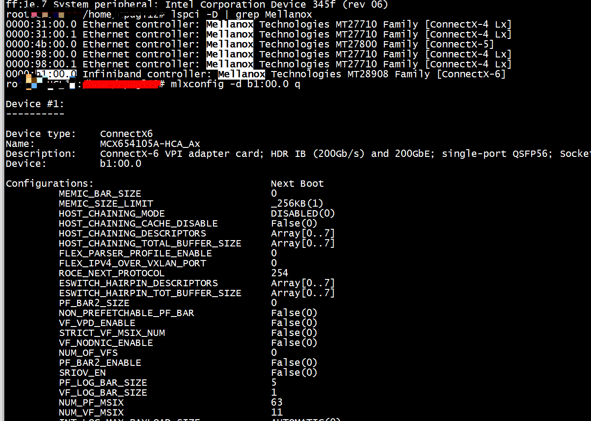
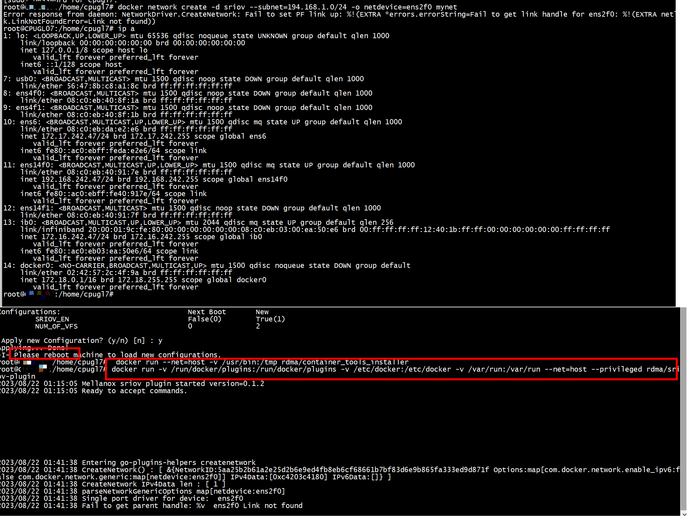
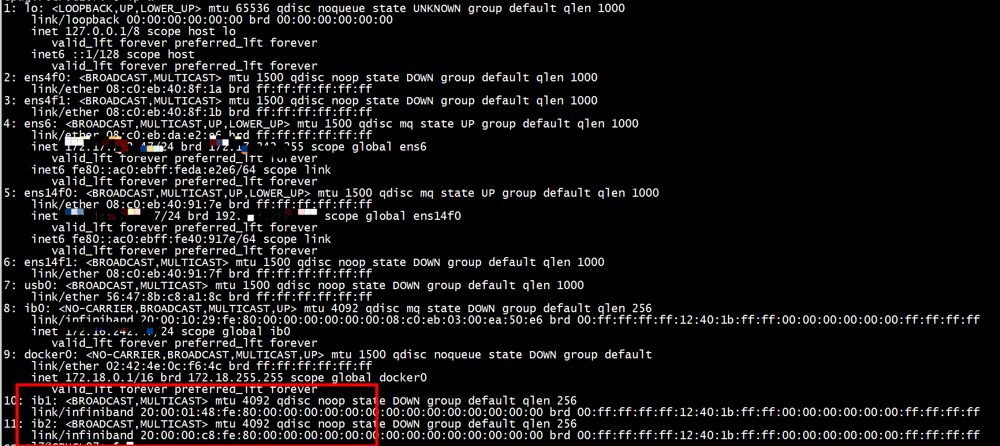
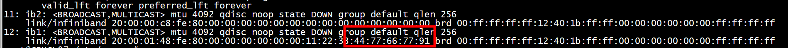
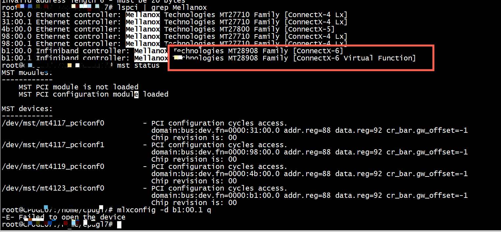
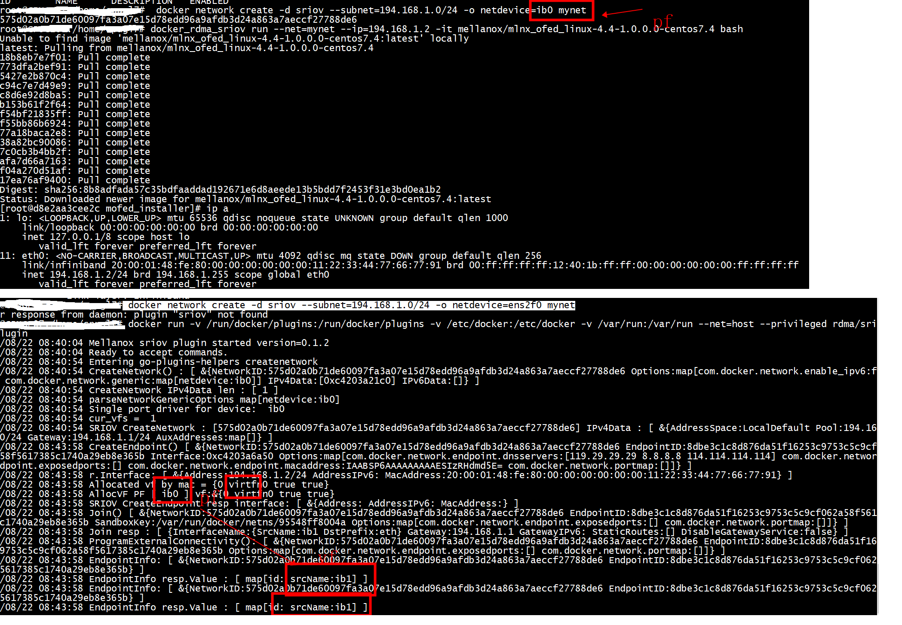
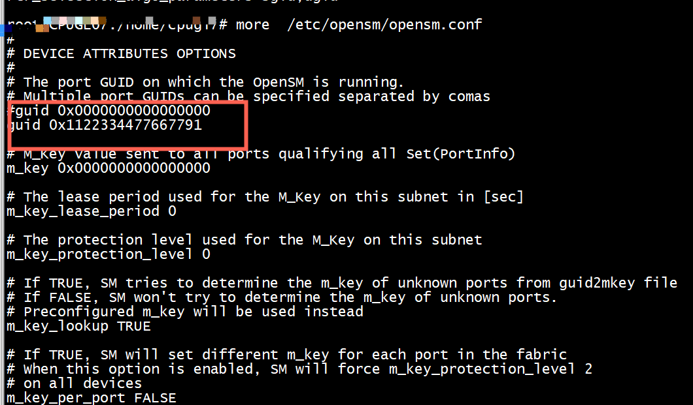

# HCA卡的Port GUID 和ib0的关系

```
[root@rac2 ~]# ibstat
CA 'mlx4_0'         ——————————————>>>>额外说明：这是第一个HCA卡(并且是双port，所以下面有port1和prot2)
    CA type: MT4099
    Number of ports: 2
    Firmware version: 2.35.5100
    Hardware version: 0
    Node GUID: 0x248a0703005d07f0
    System image GUID: 0x248a0703005d07f3
    Port 1:
        State: Active
        Physical state: LinkUp
        Rate: 56
        Base lid: 4
        LMC: 0
        SM lid: 4
        Capability mask: 0x0259486a
        Port GUID: 0x248a0703005d07f1---------------->>>注意此处！！！！
        Link layer: InfiniBand
    Port 2:
        State: Down
        Physical state: Polling
        Rate: 10
        Base lid: 0
        LMC: 0
        SM lid: 0
        Capability mask: 0x02594868
        Port GUID: 0x248a0703005d07f2
        Link layer: InfiniBand
CA 'mlx4_1''         ——————————————>>>>额外说明：这是第二个HCA卡(并且是双port，所以下面有port1和prot2)
    CA type: MT4099
    Number of ports: 2
    Firmware version: 2.35.5100
    Hardware version: 0
    Node GUID: 0x248a0703005d0840
    System image GUID: 0x248a0703005d0843
    Port 1:
        State: Active
        Physical state: LinkUp
        Rate: 56
        Base lid: 6
        LMC: 0
        SM lid: 8
        Capability mask: 0x02594868
        Port GUID: 0x248a0703005d0841
        Link layer: InfiniBand
    Port 2:
        State: Down
        Physical state: Polling
        Rate: 10
        Base lid: 0
        LMC: 0
        SM lid: 0
        Capability mask: 0x02594868
        Port GUID: 0x248a0703005d0842
        Link layer: InfiniBand
 
```

# Subnet Manager
```Text
IB 网络使用子网管理器（SM, Subnet Manager）管理网络路由，子网管理器可以运行在 服务器节点或具有管理功能的 IB 交换机上，由于IB交换机作者没有权限，因此这里直接部署在两台服务器节点上，由于子网管理器也要考虑单点问题，而SM本身就支持主备切换，同时只 有一台处于 Active 状态，因此部署两台，一主一备，
MLNX_OFED 驱动当中集成了子网管理器 OpenSM，安装 MLNX_OFED 驱动后， OpenSM 已默认安装。启动子网管理器的方法如下：
 步骤 1: 运行下述命令来创建 opensm.conf 配置文件:
 opensm --create-config /etc/opensm/opensm.conf
步骤 2 基于上述初始化创建，OpenSM 使用默认的路由算法 minihop。当网络使用 Fat-Tree 或 Up-Down 等其它拓扑组网时，需要在 opensm.conf 配置文件中将 routing_engine 修改为 对应的路由算法
修改默认配置:
# vim /etc/opensm/opensm.conf
# 修改以下内容，两台sm都需要修改
routing_engine updn
sm_priority 13  # 范围为0-15， 这里两台sm要不一样，数值大的为master，另一台即为back
# 保存后启动
systemctl start opensm
# 开机启动
systemctl enable opensm
# 能够启动说明没有问题，如果无法启动可查看相关日志
```


In case one uses a switch which does not provide a subnet manager, one needs to use “opensm” as described above. One needs to start opensm on one node, however, if this node goes down, the subnet manager is absent. Therefore it makes sense to start opensm on every node. However, multiple instances of opensm will conflict unless the priority of the opensm daemon is correctly set. This is done as follows (for Linux Debian):   
The configuration is normally not needed, there is no configuration file except in /etc/default/opensm, where you can only set the appropriate ports.   
The configuration file can, however, easily created as follows:   
```
# cd /etc/opensm
# opensm -c opensm.conf
```
Now the configuration file can be edited, whereas the parameter “sm_priority” has to be set accordingly on each machine.  
# Enabling SR-IOV
[Linux中如何判断SR-IOV是否打开](https://zhuanlan.zhihu.com/p/561002399)


```
lspci -D | grep Mellanox
0000:31:00.0 Ethernet controller: Mellanox Technologies MT27710 Family [ConnectX-4 Lx]
0000:31:00.1 Ethernet controller: Mellanox Technologies MT27710 Family [ConnectX-4 Lx]
0000:4b:00.0 Ethernet controller: Mellanox Technologies MT27800 Family [ConnectX-5]
0000:98:00.0 Ethernet controller: Mellanox Technologies MT27710 Family [ConnectX-4 Lx]
0000:98:00.1 Ethernet controller: Mellanox Technologies MT27710 Family [ConnectX-4 Lx]
0000:b1:00.0 Infiniband controller: Mellanox Technologies MT28908 Family [ConnectX-6]
```


```
root@ubuntu:/home/ubuntu# mlxconfig -d b1:00.0 q | grep SRIOV_EN
         SRIOV_EN                            False(0)        
root@ubuntu:/home/ubuntu# mlxconfig -d b1:00.0 q | grep NUM_OF_VFS
         NUM_OF_VFS                          0               
root@ubuntu:/home/ubuntu# 
```

```
 mlxconfig -d b1:00.0 q | grep -e "NUM_OF_VFS" -e "SRIOV_EN"
         NUM_OF_VFS                          2               
         SRIOV_EN                            True(1) 
```
+ ***1 ) Enable SR-IOV***

```
mlxconfig -d b1:00.0 set SRIOV_EN=1 NUM_OF_VFS=2

Device #1:
----------

Device type:    ConnectX6       
Name:           MCX654105A-HCA_Ax
Description:    ConnectX-6 VPI adapter card; HDR IB (200Gb/s) and 200GbE; single-port QSFP56; Socket Direct 2x PCIe3.0 x16; tall bracket; ROHS R6
Device:         b1:00.0         

Configurations:                              Next Boot       New
         SRIOV_EN                            False(0)        True(1)         
         NUM_OF_VFS                          0               2               

```
+ ***2 ) Enable SR-IOV***
****操作总结:***   

```
1) mlxconfig -d b1:00.0 reset
2) mlxconfig -d b1:00.0 set SRIOV_EN=1 NUM_OF_VFS=2
3) reboot os
```

```Text
 Ensure that opensm is configured for virtualization mode.

This is NOT needed for RoCE. This is only needed for InfiniBand.

(a) Make sure that the openSM is enabled with virtualization. Open the file /etc/opensm/opensm.conf and add:

virt_enabled 2

Note: This is relevant only for mlx5 driver and not for mlx4 (ConnectX-3/Pro).

This parameter has the following configuration options:

0: Ignore Virtualization - No virtualization support (Default)
1: Disable Virtualization - Disable virtualization on all Virtualization supporting ports
2: Enable Virtualization - Enable (virtualization on all Virtualization supporting ports)
The Default for parameter is 0 (ignore virtualization).

 

(b) Restart the opensm after above configuration.

Without this configuration VF ports will be in down state.
```


重启后ib0处于down状态  
```
8: ib0: <NO-CARRIER,BROADCAST,MULTICAST,UP> mtu 4092 qdisc mq state DOWN group default qlen 256
    link/infiniband 20:00:10:29:fe:80:00:00:00:00:00:00:08:c0:eb:03:00:ea:50:e6 brd 00:ff:ff:ff:ff:12:40:1b:ff:ff:00:00:00:00:00:00:ff:ff:ff:ff
    inet 172.16.242.47/24 scope global ib0
       valid_lft forever preferred_lft forever
```

ibstat 查看状态，处于Initializing 状态  
```
CA 'mlx5_5'
        CA type: MT4123
        Number of ports: 1
        Firmware version: 20.30.1004
        Hardware version: 0
        Node GUID: 0x08c0eb0300ea50e6
        System image GUID: 0x08c0eb0300ea50e6
        Port 1:
                State: Initializing
                Physical state: LinkUp
                Rate: 200
                Base lid: 65535
                LMC: 0
                SM lid: 0
                Capability mask: 0x2651e848
                Port GUID: 0x08c0eb0300ea50e6
                Link layer: InfiniBand
```
 sminfo 状态  
```
 sminfo
sminfo: sm lid 4 sm guid 0x8c0eb0300f6fc26, activity count 5568705 priority 15 state 3 SMINFO_MASTER
```
执行ibhosts 出错   
```
ibhosts 
ibwarn: [4150] mad_rpc_open_port: client_register for mgmt 1 failed
src/ibnetdisc.c:1183; can't open MAD port ((null):0)
/usr/sbin/ibnetdiscover: iberror: failed: discover failed

ls /dev/infiniband/umad*
/dev/infiniband/umad0  /dev/infiniband/umad1  /dev/infiniband/umad2  /dev/infiniband/umad3  /dev/infiniband/umad4  /dev/infiniband/umad5
```
/etc/init.d/openibd status   
```
/etc/init.d/openibd status

  HCA driver loaded

Configured IPoIB devices:
ib0

Currently active IPoIB devices:
Configured Mellanox EN devices:
ens14f0
ens14f1
ens4f0
ens4f1
ens6

Currently active Mellanox devices:
ens14f0


ens6
ib0

The following OFED modules are loaded:

  rdma_ucm
  rdma_cm
  ib_ipoib
  mlx4_core
  mlx4_ib
  mlx4_en
  mlx5_core
  mlx5_ib
  ib_uverbs
  ib_umad
  ib_ucm
  ib_cm
  ib_core
  mlxfw
  mlx5_fpga_tools
```

```
root@ubuntu:/etc/opensm# mlxconfig -d b1:00.0 q | grep LINK
         LINK_TYPE_P1                        IB(1)           
         KEEP_ETH_LINK_UP_P1                 True(1)         
         KEEP_IB_LINK_UP_P1                  False(0)        
         KEEP_LINK_UP_ON_BOOT_P1             False(0)        
         KEEP_LINK_UP_ON_STANDBY_P1          False(0)        
         AUTO_POWER_SAVE_LINK_DOWN_P1        False(0)        
         UNKNOWN_UPLINK_MAC_FLOOD_P1         False(0)        
root@ubuntu:/etc/opensm# mlxconfig -d b1:00.0 set KEEP_IB_LINK_UP_P1=0 KEEP_LINK_UP_ON_BOOT_P1=1
```

##  mlx5_num_vfs

```
root@ubuntu:/etc/opensm# ls /sys/class/infiniband/mlx5_5/device/sriov
root@ubuntu:/etc/opensm# ls /sys/class/infiniband/mlx5_5/device/sriov/
root@ubuntu:/etc/opensm# cat /sys/class/infiniband/mlx5_5/device/mlx5_num_vfs
0
```
mlx5_num_vfs等于0
```
root@ubuntu:/etc/opensm# echo 2 >  /sys/class/infiniband/mlx5_5/device/mlx5_num_vfs
root@ubuntu:/etc/opensm# cat /sys/class/infiniband/mlx5_5/device/mlx5_num_vfs
2
root@ubuntu:/etc/opensm# ls /sys/class/infiniband/mlx5_5/device/sriov
0  1
root@ubuntu:/etc/opensm# ls /sys/class/infiniband/mlx5_5/device/sriov/0/policy 
/sys/class/infiniband/mlx5_5/device/sriov/0/policy
root@ubuntu:/etc/opensm# cat  /sys/class/infiniband/mlx5_5/device/sriov/0/policy 
Down
root@ubuntu:/etc/opensm# echo  Follow >   /sys/class/infiniband/mlx5_5/device/sriov/0/policy 
root@ubuntu:/etc/opensm# cat  /sys/class/infiniband/mlx5_5/device/sriov/0/policy 
Follow
``` 
多了几个ib网卡   


```
ubuntu@ubuntu:~$ ibdev2netdev 
mlx5_0 port 1 ==> ens4f0 (Down)
mlx5_1 port 1 ==> ens4f1 (Down)
mlx5_2 port 1 ==> ens6 (Up)
mlx5_3 port 1 ==> ens14f0 (Up)
mlx5_4 port 1 ==> ens14f1 (Down)
mlx5_5 port 1 ==> ib0 (Down)
mlx5_6 port 1 ==> ib1 (Down)
mlx5_7 port 1 ==> ib1 (Down)
ubuntu@ubuntu:~$ ibstat ib1
ibpanic: [5896] main: 'ib1' IB device can't be found: No such file or directory
ubuntu@ubuntu:~$ ibstat ib2
ibpanic: [5898] main: 'ib2' IB device can't be found: No such file or directory
ubuntu@ubuntu:~$ 
```

```
root@ubuntu:/etc/opensm# cat  /sys/class/infiniband/mlx5_5/device/sriov/0/node 
00:00:00:00:00:00:00:00
root@ubuntu:/etc/opensm# cat  /sys/class/infiniband/mlx5_5/device/sriov/0/port
00:00:00:00:00:00:00:00
```

```
root@ubuntu:/etc/opensm# echo 11:22:33:44:77:66:77:90 >   /sys/class/infiniband/mlx5_5/device/sriov/0/node
root@ubuntu:/etc/opensm# echo 11:22:33:44:77:66:77:91 >   /sys/class/infiniband/mlx5_5/device/sriov/0/port
root@ubuntu:/etc/opensm# 
```
没有发生变化 
```
10: ib1: <BROADCAST,MULTICAST> mtu 4092 qdisc noop state DOWN group default qlen 256
    link/infiniband 20:00:01:48:fe:80:00:00:00:00:00:00:00:00:00:00:00:00:00:00 brd 00:ff:ff:ff:ff:12:40:1b:ff:ff:00:00:00:00:00:00:ff:ff:ff:ff
11: ib2: <BROADCAST,MULTICAST> mtu 4092 qdisc noop state DOWN group default qlen 256
    link/infiniband 20:00:00:c8:fe:80:00:00:00:00:00:00:00:00:00:00:00:00:00:00 brd 00:ff:ff:ff:ff:12:40:1b:ff:ff:00:00:00:00:00:00:ff:ff:ff:ff
```


## 设置node和port

```
root@ubuntu:/etc/opensm# echo 11:22:33:44:77:66:77:90 >   /sys/class/infiniband/mlx5_5/device/sriov/0/node
root@ubuntu:/etc/opensm# echo 11:22:33:44:77:66:77:91 >   /sys/class/infiniband/mlx5_5/device/sriov/0/port
root@ubuntu:/etc/opensm# echo 0000:b1:00.1 > /sys/bus/pci/drivers/mlx5_core/unbind
root@ubuntu:/etc/opensm# echo 0000:b1:00.1 > /sys/bus/pci/drivers/mlx5_core/bind
```
 
```
10: ib1: <BROADCAST,MULTICAST> mtu 4092 qdisc noop state DOWN group default qlen 256
    link/infiniband 20:00:01:48:fe:80:00:00:00:00:00:00:00:00:00:00:00:00:00:00 brd 00:ff:ff:ff:ff:12:40:1b:ff:ff:00:00:00:00:00:00:ff:ff:ff:ff
11: ib2: <BROADCAST,MULTICAST> mtu 4092 qdisc noop state DOWN group default qlen 256
    link/infiniband 20:00:00:c8:fe:80:00:00:00:00:00:00:00:00:00:00:00:00:00:00 brd 00:ff:ff:ff:ff:12:40:1b:ff:ff:00:00:00:00:00:00:ff:ff:ff:ff
ubuntu@ubuntu:~$ ethtool -i ib1
driver: mlx5_core[ib_ipoib]
version: 4.9-5.1.0
firmware-version: 20.30.1004 (MT_0000000226)
expansion-rom-version: 
bus-info: 0000:b1:00.1
supports-statistics: yes
supports-test: yes
supports-eeprom-access: no
supports-register-dump: no
supports-priv-flags: yes
```

```
root@ubuntu:/etc/opensm# echo 0000:b1:00.1 > /sys/bus/pci/drivers/mlx5_core/unbind
root@ubuntu:/etc/opensm# echo 0000:b1:00.1 > /sys/bus/pci/drivers/mlx5_core/bind
root@ubuntu:/etc/opensm# ip a
11: ib2: <BROADCAST,MULTICAST> mtu 4092 qdisc noop state DOWN group default qlen 256
    link/infiniband 20:00:00:c8:fe:80:00:00:00:00:00:00:00:00:00:00:00:00:00:00 brd 00:ff:ff:ff:ff:12:40:1b:ff:ff:00:00:00:00:00:00:ff:ff:ff:ff
12: ib1: <BROADCAST,MULTICAST> mtu 4092 qdisc noop state DOWN group default qlen 256
    link/infiniband 20:00:01:48:fe:80:00:00:00:00:00:00:11:22:33:44:77:66:77:91 brd 00:ff:ff:ff:ff:12:40:1b:ff:ff:00:00:00:00:00:00:ff:ff:ff:ff
```
ib1发生变化了   


## sriov 配置

```
root@ubuntu:/home/ubuntu# cat /sys/class/infiniband/mlx5_5/device/mlx5_num_vfs
0
root@ubuntu:/home/ubuntu# echo 1 >  /sys/class/infiniband/mlx5_5/device/mlx5_num_vfs
root@ubuntu:/home/ubuntu# echo  Follow >   /sys/class/infiniband/mlx5_5/device/sriov/0/policy 
root@ubuntu:/home/ubuntu#  echo 11:22:33:44:77:66:77:90 >   /sys/class/infiniband/mlx5_5/device/sriov/0/node
root@ubuntu:/home/ubuntu# echo 11:22:33:44:77:66:77:91 >   /sys/class/infiniband/mlx5_5/device/sriov/0/port
root@ubuntu:/home/ubuntu#  echo 0000:b1:00.1 > /sys/bus/pci/drivers/mlx5_core/unbind
root@ubuntu:/home/ubuntu# echo 0000:b1:00.1 > /sys/bus/pci/drivers/mlx5_core/bind
root@ubuntu:/home/ubuntu# 
CA 'mlx5_6'
        CA type: MT4124
        Number of ports: 1
        Firmware version: 20.30.1004
        Hardware version: 0
        Node GUID: 0x1122334477667790
        System image GUID: 0x08c0eb0300ea50e6
        Port 1:
                State: Down
                Physical state: LinkUp
                Rate: 200
                Base lid: 65535
                LMC: 0
                SM lid: 4
                Capability mask: 0x2651ec48
                Port GUID: 0x1122334477667791
                Link layer: InfiniBand
11: ib1: <NO-CARRIER,BROADCAST,MULTICAST,UP> mtu 4092 qdisc mq state DOWN group default qlen 256
    link/infiniband 20:00:01:48:fe:80:00:00:00:00:00:00:11:22:33:44:77:66:77:91 brd 00:ff:ff:ff:ff:12:40:1b:ff:ff:00:00:00:00:00:00:ff:ff:ff:ff
```

```
CA 'mlx5_6'
        CA type: MT4124
        Number of ports: 1
        Firmware version: 20.30.1004
        Hardware version: 0
        Node GUID: 0x1122334477667790
        System image GUID: 0x08c0eb0300ea50e6
        Port 1:
                State: Down
                Physical state: LinkUp
                Rate: 200
                Base lid: 65535
                LMC: 0
                SM lid: 4
                Capability mask: 0x2651ec48
                Port GUID: 0x1122334477667791
                Link layer: InfiniBand
```

mst status 看不到vf   




# Install  SR-IOV plugin and run
```
1）docker pull rdma/sriov-plugin
2） docker pull rdma/container_tools_installer
3） docker run --net=host -v /usr/bin:/tmp rdma/container_tools_installer
4） docker run -v /run/docker/plugins:/run/docker/plugins -v /etc/docker:/etc/docker -v /var/run:/var/run --net=host --privileged rdma/sriov-plugin
5）  docker network create -d sriov --subnet=194.168.1.0/24 -o netdevice=ib0 mynet
6）  docker_rdma_sriov run --net=mynet --ip=194.168.1.2 -it mellanox/mlnx_ofed_linux-4.4-1.0.0.0-centos7.4 bash
```

```
8: ib0: <BROADCAST,MULTICAST,UP,LOWER_UP> mtu 2044 qdisc mq state UP group default qlen 256
    link/infiniband 20:00:10:29:fe:80:00:00:00:00:00:00:08:c0:eb:03:00:ea:50:e6 brd 00:ff:ff:ff:ff:12:40:1b:ff:ff:00:00:00:00:00:00:ff:ff:ff:ff
    inet 172.16.242.47/24 brd 172.16.242.255 scope global ib0
       valid_lft forever preferred_lft forever
    inet6 fe80::ac0:eb03:ea:50e6/64 scope link 
       valid_lft forever preferred_lft forever
9: docker0: <NO-CARRIER,BROADCAST,MULTICAST,UP> mtu 1500 qdisc noqueue state DOWN group default 
    link/ether 02:42:9f:e5:e7:27 brd ff:ff:ff:ff:ff:ff
    inet 172.18.0.1/16 brd 172.18.255.255 scope global docker0
       valid_lft forever preferred_lft forever
11: ib1: <BROADCAST,MULTICAST> mtu 4092 qdisc noop state DOWN group default qlen 256
    link/infiniband 20:00:01:48:fe:80:00:00:00:00:00:00:11:22:33:44:77:66:77:91 brd 00:ff:ff:ff:ff:12:40:1b:ff:ff:00:00:00:00:00:00:ff:ff:ff:ff
```


和mlx5_5保持一致   
```
CA 'mlx5_5'
        CA type: MT4123
        Number of ports: 1
        Firmware version: 20.30.1004
        Hardware version: 0
        Node GUID: 0x08c0eb0300ea50e6
        System image GUID: 0x08c0eb0300ea50e6
        Port 1:
                State: Active
                Physical state: LinkUp
                Rate: 200
                Base lid: 18
                LMC: 0
                SM lid: 4
                Capability mask: 0x2651e848
                Port GUID: 0x08c0eb0300ea50e6
                Link layer: InfiniBand
```

```
root@ubuntu:/home/ubuntu# echo 08:c0:eb:03:00:ea:50:e7 >   /sys/class/infiniband/mlx5_5/device/sriov/0/node
root@ubuntu:/home/ubuntu# echo 08:c0:eb:03:00:ea:50:e7 >   /sys/class/infiniband/mlx5_5/device/sriov/0/port
root@ubuntu:/home/ubuntu# echo 0000:b1:00.1 > /sys/bus/pci/drivers/mlx5_core/unbind
root@ubuntu:/home/ubuntu# echo 0000:b1:00.1 > /sys/bus/pci/drivers/mlx5_core/bind
```

# mstflint -dev b1:00.0 dc (for Configuring SR-IOV for ConnectX-3/ConnectX-3 Pro)
Verify the HCA is configured to support SR-IOV   
```
[HCA]
num_pfs = 1
total_vfs = <0-126>
sriov_en = true
```
```
mstflint -dev b1:00.0 dc
root@ubuntu:/home/ubuntu# mstflint -dev b1:00.0 dc | grep num_pfs
nv_config.global.pci.settings.num_pfs = 0x1
root@ubuntu:/home/ubuntu# mstflint -dev b1:00.0 dc | grep total_vfs
root@ubuntu:/home/ubuntu# mstflint -dev b1:00.0 dc | grep sriov_en
root@ubuntu:/home/ubuntu# 
```

# opensm -B -g 0x1122334477667791
```
tail -n 100 /var/log/opensm.log
Aug 22 05:19:42 782127 [88D4700] 0x01 -> sm_mad_ctrl_send_err_cb: ERR 3113: MAD completed in error (IB_ERROR): SubnGet(NodeInfo), attr_mod 0x0, TID 0x124e
Aug 22 05:19:42 782139 [88D4700] 0x01 -> osm_get_physp_by_dr: ERR 7526: Couldn't find SM port by guid: 0x1122334477667791
Aug 22 05:19:42 782159 [88D4700] 0x01 -> vl15_send_mad: ERR 3E03: MAD send failed (IB_UNKNOWN_ERROR)
Aug 22 05:19:42 782167 [76D2700] 0x01 -> state_mgr_is_sm_port_down: ERR 3309: SM port with GUID:1122334477667791 is unknown
Aug 22 05:19:42 782199 [76D2700] 0x01 -> state_mgr_clear_sm_port_when_down: ERR 3320: SM port with GUID:1122334477667791 is unknown
Aug 22 05:19:42 782217 [88D4700] 0x01 -> vl15_send_mad: ERR 3E04: GET method failed for attribute 0x11 (NodeInfo)
```

# opensm

```
opensm --create-config /etc/opensm/opensm.conf
```



```
Aug 22 11:30:43 935330 [88D4700] 0x01 -> sm_mad_ctrl_send_err_cb: ERR 3113: MAD completed in error (IB_ERROR): SubnGet(NodeInfo), attr_mod 0x0, TID 0x1b00
Aug 22 11:30:43 935340 [88D4700] 0x01 -> osm_get_physp_by_dr: ERR 7526: Couldn't find SM port by guid: 0x1122334477667791
Aug 22 11:30:43 935355 [88D4700] 0x01 -> vl15_send_mad: ERR 3E03: MAD send failed (IB_UNKNOWN_ERROR)
Aug 22 11:30:43 935364 [76D2700] 0x01 -> state_mgr_is_sm_port_down: ERR 3309: SM port with GUID:1122334477667791 is unknown
Aug 22 11:30:43 935384 [76D2700] 0x01 -> state_mgr_clear_sm_port_when_down: ERR 3320: SM port with GUID:1122334477667791 is unknown
Aug 22 11:30:43 935402 [88D4700] 0x01 -> vl15_send_^C
```

根据ibdiagnet获取的guid，更改guid=0x08c0eb0300f6fc26   
```
 more /var/tmp/ibdiagnet2/ibdiagnet2.sm
# This database file was automatically generated by IBDIAG


ibdiagnet fabric SM report

  SM - master
    Port=0 lid=0x0004 guid=0x08c0eb0300f6fc26 dev=54000 priority:15
```
opensm 退出了  
```
tail -f  /var/log/opensm.log
Aug 24 04:32:59 236829 [95BD9740] 0x01 -> osm_sm_bind: ERR 2E10: SM MAD Controller bind failed (IB_ERROR) for port guid 0x8c0eb0300f6fc26, port index 0

Error from osm_opensm_bind (0x2A)
Perhaps another instance of OpenSM is already running
Aug 24 04:32:59 236853 [95BD9740] 0x01 -> perfmgr_mad_unbind: ERR 5405: No previous bind
Aug 24 04:32:59 236864 [95BD9740] 0x01 -> osm_congestion_control_shutdown: ERR C108: No previous bind
Aug 24 04:32:59 236951 [95BD9740] 0x01 -> osm_sa_mad_ctrl_unbind: ERR 1A11: No previous bind
Exiting SM
```

```
systemctl  status opensm
● opensmd.service - LSB: Manage OpenSM
   Loaded: loaded (/etc/init.d/opensmd; generated)
   Active: active (exited) since Thu 2023-08-24 04:32:59 EDT; 27s ago
     Docs: man:systemd-sysv-generator(8)
  Process: 14346 ExecStop=/etc/init.d/opensmd stop (code=exited, status=0/SUCCESS)
  Process: 14360 ExecStart=/etc/init.d/opensmd start (code=exited, status=0/SUCCESS)

Aug 24 04:32:59 ubuntu systemd[1]: Starting LSB: Manage OpenSM...
Aug 24 04:32:59 ubuntu OpenSM[14378]:  Loading Cached Option:guid_1 = 0x08c0eb0300f6fc26
Aug 24 04:32:59 ubuntu opensmd[14360]: Starting opensm:  * done
Aug 24 04:32:59 ubuntu OpenSM[14380]: /var/log/opensm.log log file opened
Aug 24 04:32:59 ubuntu OpenSM[14380]: OpenSM 5.7.2.MLNX20201014.9378048
Aug 24 04:32:59 ubuntu systemd[1]: Started LSB: Manage OpenSM.
Aug 24 04:32:59 ubuntu OpenSM[14380]: Entering DISCOVERING state
```

#  ibdiagnet

```
more /var/tmp/ibdiagnet2/ibdiagnet2.sm
# This database file was automatically generated by IBDIAG


ibdiagnet fabric SM report

  SM - master
    Port=0 lid=0x0004 guid=0x08c0eb0300f6fc26 dev=54000 priority:15
```

# references
[DOCKER RDMA SRIOV NETWORKING WITH CONNECTX4/CONNECTX5/CONNECTX6](https://enterprise-support.nvidia.com/s/article/Docker-RDMA-SRIOV-Networking-with-ConnectX4-ConnectX5-ConnectX6)

[HOWTO CONFIGURE SR-IOV FOR CONNECT-IB/CONNECTX-4 WITH KVM (INFINIBAND)](https://enterprise-support.nvidia.com/s/article/howto-configure-sr-iov-for-connect-ib-connectx-4-with-kvm--infiniband-x)
[Configuring SR-IOV for Mellanox adapters](https://shawnliu.me/post/configuring-sr-iov-for-mellanox-adapters/)  
[Ubuntu系统IB网卡输入ibstat返回State: Initializing或State: Down的解决办法](https://blog.csdn.net/m0_37201243/article/details/108655015)

[两台IB交换机使用server side方式做高可用的记录](https://blog.51cto.com/u_14036245/4351961)