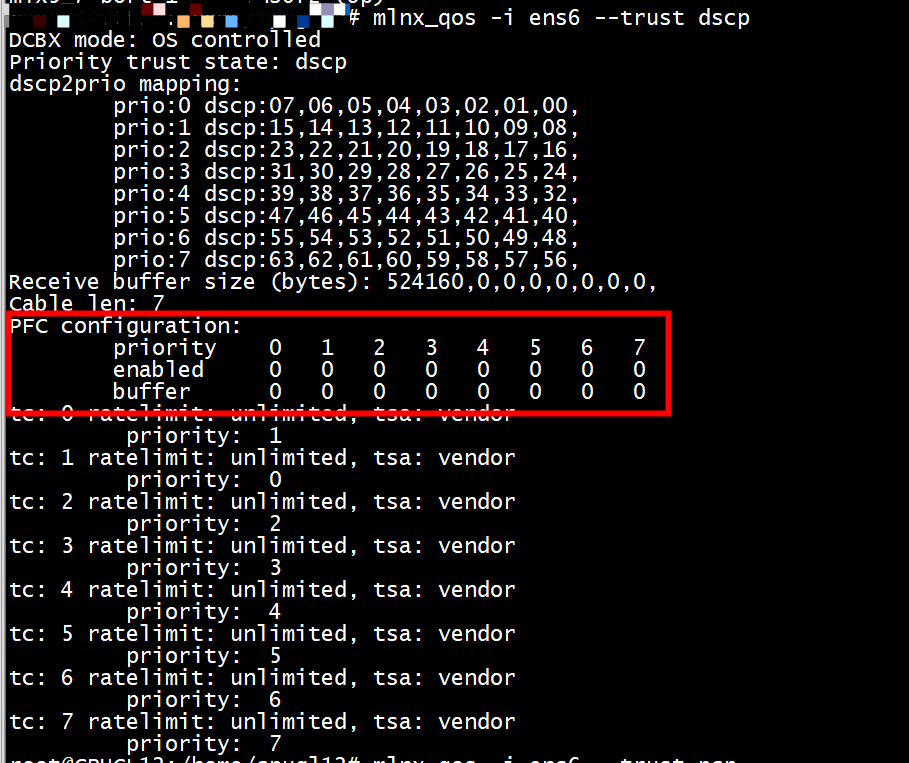
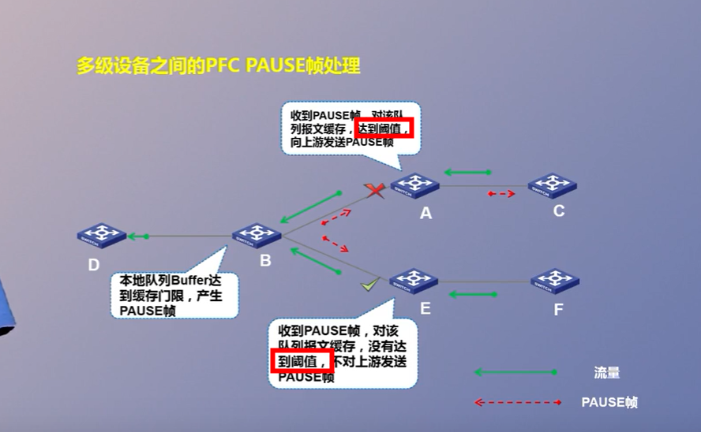
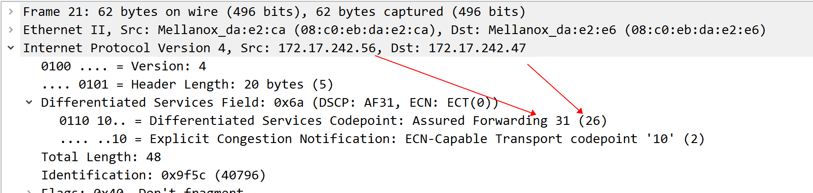
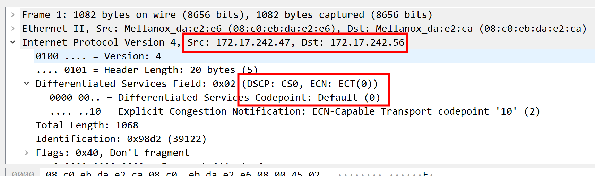
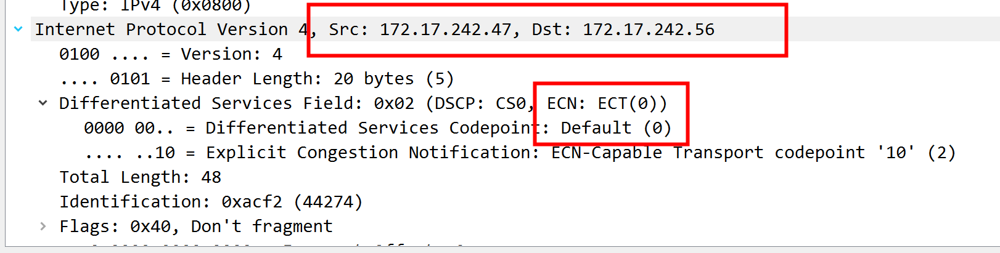
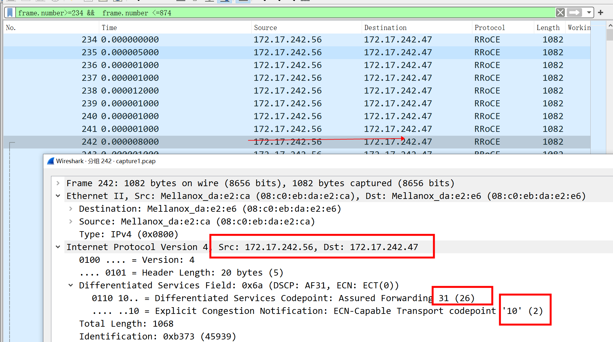

# tcp_ecn


```
NIC:
# mlnx_qos -i ens6f0 --trust dscp
# echo 106 > /sys/class/infiniband/mlx5_0/tc/1/traffic_class
# cma_roce_tos -d mlx5_0 -t 106
# sysctl -w net.ipv4.tcp_ecn=1
# mlnx_qos -i ens6f0 --pfc 0,0,0,1,0,0,0,0
```


ECN功能工作机制：   
(1) ***发送端设置ECN域为10***，告知路径上的设备及接收端，发送端设备支持ECN功能。   
(2) 中间设备发生拥塞并达到门限，拥塞设备将发生拥塞的报文ECN域设置为11，报文正常转发。   
(3) 接收端收到ECN置位为11的报文，由传输层发送CNP（Congestion Notification Packet，拥塞通知报文）通知发送端。   
(4) 发送端收到CNP报文，对对应的优先级的队列进行降速处理。   
(5) 经过一段可配置的时间或者发送一定数量数据，发送端恢复原来的速率。   

## ECN with IP
DC-QCN算法依赖于交换机端的ECN标记。ECN是商用数据中心交换机的普遍特点。在数据包IP头部中的查分服务域中的两个比特位用来提示拥塞。一旦交换机端出现了拥塞，这两个比特位就被置为"11"(CE)   
```Text
IP头部有2个bit的ECN标志位：

00 – Non ECN-Capable Transport, Non-ECT
10 – ECN Capable Transport, ECT(0)
01 – ECN Capable Transport, ECT(1)
11 – Congestion Encountered, CE.
如果端点支持ECN，就数据包中的标志位设置为ECT(0)或者ECT(1)。
```
## ECN with TCP
为了支持ECN，TCP使用了TCP头部的3个标志位：Nonce Sum (NS)，ECN-Echo (ECE)和Congestion Window Reduced (CWR)。   

## ECN in RoCEv2
  RoCEv2引入了ECN机制来实现拥塞控制，即RoCEv2 Congestion Management (RCM)。通过RCM，一旦网络发生拥塞，就会通知发送端降低发送速率。与TCP类似，RoCEv2使用传输层头部Base Transport Header (BTH)的FECN标志位来标识拥塞。    
```Text
实现RCM的RoCEv2 HCAs必须遵循下面的规则：

(1) 如果收到IP.ECN为11的包，HCA生成一个RoCEv2 CNP(Congestion Notification Packet)包，返回给发送端；
(2) 如果收到RoCEv2 CNP包，则降低对应QP的发送速率；
(3) 从上一次收到RoCEv2 CNP后，经过配置的时间或者字节数，HCA可以增加对应QP的发送速率。
```

# 开启dscp 之前
```
root@centos12:/home/centos12# ibdev2netdev 
mlx5_0 port 1 ==> ens4f0 (Down)
mlx5_1 port 1 ==> ens4f1 (Down)
mlx5_2 port 1 ==> ens6 (Up)
mlx5_3 port 1 ==> ens14f0 (Up)
mlx5_4 port 1 ==> ens14f1 (Down)
mlx5_5 port 1 ==> ib0 (Up)
mlx5_6 port 1 ==> ens6f1 (Down)
mlx5_7 port 1 ==> ens6f2 (Up)
```
没有开启dscp,traffic_class 属性看不到    
```
root@centos12:/home/centos12# mlnx_qos -i ens6
DCBX mode: OS controlled
Priority trust state: pcp
Receive buffer size (bytes): 524160,0,0,0,0,0,0,0,
Cable len: 7
PFC configuration:
        priority    0   1   2   3   4   5   6   7
        enabled     0   0   0   0   0   0   0   0   
        buffer      0   0   0   0   0   0   0   0   
tc: 0 ratelimit: unlimited, tsa: vendor
         priority:  1
tc: 1 ratelimit: unlimited, tsa: vendor
         priority:  0
tc: 2 ratelimit: unlimited, tsa: vendor
         priority:  2
tc: 3 ratelimit: unlimited, tsa: vendor
         priority:  3
tc: 4 ratelimit: unlimited, tsa: vendor
         priority:  4
tc: 5 ratelimit: unlimited, tsa: vendor
         priority:  5
tc: 6 ratelimit: unlimited, tsa: vendor
         priority:  6
tc: 7 ratelimit: unlimited, tsa: vendor
         priority:  7
root@centos12:/home/centos12# 
root@centos12:/home/centos12# cat /sys/class/infiniband/mlx5_2/tc/1/traffic_class 
```

# 开启dscp 

```
root@centos12:/home/centos12# mlnx_qos -i ens6 --trust dscp
DCBX mode: OS controlled
Priority trust state: dscp
dscp2prio mapping:
        prio:0 dscp:07,06,05,04,03,02,01,00,
        prio:1 dscp:15,14,13,12,11,10,09,08,
        prio:2 dscp:23,22,21,20,19,18,17,16,
        prio:3 dscp:31,30,29,28,27,26,25,24,
        prio:4 dscp:39,38,37,36,35,34,33,32,
        prio:5 dscp:47,46,45,44,43,42,41,40,
        prio:6 dscp:55,54,53,52,51,50,49,48,
        prio:7 dscp:63,62,61,60,59,58,57,56,
Receive buffer size (bytes): 524160,0,0,0,0,0,0,0,
Cable len: 7
PFC configuration:
        priority    0   1   2   3   4   5   6   7
        enabled     0   0   0   0   0   0   0   0   
        buffer      0   0   0   0   0   0   0   0   
tc: 0 ratelimit: unlimited, tsa: vendor
         priority:  1
tc: 1 ratelimit: unlimited, tsa: vendor
         priority:  0
tc: 2 ratelimit: unlimited, tsa: vendor
         priority:  2
tc: 3 ratelimit: unlimited, tsa: vendor
         priority:  3
tc: 4 ratelimit: unlimited, tsa: vendor
         priority:  4
tc: 5 ratelimit: unlimited, tsa: vendor
         priority:  5
tc: 6 ratelimit: unlimited, tsa: vendor
         priority:  6
tc: 7 ratelimit: unlimited, tsa: vendor
         priority:  7
root@centos12:/home/centos12# 
root@centos12:/home/centos12# cat /sys/class/infiniband/mlx5_2/tc/1/traffic_class 
root@centos12:/home/centos12# 
```
traffic_class 属性仍然看不到    

# pfc




# 设置traffic_class 
```
root@centos12:/home/centos12# cat /sys/class/infiniband/mlx5_2/tc/1/traffic_class 
root@centos12:/home/centos12# echo 106 > /sys/class/infiniband/mlx5_2/tc/1/traffic_class
root@centos12:/home/centos12# cat /sys/class/infiniband/mlx5_2/tc/1/traffic_class 
Global tclass=106
root@centos12:/home/centos12# 
```

将RoCE流量的标记设置为26，至于为什么26要填106？
在数据包的IP层(网路层)有一块TOS(Type Of Server)域，其中前8个位为DSCP值，后2位为ECN标记位，我们需要把ECN标记位设置为10(二进制)，而DSCP值为26，对应二进制值为11010，连一起就是1101010，对应十进制值就是106


# server

```
root@centos12:/home/centos12# 
root@centos12:/home/centos12# show_gids
DEV     PORT    INDEX   GID                                     IPv4            VER     DEV
---     ----    -----   ---                                     ------------    ---     ---
mlx5_0  1       0       fe80:0000:0000:0000:0ac0:ebff:fe40:8df2                 v1      ens4f0
mlx5_0  1       1       fe80:0000:0000:0000:0ac0:ebff:fe40:8df2                 v2      ens4f0
mlx5_1  1       0       fe80:0000:0000:0000:0ac0:ebff:fe40:8df3                 v1      ens4f1
mlx5_1  1       1       fe80:0000:0000:0000:0ac0:ebff:fe40:8df3                 v2      ens4f1
mlx5_2  1       0       fe80:0000:0000:0000:0ac0:ebff:feda:e2ca                 v1      ens6
mlx5_2  1       1       fe80:0000:0000:0000:0ac0:ebff:feda:e2ca                 v2      ens6
mlx5_2  1       2       0000:0000:0000:0000:0000:ffff:ac11:f238 172.17.242.56   v1      ens6
mlx5_2  1       3       0000:0000:0000:0000:0000:ffff:ac11:f238 172.17.242.56   v2      ens6
mlx5_3  1       0       fe80:0000:0000:0000:0ac0:ebff:fe3b:353c                 v1      ens14f0
mlx5_3  1       1       fe80:0000:0000:0000:0ac0:ebff:fe3b:353c                 v2      ens14f0
mlx5_3  1       2       0000:0000:0000:0000:0000:ffff:c0a8:f238 192.168.242.56          v1      ens14f0
mlx5_3  1       3       0000:0000:0000:0000:0000:ffff:c0a8:f238 192.168.242.56          v2      ens14f0
mlx5_4  1       0       fe80:0000:0000:0000:0ac0:ebff:fe3b:353d                 v1      ens14f1
mlx5_4  1       1       fe80:0000:0000:0000:0ac0:ebff:fe3b:353d                 v2      ens14f1
mlx5_5  1       0       fe80:0000:0000:0000:08c0:eb03:00b6:a0b4                 v1
mlx5_6  1       0       fe80:0000:0000:0000:d8ea:31ff:fe2d:ce8c                 v1      ens6f1
mlx5_6  1       1       fe80:0000:0000:0000:d8ea:31ff:fe2d:ce8c                 v2      ens6f1
mlx5_7  1       0       fe80:0000:0000:0000:f436:ffff:fe68:68fc                 v1      ens6f2
mlx5_7  1       1       fe80:0000:0000:0000:f436:ffff:fe68:68fc                 v2      ens6f2
n_gids_found=19
root@centos12:/home/centos12# 
```
rocev1测试   
```
root@centos12:/home/rdma/srq_pingpong# ./srq_pingpong  -d mlx5_2  -g 2
```

## roce 抓包
ethtool --set-priv-flags XXXXX sniffer off
```
root@centos12:/home/centos12# docker run -it -v /dev/infiniband:/dev/infiniband -v /tmp/traces:/tmp/traces --net=host --privileged  mellanox/tcpdump-rdma bash
[root@centos12 /]# tcpdump -i mlx5_2 -s 0 -w /tmp/traces/capture1.pcap 
```

# client 端

没有开启dscp   
```
root@centos07:/home/rdma/rdma_ping# ls
buildme   rclient    rclient.o  rcommon.c  readme.md  rping.c  rping.o     rserver    rserver.o
Makefile  rclient.c  rcommon    rcommon.o  rping      rping.h  rping_test  rserver.c
root@centos07:/home/rdma/rdma_ping# cat /sys/class/infiniband/mlx5_2/tc/1/traffic_class
root@centos07:/home/rdma/rdma_ping# 
cpugl13@cpugl13:~$  mlnx_qos -i ens14f0 
DCBX mode: OS controlled
Priority trust state: pcp
Receive buffer size (bytes): 262016,0,0,0,0,0,0,0,
Cable len: 7
PFC configuration:
        priority    0   1   2   3   4   5   6   7
        enabled     0   0   0   0   0   0   0   0   
        buffer      0   0   0   0   0   0   0   0   
tc: 0 ratelimit: unlimited, tsa: vendor
         priority:  1
tc: 1 ratelimit: unlimited, tsa: vendor
         priority:  0
tc: 2 ratelimit: unlimited, tsa: vendor
         priority:  2
tc: 3 ratelimit: unlimited, tsa: vendor
         priority:  3
tc: 4 ratelimit: unlimited, tsa: vendor
         priority:  4
tc: 5 ratelimit: unlimited, tsa: vendor
         priority:  5
tc: 6 ratelimit: unlimited, tsa: vendor
         priority:  6
tc: 7 ratelimit: unlimited, tsa: vendor
         priority:  7
```
rocev1测试   
```
root@centos07:/home/rdma# ./srq_pingpong  -d mlx5_2  172.17.242.56  -g 2 

```

RoCEv1不需要PFC(Priority Flow  Control)，而RoCEv2需要。因为RoCEv1只支持链路层转发，只考虑同一交换机两个端口之间转发的情况，由于ib交换机本身支持无损网络，因此不需要PFC。但RoCEv2支持第三层IP路由，要考虑跨交换机转发数据，一旦跨交换机就没法保证无损了，因此需要QoS做PFC功能保证无损。也就是说PFC保证链路lossless，让RDMA能在三层下正常运行。


# roce v2

## server(开启dscp)
```
root@centos12:/home/rdma/srq_pingpong# ./srq_pingpong  -d mlx5_2  -g 3
  local address:  LID 0x0000, QPN 0x000147, PSN 0xfb140f, GID ::ffff:172.17.242.56
  local address:  LID 0x0000, QPN 0x000148, PSN 0x886e4d, GID ::ffff:172.17.242.56
  local address:  LID 0x0000, QPN 0x000149, PSN 0x9da613, GID ::ffff:172.17.242.56
  local address:  LID 0x0000, QPN 0x00014a, PSN 0xff6766, GID ::ffff:172.17.242.56
  local address:  LID 0x0000, QPN 0x00014b, PSN 0x1e6081, GID ::ffff:172.17.242.56
  local address:  LID 0x0000, QPN 0x00014c, PSN 0x27524f, GID ::ffff:172.17.242.56
  local address:  LID 0x0000, QPN 0x00014d, PSN 0x6ec702, GID ::ffff:172.17.242.56
  local address:  LID 0x0000, QPN 0x00014e, PSN 0x93c3d3, GID ::ffff:172.17.242.56
  local address:  LID 0x0000, QPN 0x00014f, PSN 0x2ccc7b, GID ::ffff:172.17.242.56
  local address:  LID 0x0000, QPN 0x000150, PSN 0xf40fe1, GID ::ffff:172.17.242.56
  local address:  LID 0x0000, QPN 0x000151, PSN 0xac1e71, GID ::ffff:172.17.242.56
  local address:  LID 0x0000, QPN 0x000152, PSN 0x093cb0, GID ::ffff:172.17.242.56
  local address:  LID 0x0000, QPN 0x000153, PSN 0xbde4dc, GID ::ffff:172.17.242.56
  local address:  LID 0x0000, QPN 0x000154, PSN 0x940359, GID ::ffff:172.17.242.56
  local address:  LID 0x0000, QPN 0x000155, PSN 0x92e7a3, GID ::ffff:172.17.242.56
  local address:  LID 0x0000, QPN 0x000156, PSN 0x36e22b, GID ::ffff:172.17.242.56
  remote address:  LID 0x0000, QPN 0x000117, PSN 0x1d409b,   local address:  LID 0x0000, QPN 0x000147, PSN 0xfb140f, 
  remote address:  LID 0x0000, QPN 0x000118, PSN 0x2b2de9,   local address:  LID 0x0000, QPN 0x000148, PSN 0x886e4d, 
  remote address:  LID 0x0000, QPN 0x000119, PSN 0xdf637f,   local address:  LID 0x0000, QPN 0x000149, PSN 0x9da613, 
  remote address:  LID 0x0000, QPN 0x00011a, PSN 0xbc1662,   local address:  LID 0x0000, QPN 0x00014a, PSN 0xff6766, 
  remote address:  LID 0x0000, QPN 0x00011b, PSN 0xfb49cd,   local address:  LID 0x0000, QPN 0x00014b, PSN 0x1e6081, 
  remote address:  LID 0x0000, QPN 0x00011c, PSN 0xe0efab,   local address:  LID 0x0000, QPN 0x00014c, PSN 0x27524f, 
  remote address:  LID 0x0000, QPN 0x00011d, PSN 0xa76f2e,   local address:  LID 0x0000, QPN 0x00014d, PSN 0x6ec702, 
  remote address:  LID 0x0000, QPN 0x00011e, PSN 0x5ae68f,   local address:  LID 0x0000, QPN 0x00014e, PSN 0x93c3d3, 
  remote address:  LID 0x0000, QPN 0x00011f, PSN 0x7b7e87,   local address:  LID 0x0000, QPN 0x00014f, PSN 0x2ccc7b, 
  remote address:  LID 0x0000, QPN 0x000120, PSN 0x7ca6fd,   local address:  LID 0x0000, QPN 0x000150, PSN 0xf40fe1, 
  remote address:  LID 0x0000, QPN 0x000121, PSN 0x679d5d,   local address:  LID 0x0000, QPN 0x000151, PSN 0xac1e71, 
  remote address:  LID 0x0000, QPN 0x000122, PSN 0x764f2c,   local address:  LID 0x0000, QPN 0x000152, PSN 0x093cb0, 
  remote address:  LID 0x0000, QPN 0x000123, PSN 0x1a2ba8,   local address:  LID 0x0000, QPN 0x000153, PSN 0xbde4dc, 
  remote address:  LID 0x0000, QPN 0x000124, PSN 0x897035,   local address:  LID 0x0000, QPN 0x000154, PSN 0x940359, 
  remote address:  LID 0x0000, QPN 0x000125, PSN 0xafe94f,   local address:  LID 0x0000, QPN 0x000155, PSN 0x92e7a3, 
  remote address:  LID 0x0000, QPN 0x000126, PSN 0xa12067,   local address:  LID 0x0000, QPN 0x000156, PSN 0x36e22b, 
  remote address: LID 0x0000, QPN 0x000117, PSN 0x1d409b, GID ::ffff:172.17.242.47
  remote address: LID 0x0000, QPN 0x000118, PSN 0x2b2de9, GID ::ffff:172.17.242.47
  remote address: LID 0x0000, QPN 0x000119, PSN 0xdf637f, GID ::ffff:172.17.242.47
  remote address: LID 0x0000, QPN 0x00011a, PSN 0xbc1662, GID ::ffff:172.17.242.47
  remote address: LID 0x0000, QPN 0x00011b, PSN 0xfb49cd, GID ::ffff:172.17.242.47
  remote address: LID 0x0000, QPN 0x00011c, PSN 0xe0efab, GID ::ffff:172.17.242.47
  remote address: LID 0x0000, QPN 0x00011d, PSN 0xa76f2e, GID ::ffff:172.17.242.47
  remote address: LID 0x0000, QPN 0x00011e, PSN 0x5ae68f, GID ::ffff:172.17.242.47
  remote address: LID 0x0000, QPN 0x00011f, PSN 0x7b7e87, GID ::ffff:172.17.242.47
  remote address: LID 0x0000, QPN 0x000120, PSN 0x7ca6fd, GID ::ffff:172.17.242.47
  remote address: LID 0x0000, QPN 0x000121, PSN 0x679d5d, GID ::ffff:172.17.242.47
  remote address: LID 0x0000, QPN 0x000122, PSN 0x764f2c, GID ::ffff:172.17.242.47
  remote address: LID 0x0000, QPN 0x000123, PSN 0x1a2ba8, GID ::ffff:172.17.242.47
  remote address: LID 0x0000, QPN 0x000124, PSN 0x897035, GID ::ffff:172.17.242.47
  remote address: LID 0x0000, QPN 0x000125, PSN 0xafe94f, GID ::ffff:172.17.242.47
  remote address: LID 0x0000, QPN 0x000126, PSN 0xa12067, GID ::ffff:172.17.242.47
8192000 bytes in 0.00 seconds = 14219.14 Mbit/sec
1000 iters in 0.00 seconds = 4.61 usec/iter
root@centos12:/home/rdma/srq_pingpong# 
```



## client(没有开启dscp)

```
root@centos07:/home/rdma# ./srq_pingpong  -d mlx5_2  172.17.242.56  -g 3
  local address:  LID 0x0000, QPN 0x000117, PSN 0x1d409b, GID ::ffff:172.17.242.47
  local address:  LID 0x0000, QPN 0x000118, PSN 0x2b2de9, GID ::ffff:172.17.242.47
  local address:  LID 0x0000, QPN 0x000119, PSN 0xdf637f, GID ::ffff:172.17.242.47
  local address:  LID 0x0000, QPN 0x00011a, PSN 0xbc1662, GID ::ffff:172.17.242.47
  local address:  LID 0x0000, QPN 0x00011b, PSN 0xfb49cd, GID ::ffff:172.17.242.47
  local address:  LID 0x0000, QPN 0x00011c, PSN 0xe0efab, GID ::ffff:172.17.242.47
  local address:  LID 0x0000, QPN 0x00011d, PSN 0xa76f2e, GID ::ffff:172.17.242.47
  local address:  LID 0x0000, QPN 0x00011e, PSN 0x5ae68f, GID ::ffff:172.17.242.47
  local address:  LID 0x0000, QPN 0x00011f, PSN 0x7b7e87, GID ::ffff:172.17.242.47
  local address:  LID 0x0000, QPN 0x000120, PSN 0x7ca6fd, GID ::ffff:172.17.242.47
  local address:  LID 0x0000, QPN 0x000121, PSN 0x679d5d, GID ::ffff:172.17.242.47
  local address:  LID 0x0000, QPN 0x000122, PSN 0x764f2c, GID ::ffff:172.17.242.47
  local address:  LID 0x0000, QPN 0x000123, PSN 0x1a2ba8, GID ::ffff:172.17.242.47
  local address:  LID 0x0000, QPN 0x000124, PSN 0x897035, GID ::ffff:172.17.242.47
  local address:  LID 0x0000, QPN 0x000125, PSN 0xafe94f, GID ::ffff:172.17.242.47
  local address:  LID 0x0000, QPN 0x000126, PSN 0xa12067, GID ::ffff:172.17.242.47
  remote address: LID 0x0000, QPN 0x000147, PSN 0xfb140f, GID ::ffff:172.17.242.56
  remote address: LID 0x0000, QPN 0x000148, PSN 0x886e4d, GID ::ffff:172.17.242.56
  remote address: LID 0x0000, QPN 0x000149, PSN 0x9da613, GID ::ffff:172.17.242.56
  remote address: LID 0x0000, QPN 0x00014a, PSN 0xff6766, GID ::ffff:172.17.242.56
  remote address: LID 0x0000, QPN 0x00014b, PSN 0x1e6081, GID ::ffff:172.17.242.56
  remote address: LID 0x0000, QPN 0x00014c, PSN 0x27524f, GID ::ffff:172.17.242.56
  remote address: LID 0x0000, QPN 0x00014d, PSN 0x6ec702, GID ::ffff:172.17.242.56
  remote address: LID 0x0000, QPN 0x00014e, PSN 0x93c3d3, GID ::ffff:172.17.242.56
  remote address: LID 0x0000, QPN 0x00014f, PSN 0x2ccc7b, GID ::ffff:172.17.242.56
  remote address: LID 0x0000, QPN 0x000150, PSN 0xf40fe1, GID ::ffff:172.17.242.56
  remote address: LID 0x0000, QPN 0x000151, PSN 0xac1e71, GID ::ffff:172.17.242.56
  remote address: LID 0x0000, QPN 0x000152, PSN 0x093cb0, GID ::ffff:172.17.242.56
  remote address: LID 0x0000, QPN 0x000153, PSN 0xbde4dc, GID ::ffff:172.17.242.56
  remote address: LID 0x0000, QPN 0x000154, PSN 0x940359, GID ::ffff:172.17.242.56
  remote address: LID 0x0000, QPN 0x000155, PSN 0x92e7a3, GID ::ffff:172.17.242.56
  remote address: LID 0x0000, QPN 0x000156, PSN 0x36e22b, GID ::ffff:172.17.242.56
  remote address:  LID 0x0000, QPN 0x000147, PSN 0xfb140f,   local address:  LID 0x0000, QPN 0x000117, PSN 0x1d409b, 
  remote address:  LID 0x0000, QPN 0x000148, PSN 0x886e4d,   local address:  LID 0x0000, QPN 0x000118, PSN 0x2b2de9, 
  remote address:  LID 0x0000, QPN 0x000149, PSN 0x9da613,   local address:  LID 0x0000, QPN 0x000119, PSN 0xdf637f, 
  remote address:  LID 0x0000, QPN 0x00014a, PSN 0xff6766,   local address:  LID 0x0000, QPN 0x00011a, PSN 0xbc1662, 
  remote address:  LID 0x0000, QPN 0x00014b, PSN 0x1e6081,   local address:  LID 0x0000, QPN 0x00011b, PSN 0xfb49cd, 
  remote address:  LID 0x0000, QPN 0x00014c, PSN 0x27524f,   local address:  LID 0x0000, QPN 0x00011c, PSN 0xe0efab, 
  remote address:  LID 0x0000, QPN 0x00014d, PSN 0x6ec702,   local address:  LID 0x0000, QPN 0x00011d, PSN 0xa76f2e, 
  remote address:  LID 0x0000, QPN 0x00014e, PSN 0x93c3d3,   local address:  LID 0x0000, QPN 0x00011e, PSN 0x5ae68f, 
  remote address:  LID 0x0000, QPN 0x00014f, PSN 0x2ccc7b,   local address:  LID 0x0000, QPN 0x00011f, PSN 0x7b7e87, 
  remote address:  LID 0x0000, QPN 0x000150, PSN 0xf40fe1,   local address:  LID 0x0000, QPN 0x000120, PSN 0x7ca6fd, 
  remote address:  LID 0x0000, QPN 0x000151, PSN 0xac1e71,   local address:  LID 0x0000, QPN 0x000121, PSN 0x679d5d, 
  remote address:  LID 0x0000, QPN 0x000152, PSN 0x093cb0,   local address:  LID 0x0000, QPN 0x000122, PSN 0x764f2c, 
  remote address:  LID 0x0000, QPN 0x000153, PSN 0xbde4dc,   local address:  LID 0x0000, QPN 0x000123, PSN 0x1a2ba8, 
  remote address:  LID 0x0000, QPN 0x000154, PSN 0x940359,   local address:  LID 0x0000, QPN 0x000124, PSN 0x897035, 
  remote address:  LID 0x0000, QPN 0x000155, PSN 0x92e7a3,   local address:  LID 0x0000, QPN 0x000125, PSN 0xafe94f, 
  remote address:  LID 0x0000, QPN 0x000156, PSN 0x36e22b,   local address:  LID 0x0000, QPN 0x000126, PSN 0xa12067, 
```

# roce v2 test2

## server(没开启dscp)


```
root@centos07:/home/rdma# ./srq_pingpong  -d mlx5_2    -g 3
  local address:  LID 0x0000, QPN 0x000127, PSN 0x648f20, GID ::ffff:172.17.242.47
  local address:  LID 0x0000, QPN 0x000128, PSN 0xaf1a8a, GID ::ffff:172.17.242.47
  local address:  LID 0x0000, QPN 0x000129, PSN 0x0fca0c, GID ::ffff:172.17.242.47
  local address:  LID 0x0000, QPN 0x00012a, PSN 0x766e6b, GID ::ffff:172.17.242.47
  local address:  LID 0x0000, QPN 0x00012b, PSN 0xb6dba2, GID ::ffff:172.17.242.47
  local address:  LID 0x0000, QPN 0x00012c, PSN 0x1f655c, GID ::ffff:172.17.242.47
  local address:  LID 0x0000, QPN 0x00012d, PSN 0x28918b, GID ::ffff:172.17.242.47
  local address:  LID 0x0000, QPN 0x00012e, PSN 0xf21628, GID ::ffff:172.17.242.47
  local address:  LID 0x0000, QPN 0x00012f, PSN 0xaa38ac, GID ::ffff:172.17.242.47
  local address:  LID 0x0000, QPN 0x000130, PSN 0xbb26be, GID ::ffff:172.17.242.47
  local address:  LID 0x0000, QPN 0x000131, PSN 0xb7688a, GID ::ffff:172.17.242.47
  local address:  LID 0x0000, QPN 0x000132, PSN 0x763f55, GID ::ffff:172.17.242.47
  local address:  LID 0x0000, QPN 0x000133, PSN 0xa4431d, GID ::ffff:172.17.242.47
  local address:  LID 0x0000, QPN 0x000134, PSN 0x448b06, GID ::ffff:172.17.242.47
  local address:  LID 0x0000, QPN 0x000135, PSN 0x1e1a4c, GID ::ffff:172.17.242.47
  local address:  LID 0x0000, QPN 0x000136, PSN 0xcb4a20, GID ::ffff:172.17.242.47
  remote address:  LID 0x0000, QPN 0x000157, PSN 0x7c06f8,   local address:  LID 0x0000, QPN 0x000127, PSN 0x648f20, 
  remote address:  LID 0x0000, QPN 0x000158, PSN 0xefa4b9,   local address:  LID 0x0000, QPN 0x000128, PSN 0xaf1a8a, 
  remote address:  LID 0x0000, QPN 0x000159, PSN 0x8e66d9,   local address:  LID 0x0000, QPN 0x000129, PSN 0x0fca0c, 
  remote address:  LID 0x0000, QPN 0x00015a, PSN 0xc4ec7d,   local address:  LID 0x0000, QPN 0x00012a, PSN 0x766e6b, 
  remote address:  LID 0x0000, QPN 0x00015b, PSN 0x752883,   local address:  LID 0x0000, QPN 0x00012b, PSN 0xb6dba2, 
  remote address:  LID 0x0000, QPN 0x00015c, PSN 0x2dd3f3,   local address:  LID 0x0000, QPN 0x00012c, PSN 0x1f655c, 
  remote address:  LID 0x0000, QPN 0x00015d, PSN 0x66dea0,   local address:  LID 0x0000, QPN 0x00012d, PSN 0x28918b, 
  remote address:  LID 0x0000, QPN 0x00015e, PSN 0x9f52e3,   local address:  LID 0x0000, QPN 0x00012e, PSN 0xf21628, 
  remote address:  LID 0x0000, QPN 0x00015f, PSN 0xeaa315,   local address:  LID 0x0000, QPN 0x00012f, PSN 0xaa38ac, 
  remote address:  LID 0x0000, QPN 0x000160, PSN 0x18583c,   local address:  LID 0x0000, QPN 0x000130, PSN 0xbb26be, 
  remote address:  LID 0x0000, QPN 0x000161, PSN 0x7b2266,   local address:  LID 0x0000, QPN 0x000131, PSN 0xb7688a, 
  remote address:  LID 0x0000, QPN 0x000162, PSN 0x0e7d38,   local address:  LID 0x0000, QPN 0x000132, PSN 0x763f55, 
  remote address:  LID 0x0000, QPN 0x000163, PSN 0xde1b8e,   local address:  LID 0x0000, QPN 0x000133, PSN 0xa4431d, 
  remote address:  LID 0x0000, QPN 0x000164, PSN 0x10c5ec,   local address:  LID 0x0000, QPN 0x000134, PSN 0x448b06, 
  remote address:  LID 0x0000, QPN 0x000165, PSN 0x7c4570,   local address:  LID 0x0000, QPN 0x000135, PSN 0x1e1a4c, 
  remote address:  LID 0x0000, QPN 0x000166, PSN 0x4c73aa,   local address:  LID 0x0000, QPN 0x000136, PSN 0xcb4a20, 
  remote address: LID 0x0000, QPN 0x000157, PSN 0x7c06f8, GID ::ffff:172.17.242.56
  remote address: LID 0x0000, QPN 0x000158, PSN 0xefa4b9, GID ::ffff:172.17.242.56
  remote address: LID 0x0000, QPN 0x000159, PSN 0x8e66d9, GID ::ffff:172.17.242.56
  remote address: LID 0x0000, QPN 0x00015a, PSN 0xc4ec7d, GID ::ffff:172.17.242.56
  remote address: LID 0x0000, QPN 0x00015b, PSN 0x752883, GID ::ffff:172.17.242.56
  remote address: LID 0x0000, QPN 0x00015c, PSN 0x2dd3f3, GID ::ffff:172.17.242.56
  remote address: LID 0x0000, QPN 0x00015d, PSN 0x66dea0, GID ::ffff:172.17.242.56
  remote address: LID 0x0000, QPN 0x00015e, PSN 0x9f52e3, GID ::ffff:172.17.242.56
  remote address: LID 0x0000, QPN 0x00015f, PSN 0xeaa315, GID ::ffff:172.17.242.56
  remote address: LID 0x0000, QPN 0x000160, PSN 0x18583c, GID ::ffff:172.17.242.56
  remote address: LID 0x0000, QPN 0x000161, PSN 0x7b2266, GID ::ffff:172.17.242.56
  remote address: LID 0x0000, QPN 0x000162, PSN 0x0e7d38, GID ::ffff:172.17.242.56
  remote address: LID 0x0000, QPN 0x000163, PSN 0xde1b8e, GID ::ffff:172.17.242.56
  remote address: LID 0x0000, QPN 0x000164, PSN 0x10c5ec, GID ::ffff:172.17.242.56
  remote address: LID 0x0000, QPN 0x000165, PSN 0x7c4570, GID ::ffff:172.17.242.56
  remote address: LID 0x0000, QPN 0x000166, PSN 0x4c73aa, GID ::ffff:172.17.242.56
8192000 bytes in 0.01 seconds = 12274.96 Mbit/sec
1000 iters in 0.01 seconds = 5.34 usec/iter
root@centos07:/home/rdma# 
```


## client(开启dscp)

```
root@centos12:/home/centos12# cat /sys/class/infiniband/mlx5_2/tc/1/traffic_class 
root@centos12:/home/centos12# echo 106 > /sys/class/infiniband/mlx5_2/tc/1/traffic_class
root@centos12:/home/centos12# cat /sys/class/infiniband/mlx5_2/tc/1/traffic_class 
Global tclass=106
root@centos12:/home/centos12# 
```
```
root@centos12:/home/rdma/srq_pingpong# ./srq_pingpong  -d mlx5_2 172.17.242.47   -g 3
  local address:  LID 0x0000, QPN 0x000157, PSN 0x7c06f8, GID ::ffff:172.17.242.56
  local address:  LID 0x0000, QPN 0x000158, PSN 0xefa4b9, GID ::ffff:172.17.242.56
  local address:  LID 0x0000, QPN 0x000159, PSN 0x8e66d9, GID ::ffff:172.17.242.56
  local address:  LID 0x0000, QPN 0x00015a, PSN 0xc4ec7d, GID ::ffff:172.17.242.56
  local address:  LID 0x0000, QPN 0x00015b, PSN 0x752883, GID ::ffff:172.17.242.56
  local address:  LID 0x0000, QPN 0x00015c, PSN 0x2dd3f3, GID ::ffff:172.17.242.56
  local address:  LID 0x0000, QPN 0x00015d, PSN 0x66dea0, GID ::ffff:172.17.242.56
  local address:  LID 0x0000, QPN 0x00015e, PSN 0x9f52e3, GID ::ffff:172.17.242.56
  local address:  LID 0x0000, QPN 0x00015f, PSN 0xeaa315, GID ::ffff:172.17.242.56
  local address:  LID 0x0000, QPN 0x000160, PSN 0x18583c, GID ::ffff:172.17.242.56
  local address:  LID 0x0000, QPN 0x000161, PSN 0x7b2266, GID ::ffff:172.17.242.56
  local address:  LID 0x0000, QPN 0x000162, PSN 0x0e7d38, GID ::ffff:172.17.242.56
  local address:  LID 0x0000, QPN 0x000163, PSN 0xde1b8e, GID ::ffff:172.17.242.56
  local address:  LID 0x0000, QPN 0x000164, PSN 0x10c5ec, GID ::ffff:172.17.242.56
  local address:  LID 0x0000, QPN 0x000165, PSN 0x7c4570, GID ::ffff:172.17.242.56
  local address:  LID 0x0000, QPN 0x000166, PSN 0x4c73aa, GID ::ffff:172.17.242.56
  remote address: LID 0x0000, QPN 0x000127, PSN 0x648f20, GID ::ffff:172.17.242.47
  remote address: LID 0x0000, QPN 0x000128, PSN 0xaf1a8a, GID ::ffff:172.17.242.47
  remote address: LID 0x0000, QPN 0x000129, PSN 0x0fca0c, GID ::ffff:172.17.242.47
  remote address: LID 0x0000, QPN 0x00012a, PSN 0x766e6b, GID ::ffff:172.17.242.47
  remote address: LID 0x0000, QPN 0x00012b, PSN 0xb6dba2, GID ::ffff:172.17.242.47
  remote address: LID 0x0000, QPN 0x00012c, PSN 0x1f655c, GID ::ffff:172.17.242.47
  remote address: LID 0x0000, QPN 0x00012d, PSN 0x28918b, GID ::ffff:172.17.242.47
  remote address: LID 0x0000, QPN 0x00012e, PSN 0xf21628, GID ::ffff:172.17.242.47
  remote address: LID 0x0000, QPN 0x00012f, PSN 0xaa38ac, GID ::ffff:172.17.242.47
  remote address: LID 0x0000, QPN 0x000130, PSN 0xbb26be, GID ::ffff:172.17.242.47
  remote address: LID 0x0000, QPN 0x000131, PSN 0xb7688a, GID ::ffff:172.17.242.47
  remote address: LID 0x0000, QPN 0x000132, PSN 0x763f55, GID ::ffff:172.17.242.47
  remote address: LID 0x0000, QPN 0x000133, PSN 0xa4431d, GID ::ffff:172.17.242.47
  remote address: LID 0x0000, QPN 0x000134, PSN 0x448b06, GID ::ffff:172.17.242.47
  remote address: LID 0x0000, QPN 0x000135, PSN 0x1e1a4c, GID ::ffff:172.17.242.47
  remote address: LID 0x0000, QPN 0x000136, PSN 0xcb4a20, GID ::ffff:172.17.242.47
  remote address:  LID 0x0000, QPN 0x000127, PSN 0x648f20,   local address:  LID 0x0000, QPN 0x000157, PSN 0x7c06f8, 
  remote address:  LID 0x0000, QPN 0x000128, PSN 0xaf1a8a,   local address:  LID 0x0000, QPN 0x000158, PSN 0xefa4b9, 
  remote address:  LID 0x0000, QPN 0x000129, PSN 0x0fca0c,   local address:  LID 0x0000, QPN 0x000159, PSN 0x8e66d9, 
  remote address:  LID 0x0000, QPN 0x00012a, PSN 0x766e6b,   local address:  LID 0x0000, QPN 0x00015a, PSN 0xc4ec7d, 
  remote address:  LID 0x0000, QPN 0x00012b, PSN 0xb6dba2,   local address:  LID 0x0000, QPN 0x00015b, PSN 0x752883, 
  remote address:  LID 0x0000, QPN 0x00012c, PSN 0x1f655c,   local address:  LID 0x0000, QPN 0x00015c, PSN 0x2dd3f3, 
  remote address:  LID 0x0000, QPN 0x00012d, PSN 0x28918b,   local address:  LID 0x0000, QPN 0x00015d, PSN 0x66dea0, 
  remote address:  LID 0x0000, QPN 0x00012e, PSN 0xf21628,   local address:  LID 0x0000, QPN 0x00015e, PSN 0x9f52e3, 
  remote address:  LID 0x0000, QPN 0x00012f, PSN 0xaa38ac,   local address:  LID 0x0000, QPN 0x00015f, PSN 0xeaa315, 
  remote address:  LID 0x0000, QPN 0x000130, PSN 0xbb26be,   local address:  LID 0x0000, QPN 0x000160, PSN 0x18583c, 
  remote address:  LID 0x0000, QPN 0x000131, PSN 0xb7688a,   local address:  LID 0x0000, QPN 0x000161, PSN 0x7b2266, 
  remote address:  LID 0x0000, QPN 0x000132, PSN 0x763f55,   local address:  LID 0x0000, QPN 0x000162, PSN 0x0e7d38, 
  remote address:  LID 0x0000, QPN 0x000133, PSN 0xa4431d,   local address:  LID 0x0000, QPN 0x000163, PSN 0xde1b8e, 
  remote address:  LID 0x0000, QPN 0x000134, PSN 0x448b06,   local address:  LID 0x0000, QPN 0x000164, PSN 0x10c5ec, 
  remote address:  LID 0x0000, QPN 0x000135, PSN 0x1e1a4c,   local address:  LID 0x0000, QPN 0x000165, PSN 0x7c4570, 
  remote address:  LID 0x0000, QPN 0x000136, PSN 0xcb4a20,   local address:  LID 0x0000, QPN 0x000166, PSN 0x4c73aa, 
8192000 bytes in 0.00 seconds = 66131.18 Mbit/sec
1000 iters in 0.00 seconds = 0.99 usec/iter
root@centos12:/home/rdma/srq_pingpong#
```


# references

[pfc风暴处理---NSDI'21: 阿里在盘古云存储系统中部署RDMA的经验谈(三)](https://zhuanlan.zhihu.com/p/382081919)    