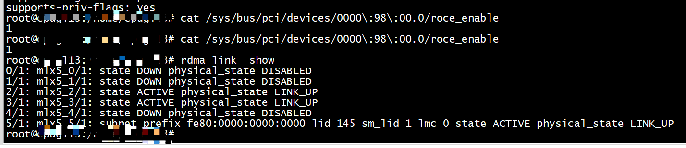

# rdma link  show


# server

```
cat /sys/bus/pci/devices/0000\:98\:00.0/roce_enable
1
```

```
rping -s  192.168.13.56  -v -C 3
server ping data: rdma-ping-0: ABCDEFGHIJKLMNOPQRSTUVWXYZ[\]^_`abcdefghijklmnopqr
server ping data: rdma-ping-1: BCDEFGHIJKLMNOPQRSTUVWXYZ[\]^_`abcdefghijklmnopqrs
server ping data: rdma-ping-2: CDEFGHIJKLMNOPQRSTUVWXYZ[\]^_`abcdefghijklmnopqrst
server DISCONNECT EVENT...
wait for RDMA_READ_ADV state 10
```

# client

```
cat /sys/bus/pci/devices/0000\:98\:00.0/roce_enable
1
```

```
rping -c -a 192.168.13.56 -v -C 3
ping data: rdma-ping-0: ABCDEFGHIJKLMNOPQRSTUVWXYZ[\]^_`abcdefghijklmnopqr
ping data: rdma-ping-1: BCDEFGHIJKLMNOPQRSTUVWXYZ[\]^_`abcdefghijklmnopqrs
ping data: rdma-ping-2: CDEFGHIJKLMNOPQRSTUVWXYZ[\]^_`abcdefghijklmnopqrst
```