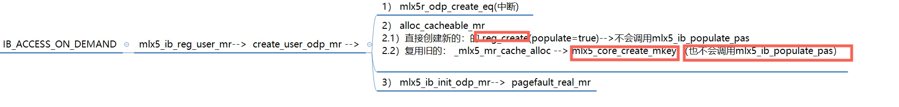

# Pascal/Valta 架构上的 Unified Memory
硬件上引入PAGE MIGRATION ENGINE，支持Virtual Memory Demand Paging，其实就是gpu硬件层面支持页面错误处理机制【handle thousands of simultaneous page faults】。因为没有该特性的话，应用要提前将数据都加载到GPU显存中，这样势必会带来很大的开销。
再以一个例子来说明：   

   

第一句代码：申请GPU显存，此时在GPU上不会创建页面。   
第二句代码：CPU访问内存，出现也错误，数据将会在CPU中分配。   
第三句代码：GPU内核访问，出现页错误，数据会migrate到GPU中。  
特点：  
+  如果系统不支持UVA，则系统会向CPU发送一个中断。   
+  Unified Memory driver会决定会映射还是迁移数据。  

# How does ODP work?
```Text
When applications register a memory region(MR), RDMA drivers normally pin
pages in the MR so that physical addresses are never changed during RDMA
communication. This requires the MR to fit in physical memory and
inevitably leads to memory pressure. On the other hand, On-Demand Paging
(ODP) allows applications to register MRs without pinning pages. They are
paged-in when the driver requires and paged-out when the OS reclaims. As a
result, it is possible to register a large MR that does not fit in physical
memory without taking up so much physical memory.
```
```Text
"struct ib_umem_odp" is used to manage pages. It is created for each
ODP-enabled MR on its registration. This struct holds a pair of arrays
(dma_list/pfn_list) that serve as a driver page table. DMA addresses and
PFNs are stored in the driver page table. They are updated on page-in and
page-out, both of which use the common interface in ib_uverbs.

Page-in can occur when requester, responder or completer access an MR in
order to process RDMA operations. If they find that the pages being
accessed are not present on physical memory or requisite permissions are
not set on the pages, they provoke page fault to make pages present with
proper permissions and at the same time update the driver page table. After
confirming the presence of the pages, they execute memory access such as
read, write or atomic operations.

Page-out is triggered by page reclaim or filesystem events (e.g. metadata
update of a file that is being used as an MR). When creating an ODP-enabled
MR, the driver registers an MMU notifier callback. When the kernel issues a
page invalidation notification, the callback is provoked to unmap DMA
addresses and update the driver page table. After that, the kernel releases
the pages.
```
 

# 非IB_ACCESS_ON_DEMAND
  
mlx5_ib_populate_pas构造mtt
# IB_ACCESS_ON_DEMAND
 
 
# references
[【研究综述】浅谈GPU通信和PCIe P2P DMA](https://zhuanlan.zhihu.com/p/430101220)   