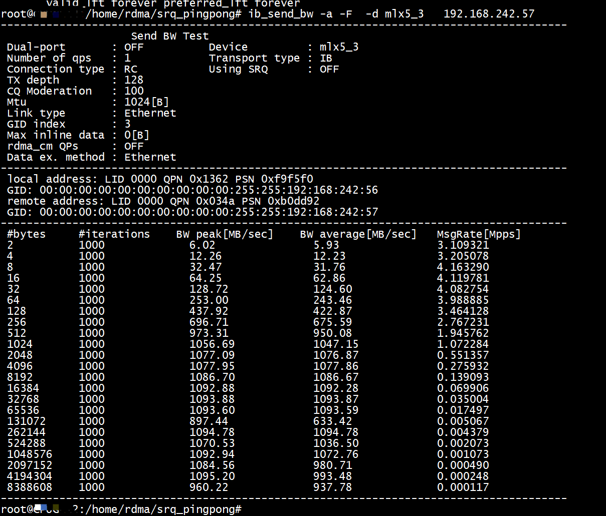
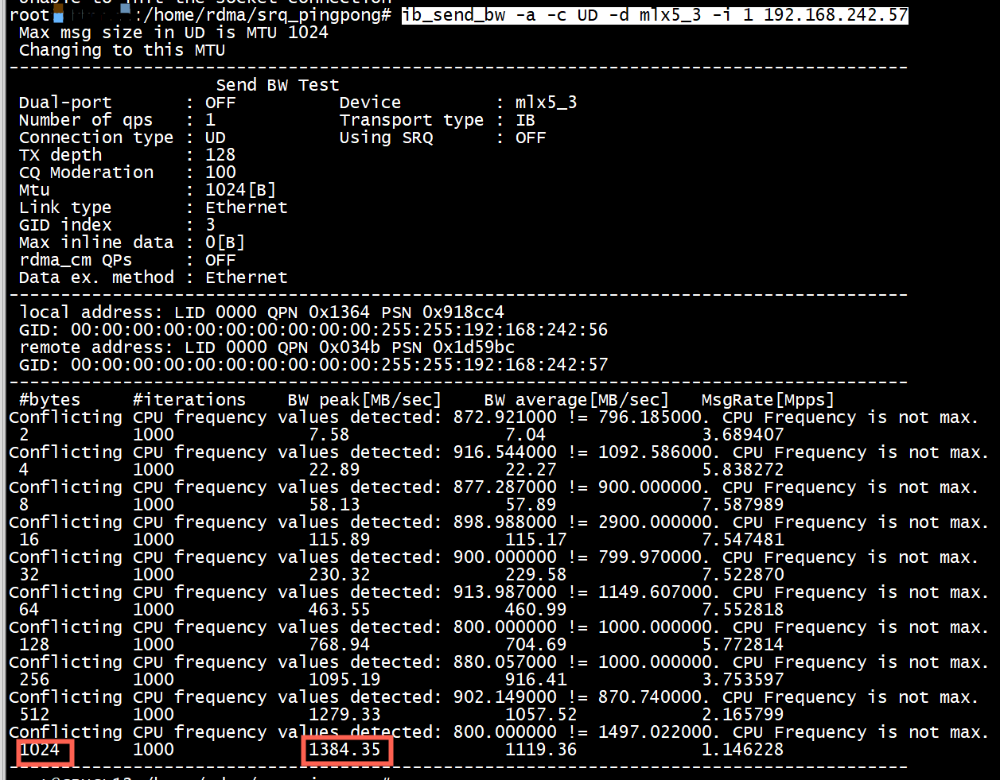
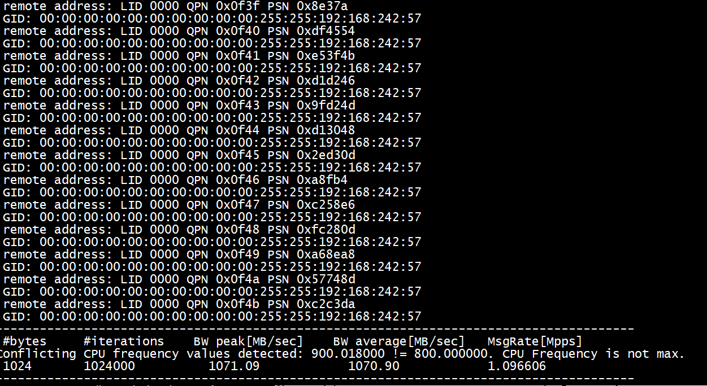
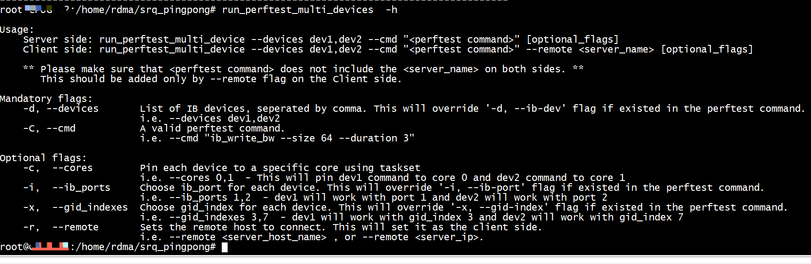
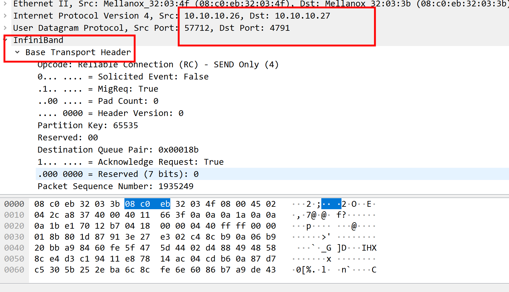

# 网卡带宽

```Shell
ethtool -i ens14f0
driver: mlx5_core
version: 4.9-5.1.0
firmware-version: 14.27.1016 (MT_2420110004)
expansion-rom-version: 
bus-info: 0000:98:00.0
supports-statistics: yes
supports-test: yes
supports-eeprom-access: no
supports-register-dump: no
supports-priv-flags: yes
ethtool  ens14f0 | grep -i speed
        Speed: 10000Mb/s
```
10000Mb/s   
# ib_send_bw test1
+ server
```Shell
ib_send_bw -a -F -d mlx5_3   
```


+ client
```Shell
ib_send_bw -a -F  -d mlx5_3   192.168.242.57  
```



# ib_send_bw test2
+ server
```Shell
ib_send_bw -a -c UD -d mlx5_3  -i 1   
```


+ client
```Shell
ib_send_bw -a -c UD -d mlx5_3 -i 1 192.168.242.57  
```



#  multiple QP  and 指定包大小

+ server
```Shell
ib_send_bw -s 1024  -c UD -q 1024 -d mlx5_3  -i 1
```


+ client
```Shell
ib_send_bw  -s 1024  -c UD -q 1024 -d mlx5_3 -i 1 192.168.242.57
```



#  multiple QP  and  RC 

+ server
```Shell
ib_send_bw -s 1024  -c RC -q 4096 -d mlx5_3  -i 1
```


+ client
```Shell
ib_send_bw  -s 1024  -c RC -q 4096 -d mlx5_3 -i 1 192.168.242.5
```

```
---------------------------------------------------------------------------------------
 #bytes     #iterations    BW peak[MB/sec]    BW average[MB/sec]   MsgRate[Mpps]
Conflicting CPU frequency values detected: 894.060000 != 800.000000. CPU Frequency is not max.
 1024       4096000          1082.89            956.64             0.979595
---------------------------------------------------------------------------------------
```

# run_perftest_multi_devices

```
Server side:
run_perftest_multi_devices -d mlx5_0,mlx5_2 -c 0,1 --cmd "ib_write_bw"

Client side:
run_perftest_multi_devices -d mlx5_0,mlx5_2 -c 0,1 --cmd "ib_write_bw --report_gbits" --remote <ib interface ip > 
```



# ib perf

```
centos7@centos7:~$ ethtool -i ibp129s0
driver: mlx5_core[ib_ipoib]
version: 5.4-3.0.3
firmware-version: 20.33.1048 (MT_0000000226)
expansion-rom-version: 
bus-info: 0000:81:00.0
supports-statistics: yes
supports-test: yes
supports-eeprom-access: no
supports-register-dump: no
supports-priv-flags: yes
centos7@centos7:~$ ibdev2netdev 
mlx5_0 port 1 ==> enp1s0f0 (Up)
mlx5_1 port 1 ==> enp1s0f1 (Up)
mlx5_2 port 1 ==> ibp129s0 (Up)
mlx5_3 port 1 ==> enp193s0 (Up)
```


##  server
```
centos7@centos7:~$ ib_send_bw -a -F -d mlx5_2

************************************
* Waiting for client to connect... *
************************************
---------------------------------------------------------------------------------------
                    Send BW Test
 Dual-port       : OFF          Device         : mlx5_2
 Number of qps   : 1            Transport type : IB
 Connection type : RC           Using SRQ      : OFF
 PCIe relax order: ON
 ibv_wr* API     : ON
 RX depth        : 512
 CQ Moderation   : 100
 Mtu             : 4096[B]
 Link type       : IB
 Max inline data : 0[B]
 rdma_cm QPs     : OFF
 Data ex. method : Ethernet
---------------------------------------------------------------------------------------
 local address: LID 0x74 QPN 0x0027 PSN 0x18941
 remote address: LID 0x6e QPN 0x0027 PSN 0x172f5a
---------------------------------------------------------------------------------------
 #bytes     #iterations    BW peak[MB/sec]    BW average[MB/sec]   MsgRate[Mpps]
 2          1000             0.00               4.91               2.572540
 4          1000             0.00               8.83               2.315508
 8          1000             0.00               19.66              2.577234
 16         1000             0.00               39.34              2.578367
 32         1000             0.00               78.72              2.579386
 64         1000             0.00               155.21             2.543005
 128        1000             0.00               304.05             2.490775
 256        1000             0.00               629.59             2.578787
 512        1000             0.00               1255.61            2.571485
 1024       1000             0.00               2507.21            2.567381
 2048       1000             0.00               4944.08            2.531367
 4096       1000             0.00               9633.97            2.466295
 8192       1000             0.00               16984.76                   2.174049
 16384      1000             0.00               17501.94                   1.120124
 32768      1000             0.00               17976.40                   0.575245
 65536      1000             0.00               20456.68                   0.327307
 131072     1000             0.00               21750.80                   0.174006
 262144     1000             0.00               22664.44                   0.090658
 524288     1000             0.00               23092.86                   0.046186
 1048576    1000             0.00               23131.70                   0.023132
 2097152    1000             0.00               23357.65                   0.011679
 4194304    1000             0.00               23376.34                   0.005844
 8388608    1000             0.00               23426.81                   0.002928
---------------------------------------------------------------------------------------
centos7@centos7:~$ 
```
***Link type       : IB***
## client

```
centos6@centos6:~$ ib_send_bw -a -F  -d mlx5_2 172.16.242.27
---------------------------------------------------------------------------------------
                    Send BW Test
 Dual-port       : OFF          Device         : mlx5_2
 Number of qps   : 1            Transport type : IB
 Connection type : RC           Using SRQ      : OFF
 PCIe relax order: ON
 ibv_wr* API     : ON
 TX depth        : 128
 CQ Moderation   : 100
 Mtu             : 4096[B]
 Link type       : IB
 Max inline data : 0[B]
 rdma_cm QPs     : OFF
 Data ex. method : Ethernet
---------------------------------------------------------------------------------------
 local address: LID 0x6e QPN 0x0027 PSN 0x172f5a
 remote address: LID 0x74 QPN 0x0027 PSN 0x18941
---------------------------------------------------------------------------------------
 #bytes     #iterations    BW peak[MB/sec]    BW average[MB/sec]   MsgRate[Mpps]
 2          1000             4.85               4.80               2.518597
 4          1000             8.76               8.75               2.295007
 8          1000             19.49              19.48              2.552887
 16         1000             39.01              38.97              2.554192
 32         1000             78.02              77.95              2.554344
 64         1000             153.92             153.51             2.515079
 128        1000             309.04             300.93             2.465180
 256        1000             622.93             622.68             2.550486
 512        1000             1242.20            1242.06            2.543738
 1024       1000             2446.10            2445.80            2.504497
 2048       1000             4892.24            4889.31            2.503325
 4096       1000             9527.46            9521.42            2.437484
 8192       1000             16717.91            16674.65                  2.134355
 16384      1000             17353.63            17346.59                  1.110182
 32768      1000             17892.54            17892.52                  0.572561
 65536      1000             22235.93            20377.38                  0.326038
 131072     1000             22660.74            21693.88                  0.173551
 262144     1000             22730.29            22614.51                  0.090458
 524288     1000             23047.83            23047.66                  0.046095
 1048576    1000             23124.94            23097.33                  0.023097
 2097152    1000             23326.85            23326.81                  0.011663
 4194304    1000             23393.95            23342.48                  0.005836
 8388608    1000             23401.80            23396.08                  0.002925
---------------------------------------------------------------------------------------
centos6@centos6:~$ 
```
***Link type       : IB***
# ib perf2

## server

```
root@centos7:/home/centos7# ib_send_bw -a -F -d mlx5_1  

************************************
* Waiting for client to connect... *
************************************
---------------------------------------------------------------------------------------
                    Send BW Test
 Dual-port       : OFF          Device         : mlx5_1
 Number of qps   : 1            Transport type : IB
 Connection type : RC           Using SRQ      : OFF
 PCIe relax order: ON
 ibv_wr* API     : ON
 RX depth        : 512
 CQ Moderation   : 100
 Mtu             : 1024[B]
 Link type       : Ethernet
 GID index       : 3
 Max inline data : 0[B]
 rdma_cm QPs     : OFF
 Data ex. method : Ethernet
---------------------------------------------------------------------------------------
 local address: LID 0000 QPN 0x0187 PSN 0xf3b87d
 GID: 00:00:00:00:00:00:00:00:00:00:255:255:10:10:10:27
 remote address: LID 0000 QPN 0x0187 PSN 0x8c54bc
 GID: 00:00:00:00:00:00:00:00:00:00:255:255:10:10:10:26
---------------------------------------------------------------------------------------
 #bytes     #iterations    BW peak[MB/sec]    BW average[MB/sec]   MsgRate[Mpps]
 2          1000             0.00               4.46               2.340101
 4          1000             0.00               8.98               2.353771
 8          1000             0.00               21.77              2.853702
 16         1000             0.00               43.56              2.854852
 32         1000             0.00               86.58              2.837012
 64         1000             0.00               174.67             2.861766
 128        1000             0.00               349.15             2.860232
 256        1000             0.00               676.56             2.771205
 512        1000             0.00               1019.34            2.087603
 1024       1000             0.00               1103.43            1.129917
 2048       1000             0.00               1104.79            0.565651
 4096       1000             0.00               1104.79            0.282827
 8192       1000             0.00               1104.81            0.141415
 16384      1000             0.00               1104.81            0.070708
 32768      1000             0.00               1097.57            0.035122
 65536      1000             0.00               1101.51            0.017624
 131072     1000             0.00               1103.18            0.008825
 262144     1000             0.00               1102.34            0.004409
 524288     1000             0.00               1101.53            0.002203
 1048576    1000             0.00               1101.72            0.001102
 2097152    1000             0.00               1101.62            0.000551
 4194304    1000             0.00               1101.75            0.000275
 8388608    1000             0.00               1101.79            0.000138
---------------------------------------------------------------------------------------
root@centos7:/home/centos7# 
```
***Link type       : Ethernet***
## client

```
root@centos6:/home/centos6# ibdev2netdev 
mlx5_0 port 1 ==> enp1s0f0 (Up)
mlx5_1 port 1 ==> enp1s0f1 (Up)
mlx5_2 port 1 ==> ibp129s0 (Up)
mlx5_3 port 1 ==> enp193s0 (Up)
root@centos6:/home/centos6# ethtool -i enp1s0f1
driver: mlx5_core
version: 5.4-3.0.3
firmware-version: 14.31.2006 (MT_2420110004)
expansion-rom-version: 
bus-info: 0000:01:00.1
supports-statistics: yes
supports-test: yes
supports-eeprom-access: no
supports-register-dump: no
supports-priv-flags: yes
root@centos6:/home/centos6# 
```

```
root@cpu6:/home/cpu6#  cat /sys/class/infiniband/mlx5_1/ports/1/gid_attrs/ndevs/0
enp1s0f1
root@cpu6:/home/cpu6# cat  /sys/class/infiniband/mlx5_1/ports/1/gid_attrs/ndevs/1
enp1s0f1
root@cpu6:/home/cpu6# cat /sys/class/infiniband/mlx5_1/ports/1/gid_attrs/types/0
IB/RoCE v1
root@cpu6:/home/cpu6# cat /sys/class/infiniband/mlx5_1/ports/1/gid_attrs/types/1
RoCE v2
root@cpu6:/home/cpu6# 
```

```
root@centos6:/home/centos6# ib_send_bw -a -F  -d mlx5_1  10.10.10.27
---------------------------------------------------------------------------------------
                    Send BW Test
 Dual-port       : OFF          Device         : mlx5_1
 Number of qps   : 1            Transport type : IB
 Connection type : RC           Using SRQ      : OFF
 PCIe relax order: ON
 ibv_wr* API     : ON
 TX depth        : 128
 CQ Moderation   : 100
 Mtu             : 1024[B]
 Link type       : Ethernet
 GID index       : 3
 Max inline data : 0[B]
 rdma_cm QPs     : OFF
 Data ex. method : Ethernet
---------------------------------------------------------------------------------------
 local address: LID 0000 QPN 0x0187 PSN 0x8c54bc
 GID: 00:00:00:00:00:00:00:00:00:00:255:255:10:10:10:26
 remote address: LID 0000 QPN 0x0187 PSN 0xf3b87d
 GID: 00:00:00:00:00:00:00:00:00:00:255:255:10:10:10:27
---------------------------------------------------------------------------------------
 #bytes     #iterations    BW peak[MB/sec]    BW average[MB/sec]   MsgRate[Mpps]
 2          1000             4.41               4.35               2.279199
 4          1000             8.86               8.83               2.315890
 8          1000             21.42              21.41              2.805660
 16         1000             42.84              42.83              2.806985
 32         1000             85.50              85.11              2.788753
 64         1000             171.37             171.23             2.805415
 128        1000             342.75             342.52             2.805911
 256        1000             667.47             663.75             2.718714
 512        1000             1004.47            1003.98            2.056151
 1024       1000             1088.32            1067.24            1.092854
 2048       1000             1096.54            1096.36            0.561336
 4096       1000             1099.16            1098.96            0.281334
 8192       1000             1101.72            1101.71            0.141019
 16384      1000             1102.77            1102.76            0.070576
 32768      1000             1102.76            1096.00            0.035072
 65536      1000             1102.94            1100.18            0.017603
 131072     1000             1102.40            1101.97            0.008816
 262144     1000             1101.73            1101.07            0.004404
 524288     1000             1101.50            1100.40            0.002201
 1048576    1000             1101.53            1100.61            0.001101
 2097152    1000             1100.62            1100.51            0.000550
 4194304    1000             1101.05            1100.60            0.000275
 8388608    1000             1100.83            1100.71            0.000138
---------------------------------------------------------------------------------------
root@centos6:/home/centos6# 
```
***Link type       : Ethernet***
## tcpdump

```
ib_send_bw -s 1024  -d mlx5_1  -n 5
root@cpu6:/home/cpu6# ib_send_bw -s 1024   -d mlx5_1  10.10.10.27 -n 5 
---------------------------------------------------------------------------------------
                    Send BW Test
 Dual-port       : OFF          Device         : mlx5_1
 Number of qps   : 1            Transport type : IB
 Connection type : RC           Using SRQ      : OFF
 PCIe relax order: ON
 ibv_wr* API     : ON
 TX depth        : 5
 CQ Moderation   : 5
 Mtu             : 1024[B]
 Link type       : Ethernet
 GID index       : 3
 Max inline data : 0[B]
 rdma_cm QPs     : OFF
 Data ex. method : Ethernet
---------------------------------------------------------------------------------------
 local address: LID 0000 QPN 0x018a PSN 0xd4e32f
 GID: 00:00:00:00:00:00:00:00:00:00:255:255:10:10:10:26
 remote address: LID 0000 QPN 0x018a PSN 0x47df16
 GID: 00:00:00:00:00:00:00:00:00:00:255:255:10:10:10:27
---------------------------------------------------------------------------------------
 #bytes     #iterations    BW peak[MB/sec]    BW average[MB/sec]   MsgRate[Mpps]
Conflicting CPU frequency values detected: 1499.707000 != 2522.763000. CPU Frequency is not max.
 1024       5                264.95             264.94             0.271294
---------------------------------------------------------------------------------------
root@cpu6:/home/cpu6# 

root@cpu7:/home/cpu7# ib_send_bw -s 1024  -d mlx5_1  -n 5

************************************
* Waiting for client to connect... *
************************************
---------------------------------------------------------------------------------------
                    Send BW Test
 Dual-port       : OFF          Device         : mlx5_1
 Number of qps   : 1            Transport type : IB
 Connection type : RC           Using SRQ      : OFF
 PCIe relax order: ON
 ibv_wr* API     : ON
 RX depth        : 6
 CQ Moderation   : 5
 Mtu             : 1024[B]
 Link type       : Ethernet
 GID index       : 3
 Max inline data : 0[B]
 rdma_cm QPs     : OFF
 Data ex. method : Ethernet
---------------------------------------------------------------------------------------
 local address: LID 0000 QPN 0x018b PSN 0x533ab8
 GID: 00:00:00:00:00:00:00:00:00:00:255:255:10:10:10:27
 remote address: LID 0000 QPN 0x018b PSN 0x1d8791
 GID: 00:00:00:00:00:00:00:00:00:00:255:255:10:10:10:26
---------------------------------------------------------------------------------------
 #bytes     #iterations    BW peak[MB/sec]    BW average[MB/sec]   MsgRate[Mpps]
Conflicting CPU frequency values detected: 1499.552000 != 1466.956000. CPU Frequency is not max.
 1024       5                0.00               437.92             0.448426
---------------------------------------------------------------------------------------
```

# references

[在25G以太网环境下使用Perftest对RoCEv2性能进行测试](http://blog.sysu.tech/Benchmark/%E5%9C%A825G%E4%BB%A5%E5%A4%AA%E7%BD%91%E7%8E%AF%E5%A2%83%E4%B8%8B%E4%BD%BF%E7%94%A8Perftest%E5%AF%B9RoCEv2%E6%80%A7%E8%83%BD%E8%BF%9B%E8%A1%8C%E6%B5%8B%E8%AF%95/)