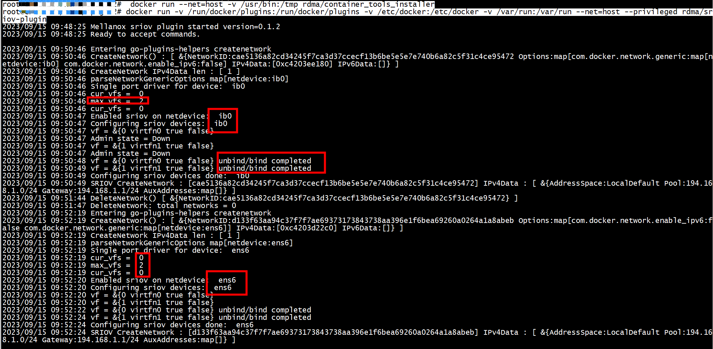
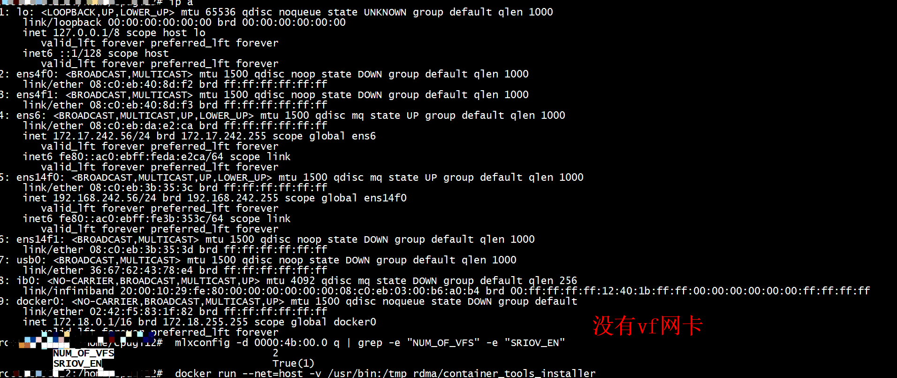
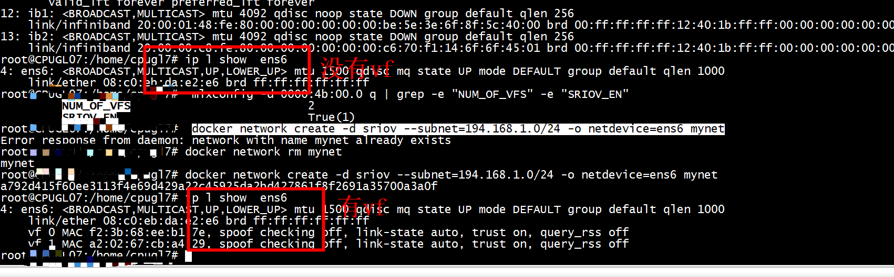
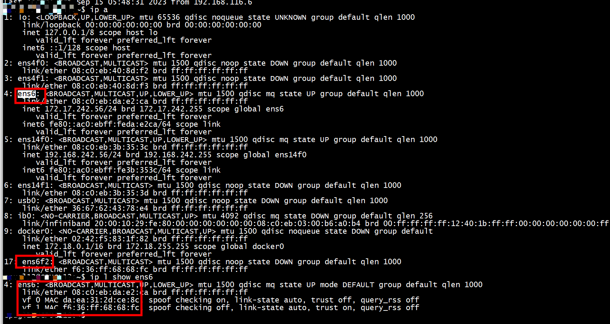
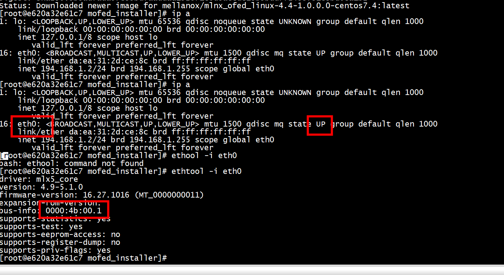
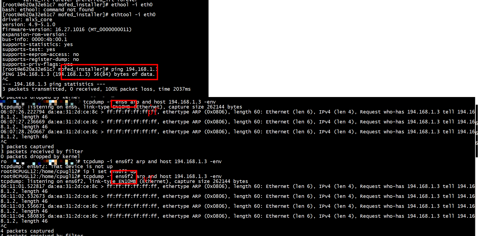
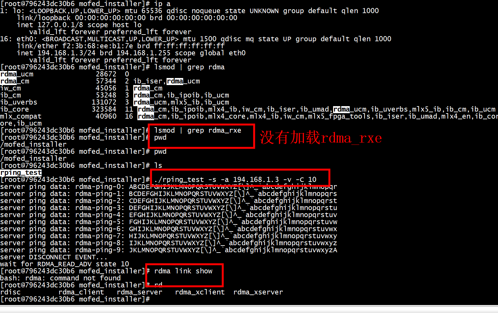

# enable  SRIOV_EN
```
root@ubuntu:/home/ubuntu# lspci -v | grep -i mellanox
31:00.0 Ethernet controller: Mellanox Technologies MT27710 Family [ConnectX-4 Lx]
        Subsystem: Mellanox Technologies ConnectX-4 Lx Stand-up dual-port 10GbE MCX4121A-XCAT
31:00.1 Ethernet controller: Mellanox Technologies MT27710 Family [ConnectX-4 Lx]
        Subsystem: Mellanox Technologies ConnectX-4 Lx Stand-up dual-port 10GbE MCX4121A-XCAT
4b:00.0 Ethernet controller: Mellanox Technologies MT27800 Family [ConnectX-5]
        Subsystem: Mellanox Technologies MT27800 Family [ConnectX-5]
98:00.0 Ethernet controller: Mellanox Technologies MT27710 Family [ConnectX-4 Lx]
        Subsystem: Mellanox Technologies ConnectX-4 Lx Stand-up dual-port 10GbE MCX4121A-XCAT
98:00.1 Ethernet controller: Mellanox Technologies MT27710 Family [ConnectX-4 Lx]
        Subsystem: Mellanox Technologies ConnectX-4 Lx Stand-up dual-port 10GbE MCX4121A-XCAT
b1:00.0 Infiniband controller: Mellanox Technologies MT28908 Family [ConnectX-6]
        Subsystem: Mellanox Technologies MT28908 Family [ConnectX-6]
b1:00.1 Infiniband controller: Mellanox Technologies MT28908 Family [ConnectX-6 Virtual Function]
        Subsystem: Mellanox Technologies MT28908 Family [ConnectX-6 Virtual Function]
root@ubuntu:/home/ubuntu# ethtool -i ens6
driver: mlx5_core
version: 4.9-5.1.0
firmware-version: 16.27.1016 (MT_0000000011)
expansion-rom-version: 
bus-info: 0000:4b:00.0
supports-statistics: yes
supports-test: yes
supports-eeprom-access: no
supports-register-dump: no
supports-priv-flags: yes
root@ubuntu:/home/ubuntu#  mlxconfig -d 0000:4b:00.0 q | grep SRIOV_EN
         SRIOV_EN                            True(1)         
root@ubuntu:/home/ubuntu# 
```

```
mlxconfig -d b1:00.0 set SRIOV_EN=1 NUM_OF_VFS=2
root@ubuntu:/home/ubuntu#  mlxconfig -d 0000:4b:00.0 q | grep -e "NUM_OF_VFS" -e "SRIOV_EN"
         NUM_OF_VFS                          2               
         SRIOV_EN                            True(1)         
root@ubuntu:/home/ubuntu# 
```

#  rdma/sriov-plugin 服务端

```
root@ubuntu:/home/ubuntu#  docker run --net=host -v /usr/bin:/tmp rdma/container_tools_installer
root@ubuntu:/home/ubuntu# docker run -v /run/docker/plugins:/run/docker/plugins -v /etc/docker:/etc/docker -v /var/run:/var/run --net=host --privileged rdma/sriov-plugin
```


#  rdma/sriov-plugin 客户端

```
root@ubuntu:/home/ubuntu#  docker network create -d sriov --subnet=194.168.1.0/24 -o netdevice=ib0 mynet
cae5136a82cd34245f7ca3d37ccecf13b6be5e5e7e740b6a82c5f31c4ce95472
root@ubuntu:/home/ubuntu# docker network rm mynet
mynet
```
host节点   
```
4: ens6: <BROADCAST,MULTICAST,UP,LOWER_UP> mtu 1500 qdisc mq state UP group default qlen 1000
    link/ether 08:c0:eb:da:e2:ca brd ff:ff:ff:ff:ff:ff
    inet 172.17.242.56/24 brd 172.17.242.255 scope global ens6
       valid_lft forever preferred_lft forever
    inet6 fe80::ac0:ebff:feda:e2ca/64 scope link 
       valid_lft forever preferred_lft forever
```

## sriov 网卡

```
4: ens6: <BROADCAST,MULTICAST,UP,LOWER_UP> mtu 1500 qdisc mq state UP group default qlen 1000
    link/ether 08:c0:eb:da:e2:ca brd ff:ff:ff:ff:ff:ff
    inet 172.17.242.56/24 brd 172.17.242.255 scope global ens6
       valid_lft forever preferred_lft forever
    inet6 fe80::ac0:ebff:feda:e2ca/64 scope link 
       valid_lft forever preferred_lft forever
root@ubuntu:/home/ubuntu# lspci -v | grep -i mellanox
31:00.0 Ethernet controller: Mellanox Technologies MT27710 Family [ConnectX-4 Lx]
        Subsystem: Mellanox Technologies ConnectX-4 Lx Stand-up dual-port 10GbE MCX4121A-XCAT
31:00.1 Ethernet controller: Mellanox Technologies MT27710 Family [ConnectX-4 Lx]
        Subsystem: Mellanox Technologies ConnectX-4 Lx Stand-up dual-port 10GbE MCX4121A-XCAT
4b:00.0 Ethernet controller: Mellanox Technologies MT27800 Family [ConnectX-5]
        Subsystem: Mellanox Technologies MT27800 Family [ConnectX-5]
98:00.0 Ethernet controller: Mellanox Technologies MT27710 Family [ConnectX-4 Lx]
        Subsystem: Mellanox Technologies ConnectX-4 Lx Stand-up dual-port 10GbE MCX4121A-XCAT
98:00.1 Ethernet controller: Mellanox Technologies MT27710 Family [ConnectX-4 Lx]
        Subsystem: Mellanox Technologies ConnectX-4 Lx Stand-up dual-port 10GbE MCX4121A-XCAT
b1:00.0 Infiniband controller: Mellanox Technologies MT28908 Family [ConnectX-6]
        Subsystem: Mellanox Technologies MT28908 Family [ConnectX-6]
b1:00.1 Infiniband controller: Mellanox Technologies MT28908 Family [ConnectX-6 Virtual Function]
        Subsystem: Mellanox Technologies MT28908 Family [ConnectX-6 Virtual Function]
root@ubuntu:/home/ubuntu# ethtool -i ens6
driver: mlx5_core
version: 4.9-5.1.0
firmware-version: 16.27.1016 (MT_0000000011)
expansion-rom-version: 
bus-info: 0000:4b:00.0
supports-statistics: yes
supports-test: yes
supports-eeprom-access: no
supports-register-dump: no
supports-priv-flags: yes
mlxconfig -d 0000:4b:00.0 q | grep -e "NUM_OF_VFS" -e "SRIOV_EN"
```

```
root@ubuntu:/home/ubuntu#  mlxconfig -d 0000:4b:00.0 q | grep -e "NUM_OF_VFS" -e "SRIOV_EN"
         NUM_OF_VFS                          2               
         SRIOV_EN                            True(1)   
```


sriov开启 vf num等于2 但是用ip命令看不到vf网卡   


```
root@ubuntu:/home/ubuntu# ip l show  ens6
4: ens6: <BROADCAST,MULTICAST,UP,LOWER_UP> mtu 1500 qdisc mq state UP mode DEFAULT group default qlen 1000
    link/ether 08:c0:eb:da:e2:e6 brd ff:ff:ff:ff:ff:ff
root@ubuntu:/home/ubuntu#  mlxconfig -d 0000:4b:00.0 q | grep -e "NUM_OF_VFS" -e "SRIOV_EN"
         NUM_OF_VFS                          2               
         SRIOV_EN                            True(1)         
root@ubuntu:/home/ubuntu# 
```

执行下述命令可以看到了   
```
root@ubuntu:/home/ubuntu#  docker network create -d sriov --subnet=194.168.1.0/24 -o netdevice=ens6 mynet
d133f63aa94c37f7f7ae69373173843738aa396e1f6bea69260a0264a1a8abeb
root@ubuntu:/home/ubuntu# docker_rdma_sriov run --net=mynet --ip=194.168.1.2 -it mellanox/mlnx_ofed_linux-4.4-1.0.0.0-centos7.4 bash
```




查看容器的网卡   

容器发ping报文，host上抓包  



## 创建第二个docker

host节点<172.17.242.47>  


```
4: ens6: <BROADCAST,MULTICAST,UP,LOWER_UP> mtu 1500 qdisc mq state UP group default qlen 1000
    link/ether 08:c0:eb:da:e2:e6 brd ff:ff:ff:ff:ff:ff
    inet 172.17.242.47/24 brd 172.17.242.255 scope global ens6
       valid_lft forever preferred_lft forever
    inet6 fe80::ac0:ebff:feda:e2e6/64 scope link 
       valid_lft forever preferred_lft foreve
```
## 创建
```
root@ubuntu:/home/ubuntu#  docker network create -d sriov --subnet=194.168.1.0/24 -o netdevice=ens6 mynet
Error response from daemon: network with name mynet already exists
root@ubuntu:/home/ubuntu# docker network rm mynet
mynet
root@ubuntu:/home/ubuntu# docker network create -d sriov --subnet=194.168.1.0/24 -o netdevice=ens6 mynet
a792d415f60ee3113f4e69d429a22c45925da2bd427861f8f2691a35700a3a0f
root@ubuntu:/home/ubuntu# ip l show  ens6
4: ens6: <BROADCAST,MULTICAST,UP,LOWER_UP> mtu 1500 qdisc mq state UP mode DEFAULT group default qlen 1000
    link/ether 08:c0:eb:da:e2:e6 brd ff:ff:ff:ff:ff:ff
    vf 0 MAC f2:3b:68:ee:b1:7e, spoof checking off, link-state auto, trust on, query_rss off
    vf 1 MAC a2:02:67:cb:a4:29, spoof checking off, link-state auto, trust on, query_rss off
root@ubuntu:/home/ubuntu# docker_rdma_sriov run --net=mynet --ip=194.168.1.3 -it mellanox/mlnx_ofed_linux-4.4-1.0.0.0-centos7.4 bash
[root@796243dc30b6 mofed_installer]# ping 194.168.1.2
PING 194.168.1.2 (194.168.1.2) 56(84) bytes of data.
64 bytes from 194.168.1.2: icmp_seq=1 ttl=64 time=0.064 ms
64 bytes from 194.168.1.2: icmp_seq=2 ttl=64 time=0.039 ms
64 bytes from 194.168.1.2: icmp_seq=3 ttl=64 time=0.032 ms
64 bytes from 194.168.1.2: icmp_seq=4 ttl=64 time=0.041 ms
```  


```
[root@796243dc30b6 mofed_installer]# ping 194.168.1.2
PING 194.168.1.2 (194.168.1.2) 56(84) bytes of data.
64 bytes from 194.168.1.2: icmp_seq=1 ttl=64 time=0.064 ms
64 bytes from 194.168.1.2: icmp_seq=2 ttl=64 time=0.039 ms
64 bytes from 194.168.1.2: icmp_seq=3 ttl=64 time=0.032 ms
64 bytes from 194.168.1.2: icmp_seq=4 ttl=64 time=0.041 ms
^C
--- 194.168.1.2 ping statistics ---
4 packets transmitted, 4 received, 0% packet loss, time 3050ms
rtt min/avg/max/mdev = 0.032/0.044/0.064/0.012 ms
[root@796243dc30b6 mofed_installer]# ip a
1: lo: <LOOPBACK,UP,LOWER_UP> mtu 65536 qdisc noqueue state UNKNOWN group default qlen 1000
    link/loopback 00:00:00:00:00:00 brd 00:00:00:00:00:00
    inet 127.0.0.1/8 scope host lo
       valid_lft forever preferred_lft forever
16: eth0: <BROADCAST,MULTICAST,UP,LOWER_UP> mtu 1500 qdisc mq state UP group default qlen 1000
    link/ether f2:3b:68:ee:b1:7e brd ff:ff:ff:ff:ff:ff
    inet 194.168.1.3/24 brd 194.168.1.255 scope global eth0
       valid_lft forever preferred_lft forever
[root@796243dc30b6 mofed_installer]#
```
ping是成功的   

没有rdma_rxe模块  
```
[root@796243dc30b6 mofed_installer]# lsmod | grep rdma
rdma_ucm               28672  0 
rdma_cm                57344  2 ib_iser,rdma_ucm
iw_cm                  45056  1 rdma_cm
ib_cm                  53248  3 rdma_cm,ib_ipoib,ib_ucm
ib_uverbs             131072  3 rdma_ucm,mlx5_ib,ib_ucm
ib_core               323584  11 rdma_cm,ib_ipoib,mlx4_ib,iw_cm,ib_iser,ib_umad,rdma_ucm,ib_uverbs,mlx5_ib,ib_cm,ib_ucm
mlx_compat             40960  16 rdma_cm,ib_ipoib,mlx4_core,mlx4_ib,iw_cm,mlx5_fpga_tools,ib_iser,ib_umad,mlx4_en,ib_core,rdma_ucm,ib_uverbs,mlx5_ib,ib_cm,mlx5_core,ib_ucm
[root@796243dc30b6 mofed_installer]# lsmod | grep rdma_rxe
```

# server client 通信

## server
host节点<172.17.242.47>    
docker cp rping_test 796243dc30b6:/mofed_installer    
```
ip l sh ens6
4: ens6: <BROADCAST,MULTICAST,UP,LOWER_UP> mtu 1500 qdisc mq state UP mode DEFAULT group default qlen 1000
    link/ether 08:c0:eb:da:e2:e6 brd ff:ff:ff:ff:ff:ff
    vf 0 MAC f2:3b:68:ee:b1:7e, spoof checking on, link-state auto, trust off, query_rss off
    vf 1 MAC a2:02:67:cb:a4:29, spoof checking off, link-state auto, trust on, query_rss off
```


```
[root@796243dc30b6 mofed_installer]# lsmod | grep rdma_rxe
[root@796243dc30b6 mofed_installer]# pwd
/mofed_installer
[root@796243dc30b6 mofed_installer]# pwd
/mofed_installer
[root@796243dc30b6 mofed_installer]# ls
rping_test
[root@796243dc30b6 mofed_installer]# ./rping_test -s -a 194.168.1.3 -v -C 10
server ping data: rdma-ping-0: ABCDEFGHIJKLMNOPQRSTUVWXYZ[\]^_`abcdefghijklmnopqr
server ping data: rdma-ping-1: BCDEFGHIJKLMNOPQRSTUVWXYZ[\]^_`abcdefghijklmnopqrs
server ping data: rdma-ping-2: CDEFGHIJKLMNOPQRSTUVWXYZ[\]^_`abcdefghijklmnopqrst
server ping data: rdma-ping-3: DEFGHIJKLMNOPQRSTUVWXYZ[\]^_`abcdefghijklmnopqrstu
server ping data: rdma-ping-4: EFGHIJKLMNOPQRSTUVWXYZ[\]^_`abcdefghijklmnopqrstuv
server ping data: rdma-ping-5: FGHIJKLMNOPQRSTUVWXYZ[\]^_`abcdefghijklmnopqrstuvw
server ping data: rdma-ping-6: GHIJKLMNOPQRSTUVWXYZ[\]^_`abcdefghijklmnopqrstuvwx
server ping data: rdma-ping-7: HIJKLMNOPQRSTUVWXYZ[\]^_`abcdefghijklmnopqrstuvwxy
server ping data: rdma-ping-8: IJKLMNOPQRSTUVWXYZ[\]^_`abcdefghijklmnopqrstuvwxyz
server ping data: rdma-ping-9: JKLMNOPQRSTUVWXYZ[\]^_`abcdefghijklmnopqrstuvwxyzA
server DISCONNECT EVENT...
wait for RDMA_READ_ADV state 10
[root@796243dc30b6 mofed_installer]# rdma link show
bash: rdma: command not found
```

## client
host节点< 172.17.242.56>  
```
[root@e620a32e61c7 mofed_installer]# ip a
1: lo: <LOOPBACK,UP,LOWER_UP> mtu 65536 qdisc noqueue state UNKNOWN group default qlen 1000
    link/loopback 00:00:00:00:00:00 brd 00:00:00:00:00:00
    inet 127.0.0.1/8 scope host lo
       valid_lft forever preferred_lft forever
16: eth0: <BROADCAST,MULTICAST,UP,LOWER_UP> mtu 1500 qdisc mq state UP group default qlen 1000
    link/ether da:ea:31:2d:ce:8c brd ff:ff:ff:ff:ff:ff
    inet 194.168.1.2/24 brd 194.168.1.255 scope global eth0
       valid_lft forever preferred_lft forever
[root@e620a32e61c7 mofed_installer]# uname -a
Linux e620a32e61c7 4.15.0-55-generic #60-Ubuntu SMP Tue Jul 2 18:22:20 UTC 2019 x86_64 x86_64 x86_64 GNU/Linux
[root@e620a32e61c7 mofed_installer]# 
```

```
[root@e620a32e61c7 mofed_installer]# ./rping_test -c -a 194.168.1.3 -d -C 10
count 10
created cm_id 0x55ee753b2eb0
cma_event type RDMA_CM_EVENT_ADDR_RESOLVED cma_id 0x55ee753b2eb0 (parent)
cma_event type RDMA_CM_EVENT_ROUTE_RESOLVED cma_id 0x55ee753b2eb0 (parent)
rdma_resolve_addr - rdma_resolve_route successful
created pd 0x55ee753b28f0
created channel 0x55ee753b21d0
created cq 0x55ee753b5370
created qp 0x55ee753b7688
rping_setup_buffers called on cb 0x55ee753ae780
allocated & registered buffers...
cq_thread started.
cma_event type RDMA_CM_EVENT_ESTABLISHED cma_id 0x55ee753b2eb0 (parent)
ESTABLISHED
rmda_connect successful
RDMA addr 55ee753b0070 rkey 3805 len 64
send completion
recv completion
RDMA addr 55ee753b2180 rkey 3906 len 64
send completion
recv completion
RDMA addr 55ee753b0070 rkey 3805 len 64
send completion
recv completion
RDMA addr 55ee753b2180 rkey 3906 len 64
send completion
recv completion
RDMA addr 55ee753b0070 rkey 3805 len 64
send completion
recv completion
RDMA addr 55ee753b2180 rkey 3906 len 64
send completion
```
# 总结
1） 使能sriov  
```
mlxconfig -d 0000:4b:00.0 set SRIOV_EN=1 NUM_OF_VFS=2
```
2） 运行插件  
```
docker run --net=host -v /usr/bin:/tmp rdma/container_tools_installer     
docker run -v /run/docker/plugins:/run/docker/plugins -v /etc/docker:/etc/docker -v /var/run:/var/run --net=host --privileged rdma/sriov-plugin     
```
3） 创建网络   
```
docker network create -d sriov --subnet=194.168.1.0/24 -o netdevice=ens6 mynet     
```
4） 创建容器  
```
docker_rdma_sriov run --net=mynet --ip=194.168.1.2 -it    
```


# references
[Docker RoCE SRIOV Networking using OVS with ConnectX4/ConnectX5](https://mellanox.my.site.com/mellanoxcommunity/s/article/docker-roce-sriov-networking-using-ovs-with-connectx4-connectx5)