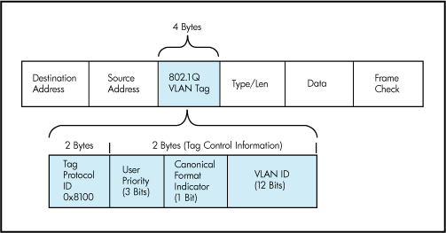
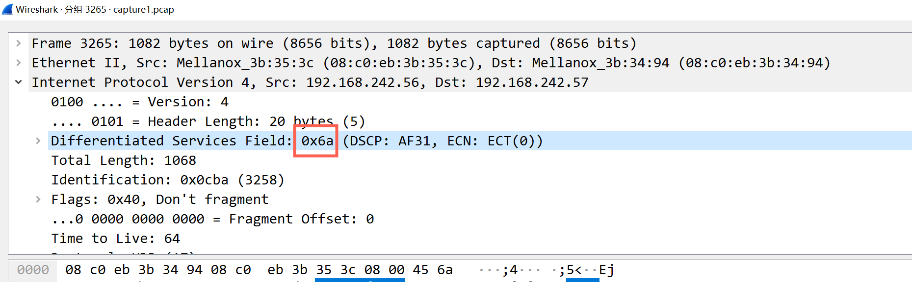
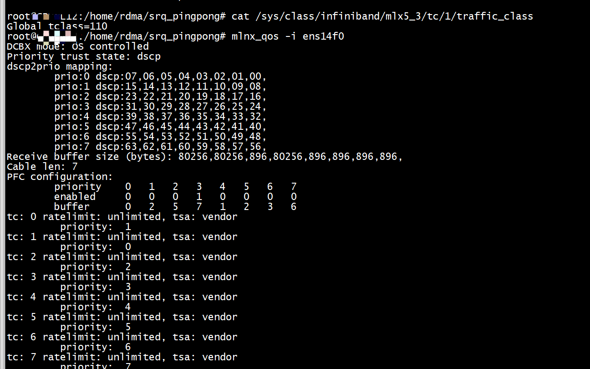
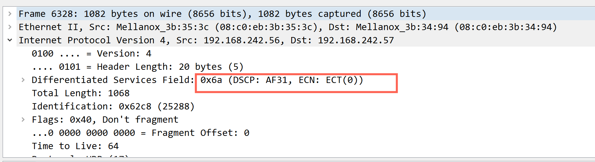
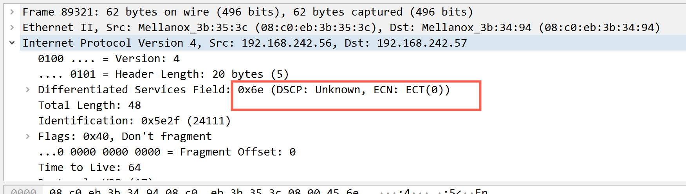

# dscp
```Shell
mlnx_qos -i ens14f0  --pfc 0,0,0,1,0,0,0,0
DCBX mode: OS controlled
Priority trust state: dscp
dscp2prio mapping:
        prio:0 dscp:07,06,05,04,03,02,01,00,
        prio:1 dscp:15,14,13,12,11,10,09,08,
        prio:2 dscp:23,22,21,20,19,18,17,16,
        prio:3 dscp:31,29,28,27,26,25,24,
        prio:4 dscp:39,38,37,36,35,34,33,32,
        prio:5 dscp:47,46,45,44,43,42,41,40,
        prio:6 dscp:30,55,54,53,52,51,50,49,
        prio:6 dscp:48,
        prio:7 dscp:63,62,61,60,59,58,57,56,
Receive buffer size (bytes): 80256,80256,896,80256,896,896,896,896,
Cable len: 7
PFC configuration:
        priority    0   1   2   3   4   5   6   7
        enabled     0   0   0   1   0   0   0   0   
        buffer      0   2   5   7   1   2   3   6   
tc: 0 ratelimit: unlimited, tsa: vendor
         priority:  1
tc: 1 ratelimit: unlimited, tsa: vendor
         priority:  0
tc: 2 ratelimit: unlimited, tsa: vendor
         priority:  2
tc: 3 ratelimit: unlimited, tsa: vendor
         priority:  3
tc: 4 ratelimit: unlimited, tsa: vendor
         priority:  4
tc: 5 ratelimit: unlimited, tsa: vendor
         priority:  5
tc: 6 ratelimit: unlimited, tsa: vendor
         priority:  6
tc: 7 ratelimit: unlimited, tsa: vendor
         priority:  7
```
# pcp
```Shell
mlnx_qos -i ens14f0 --trust pcp
DCBX mode: OS controlled
Priority trust state: pcp
Receive buffer size (bytes): 80256,80256,896,80256,896,896,896,896,
Cable len: 7
PFC configuration:
        priority    0   1   2   3   4   5   6   7
        enabled     0   0   0   1   0   0   0   0   
        buffer      0   2   5   7   1   2   3   6   
tc: 0 ratelimit: unlimited, tsa: vendor
         priority:  1
tc: 1 ratelimit: unlimited, tsa: vendor
         priority:  0
tc: 2 ratelimit: unlimited, tsa: vendor
         priority:  2
tc: 3 ratelimit: unlimited, tsa: vendor
         priority:  3
tc: 4 ratelimit: unlimited, tsa: vendor
         priority:  4
tc: 5 ratelimit: unlimited, tsa: vendor
         priority:  5
tc: 6 ratelimit: unlimited, tsa: vendor
         priority:  6
tc: 7 ratelimit: unlimited, tsa: vendor
         priority:  7
```

#  为了实现每个流有不同的优先级，硬件层如何对流量分类

在IP/Ethernet数据包头部中，有两种方式来对网络包进行分类：  
+ 使用VLAN头部的PCP域  
+ 使用IP头部的DSCP域  



# 应用层对流量的分类是怎么映射到硬件层上的分类
通常是要经过一个两阶段或者三阶段的过程来完成，但这在不同的库接口(verbs和rdma_cm)以及不同版本的RoCE协议下也是不同的。
首先，针对不同协议来看：
##  RoCEv1
RoCEv1：这个协议是将RDMA数据段封装到以太网数据段内，再加上以太网的头部，因此属于二层数据包，为了对它进行分类的话，只能使用VLAN头部中的PCP域来设置优先级值，因此还需要额外开启VLAN功能。当开启VLAN之后，在不同的库中映射过程如下：
+ verbs：
应用在创建QP时，对QP属性中的SL(service level)字段进行设置优先级。
在硬件驱动中，会自动将SL转换成VLAN头部中的PCP域代表的值UP，转换方式：UP = SL & 7，该值只有8种可选值
网络流会根据UP值映射到对应的TC上
+ rdma_cm:
应用通过rdma_set_option函数来设置ToS值，该值只有4种有效值：0,8,24,16，
然后在内核中，将ToS转换成sk_prio，该值也只有4种有效值：0,2,4,6，映射方式固定
最后在硬件驱动中，将sk_prio转换成UP，映射方式可以用户自定义
网络流会根据UP值映射到对应的TC上
## RoCEv2
RoCEv2: 这个协议是将RDMA数据段先封装到UDP数据段内，加上UDP头部，再加上IP头部，最后在加上以太网头部，属于三层数据包，为了对它进行分类的话，既可以使用以太网VLAN中的PCP域，也可以使用IP头部的DSCP域。对于PCP域的映射过程和上面一致，下面仅解释DSCP域的映射过程：
+  verbs:
应用在创建QP时，对QP属性中GRH中的traffic_class字段进行设置优先级。
在硬件驱动中，IP头部的ToS字段会直接被赋值为traffic_class，而DSCP只是ToS中的高6位，因此traffic_class到优先级的转换是：traffic_class=有效优先级值 * 4
最终根据DSCP值到TC的映射表来将网络流映射到对应的TC上
+ rdma_cm:
应用通过rdma_set_optin函数来设置ToS值
在硬件驱动中，根据设置的ToS到DSCP值的映射表，将ToS转换成DSCP值
最终根据DSCP值到TC的映射表来将网络流映射到对应的TC上

# demo
+ 1) 设置attr.ah_attr.grh.traffic_class和sys/class/infiniband/mlx5_3/tc/1/traffic_class   

 attr.ah_attr.grh.traffic_class = 106;  
```
cat /sys/class/infiniband/mlx5_3/tc/1/traffic_class
Global tclass=106
```

将RoCE流量的标记设置为26，至于为什么26要填106？
在数据包的IP层(网路层)有一块TOS(Type Of Server)域，其中前8个位为DSCP值，后2位为ECN标记位，我们需要把ECN标记位设置为10(二进制)，而DSCP值为26，对应二进制值为11010，连一起就是1101010，对应十刘进制值就是0x6A

```
mlnx_qos -i ens14f0
DCBX mode: OS controlled
Priority trust state: dscp
dscp2prio mapping:
        prio:0 dscp:07,06,05,04,03,02,01,00,
        prio:1 dscp:15,14,13,12,11,10,09,08,
        prio:2 dscp:23,22,21,20,19,18,17,16,
        prio:3 dscp:31,30,29,28,27,26,25,24,
        prio:4 dscp:39,38,37,36,35,34,33,32,
        prio:5 dscp:47,46,45,44,43,42,41,40,
        prio:6 dscp:55,54,53,52,51,50,49,48,
        prio:7 dscp:63,62,61,60,59,58,57,56,
Receive buffer size (bytes): 80256,80256,896,80256,896,896,896,896,
Cable len: 7
PFC configuration:
        priority    0   1   2   3   4   5   6   7
        enabled     0   0   0   1   0   0   0   0   
        buffer      0   2   5   7   1   2   3   6   
tc: 0 ratelimit: unlimited, tsa: vendor
         priority:  1
tc: 1 ratelimit: unlimited, tsa: vendor
         priority:  0
tc: 2 ratelimit: unlimited, tsa: vendor
         priority:  2
tc: 3 ratelimit: unlimited, tsa: vendor
         priority:  3
tc: 4 ratelimit: unlimited, tsa: vendor
         priority:  4
tc: 5 ratelimit: unlimited, tsa: vendor
         priority:  5
tc: 6 ratelimit: unlimited, tsa: vendor
         priority:  6
tc: 7 ratelimit: unlimited, tsa: vendor
         priority:  7
```



在prio 3启用PFC   
mlnx_qos -i ens14f0  --pfc 0,0,0,1,0,0,0,0



+ 2) 设置attr.ah_attr.grh.traffic_class和sys/class/infiniband/mlx5_3/tc/1/traffic_class   

 attr.ah_attr.grh.traffic_class = 110;  
```
cat /sys/class/infiniband/mlx5_3/tc/1/traffic_class
Global tclass=106
```


还是106

+ 3) 设置attr.ah_attr.grh.traffic_class和sys/class/infiniband/mlx5_3/tc/1/traffic_class   

 attr.ah_attr.grh.traffic_class = 106;  
```
cat /sys/class/infiniband/mlx5_3/tc/1/traffic_class
Global tclass=110
```


是110


