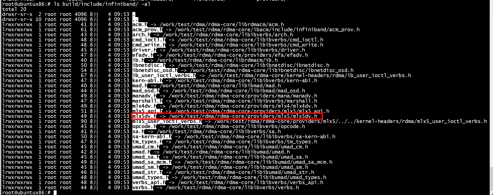
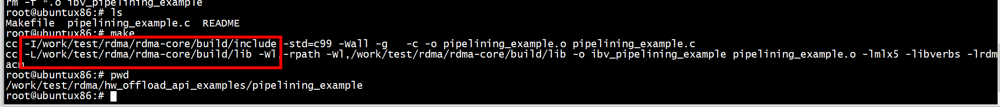

# rdma core

```
git clone https://github.com/linux-rdma/rdma-core.git
```

```
./build.sh 
```

## include 头文件



```Shell
CC ?= gcc
RDMA_CORE_PATH = /work/test/rdma/rdma-core
ifdef RDMA_CORE_PATH
CFLAGS += -I${RDMA_CORE_PATH}/build/include
LDFLAGS += -L${RDMA_CORE_PATH}/build/lib
LDFLAGS += -Wl,-rpath -Wl,${RDMA_CORE_PATH}/build/lib
endif
CFLAGS += -std=c99 -Wall -g
LIBS = -lmlx5 -libverbs -lrdmacm


TARGETS = ibv_pipelining_example

all: $(TARGETS)

ibv_pipelining_example: pipelining_example.o
        $(CC) $(LDFLAGS) -o $@ $^ $(LIBS)

clean:
        rm -f *.o $(TARGETS)
```

