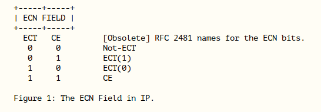
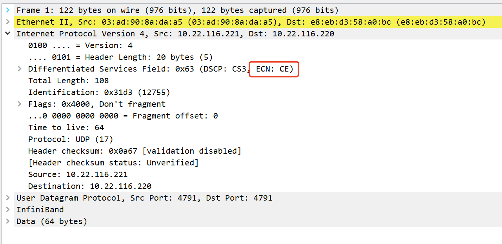

#  rdma res show

```
 rdma res show
0: mlx5_0: pd 2 cq 3 qp 1 cm_id 0 mr 0 ctx 0 srq 2 
1: mlx5_1: pd 3 cq 4 qp 65 cm_id 0 mr 1 ctx 1 srq 2 
```

# test


## ibv_devinfo   

```
root@test:~/rdma# rdma link
link irdma0/1 state DOWN physical_state DISABLED netdev enp23s0f0 
link irdma1/1 state ACTIVE physical_state LINK_UP netdev enp23s0f1 
ibv_devinfo -d irdma1  -v
hca_id: irdma1
        transport:                      InfiniBand (0)
        fw_ver:                         1.54
        node_guid:                      6efe:54ff:fe3d:8a39
        sys_image_guid:                 6cfe:543d:8a39:0000
        vendor_id:                      0x8086
        vendor_part_id:                 5522
        hw_ver:                         0x2
        phys_port_cnt:                  1
        max_mr_size:                    0x200000000000
        page_size_cap:                  0x40201000
        max_qp:                         65533
        max_qp_wr:                      4063
        device_cap_flags:               0x00229000
                                        RC_RNR_NAK_GEN
                                        MEM_WINDOW
                                        MEM_MGT_EXTENSIONS
                                        Unknown flags: 0x8000
        max_sge:                        13
        max_sge_rd:                     13
        max_cq:                         131069
        max_cqe:                        1048574
        max_mr:                         2097150
        max_pd:                         262141
        max_qp_rd_atom:                 127
        max_ee_rd_atom:                 0
        max_res_rd_atom:                0
        max_qp_init_rd_atom:            255
        max_ee_init_rd_atom:            0
        atomic_cap:                     ATOMIC_NONE (0)
        max_ee:                         0
        max_rdd:                        0
        max_mw:                         2097150
        max_raw_ipv6_qp:                0
        max_raw_ethy_qp:                0
        max_mcast_grp:                  65536
        max_mcast_qp_attach:            8
        max_total_mcast_qp_attach:      524288
        max_ah:                         131072
        max_fmr:                        0
        max_srq:                        0
        max_pkeys:                      1
        local_ca_ack_delay:             0
        general_odp_caps:
        rc_odp_caps:
                                        NO SUPPORT
        uc_odp_caps:
                                        NO SUPPORT
        ud_odp_caps:
                                        NO SUPPORT
        xrc_odp_caps:
                                        NO SUPPORT
        completion timestamp_mask:                      0x000000000001ffff
        core clock not supported
        device_cap_flags_ex:            0x229000
        tso_caps:
                max_tso:                        0
        rss_caps:
                max_rwq_indirection_tables:                     0
                max_rwq_indirection_table_size:                 0
                rx_hash_function:                               0x0
                rx_hash_fields_mask:                            0x0
        max_wq_type_rq:                 0
        packet_pacing_caps:
                qp_rate_limit_min:      0kbps
                qp_rate_limit_max:      0kbps
        tag matching not supported
        num_comp_vectors:               48
                port:   1
                        state:                  PORT_ACTIVE (4)
                        max_mtu:                4096 (5)
                        active_mtu:             1024 (3)
                        sm_lid:                 0
                        port_lid:               1
                        port_lmc:               0x00
                        link_layer:             Ethernet
                        max_msg_sz:             0x7fffffff
                        port_cap_flags:         0x04050000
                        port_cap_flags2:        0x0000
                        max_vl_num:             invalid value (0)
                        bad_pkey_cntr:          0x0
                        qkey_viol_cntr:         0x0
                        sm_sl:                  0
                        pkey_tbl_len:           1
                        gid_tbl_len:            32
                        subnet_timeout:         0
                        init_type_reply:        0
                        active_width:           4X (2)
                        active_speed:           25.0 Gbps (32)
                        phys_state:             LINK_UP (5)
                        GID[  0]:               fe80::6efe:54ff:fe3d:8a39, RoCE v2
                        GID[  1]:               ::ffff:10.22.116.221, RoCE v2
```

## test

```
./rc_pingpong -h
./rc_pingpong: invalid option -- 'h'
Usage:
  ./rc_pingpong            start a server and wait for connection
  ./rc_pingpong <host>     connect to server at <host>

Options:
  -p, --port=<port>      listen on/connect to port <port> (default 18515)
  -d, --ib-dev=<dev>     use IB device <dev> (default first device found)
  -i, --ib-port=<port>   use port <port> of IB device (default 1)
  -s, --size=<size>      size of message to exchange (default 4096)
  -m, --mtu=<size>       path MTU (default 1024)
  -r, --rx-depth=<dep>   number of receives to post at a time (default 500)
  -n, --iters=<iters>    number of exchanges (default 1000)
  -l, --sl=<sl>          service level value
  -e, --events           sleep on CQ events (default poll)
  -g, --gid-idx=<gid index> local port gid index
  -f, --fname=<filename> use a mmapable file for the RDMA MR
```

## server

```
./rc_pingpong -d irdma1  -g  1  -p 7777
  local address:  LID 0x0001, QPN 0x000021, PSN 0x6dc420, GID ::ffff:10.22.116.221
  remote address: LID 0x0001, QPN 0x000027, PSN 0x82ab1e, GID ::ffff:10.22.116.220
8192000 bytes in 0.01 seconds = 4453.38 Mbit/sec
1000 iters in 0.01 seconds = 14.72 usec/iter
```
```
./rc_pingpong -d rocep23s0f1   -g  1  -p 7777
  local address:  LID 0x0001, QPN 0x00000b, PSN 0xcb6399, GID ::ffff:10.22.116.221
  remote address: LID 0x0001, QPN 0x00000a, PSN 0x98866e, GID ::ffff:10.22.116.220
8192000 bytes in 0.02 seconds = 4346.75 Mbit/sec
1000 iters in 0.02 seconds = 15.08 usec/iter
```

## client


```
./rc_pingpong 10.22.116.221  -d irdma0  -g  1  -p 7777  
  local address:  LID 0x0001, QPN 0x000027, PSN 0x82ab1e, GID ::ffff:10.22.116.220
  remote address: LID 0x0001, QPN 0x000021, PSN 0x6dc420, GID ::ffff:10.22.116.221
8192000 bytes in 0.01 seconds = 4460.05 Mbit/sec
1000 iters in 0.01 seconds = 14.69 usec/iter
```


```
 ./rc_pingpong 10.22.116.221  -d rocep23s0f0  -g  1  -p 7777
  local address:  LID 0x0001, QPN 0x00000a, PSN 0x98866e, GID ::ffff:10.22.116.220
  remote address: LID 0x0001, QPN 0x00000b, PSN 0xcb6399, GID ::ffff:10.22.116.221
8192000 bytes in 0.02 seconds = 4353.97 Mbit/sec
1000 iters in 0.02 seconds = 15.05 usec/iter
```

## tcp listen

```
netstat -pan | grep 7777
tcp        0      0 0.0.0.0:7777            0.0.0.0:*               LISTEN      45069/./rc_pingpong
```


## error Failed to modify QP to RTR

+ server

```
./rc_pingpong -d irdma1  -g  0  -p 7777
  local address:  LID 0x0001, QPN 0x000022, PSN 0x872bcc, GID fe80::6efe:54ff:fe3d:8a39
Failed to modify QP to RTR
Couldn't connect to remote QP
```
采用-g  1    

+ client

```
./rc_pingpong 10.22.116.221  -d irdma0  -g  0  -p 7777  
  local address:  LID 0x0001, QPN 0x000028, PSN 0x93b207, GID fe80::6efe:54ff:fe3d:ba88
client read: No space left on device
Couldn't read remote address
```
采用-g  1    

## rping


```
./rping -s 10.22.116.221  -v -C 3
server ping data: rdma-ping-0: ABCDEFGHIJKLMNOPQRSTUVWXYZ[\]^_`abcdefghijklmnopqr
server ping data: rdma-ping-1: BCDEFGHIJKLMNOPQRSTUVWXYZ[\]^_`abcdefghijklmnopqrs
server ping data: rdma-ping-2: CDEFGHIJKLMNOPQRSTUVWXYZ[\]^_`abcdefghijklmnopqrst
server DISCONNECT EVENT...
wait for RDMA_READ_ADV state 9
```
```
/rping -c -a 10.22.116.221 -v -C 3
ping data: rdma-ping-0: ABCDEFGHIJKLMNOPQRSTUVWXYZ[\]^_`abcdefghijklmnopqr
ping data: rdma-ping-1: BCDEFGHIJKLMNOPQRSTUVWXYZ[\]^_`abcdefghijklmnopqrs
ping data: rdma-ping-2: CDEFGHIJKLMNOPQRSTUVWXYZ[\]^_`abcdefghijklmnopqrst
```

##  RDMA_RC_example    


```
./RDMA_RC_example -g 1 -d  rocep23s0f1 
./RDMA_RC_example -g 1 -d  rocep23s0f0  10.22.116.221
```


# intel

+ iwarp

```
mkdir /sys/kernel/config/rdma_cm/irdma0
echo 16 > /sys/kernel/config/rdma_cm/irdma0/ports/1/default_roce_tos
```

+ roce

```
modprobe irdma roce_ena=1
```

```
mkdir /sys/kernel/config/rdma_cm/rocep23s0f0
echo 96 > /sys/kernel/config/rdma_cm/rocep23s0f0/ports/1/default_roce_tos
```

```
mkdir /sys/kernel/config/rdma_cm/rocep23s0f1
echo 96 > /sys/kernel/config/rdma_cm/rocep23s0f1/ports/1/default_roce_tos
```


+ 程序开启

```
 attr.ah_attr.grh.traffic_class = 96|0x2;
```

+ server

```
./RDMA_RC_example -g 1 -d  rocep23s0f1  
 ------------------------------------------------
 Device name : "rocep23s0f1"
 IB port : 1
 TCP port : 19875
 GID index : 1
 UDP source port : 0
 ------------------------------------------------

waiting on port 19875 for TCP connection
TCP connection was established
searching for IB devices in host
found 2 device(s)
dev.max_qp = 65533
fill the buffer with 'SEND operation from server'
going to send the message: 'SEND operation from server'
MR was registered with addr=0x559260033020, lkey=0xb23c2b0a, rkey=0xb23c2b0a, flags=0x7
QP was created, QP number=0x9

Local LID = 0x1
Remote address = 0x558ef74f7990
Remote rkey = 0xf1b87ea1
Remote QP number = 0x8
Remote LID = 0x1
Remote GID = 00:00:00:00:00:00:00:00:00:00:ff:ff:0a:16:74:dc
QP state was change to RTS

Test 1: server use 'RDMA send' to client
Send Request was posted
completion was found in CQ with status 0xc
got bad completion with status: 0xc, vendor syndrome: 0x10008
poll completion failed

test result is 1
```

+ client

```
./RDMA_RC_example -g 1 -d  rocep23s0f0  10.22.116.221
 ------------------------------------------------
 Device name : "rocep23s0f0"
 IB port : 1
 IP : 10.22.116.221
 TCP port : 19875
 GID index : 1
 UDP source port : 0
 ------------------------------------------------

TCP connection was established
searching for IB devices in host
found 2 device(s)
dev.max_qp = 65533
MR was registered with addr=0x558ef74f7990, lkey=0xf1b87ea1, rkey=0xf1b87ea1, flags=0x7
QP was created, QP number=0x8

Local LID = 0x1
Remote address = 0x559260033020
Remote rkey = 0xb23c2b0a
Remote QP number = 0x9
Remote LID = 0x1
Remote GID = 00:00:00:00:00:00:00:00:00:00:ff:ff:0a:16:74:dd
Receive Request was posted
QP state was change to RTS

Test 1: server use 'RDMA send' to client
completion wasn't found in the CQ after timeout
poll completion failed

test result is 1./RDMA_RC_example -g 1 -d  rocep23s0f0  10.22.116.221
 ------------------------------------------------
 Device name : "rocep23s0f0"
 IB port : 1
 IP : 10.22.116.221
 TCP port : 19875
 GID index : 1
 UDP source port : 0
 ------------------------------------------------

TCP connection was established
searching for IB devices in host
found 2 device(s)
dev.max_qp = 65533
MR was registered with addr=0x558ef74f7990, lkey=0xf1b87ea1, rkey=0xf1b87ea1, flags=0x7
QP was created, QP number=0x8

Local LID = 0x1
Remote address = 0x559260033020
Remote rkey = 0xb23c2b0a
Remote QP number = 0x9
Remote LID = 0x1
Remote GID = 00:00:00:00:00:00:00:00:00:00:ff:ff:0a:16:74:dd
Receive Request was posted
QP state was change to RTS

Test 1: server use 'RDMA send' to client
completion wasn't found in the CQ after timeout
poll completion failed

test result is 1
```

+ switch




## mellanox


```
root@test:~/rc_pingpong# ./rc_pingpong 10.22.116.221  -d rocep61s0f1  -g  1  -p 7777
  local address:  LID 0x0000, QPN 0x0001aa, PSN 0xedd4ce, GID fe80::c670:bdff:feaa:1f09
Couldn't connect to 10.22.116.221:7777
root@test:~/rc_pingpong# ./rc_pingpong 10.22.116.221  -d rocep61s0f1  -g  1  -p 7777
  local address:  LID 0x0000, QPN 0x0001ab, PSN 0x5406dc, GID fe80::c670:bdff:feaa:1f09
client read: No space left on device
Couldn't read remote address
root@test:~/rc_pingpong# ./rc_pingpong 10.22.116.221  -d rocep61s0f1  -g  0  -p 7777
  local address:  LID 0x0000, QPN 0x0001ac, PSN 0xc36bd9, GID fe80::c670:bdff:feaa:1f09
  remote address: LID 0x0000, QPN 0x0001aa, PSN 0x345d6e, GID fe80::c670:bdff:feaa:1fc9
Failed status transport retry counter exceeded (12) for wr_id 2
```
-g  有问题    

```
root@test:~/rc_pingpong# ./rc_pingpong 10.22.116.221  -d rocep61s0f1  -g  3  -p 7777
  local address:  LID 0x0000, QPN 0x0001ad, PSN 0x1ad82e, GID ::ffff:10.22.116.220
  remote address: LID 0x0000, QPN 0x0001ab, PSN 0x459eaa, GID ::ffff:10.22.116.221
8192000 bytes in 0.01 seconds = 9668.93 Mbit/sec
1000 iters in 0.01 seconds = 6.78 usec/iter
root@test:~/rc_pingpong# 
```


+ server   


```
ibv_devinfo  -d  rocep61s0f1 -v
hca_id: rocep61s0f1
        transport:                      InfiniBand (0)
        fw_ver:                         22.36.1010
        node_guid:                      c470:bd03:00aa:1fc9
        sys_image_guid:                 c470:bd03:00aa:1fc8
        vendor_id:                      0x02c9
        vendor_part_id:                 4125
        hw_ver:                         0x0
        board_id:                       MT_0000000359
        phys_port_cnt:                  1
        max_mr_size:                    0xffffffffffffffff
        page_size_cap:                  0xfffffffffffff000
        max_qp:                         131072
        max_qp_wr:                      32768
        device_cap_flags:               0xed721c36
                                        BAD_PKEY_CNTR
                                        BAD_QKEY_CNTR
                                        AUTO_PATH_MIG
                                        CHANGE_PHY_PORT
                                        PORT_ACTIVE_EVENT
                                        SYS_IMAGE_GUID
                                        RC_RNR_NAK_GEN
                                        MEM_WINDOW
                                        XRC
                                        MEM_MGT_EXTENSIONS
                                        MEM_WINDOW_TYPE_2B
                                        RAW_IP_CSUM
                                        MANAGED_FLOW_STEERING
                                        Unknown flags: 0xC8400000
        max_sge:                        30
        max_sge_rd:                     30
        max_cq:                         16777216
        max_cqe:                        4194303
        max_mr:                         16777216
        max_pd:                         8388608
        max_qp_rd_atom:                 16
        max_ee_rd_atom:                 0
        max_res_rd_atom:                2097152
        max_qp_init_rd_atom:            16
        max_ee_init_rd_atom:            0
        atomic_cap:                     ATOMIC_HCA (1)
        max_ee:                         0
        max_rdd:                        0
        max_mw:                         16777216
        max_raw_ipv6_qp:                0
        max_raw_ethy_qp:                0
        max_mcast_grp:                  2097152
        max_mcast_qp_attach:            240
        max_total_mcast_qp_attach:      503316480
        max_ah:                         2147483647
        max_fmr:                        0
        max_srq:                        8388608
        max_srq_wr:                     32767
        max_srq_sge:                    31
        max_pkeys:                      128
        local_ca_ack_delay:             16
        general_odp_caps:
                                        ODP_SUPPORT
                                        ODP_SUPPORT_IMPLICIT
        rc_odp_caps:
                                        SUPPORT_SEND
                                        SUPPORT_RECV
                                        SUPPORT_WRITE
                                        SUPPORT_READ
                                        SUPPORT_SRQ
        uc_odp_caps:
                                        NO SUPPORT
        ud_odp_caps:
                                        SUPPORT_SEND
        xrc_odp_caps:
                                        SUPPORT_SEND
                                        SUPPORT_WRITE
                                        SUPPORT_READ
                                        SUPPORT_SRQ
        completion timestamp_mask:                      0x7fffffffffffffff
        hca_core_clock:                 1000000kHZ
        raw packet caps:
                                        C-VLAN stripping offload
                                        Scatter FCS offload
                                        IP csum offload
                                        Delay drop
        device_cap_flags_ex:            0x15ED721C36
                                        RAW_SCATTER_FCS
                                        PCI_WRITE_END_PADDING
                                        Unknown flags: 0x100000000
        tso_caps:
                max_tso:                        262144
                supported_qp:
                                        SUPPORT_RAW_PACKET
        rss_caps:
                max_rwq_indirection_tables:                     524288
                max_rwq_indirection_table_size:                 2048
                rx_hash_function:                               0x1
                rx_hash_fields_mask:                            0x800000FF
                supported_qp:
                                        SUPPORT_RAW_PACKET
        max_wq_type_rq:                 8388608
        packet_pacing_caps:
                qp_rate_limit_min:      1kbps
                qp_rate_limit_max:      100000000kbps
                supported_qp:
                                        SUPPORT_RAW_PACKET
        tag matching not supported

        cq moderation caps:
                max_cq_count:   65535
                max_cq_period:  4095 us

        maximum available device memory:        131072Bytes

        num_comp_vectors:               48
                port:   1
                        state:                  PORT_ACTIVE (4)
                        max_mtu:                4096 (5)
                        active_mtu:             1024 (3)
                        sm_lid:                 0
                        port_lid:               0
                        port_lmc:               0x00
                        link_layer:             Ethernet
                        max_msg_sz:             0x40000000
                        port_cap_flags:         0x04010000
                        port_cap_flags2:        0x0000
                        max_vl_num:             invalid value (0)
                        bad_pkey_cntr:          0x0
                        qkey_viol_cntr:         0x0
                        sm_sl:                  0
                        pkey_tbl_len:           1
                        gid_tbl_len:            255
                        subnet_timeout:         0
                        init_type_reply:        0
                        active_width:           4X (2)
                        active_speed:           25.0 Gbps (32)
                        phys_state:             LINK_UP (5)
                        GID[  0]:               fe80:0000:0000:0000:c670:bdff:feaa:1fc9, RoCE v1
                        GID[  1]:               fe80::c670:bdff:feaa:1fc9, RoCE v2
                        GID[  2]:               0000:0000:0000:0000:0000:ffff:0a16:74dd, RoCE v1
                        GID[  3]:               ::ffff:10.22.116.221, RoCE v2
```

```
./rc_pingpong -d  rocep61s0f1   -g  3  -p 7777
  local address:  LID 0x0000, QPN 0x0001ab, PSN 0x459eaa, GID ::ffff:10.22.116.221
  remote address: LID 0x0000, QPN 0x0001ad, PSN 0x1ad82e, GID ::ffff:10.22.116.220
8192000 bytes in 0.01 seconds = 8675.67 Mbit/sec
1000 iters in 0.01 seconds = 7.55 usec/iter
```


```
 ./RDMA_RC_example -g 3 -d  rocep61s0f1  10.22.116.221 
 ./RDMA_RC_example -g 3 -d  rocep61s0f1
```

#  Mellanox Firmware Tools (MFT)

+ Mellanox Connect x4 SRIOV Ubuntu 22.04   (***for mst command***) 
```
  apt install gcc make dkms
  wget https://www.mellanox.com/downloads/MFT/mft-4.29.0-131-x86_64-deb.tgz
```

```
root@test2:~/mellanox/mft-4.29.0-131-x86_64-deb# ./install.sh
-I- Removing mft external packages installed on the machine
-I- Installing package: /root/mellanox/mft-4.29.0-131-x86_64-deb/SDEBS/kernel-mft-dkms_4.29.0-131_all.deb
-I- Installing package: /root/mellanox/mft-4.29.0-131-x86_64-deb/DEBS/mft_4.29.0-131_amd64.deb
-I- Installing package: /root/mellanox/mft-4.29.0-131-x86_64-deb/DEBS/mft-autocomplete_4.29.0-131_amd64.deb
-I- In order to start mst, please run "mst start".
root@test2:~/mellanox/mft-4.29.0-131-x86_64-deb# mst start
Starting MST (Mellanox Software Tools) driver set
Loading MST PCI module - Success
Loading MST PCI configuration module - Success
Create devices
Unloading MST PCI module (unused) - Success
root@test2:~/mellanox/mft-4.29.0-131-x86_64-deb# 
```

## 安装MLNX_OFED

版本：[Linux InfiniBand Drivers](https://network.nvidia.com/products/infiniband-drivers/linux/mlnx_ofed/) 


```
mkdir -p /mnt/MLNX_OFED
root@test:~/mellanox# mount -o ro,loop MLNX_OFED_LINUX-5.8-6.0.4.2-ubuntu22.04-x86_64.iso  /mnt/MLNX_OFED
root@test:~/mellanox# cd /mnt/MLNX_OFED/
root@test:/mnt/MLNX_OFED# uname -a
Linux test 5.15.0-138-generic #148-Ubuntu SMP Fri Mar 14 19:05:48 UTC 2025 x86_64 x86_64 x86_64 GNU/Linux
root@test:/mnt/MLNX_OFED# ./mlnxofedinstall --without-dkms --add-kernel-support --kernel 5.15.0-138-generic --without-fw-update --force
```

## 配置
[Mellanox SN2410交换机RoCE协议配置](http://blog.sysu.tech/RoCE/Mellanox%20SN2410%E4%BA%A4%E6%8D%A2%E6%9C%BARoCE%E5%8D%8F%E8%AE%AE%E9%85%8D%E7%BD%AE/)   
+ 1. RoCE流量设置值   
在数据包的IP层(网路程)有一块TOS(Type Of Server)域，其中前8个位为DSCP值，后2位为ECN标记位，我们需要把ECN标记位设置为10(二进制)，而DSCP值为26，对应二进制值为11010，连一起就是1101010，对应十进制值就是106     

## dcqcn


```
mstconfig -d 3d:00.1 q | head -8

Device #1:
----------

Device type:    ConnectX6DX     
Name:           MCX623106AN-CDA_Ax
Description:    ConnectX-6 Dx EN adapter card; 100GbE; Dual-port QSFP56; PCIe 4.0/3.0 x16;
Device:         3d:00.1         
```

```
mstconfig -d 3d:00.1 q | grep -i roce
         ROCE_NEXT_PROTOCOL                  254             
         ROCE_ADAPTIVE_ROUTING_EN            False(0)        
         ROCE_CC_LEGACY_DCQCN                False(0)        
         ROCE_CC_PRIO_MASK_P1                255             
         ROCE_CC_PRIO_MASK_P2                255             
         ROCE_CONTROL                        ROCE_ENABLE(2)  
```

`用法查询`

```
mstconfig -d 3d:00.1 i | grep -i dcqcn
                                                            only if ROCE_CC_LEGACY_DCQCN is FALSE.
                    ROCE_CC_LEGACY_DCQCN=<False|True>       When TRUE, the device will only use legacy Conges
                                                            tion Control DCQCN algorithm
```

`状态查询`

```
root@test:~# mstconfig -d 3d:00.1 q | grep -i dcqcn
         ROCE_CC_LEGACY_DCQCN                True(1)         
root@test:~# 
```


```
mstconfig -d 3d:00.1  -y s ROCE_CC_LEGACY_DCQCN=1

Device #1:
----------

Device type:    ConnectX6DX     
Name:           MCX623106AN-CDA_Ax
Description:    ConnectX-6 Dx EN adapter card; 100GbE; Dual-port QSFP56; PCIe 4.0/3.0 x16;
Device:         3d:00.1         

Configurations:                              Next Boot       New
         ROCE_CC_LEGACY_DCQCN                False(0)        True(1)         

 Apply new Configuration? (y/n) [n] : y
Applying... Done!
-I- Please reboot machine to load new configurations.
root@test:~/mellanox# mstconfig -d 3d:00.1 q | grep -i roce
         ROCE_NEXT_PROTOCOL                  254             
         ROCE_ADAPTIVE_ROUTING_EN            False(0)        
         ROCE_CC_LEGACY_DCQCN                True(1)         
         ROCE_CC_PRIO_MASK_P1                255             
         ROCE_CC_PRIO_MASK_P2                255             
         ROCE_CONTROL                        ROCE_ENABLE(2)  
root@test:~/mellanox# 
```

## reset
关闭ROCE_CC_LEGACY_DCQCN   
```
mstconfig -d 3d:00.1  -y s ROCE_CC_LEGACY_DCQCN=0

Device #1:
----------

Device type:    ConnectX6DX     
Name:           MCX623106AN-CDA_Ax
Description:    ConnectX-6 Dx EN adapter card; 100GbE; Dual-port QSFP56; PCIe 4.0/3.0 x16;
Device:         3d:00.1         

Configurations:                              Next Boot       New
         ROCE_CC_LEGACY_DCQCN                True(1)         False(0)        

 Apply new Configuration? (y/n) [n] : y
Applying... Done!
-I- Please reboot machine to load new configurations.
```

```
mlxfwreset -d 3d:00.1 reset -y -l3

Requested reset level for device, 3d:00.1:

3: Driver restart and PCI reset
Continue with reset?[y/N] y
-I- Sending Reset Command To Fw             -Done
-I- Stopping Driver                         -Done
-I- Resetting PCI                           -Done
-I- Starting Driver                         -Done
-I- Restarting MST                          -Skipped
-I- FW was loaded successfully.
```

## command 


```
show_counters  rocep61s0f1
```
配置查询 rocev2   

```
cma_roce_mode -d mlx5_0 -p 1
cma_roce_mode -d mlx5_1 -p 1
RoCE v2
```

## wireshark

```
ip.dsfield.ecn == 3
ip.dsfield.dscp
```

# perftest


```
apt-get -y install perftest
```