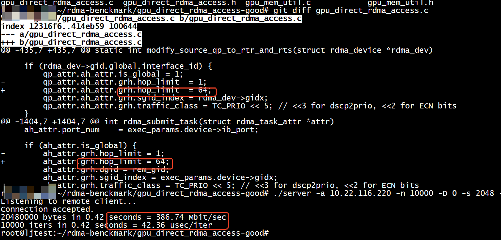

# GPU Direct RDMA Access example code
This package shows how to use the Mellanox DC QP to implement RDMA Read and Write operatinos directly to a remote GPU memory. It assumes the client appliation will run on a GPU enabled machine, like the NVIDIA DGX2. The server application, acting as a file storage simulation, will be running on few other Linux machines. All machine should have Mellanox ConnectX-5 NIC (or newer) in order for the DC QP to work properlly.

In the test codem the client application allocates memory on the defined GPU (flag '-u ) or on system RAM (default). Then sends a TCP request to the server application for a RDMA Write to the client's allocated buffer. Once the server application completes the RDMA Write operation it sends back a TCP 'done' message to the client. The client can loop for multiple such requests (flag '-n'). The RDMA message size can be configured (flag '-s' bytes)

For optimzed data transfer, the client requiers the GPU device selection based on PCI "B:D.F" format. It is recommened to chose a GPU which shares the same PCI bridge as the Mellanox ConectX NIC.

## Content:

gpu_direct_rdma_access.h, gpu_direct_rdma_access.c - Handles RDMA Read and Write ops from Server to GPU memory by request from the Client.
The API-s use DC type QPs connection for RDMA operations. The request to the server comes by socket.

gpu_mem_util.h, gpu_mem_util.c - GPU/CPU memory allocation

server.c, client.c - client and server main programs implementing GPU's Read/Write.

map_pci_nic_gpu.sh, arp_announce_conf.sh - help scripts

Makefile - makefile to build cliend and server execute files

## Installation Guide:

**1. MLNX_OFED**

Download MLNX_OFED-4.6-1.0.1.0 (or newer) from Mellanox web site: http://www.mellanox.com/page/products_dyn?product_family=26
Install with upstream libs
```sh
$ sudo ./mlnxofedinstall --force-fw-update --upstream-libs --dpdk
```
**2. CUDA libs**

Download CUDA Toolkit 10.1 (or newer) from Nvidia web site
```sh
$ wget https://developer.nvidia.com/compute/cuda/10.1/Prod/local_installers/cuda_10.1.105_418.39_linux.run
```
install on DGX server (GPU enabled servers)
```sh
$ sudo sh cuda_10.1.105_418.39_linux.run
```
**3. GPU Direct**

follow the download, build and inall guide on https://github.com/Mellanox/nv_peer_memory

**4. Multi-Homes network**

Configured system arp handling for multi-homed network with RoCE traffic (on DGX2 server)
```sh
$ git clone https://github.com/Mellanox/gpu_direct_rdma_access.git
$ ./write_to_gpu/arp_announce_conf.sh
```
**5. Check RDMA connectivity between all cluster nodes**

## Build Example Code:

```sh
$ git clone git@github.com:Mellanox/gpu_direct_rdma_access.git
$ cd gpu_direct_rdma_access
```
On the client machines
```sh
$ make USE_CUDA=1
```
On the server machines
```sh
$ make
```

## Run Server:
```sh
$ ./server -a 172.172.1.34 -n 10000 -D 1 -s 10000000 -p 18001 &
```

## Run Client:

We want to find the GPU's which share the same PCI bridge as the ConnectX Mellanox NIC
```sh
$ ./map_pci_nic_gpu.sh
172.172.1.112 (mlx5_12) is near 0000:b7:00.0 3D controller: NVIDIA Corporation Device 1db8 (rev a1)
172.172.1.112 (mlx5_12) is near 0000:b9:00.0 3D controller: NVIDIA Corporation Device 1db8 (rev a1)
172.172.1.113 (mlx5_14) is near 0000:bc:00.0 3D controller: NVIDIA Corporation Device 1db8 (rev a1)
172.172.1.113 (mlx5_14) is near 0000:be:00.0 3D controller: NVIDIA Corporation Device 1db8 (rev a1)
172.172.1.114 (mlx5_16) is near 0000:e0:00.0 3D controller: NVIDIA Corporation Device 1db8 (rev a1)
172.172.1.114 (mlx5_16) is near 0000:e2:00.0 3D controller: NVIDIA Corporation Device 1db8 (rev a1)
```

Run client application with matching IP address and BDF from the script output (-a and -u parameters)
```sh
$ ./client -t 0 -a 172.172.1.112 172.172.1.34 -u b7:00.0 -n 10000 -D 0 -s 10000000 -p 18001 &
<output>
```

# my test
dv_attr.dc_init_attr.dc_type = MLX5DV_DCTYPE_DC    

```
 patch -p1 < ./0001-solve-compilation-error.patch
```
no cuda    
```
make 
```

## run with error (transport retry counter exceeded)


```
 ./server -a 10.22.116.220 -n 10000 -D 1 -s 4096 -p 18001
bound to RDMA device name:mlx5_1, port:1, based on '10.22.116.220'
my gid idx: 3, value:0000:0000:0000:0000:0000:ffff:0a16:74dc
link_layer:ETH, lid:0, is_global:1, MTU:4096 Bytes
ibv_alloc_pd(ibv_context = 0x7f6c36d58150)
created pd 0x5653e58d7900
ibv_create_cq(0x7f6c36d58150, 640, NULL, NULL, 0)
created cq 0x5653e58d7a20
mlx5dv_create_qp(0x7f6c36d58150)
mlx5dv_create_qp 0x5653e58e80b8 completed: qp_num = 0x8fc6
ibv_modify_qp(qp = 0x5653e58e80b8, qp_attr.qp_state = 1, attr_mask = 0x31)
ibv_modify_qp to state 1 completed: qp_num = 0x8fc6
ibv_modify_qp(qp = 0x5653e58e80b8, qp_attr.qp_state = 2, attr_mask = 0x181)
ibv_modify_qp to state 2 completed: qp_num = 0x8fc6
ibv_modify_qp(qp = 0x5653e58e80b8, qp_attr.qp_state = 3, attr_mask = 0x12e01)
ibv_modify_qp to state 3 completed: qp_num = 0x8fc6
init AH cache
memory buffer(0x5653e5903000) allocated
ibv_reg_mr(pd 0x5653e58d7900, buf 0x5653e5903000, size = 4096, access_flags = 0x00000007
ibv_reg_mr completed: buf 0x5653e5903000, size = 4096, rkey = 0x00163938
Listening to remote client...
Connection accepted.
ibv_create_ah(dlid=0 port=1 is_global=1, tc=3)
rdma_poll_completions get FAILURE: status "transport retry counter exceeded" (12) for wr_id 0
ibv_dereg_mr(0x5653e58d3b10)
The buffer detached from rdma_device (0x5653e58d0f40). Number of attached to device buffers is 0.
free memory buffer(0x5653e5903000)
ibv_destroy_qp(0x5653e58e80b8)
ibv_destroy_cq(0x5653e58d7a20)
destroy ibv_ah's
ibv_dealloc_pd(0x5653e58d7900)
destroy AH cache
rdma_destroy_id(0x5653e58d6db0)
rdma_destroy_event_channel(0x5653e58d6db0)
```

`rdma_poll_completions get FAILURE`
```

        for (i = 0; i < reported_ev; ++i) {
            if (rdma_comp_ev[i].status != IBV_WC_SUCCESS) {
                fprintf(stderr, "rdma_poll_completions get FAILURE: status \"%s\" (%d) for wr_id %d\n",
                        ibv_wc_status_str(rdma_comp_ev[i].status),
                        rdma_comp_ev[i].status, (int) rdma_comp_ev[i].wr_id);
                ret_val = 1;
                if (usr_par.persistent && keep_running) {
                        rdma_reset_device(rdma_dev);
                }
                goto clean_socket;
            }
        }
```

+ client  
```
./client 10.22.116.220  -t 0 -a 10.22.116.221   -n 10000 -D 0 -s 4096 -p 18001
Connecting to remote server "10.22.116.220:18001"
Opening rdma device
Starting data transfer (10000 iters)
FAILURE: Couldn't read "rdma_task completed" message, recv data size 0 (errno=0 'Success')
```

```
./client 10.22.116.221  -t 0 -a 10.22.116.221   -n 10000 -D 0 -s 4096 -p 18001
```

# run success
更改qp_attr.ah_attr.grh.hop_limit  = 64 和 ah_attr.grh.hop_limit = 64;        


