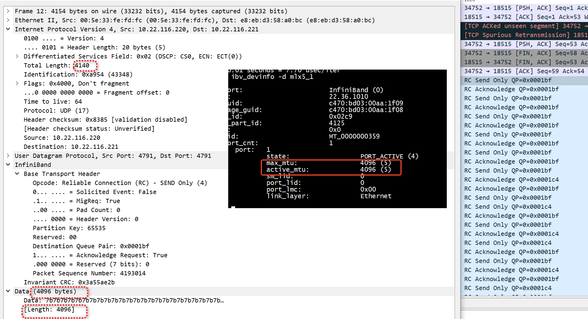

# mtu 


```
int ibv_mtu_enum_to_value(enum ibv_mtu mtu) {
    switch (mtu) {
        case IBV_MTU_256:
            return 256;
            break;
        case IBV_MTU_512:
            return 512;
            break;
        case IBV_MTU_1024:
            return 1024;
            break;
        case IBV_MTU_2048:
            return 2048;
            break;
        case IBV_MTU_4096:
            return 4096;
            break;

        default:
            break;
    }
    return -1;
}
```

+ client
```
ibv_rc_pingpong -d  mlx5_1 -m 4096 -g 3 -s 4096  10.22.116.221
  local address:  LID 0x0000, QPN 0x0001bb, PSN 0x42cb10, GID ::ffff:10.22.116.220
  remote address: LID 0x0000, QPN 0x0001b6, PSN 0x550cff, GID ::ffff:10.22.116.221
8192000 bytes in 0.01 seconds = 8535.56 Mbit/sec
1000 iters in 0.01 seconds = 7.68 usec/iter
```

+ server

```
ibv_rc_pingpong -d  mlx5_1 -m 4096  -g 3 
```

+ 抓包网卡
mtu大于4096    

```
ifconfig enp4s0f1 mtu 5120
```


 
 

 
# fragment

## ibv_rc_pingpong
 
```
ibv_rc_pingpong -d  mlx5_1 -m 4096 -g 3 -s 6144 10.22.116.221
  local address:  LID 0x0000, QPN 0x0001da, PSN 0x66167a, GID ::ffff:10.22.116.220
  remote address: LID 0x0000, QPN 0x0001cc, PSN 0x59648b, GID ::ffff:10.22.116.221
12288000 bytes in 0.01 seconds = 12294.15 Mbit/sec
1000 iters in 0.01 seconds = 8.00 usec/iter
```

```
ibv_rc_pingpong -d  mlx5_1 -m 4096 -s 6144  -g 3 
  local address:  LID 0x0000, QPN 0x0001cc, PSN 0x59648b, GID ::ffff:10.22.116.221
  remote address: LID 0x0000, QPN 0x0001da, PSN 0x66167a, GID ::ffff:10.22.116.220
12288000 bytes in 0.01 seconds = 11899.77 Mbit/sec
1000 iters in 0.01 seconds = 8.26 usec/iter
```
 
 
##  ib_write_bw   


+ server

```
ib_write_bw -d mlx5_1  -x 3 --cpu_util --report_gbits -s 6144 -m 4096  
---------------------------------------------------------------------------------------
 CPU Utilization works only with Duration mode.

************************************
* Waiting for client to connect... *
************************************
---------------------------------------------------------------------------------------
                    RDMA_Write BW Test
 Dual-port       : OFF          Device         : mlx5_1
 Number of qps   : 1            Transport type : IB
 Connection type : RC           Using SRQ      : OFF
 PCIe relax order: ON
 ibv_wr* API     : ON
 CQ Moderation   : 100
 Mtu             : 4096[B]
 Link type       : Ethernet
 GID index       : 3
 Max inline data : 0[B]
 rdma_cm QPs     : OFF
 Data ex. method : Ethernet
```


+ client    

```
ib_write_bw -d mlx5_1  -x 3 --cpu_util --report_gbits -s 6144 -m 4096  10.22.116.221
```


## ib_send_bw

+ server  
```
ib_send_bw -d mlx5_1  -x 3 --cpu_util --report_gbits -s 6144 -m 4096 
```
+ client  

```
ib_send_bw -d mlx5_1  -x 3 --cpu_util --report_gbits -s 6144 -m 4096  10.22.116.221
```
