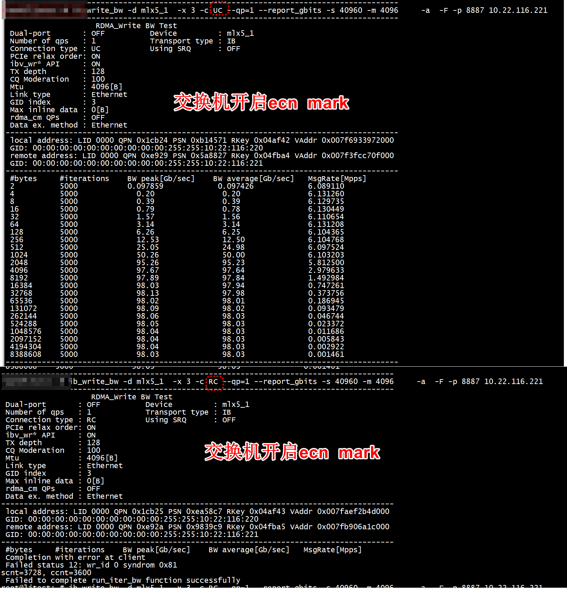

# uc ecn



# run

+ server

```
ib_send_lat --all --CPU-freq --comm_rdma_cm --perform_warm_up --connection=DC --iters=1000000 -d mlx5_1  -x 3  --report_gbits -s 4096 -m 4096

************************************
* Waiting for client to connect... *
************************************
---------------------------------------------------------------------------------------
                    Send Latency Test
 Dual-port       : OFF          Device         : mlx5_1
 Number of qps   : 2            Transport type : IB
 Connection type : DC           Using SRQ      : ON
 PCIe relax order: ON
 ibv_wr* API     : ON
 RX depth        : 512
 Mtu             : 4096[B]
 Link type       : Ethernet
 GID index       : 3
 Max inline data : 150[B]
 rdma_cm QPs     : OFF
 Data ex. method : rdma_cm
---------------------------------------------------------------------------------------
 local address: LID 0000 QPN 0x8fc9 PSN 0x8055b1
 GID: 00:00:00:00:00:00:00:00:00:00:255:255:10:22:116:220
 local address: LID 0000 QPN 0x1a183 PSN 0x94ec47
 GID: 00:00:00:00:00:00:00:00:00:00:255:255:10:22:116:220
 remote address: LID 0000 QPN 0x1ac3e PSN 0xd14195
 GID: 00:00:00:00:00:00:00:00:00:00:255:255:10:22:116:221
 remote address: LID 0000 QPN 0xc008 PSN 0x28345b
 GID: 00:00:00:00:00:00:00:00:00:00:255:255:10:22:116:221
---------------------------------------------------------------------------------------
 #bytes #iterations    t_min[usec]    t_max[usec]  t_typical[usec]    t_avg[usec]    t_stdev[usec]   99% percentile[usec]   99.9% percentile[usec] 
 2       1000000          6.20           108.30       6.28             6.29             0.26            6.34                    6.98   
 4       1000000          6.21           59.63        6.28             6.28             0.20            6.33                    6.53   
 8       1000000          6.21           63.06        6.28             6.28             0.21            6.33                    6.54   
 16      1000000          6.21           65.78        6.28             6.29             0.21            6.33                    6.54   
 32      1000000          6.21           60.62        6.29             6.29             0.20            6.34                    6.54   
 64      1000000          6.29           66.56        6.55             6.55             0.20            6.78                    6.82   
 128     1000000          6.36           83.54        6.44             6.44             0.21            6.49                    6.70   
 256     1000000          6.78           64.19        6.95             6.95             0.21            7.06                    7.25   
 512     1000000          7.01           59.21        7.12             7.13             0.21            7.24                    7.42   
 1024    1000000          7.09           64.18        7.18             7.20             0.22            7.32                    7.52   
 2048    1000000          7.30           68.04        7.43             7.43             0.21            7.53                    7.76   
 4096    1000000          7.82           62.74        7.98             7.98             0.21            8.07                    8.33   
 8192    1000000          8.66           83.73        8.81             8.83             0.23            9.00                    9.30   
 16384   1000000          9.34           86.81        9.63             9.64             0.22            9.91                    10.19  
 32768   1000000          10.70          64.51        11.06            11.05            0.22            11.28                   11.72  
 65536   1000000          13.40          95.97        13.77            13.77            0.24            14.01                   14.54  
 131072  1000000          18.77          110.97       19.20            19.18            0.24            19.41                   20.09  
 262144  1000000          29.55          79.67        29.97            29.97            0.21            30.17                   31.01  
 524288  1000000          51.09          82.27        51.49            51.50            0.18            51.69                   52.78  
 1048576 1000000          94.28          123.96       94.52            94.54            0.20            95.31                   96.00  
 2097152 1000000          180.30         209.87       180.54           180.56           0.21            181.70                  182.14 
 4194304 1000000          352.33         379.84       352.52           352.60           0.24            353.90                  354.41 
 8388608 1000000          696.22         1280.73      696.47           696.55           5.83            697.56                  698.89 
---------------------------------------------------------------------------------------
```

+ client

```
ib_send_lat --all --CPU-freq --comm_rdma_cm --perform_warm_up --connection=DC --iters=1000000    -d mlx5_1  -x 3  --report_gbits -s 4096 -m 4096  10.22.116.220
---------------------------------------------------------------------------------------
                    Send Latency Test
 Dual-port       : OFF          Device         : mlx5_1
 Number of qps   : 2            Transport type : IB
 Connection type : DC           Using SRQ      : ON
 PCIe relax order: ON
 ibv_wr* API     : ON
 TX depth        : 1
 Mtu             : 4096[B]
 Link type       : Ethernet
 GID index       : 3
 Max inline data : 150[B]
 rdma_cm QPs     : OFF
 Data ex. method : rdma_cm
---------------------------------------------------------------------------------------
 local address: LID 0000 QPN 0x1ac3e PSN 0xd14195
 GID: 00:00:00:00:00:00:00:00:00:00:255:255:10:22:116:221
 local address: LID 0000 QPN 0xc008 PSN 0x28345b
 GID: 00:00:00:00:00:00:00:00:00:00:255:255:10:22:116:221
 remote address: LID 0000 QPN 0x8fc9 PSN 0x8055b1
 GID: 00:00:00:00:00:00:00:00:00:00:255:255:10:22:116:220
 remote address: LID 0000 QPN 0x1a183 PSN 0x94ec47
 GID: 00:00:00:00:00:00:00:00:00:00:255:255:10:22:116:220
---------------------------------------------------------------------------------------
 #bytes #iterations    t_min[usec]    t_max[usec]  t_typical[usec]    t_avg[usec]    t_stdev[usec]   99% percentile[usec]   99.9% percentile[usec] 
 2       1000000          6.21           108.32       6.28             6.29             0.26            6.33                    7.58   
 4       1000000          6.21           59.61        6.28             6.28             0.20            6.33                    6.75   
 8       1000000          6.21           63.02        6.28             6.28             0.21            6.33                    6.75   
 16      1000000          6.21           65.71        6.29             6.29             0.21            6.33                    6.76   
 32      1000000          6.21           60.64        6.29             6.29             0.20            6.34                    6.76   
 64      1000000          6.28           66.51        6.70             6.55             0.20            6.79                    6.85   
 128     1000000          6.33           83.58        6.44             6.44             0.21            6.49                    6.91   
 256     1000000          6.76           64.21        6.95             6.95             0.21            7.06                    7.43   
 512     1000000          6.99           59.23        7.12             7.13             0.21            7.23                    7.60   
 1024    1000000          7.08           64.06        7.19             7.20             0.22            7.31                    7.67   
 2048    1000000          7.29           68.02        7.42             7.43             0.21            7.54                    7.92   
 4096    1000000          7.81           62.83        7.97             7.98             0.21            8.09                    8.48   
 8192    1000000          8.63           83.71        8.81             8.83             0.23            9.02                    9.30   
 16384   1000000          9.34           86.88        9.63             9.64             0.22            9.90                    10.19  
 32768   1000000          10.69          64.33        11.05            11.05            0.22            11.30                   11.72  
 65536   1000000          13.38          96.17        13.77            13.77            0.24            14.00                   14.55  
 131072  1000000          18.77          111.01       19.18            19.18            0.24            19.39                   20.10  
 262144  1000000          29.53          79.68        29.97            29.97            0.21            30.15                   31.02  
 524288  1000000          51.09          82.35        51.49            51.50            0.18            51.68                   52.78  
 1048576 1000000          94.27          123.98       94.53            94.54            0.20            95.30                   96.00  
 2097152 1000000          180.27         209.85       180.53           180.56           0.21            181.70                  182.14 
 4194304 1000000          352.31         379.82       352.54           352.60           0.24            353.89                  354.42 
 8388608 1000000          696.23         1280.96      696.46           696.55           5.83            697.55                  698.87 
---------------------------------------------------------------------------------------
```