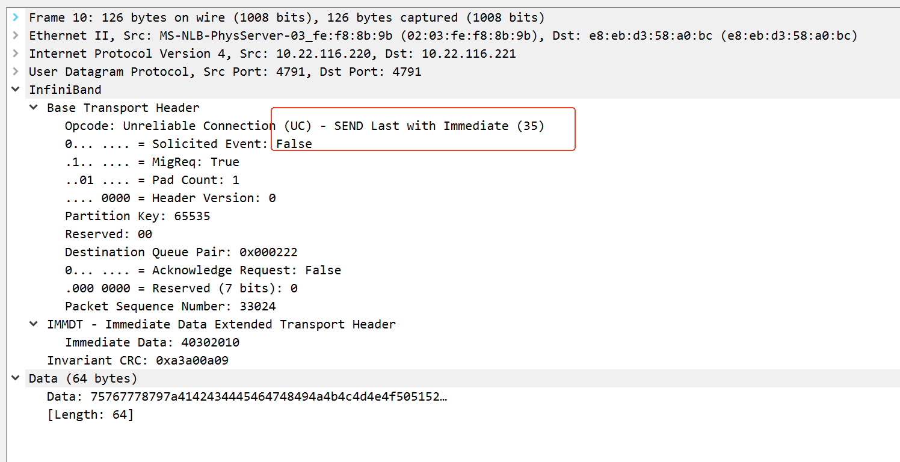
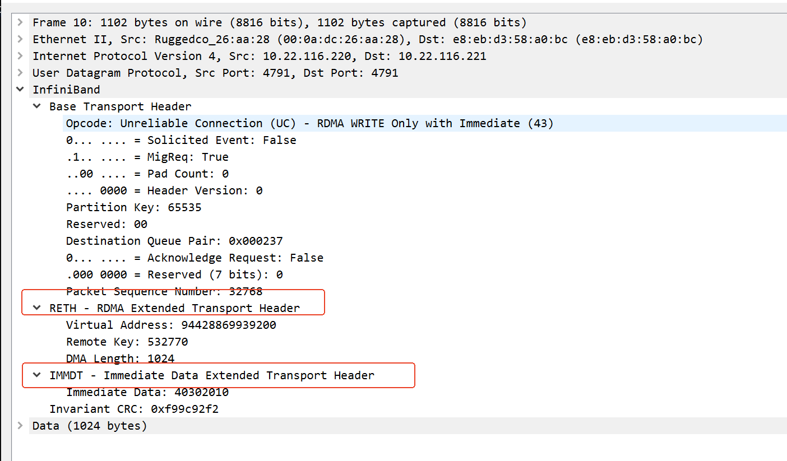

#define PP_VERB_OPCODE_CLIENT IBV_WR_SEND_WITH_IMM




#define PP_VERB_OPCODE_CLIENT IBV_WR_RDMA_WRITE_WITH_IMM




#  mbuf大小和mtu   


```

#define PP_MAX_WR 1             /* Max outstanding send/recv wr */


#define PP_DATA_BUF_LEN ((1 << 12))
```


```

        num_comp_vectors:               48
                port:   1
                        state:                  PORT_ACTIVE (4)
                        max_mtu:                4096 (5)
                        active_mtu:             4096 (5)
                        sm_lid:                 0
                        port_lid:               0
                        port_lmc:               0x00
                        link_layer:             Ethernet
                        max_msg_sz:             0x40000000
                        port_cap_flags:         0x04010000
                        port_cap_flags2:        0x0000
                        max_vl_num:             invalid value (0)
                        bad_pkey_cntr:          0x0
                        qkey_viol_cntr:         0x0
                        sm_sl:                  0
                        pkey_tbl_len:           1
                        gid_tbl_len:            255
                        subnet_timeout:         0
                        init_type_reply:        0
                        active_width:           4X (2)
                        active_speed:           25.0 Gbps (32)
                        phys_state:             LINK_UP (5)
                        GID[  0]:               fe80:0000:0000:0000:c670:bdff:feaa:1f09, RoCE v1
                        GID[  1]:               fe80::c670:bdff:feaa:1f09, RoCE v2
                        GID[  2]:               0000:0000:0000:0000:0000:ffff:0a16:74dc, RoCE v1
                        GID[  3]:               ::ffff:10.22.116.220, RoCE v2
```

# client


```
./client 
=MZINFO:main:73: IB device mlx5_1, server ip 10.22.116.221
=MZINFO:pp_open_ibvdevice:30: Device found: 1/mlx5_1
=MZINFO:pp_open_ibvdevice:53: ibdev mlx5_1 port 1 port_state 4 (expect 4) phy_state 5
=MZINFO:pp_open_ibvdevice:61: ibdev mlx5_1 port 1 lid 0 state 4, mtu max 5 active 5, link_layer 2(ethernet) phy_state 5 speed 32
=MZINFO:pp_ctx_init:149: Initialization succeeds(regular)

=MZINFO:pp_exchange_info:228: Local(Client): port_num 1, lid 0, psn 0x8000, qpn 0x24a(586), addr 0x56081a9d7000, mrkey 0x8f7f6
                                    gid 00:00:00:00:00:00:00:00:00:00:ff:ff:0a:16:74:dc
=MZINFO:pp_exchange_info:253: Remote(Server): lid 0, psn 0x1000, qpn 0x242(578), addr 0x556e5e7dc000, mrkey 0x8b3b1
                                    gid 00:00:00:00:00:00:00:00:00:00:ff:ff:0a:16:74:dd

=MZDBG:client_traffic_verb:26: Pause 1sec =MZDBG:client_traffic_verb:28: Do post_send 1 messages with length 0x1000..
=MZINFO:poll_cq_verb:277: Polled 1/1 CQEs for post_send..
=MZINFO:client_traffic_verb:46: Send done, now recving reply...
     0 (len = 0x1000): 0BCDEFGHIJKLMNOP...UVWXYZ[\]^_`abc
=MZINFO:client_traffic_verb:61: Client(verb) traffic test done
```

# server

```
./server
=MZINFO:main:66: IB device mlx5_1
=MZINFO:pp_open_ibvdevice:30: Device found: 1/mlx5_1
=MZINFO:pp_open_ibvdevice:53: ibdev mlx5_1 port 1 port_state 4 (expect 4) phy_state 5
=MZINFO:pp_open_ibvdevice:61: ibdev mlx5_1 port 1 lid 0 state 4, mtu max 5 active 5, link_layer 2(ethernet) phy_state 5 speed 32
=MZINFO:pp_ctx_init:149: Initialization succeeds(regular)

=MZINFO:pp_exchange_info:228: Local(Server): port_num 1, lid 0, psn 0x1000, qpn 0x242(578), addr 0x556e5e7dc000, mrkey 0x8b3b1
                                    gid 00:00:00:00:00:00:00:00:00:00:ff:ff:0a:16:74:dd
    =DEBUG:sock_server:46: waiting for client:
=MZINFO:pp_exchange_info:253: Remote(Client): lid 0, psn 0x8000, qpn 0x24a(586), addr 0x56081a9d7000, mrkey 0x8f7f6
                                    gid 00:00:00:00:00:00:00:00:00:00:ff:ff:0a:16:74:dc

=MZINFO:server_traffic_verb:24: Waiting for data...
     0 (len = 0x1000): 0BCDEFGHIJKLMNOP...UVWXYZ[\]^_`abc
=MZINFO:server_traffic_verb:39: Now sending reply (1)...
=MZINFO:poll_cq_verb:277: Polled 1/1 CQEs for post_send..
=MZINFO:server_traffic_verb:54: Server traffic test done
```
len = 0x1000,4096 