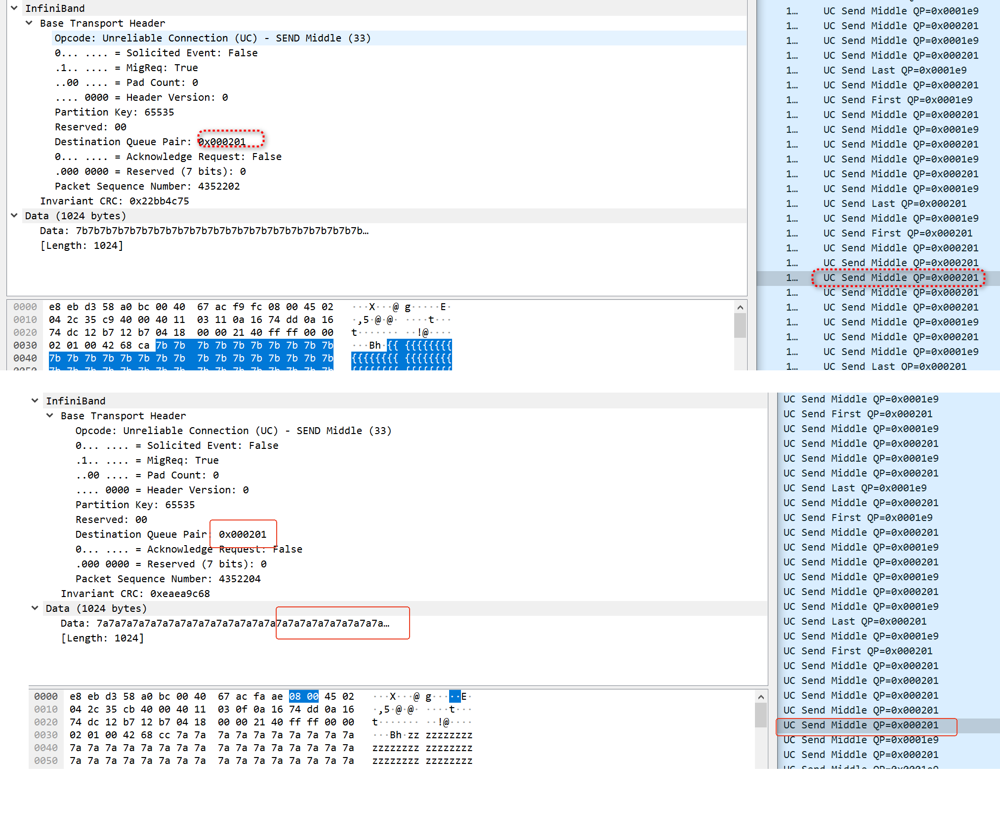

```
./uc_pingpong_sg 10.22.116.221  -d mlx5_1 -g 3 -p 8777  -r 8 -s 1024
  local address:  LID 0x0000, QPN 0x0001f4, PSN 0x66a2c7, GID ::ffff:10.22.116.220
  remote address: LID 0x0000, QPN 0x0001dc, PSN 0x558cce, GID ::ffff:10.22.116.221
2048000 bytes in 0.01 seconds = 2505.97 Mbit/sec
1000 iters in 0.01 seconds = 6.54 usec/iter
```


```
./uc_pingpong_sg   -d mlx5_1 -g 3 -p 8777  -r 8 -s 1024
  local address:  LID 0x0000, QPN 0x0001dc, PSN 0x558cce, GID ::ffff:10.22.116.221
  remote address: LID 0x0000, QPN 0x0001f4, PSN 0x66a2c7, GID ::ffff:10.22.116.220
2048000 bytes in 0.01 seconds = 2275.87 Mbit/sec
1000 iters in 0.01 seconds = 7.20 usec/iter
```

#  uc_pingpong_sg -s 4096 



```
./uc_pingpong_sg 10.22.116.221  -d mlx5_1 -g 3 -p 8777  -r 8 -s 4096
  local address:  LID 0x0000, QPN 0x000201, PSN 0x36238a, GID ::ffff:10.22.116.220
  remote address: LID 0x0000, QPN 0x0001e9, PSN 0x4268bf, GID ::ffff:10.22.116.221
8192000 bytes in 0.01 seconds = 8305.16 Mbit/sec
1000 iters in 0.01 seconds = 7.89 usec/iter
```

```
./uc_pingpong_sg  -d mlx5_1 -g 3 -p 8777  -r 8 -s 4096
  local address:  LID 0x0000, QPN 0x0001e9, PSN 0x4268bf, GID ::ffff:10.22.116.221
  remote address: LID 0x0000, QPN 0x000201, PSN 0x36238a, GID ::ffff:10.22.116.220
8192000 bytes in 0.01 seconds = 7656.97 Mbit/sec
1000 iters in 0.01 seconds = 8.56 usec/iter
```