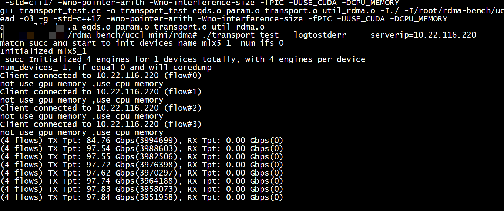
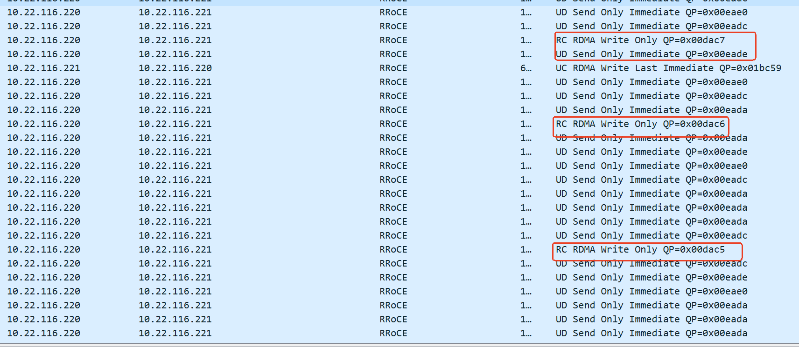
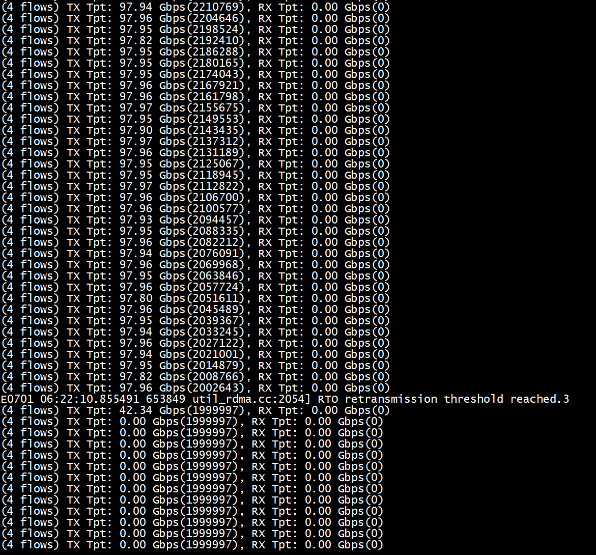
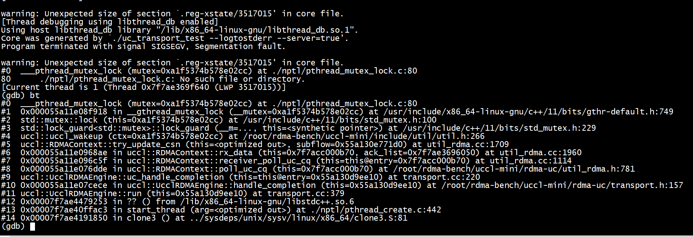
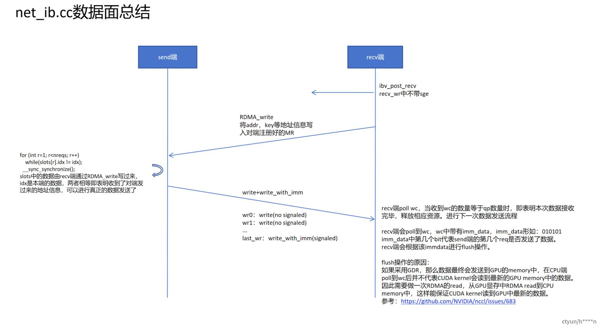
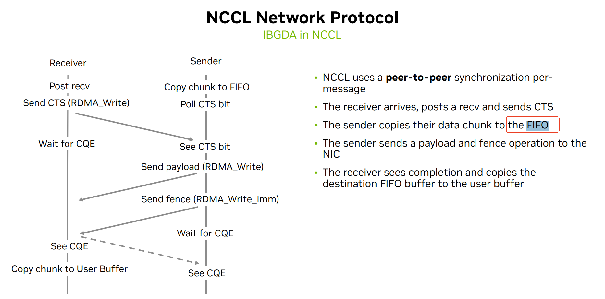
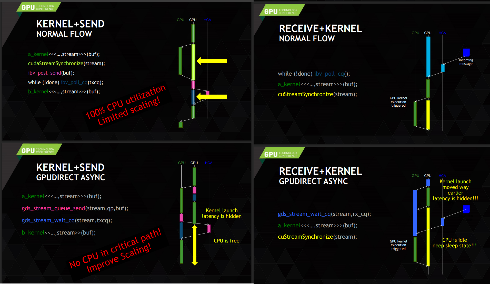
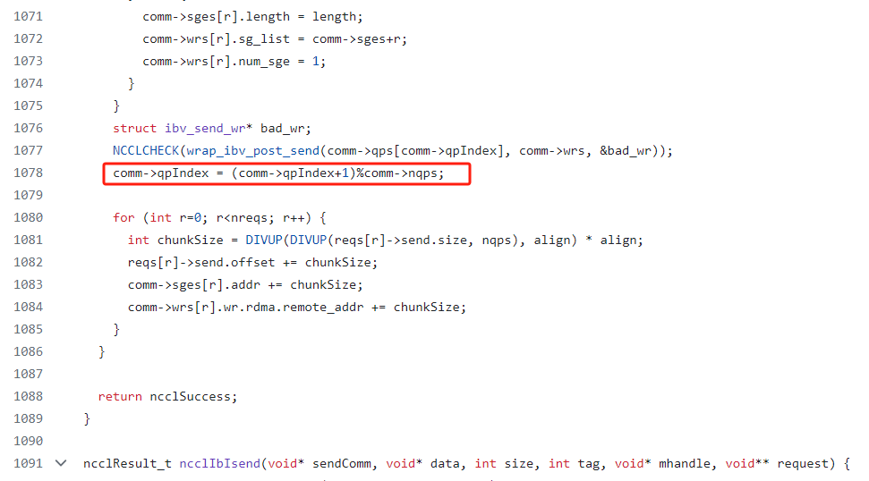
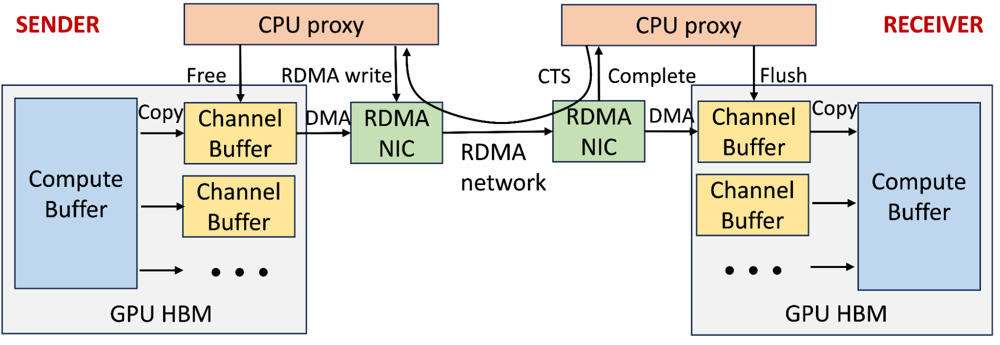

#  UCCL   


[UCCL-Tran：为GPU网络打造的可扩展软件传输层](https://zhuanlan.zhihu.com/p/1925692992087390160)  

[NCCL 源码解读(17): Primitives Simple](https://blog.hidva.com/2025/03/09/nccl-primitives-simple/)   
[阿里云 ACCL-Barex -- GDR: 再深一点](https://blog.hidva.com/2025/05/07/gdr-in-depth/)    


```
./transport_test --logtostderr   --serverip=10.22.116.221 --perftype=basic --iterations=8
./transport_test --logtostderr   --server=true  --perftype=basic --iterations=8
```


```
python3  benchmark.py --role server --local-gpu-idx 0 --num-cpus 4 --sizes 16384 --iters 1
python3  benchmark.py --role client --remote-ip 10.22.116.221  --local-gpu-idx 0 --num-cpus 4  --sizes 16384 --iters 1
```

## mytest

```
rm rdma_test.cc 
```


```
./transport_test --help
```

# gtest


```
export GLOG_v=4
```

```
./transport_test --logtostderr   --serverip=10.22.116.220   >> log.txt  2>&1 &
```
or   
```
log_level=4
export GLOG_logtostderr=1 GLOG_v=${log_level}
```

# make


```
apt install libgtest-dev
```

+ 使用cpu memeory    
```
-UUSE_CUDA -DCPU_MEMORY
```

+ 屏蔽rdma_test.cc编译（因为其依赖cudaMallocManaged or  cudaMalloc）      

```
rm rdma_test.cc 
```

#  export (不需要export)
```
export NCCL_IB_HCA=mlx5_1
export NCCL_SOCKET_IFNAME="enp61s0f1np1"
export NCCL_IB_GID_INDEX=3 
export NCCL_IB_PCI_RELAXED_ORDERING=1
CHUNK_SIZE_KB
```


#  config 

```
ibv_devices
    device                 node GUID
    ------              ----------------
    mlx5_0              c470bd0300aa1fc8
    mlx5_1              c470bd0300aa1fc9
```
mlx5_1处于工作状态，mlx5_0 出于down     

+ transport_config.h     
```
UCCL_PARAM(ROCE_GID_IDX, "ROCE_GID_IDX", 3);
UCCL_PARAM(RCMode, "RCMODE", true);
```

+ transport_config.h添加   

```
static constexpr bool ROCE_NET = true;
static char const* IB_DEVICE_NAME_PREFIX = "mlx5_";
static std::string SINGLE_CTRL_NIC("enp61s0f1np1");
static constexpr uint8_t DEVNAME_SUFFIX_LIST[8] = {0, 1, 0, 0, 0, 0, 0, 0};
static constexpr uint8_t NUM_DEVICES = 1;
static constexpr double LINK_BANDWIDTH = 100.0 * 1e9 / 8;  // 1m00Gbps
```
IB_DEVICE_NAME_PREFIX +  DEVNAME_SUFFIX_LIST 组成

#  test

```
ibv_devices
    device                 node GUID
    ------              ----------------
    mlx5_0              c470bd0300aa1fc8
    mlx5_1              c470bd0300aa1fc9
```
mlx5_1处于工作状态，mlx5_0 出于down   


+ server

```
./transport_test --logtostderr   --server=true
```

+ client    
```
 ./transport_test --logtostderr   --serverip=10.22.116.221
devices name mlx5_1  num_ifs 0 match succ 
Initialized mlx5_1
Initialized 4 engines for 1 devices totally, with 4 engines per device
num_devices_ 1 
Client connected to 10.22.116.221 (flow#0)
Client connected to 10.22.116.221 (flow#1)
Client connected to 10.22.116.221 (flow#2)
Client connected to 10.22.116.221 (flow#3)
E0630 06:37:52.695745 3514092 transport.cc:3360] RTO retransmission threshold reached.1
*** Aborted at 1751265473 (unix time) try "date -d @1751265473" if you are using GNU date ***
PC: @                0x0 (unknown)
*** SIGSEGV (@0x7f34df945000) received by PID 3514082 (TID 0x7f9e099f1640) from PID 18446744073165623296; stack trace: ***
    @     0x7f9e56969046 (unknown)
    @     0x7f9e563e4520 (unknown)
    @     0x55a1d8b38e29 uccl::RDMAContext::try_retransmit_chunk()
    @     0x55a1d8b42954 uccl::RDMAContext::__retransmit_for_flow()
    @     0x55a1d8b42b6e uccl::UcclRDMAEngine::handle_rto()
    @     0x55a1d8b461a6 uccl::UcclRDMAEngine::periodic_process()
    @     0x55a1d8b46498 uccl::UcclRDMAEngine::run()
    @     0x7f9e567b0253 (unknown)
    @     0x7f9e56436ac3 (unknown)
    @     0x7f9e564c8850 (unknown)
    @                0x0 (unknown)
Segmentation fault
```

将UCCL_PARAM(RCMode, "RCMODE", false);改为UCCL_PARAM(RCMode, "RCMODE", true);


    

```
./transport_test --logtostderr   --serverip=10.22.116.220
./transport_test --logtostderr   --server=true
```

# uc

[uc-proj](https://github.com/bzhng-development/uccl/tree/main/rdma)
```
DEFINE_bool(server, false, "Whether this is a server receiving traffic.");
DEFINE_string(serverip, "", "Server IP address the client tries to connect.");
DEFINE_string(perftype, "tpt", "Performance type: basic/lat/tpt/bi.");
DEFINE_bool(warmup, false, "Whether to run warmup.");
DEFINE_uint32(nflow, 4, "Number of flows.");
DEFINE_uint32(nmsg, 1, "Number of messages within one request to post.");
DEFINE_uint32(nreq, 2, "Outstanding requests to post.");
DEFINE_uint32(msize, 1000000, "Size of message.");
DEFINE_uint32(iterations, 1000000, "Number of iterations to run.");
DEFINE_bool(flush, false, "Whether to flush after receiving.");
DEFINE_bool(bi, false, "Whether to run bidirectional test.");
```

```
void dump_ibv_device_attr(struct ibv_device_attr *attr)
{
    printf("\n==== device attr ====\n");
    printf("\tfw_ver: %s\n", attr->fw_ver);
    printf("\tnode_guid: 0x%lx\n", attr->node_guid);
    printf("\tsys_image_guid: 0x%lx\n", attr->sys_image_guid);
    printf("\tmax_mr_size: 0x%lx\n", attr->max_mr_size);    /* Largest contiguous block that can be registered */
    printf("\tpage_size_cap: %lu\n", attr->page_size_cap);  /* Supported memory shift sizes */
    printf("\thw_ver:  %u\n", attr->hw_ver);
    printf("\tmax_qp:  %d\n", attr->max_qp);
    printf("\tmax_qp_wr:  %d\n", attr->max_qp_wr);
    printf("\tmax_sge:  %d\n", attr->max_sge);
    printf("\tmax_cq:  %d\n", attr->max_cq);
    printf("\tmax_cqe:  %d\n", attr->max_cqe);
    printf("\tmax_mr:  %d\n", attr->max_mr);
    printf("\tmax_pd:  %d\n", attr->max_pd);
    printf("\tmax_qp_rd_atom:  %d\n", attr->max_qp_rd_atom);    /* Maximum number of RDMA Read & Atomic operations that can be outstanding per QP */
    printf("\tmax_res_rd_atom:  %d\n", attr->max_res_rd_atom);  /* Maximum number of resources used for RDMA Read & Atomic operations by this HCA as the Target */
    printf("\tmax_qp_init_rd_atom:  %d\n", attr->max_qp_init_rd_atom);  /* Maximum depth per QP for initiation of RDMA Read & Atomic operations */
    printf("\tphys_port_cnt:  %d\n", attr->phys_port_cnt);
    printf("\t\n");
    printf("==============\n");
    //////////

}

void dump_ibv_port_attr(struct ibv_port_attr *attr)
{
    printf("\n==========  port attr ==========\n");
    printf("\tstate: %d  (%s)\n", attr->state, ibv_port_state_string(attr->state));
    printf("\tmax_mtu:  %s\n", ibv_mtu_string(attr->max_mtu));
    printf("\tactive_mtu:  %s\n", ibv_mtu_string(attr->active_mtu));
    printf("\tgid_tbl_len:  %d\n", attr->gid_tbl_len);  /* Length of source GID table */
    printf("\tport_cap_flags:  0x %x\n", attr->port_cap_flags);
    printf("\tmax_msg_sz:  %u\n", attr->max_msg_sz);
    printf("\tlid:  %d\n", attr->lid);  /* Base port LID */
    printf("\tsm_lid:  %d\n", attr->sm_lid);
    printf("\tlmc:  %d\n", attr->lmc);  /* LMC of LID */
    printf("\tmax_vl_num:  %d (%s)\n", attr->max_vl_num, ibv_vl_string(attr->max_vl_num));  /* Maximum number of VLs */
    printf("\tsm_sl:  %d\n", attr->sm_sl);  /* SM service level */
    printf("\tactive_width:  %d (%s)\n", attr->active_width, ibv_width_string(attr->active_width)); /* Currently active link width */
    printf("\tactive_speed:  %d (%s)\n", attr->active_speed, ibv_speed_string(attr->active_speed));
    printf("\tphys_state:  %d (%s)\n", attr->phys_state, ibv_port_phy_state_string(attr->phys_state));
    printf("==============\n");

}
```
  

3种qp  

+ IBV_QPT_UD
```
      util_rdma_create_qp(
          context, &ctrl_qp_, IBV_QPT_UD, use_cq_ex, true,
          (struct ibv_cq**)&ctrl_cq_ex_, false, kCQSize, pd, port, &ctrl_mr_,
          nullptr, CtrlChunkBuffPool::kChunkSize * CtrlChunkBuffPool::kNumChunk,
          kMaxCtrlWRs, kMaxCtrlWRs, 1, 1);
```
+  IBV_QPT_RC     

```
    util_rdma_create_qp(factory_dev->context, &comm_base->fifo_qp, IBV_QPT_RC,
                        false, false, &comm_base->flow_cq, false, kFifoCQSize,
                        factory_dev->pd, factory_dev->ib_port_num,
                        &comm_base->fifo_mr, nullptr, kFifoMRSize,
                        kMaxReq * kMaxRecv, kMaxReq * kMaxRecv, 1, 1);
```

+  IBV_QPT_UC     
```
 if (!ucclParamRCMode()){

    qp_init_attr.qp_type = IBV_QPT_UC;
     
  }
```

## run cause coredump
  
这是kChunkSize设置不对导致：   

+ 对于rdma-uc/transport_config.h 中kChunkSize应该设置为
static constexpr uint32_t kChunkSize = 32 << 10;    

+ 对于rdma-uc2/transport_config.h 中CHUNK_SIZE_KB应该设置为    
UCCL_PARAM(CHUNK_SIZE_KB, "CHUNK_SIZE_KB", 64);    

## run rdma-uc(有个bug)
rdma-uc2也有这个bug        
  

```
*** Aborted at 1751351451 (unix time) try "date -d @1751351451" if you are using GNU date ***
PC: @                0x0 (unknown)
*** SIGSEGV (@0x0) received by PID 3517443 (TID 0x7f00c496c640) from PID 0; stack trace: ***
    @     0x7f00f9c72046 (unknown)
    @     0x7f00f96ed520 (unknown)
    @     0x7f00f9742ef4 pthread_mutex_lock
    @     0x557ca351b4b8 uccl::RDMAContext::try_update_csn()
    @     0x557ca352ab7b uccl::RDMAContext::uc_rx_chunk()
    @     0x557ca3544dff uccl::SharedIOContext::uc_poll_recv_cq()
    @     0x557ca3517ef3 uccl::UcclRDMAEngine::uc_handle_completion()
    @     0x557ca35283ca uccl::UcclRDMAEngine::run()
    @     0x7f00f9ab9253 (unknown)
    @     0x7f00f973fac3 (unknown)
    @     0x7f00f97d1850 (unknown)
    @                0x0 (unknown)
Segmentation fault (core dumped)
```


# p2p


```
pip3 install  pybind11
apt-get install libelf-dev -y
```


## listen


```
(gdb) bt
#0  listen () at ../sysdeps/unix/syscall-template.S:120
#1  0x0000555555577b47 in uccl::create_listen_socket (listen_port=30000, listen_fd=0x5555555be170) at /root/rdma-bench/uccl/include/util/util.h:141
#2  operator() (__closure=0x7fffffffe280) at transport.cc:815
#3  std::__invoke_impl<void, uccl::RDMAEndpoint::initialize_engine_by_dev(int)::<lambda()> > (__f=...) at /usr/include/c++/11/bits/invoke.h:61
#4  std::__invoke<uccl::RDMAEndpoint::initialize_engine_by_dev(int)::<lambda()> > (__fn=...) at /usr/include/c++/11/bits/invoke.h:96
#5  operator() (__closure=<optimized out>) at /usr/include/c++/11/mutex:776
#6  operator() (__closure=0x0) at /usr/include/c++/11/mutex:712
#7  _FUN () at /usr/include/c++/11/mutex:712
#8  0x00007ffff7a65ee8 in __pthread_once_slow (once_control=0x55555560a210, init_routine=0x7ffff7dd8d50 <__once_proxy>) at ./nptl/pthread_once.c:116
#9  0x00005555555660a7 in __gthread_once (__func=<optimized out>, __once=0x55555560a210) at /usr/include/x86_64-linux-gnu/c++/11/bits/gthr-default.h:700
#10 std::call_once<uccl::RDMAEndpoint::initialize_engine_by_dev(int)::<lambda()> > (__f=..., __once=...) at /usr/include/c++/11/mutex:783
#11 uccl::RDMAEndpoint::initialize_engine_by_dev (this=this@entry=0x5555555a24c0 <ep>, dev=dev@entry=0) at transport.cc:775
#12 0x000055555555d826 in main (argc=<optimized out>, argv=<optimized out>) at transport_test.cc:411
(gdb) 
```

## use cpu memory test

```
int const kMaxNumGPUs = 1;
```

```
#ifndef CPU_MEMORY
  DCHECK(local_gpu_idx_ < gpu_cards.size() && gpu_cards.size() <= kMaxNumGPUs)
      << "Local GPU index out of range";
  auto ib_nics = uccl::get_rdma_nics();
  // Find the RDMA NIC that is closest to each of the GPUs.
  for (int i = 0; i < kMaxNumGPUs; i++) {
    auto gpu_device_path = gpu_cards[i];
    auto ib_nic_it = std::min_element(
        ib_nics.begin(), ib_nics.end(), [&](auto const& a, auto const& b) {
          return uccl::cal_pcie_distance(gpu_device_path, a.second) <
                 uccl::cal_pcie_distance(gpu_device_path, b.second);
        });
    gpu_to_dev[i] = ib_nic_it - ib_nics.begin();
  }
  std::cout << "Detected best GPU-NIC mapping: " << std::endl;
  for (int i = 0; i < kMaxNumGPUs; i++) {
    std::cout << "\tGPU " << i << " -> NIC " << gpu_to_dev[i] << " ("
              << ib_nics[gpu_to_dev[i]].first << ")" << std::endl;
  }
  std::cout << std::endl;
#endif
```

+ server


```
python3  benchmark.py --role server --local-gpu-idx 0 --num-cpus 4
UCCL P2P Benchmark — role: server
Message sizes: 256 B, 1.0 KB, 4.0 KB, 16.0 KB, 64.0 KB, 256.0 KB, 1.0 MB, 10.0 MB, 100.0 MB
Device: cpu | Local GPU idx: 0 | Iterations: 1000
Creating Engine with GPU index: 0, CPUs: 4
Initialized mlx5_1
Initialized 4 engines for 1 devices totally, with 4 engines per device
Creating Engine GPU num: 0
Endpoint initialized successfully
[Server] Waiting for connection …
Waiting to accept incoming connection...
[Server] Connected to 10.22.116.220 (GPU 0) conn_id=0
[Server]    256 B :   0.25 Gbps |   0.03 GB/s
[Server]   1.0 KB :   0.98 Gbps |   0.12 GB/s
[Server]   4.0 KB :   3.62 Gbps |   0.45 GB/s
[Server]  16.0 KB :  12.30 Gbps |   1.54 GB/s
[Server]  64.0 KB :  35.55 Gbps |   4.44 GB/s
[Server] 256.0 KB :  68.28 Gbps |   8.54 GB/s
[Server]   1.0 MB :  86.73 Gbps |  10.84 GB/s
[Server]  10.0 MB :  95.50 Gbps |  11.94 GB/s
[Server] 100.0 MB :  96.71 Gbps |  12.09 GB/s
[Server] Benchmark complete
Destroying Engine...
Engine destroyed
```
+ client   

```
python3  benchmark.py --role client --remote-ip 10.22.116.221  --local-gpu-idx 0 --num-cpus 4
UCCL P2P Benchmark — role: client
Message sizes: 256 B, 1.0 KB, 4.0 KB, 16.0 KB, 64.0 KB, 256.0 KB, 1.0 MB, 10.0 MB, 100.0 MB
Device: cpu | Local GPU idx: 0 | Iterations: 1000
Creating Engine with GPU index: 0, CPUs: 4
Initialized mlx5_1
Initialized 4 engines for 1 devices totally, with 4 engines per device
Creating Engine GPU num: 0
Endpoint initialized successfully
Attempting to connect to 10.22.116.221:0
[Client] Connected to 10.22.116.221 conn_id=0
[Client]    256 B :   0.25 Gbps |   0.03 GB/s
[Client]   1.0 KB :   0.98 Gbps |   0.12 GB/s
[Client]   4.0 KB :   3.62 Gbps |   0.45 GB/s
[Client]  16.0 KB :  12.30 Gbps |   1.54 GB/s
[Client]  64.0 KB :  35.55 Gbps |   4.44 GB/s
[Client] 256.0 KB :  68.28 Gbps |   8.54 GB/s
[Client]   1.0 MB :  86.73 Gbps |  10.84 GB/s
[Client]  10.0 MB :  95.50 Gbps |  11.94 GB/s
[Client] 100.0 MB :  96.71 Gbps |  12.09 GB/s
[Client] Benchmark complete
Destroying Engine...
Engine destroyed
```

# nccl
+ NCCL的传输层分析（二）    

```
// @ref ncclIbNetCommBase
struct alignas(32) NetCommBase {
  // Pointing to rdma_ctx_->fifo_mr_->addr.
  struct RemFifo* fifo;

  // CQ for Fifo QP and GPU flush QP and RC QP.
  struct ibv_cq* flow_cq;

  // Fifo QP based on Reliable Connection (RC).
  struct ibv_qp* fifo_qp;
  // Memory region for Fifo.
  struct ibv_mr* fifo_mr;

  // RC UP for small messages bypassing UcclEngine.
  struct ibv_qp* rc_qp;

  uint64_t remote_fifo_addr;
  uint32_t remote_fifo_rkey;
};

/// @ref ncclIbSendComm
struct SendComm {
  struct NetCommBase base;
  // Track outstanding FIFO requests.
  struct ucclRequest* fifo_ureqs[kMaxReq][kMaxRecv];
  uint64_t fifo_head;
};

/// @ref ncclIbRecvComm
struct RecvComm {
  struct NetCommBase base;

  // QP for GPU flush.
  struct ibv_qp* gpu_flush_qp;
  // Memory region for GPU flush.
  struct ibv_mr* gpu_flush_mr;
  struct ibv_sge gpu_flush_sge;
  // GPU flush buffer
  int gpu_flush;
};
struct ncclIbQpInfo {
  uint32_t lid;
  uint8_t ib_port;
  uint8_t link_layer;
  uint32_t qpn[NCCL_IB_MAX_QPS];

  // For RoCE
  uint64_t spn;
  uint64_t iid;
  enum ibv_mtu mtu;

  // FIFO RDMA info
  uint32_t fifoRkey;
  ui
```

## uccl 


通过分析NCCL传输层的数据数据流程可以看到，Recv会将地址信息通过RDMA＿WRITE写到发送端，发送端会根据Recv端写过来的地址信息去将自己的数据发送出去。总而言之，NCCL的数据发送的流程是由Recv驱动的，这是NCCL传输层最关键的一点。

    
ncclIbPostFifo流程分析：       
1 往comm->remFifo[MAX_REQUESTS][NCCL_NET_IB_MAX_RECVS]中的某一行填写地址信息，即ncclIbSendFifo中的addr，rkey等地址信息     

2 将某一行的地址信息作为一整块内存（内存大小为NCCL_NET_IB_MAX_RECVS*sizeof(struct ncclIbSendFifo)），并把这块内存作为WR的sge，   

sge的length就是这块内存的大小（NCCL_NET_IB_MAX_RECVS*sizeof(struct ncclIbSendFifo)），并填充好WR中其他相关的信息。   

3 将WR通过RDMA_WRITE写到对端的一块内存，对端将会根据本端发送的地址信息进行数据的发送。    
  


```
  // Prepare my fifo
  NCCLCHECK(wrap_ibv_reg_mr(&comm->fifoMr, comm->verbs.pd, comm->fifo, sizeof(struct ncclIbSendFifo)*MAX_REQUESTS*NCCL_NET_IB_MAX_RECVS, IBV_ACCESS_LOCAL_WRITE|IBV_ACCESS_REMOTE_WRITE|IBV_ACCESS_REMOTE_READ));
  qpInfo.fifoRkey = comm->fifoMr->rkey;
  qpInfo.fifoAddr = (uint64_t)comm->fifo;
```

```
/**
 * @brief A FIFO queue for flow control.
 * Receiver posts a buffer to the FIFO queue for the sender to use RDMA WRITE.
 */
struct RemFifo {
  // FIFO elements prepared for sending to remote peer.
  struct FifoItem elems[kMaxReq][kMaxRecv];
  // Tail pointer of the FIFO.
  uint64_t fifo_tail;
  // Only used for testing RC.
  uint32_t sizes[kMaxReq][kMaxRecv];
};
```
+  transport_test server     

```
(gdb) bt
#0  uccl::UcclFlow::post_fifo (this=0x5598d70905a0, engine_idx=1, data=0x7ffe07703c68, size=0x7ffe07703ce4, n=1, mhandle=0x7ffe07703ca8, wr=0x5598d7127f00, sge=0x5598d7127f80)
    at transport.cc:137
#1  0x00005598a3743f8f in uccl::RDMAEndpoint::uccl_recv_async (this=this@entry=0x5598a37644c0 <ep>, flow=0x5598d70905a0, mhandles=mhandles@entry=0x7ffe07703ca8, 
    data=data@entry=0x7ffe07703c68, size=size@entry=0x7ffe07703ce4, n=1, ureq=0x5598d7127ec0) at transport.cc:1534
#2  0x00005598a3724104 in server_tpt (datas=std::vector of length 4, capacity 4 = {...}, mhandles=std::vector of length 4, capacity 4 = {...}, 
    conn_ids=std::vector of length 4, capacity 4 = {...}) at transport_test.cc:177
#3  server_worker () at transport_test.cc:331
#4  0x00005598a371f947 in main (argc=<optimized out>, argv=<optimized out>) at transport_test.cc:438
```


+  server  ibv_post_send    
```
#0  ibv_post_send (bad_wr=0x7fffddbe9fa8, wr=0x7fffffffe1c0, qp=0x555555912878) at /usr/include/infiniband/verbs.h:3327
#1  uccl::RDMAContext::supply_rx_buff (this=0x7fffd8002ed0, ureq=0x7fffffffe180) at transport.cc:1854
#2  0x0000555555567bdc in uccl::UcclRDMAEngine::handle_rx_work (this=0x5555556003a0) at transport.cc:269
#3  0x00005555555762f5 in uccl::UcclRDMAEngine::run (this=0x5555556003a0) at transport.cc:441
```

```
#0  ibv_post_send (bad_wr=<optimized out>, wr=<optimized out>, qp=<optimized out>) at util_rdma.cc:550
#1  uccl::SharedIOContext::flush_acks (this=0x555555600540) at util_rdma.cc:553
#2  0x0000555555592c49 in uccl::SharedIOContext::uc_poll_recv_cq (this=this@entry=0x555555600540) at util_rdma.cc:691
#3  0x0000555555565f73 in uccl::UcclRDMAEngine::uc_handle_completion (this=this@entry=0x5555556003a0) at transport.cc:222
#4  0x000055555557631a in uccl::UcclRDMAEngine::handle_completion (this=0x5555556003a0) at /root/rdma-bench/uccl/rdma/transport.h:718
#5  uccl::UcclRDMAEngine::run (this=0x5555556003a0) at transport.cc:447
```


+   benchmark.py  server  

```
#0  uccl::UcclFlow::post_fifo (this=0x5602d7b5b080, engine_idx=0, data=0x7ffd79b4b988, size=0x7ffd79b4b9a4, n=1, mhandle=0x7ffd79b4b9a8, wr=0x7ffd79b4ba00, sge=0x7ffd79b4ba80)
    at transport.cc:137
#1  0x00007f32ec81899f in uccl::RDMAEndpoint::uccl_recv_async (this=0x5602d78127e0, flow=0x5602d7b5b080, mhandles=<optimized out>, data=<optimized out>, size=0x7ffd79b4b9a4, n=1, 
    ureq=0x7ffd79b4b9c0) at transport.cc:1534
```

## fifo is ready ?

```
check_fifo_ready
```

```
int RDMAEndpoint::uccl_send_async(UcclFlow* flow, struct Mhandle* mhandle,
                                  void const* data, size_t const size,
                                  struct ucclRequest* ureq) {
  ureq->type = ReqTx;
  ureq->send.data_len = size;

  int slot, nmsg;

  if (!flow->check_fifo_ready(&slot, &nmsg)) return -1;
```

##  server control

控制qp

```
      util_rdma_create_qp(
          context, &ctrl_qp_, IBV_QPT_UD, use_cq_ex, true,
          (struct ibv_cq**)&ctrl_cq_ex_, false, kCQSize, pd, port, &ctrl_mr_,
          nullptr, CtrlChunkBuffPool::kChunkSize * CtrlChunkBuffPool::kNumChunk,
          kMaxCtrlWRs, kMaxCtrlWRs, 1, 1);
```


```
    for (int i = 0; i < kMaxAckWRs; i++) {
          memset(&tx_ack_wr_[i], 0, sizeof(tx_ack_wr_[i]));
          memset(&tx_ack_sge_[i], 0, sizeof(tx_ack_sge_[i]));
          tx_ack_wr_[i].sg_list = &tx_ack_sge_[i];
          tx_ack_wr_[i].num_sge = 1;
          tx_ack_wr_[i].opcode = IBV_WR_SEND_WITH_IMM;
          tx_ack_wr_[i].send_flags = IBV_SEND_SIGNALED;
        }
```

```
3285    void RDMAContext::try_post_acks(int num_ack, uint64_t chunk_addr, bool force) {
(gdb) bt
#0  uccl::RDMAContext::try_post_acks (this=0x7fffd8002ed0, num_ack=1, chunk_addr=140736914866176, force=false) at transport.cc:3285
#1  0x0000555555569cd7 in uccl::RDMAContext::uc_post_acks (this=0x7fffd8002ed0) at transport.cc:2188
#2  0x0000555555592d28 in uccl::SharedIOContext::uc_poll_recv_cq (this=this@entry=0x555555600540) at util_rdma.cc:691
#3  0x0000555555565f73 in uccl::UcclRDMAEngine::uc_handle_completion (this=this@entry=0x5555556003a0) at transport.cc:222
#4  0x000055555557631a in uccl::UcclRDMAEngine::handle_completion (this=0x5555556003a0) at /root/rdma-bench/uccl/rdma/transport.h:718
```

## client controller plane


```
#0  ibv_start_poll (attr=0x7fffddbea02c, cq=0x5555556c5270) at /usr/include/infiniband/verbs.h:1540
#1  uccl::SharedIOContext::poll_ctrl_cq (this=this@entry=0x5555555bca60) at util_rdma.cc:425
#2  0x0000555555565f3c in uccl::UcclRDMAEngine::uc_handle_completion (this=this@entry=0x5555555bc8c0) at transport.cc:211
#3  0x000055555557631a in uccl::UcclRDMAEngine::handle_completion (this=0x5555555bc8c0) at /root/rdma-bench/uccl/rdma/transport.h:718
#4  uccl::UcclRDMAEngine::run (this=0x5555555bc8c0) at transport.cc:447
```


# 拥塞控制


```
static constexpr enum SenderCCA kSenderCCA = SENDER_CCA_TIMELY;
static constexpr enum ReceiverCCA kReceiverCCA = RECEIVER_CCA_NONE;
```

+  duplicate acks
```
// kFastRexmitDupAckThres equals to 1 means all duplicate acks are caused by
// packet loss. This is true for flow-level ECMP, which is the common case. When
// the network supports adaptive routing, duplicate acks may be caused by
// adaptive routing. In this case, kFastRexmitDupAckThres should be set to a
// value greater than 0.
static constexpr std::size_t kFastRexmitDupAckThres = ROCE_NET ? 32 : 65536;
```

# gpu

MSCCL++ delivers two types of channels, PortChannel and MemoryChannel. PortChannel provides port-mapping-based data copy and synchronization methods. When called, these methods send/receive a signal to/from a host-side proxy, which will trigger (R)DMA (such as cudaMemcpy* or ibv_post_send) or issue synchronization methods (such as cudaStreamSynchronize or ibv_poll_cq). 


```
testResult_t ncclAlltoAll_n(void* sendbuff, void* recvbuff, size_t count, ncclDataType_t type, ncclComm_t comm,
                            cudaStream_t stream, struct All2AllInfo* info) {
	size_t rankOffset = count * sizeof(BRUCK_TYPE);

	// NCCLCHECK(ncclGroupStart());
	for (int r = 0; r < info->nRanks; r++) {
		NCCLCHECK(ncclSend(((char*)sendbuff) + r * rankOffset, count, type, r, comm, stream));
		NCCLCHECK(ncclRecv(((char*)recvbuff) + r * rankOffset, count, type, r, comm, stream));
	}
	// NCCLCHECK(ncclGroupEnd());

	return testSuccess;
}
```

## GDR

[Notes about  deepseek IBGDA(InfiniBand GPUDirect Async)](https://liujunming.top/2025/05/11/Notes-about-IBGDA-InfiniBand-GPUDirect-Async/)    

[Notes about GPUDirect Async family](https://liujunming.top/2025/07/05/Notes-about-GPUDirect-Async-family/)    

[Portus](https://github.com/wutianyuan1/Portus/tree/a3c1712727e59d2eca689bf44d0cf8f5e1b3d9f1/client)    


[Demystifying NCCL: An In-depth Analysis of GPU Communication Protocols and Algorithms](https://zhuanlan.zhihu.com/p/1932137763840458794?share_code=fH9RYP1YXN8v&amp;utm_psn=1932192594412150834)     

 - cudaDeviceSynchronize：host等待所有device上的运算或者数据传输操作完成    
 - cudaStreamSynchronize：使host等待特定stream中的操作全部完成或者使用非阻塞版本的cudaStreamQuery来测试是否完成    
 - cudaEventSynchronize：可以用来实现更细粒度的同步   
 
 
```
#ifdef USE_CUDA
    int cuda_sync_post_send_client(OmniContext* dctx_ptr, uint32_t num, uint32_t *current_offsets, 
                            uint32_t *next_offsets, uint32_t slot, uint32_t qp_num, uint32_t buff_index)
    {
        struct ibv_send_wr sr;
        struct ibv_sge sge;
        struct ibv_send_wr *bad_wr = NULL;
        int qid, mid;
        if (unlikely(qp_num==0)) 
        {
            qid = (slot/num_slots_per_thread)*num_qps_per_aggregator_per_thread*num_aggregators
                    +slot%(num_qps_per_aggregator_per_thread*num_aggregators);
            mid = qp_num_to_peerid[dctx_ptr->qp[qid]->qp_num];
        }
        else 
        {
	        qid = qp_num_revert[qp_num];
	        mid = qp_num_to_peerid[qp_num];            
        }
        //std::cout<<"send: qp_num="<<dctx_ptr->qp[qid]->qp_num<<std::endl;
        int rc;
        memset(&sge, 0, sizeof(sge));
        uint8_t *tmp = (uint8_t *)dctx_ptr->comm_buf+(2*message_size*slot+buff_index*(2*message_size)*num_slots_per_thread*num_worker_threads)*buff_unit_size;
        for(uint32_t i=0; i<num; i++)
        {
            if (unlikely(current_offsets[i]+block_size-start_offset > tensor_size))
            {
                //memset(tmp+i*block_size*element_size, 0, block_size*element_size);
                if (current_offsets[i]-start_offset < tensor_size)
                    cudaMemcpy(tmp+i*block_size*element_size, (uint8_t *)tu.ptr+current_offsets[i]*element_size, (start_offset+tensor_size-current_offsets[i])*element_size, cudaMemcpyDeviceToHost);
            }
            else
            {   
                cudaMemcpy(tmp+i*block_size*element_size, (uint8_t *)tu.ptr+current_offsets[i]*element_size, block_size*element_size, cudaMemcpyDeviceToHost);
            }
        }
        memcpy(tmp+block_size*num*element_size, next_offsets, num*sizeof(uint32_t));
        sge.addr = (uintptr_t)tmp;
        sge.length = block_size*num*element_size+num*sizeof(uint32_t);
        sge.lkey = dctx_ptr->mr->lkey;
        memset(&sr, 0, sizeof(sr));
        sr.wr_id = 0;
        sr.sg_list = &sge;
        sr.num_sge = 1;
        sr.opcode = IBV_WR_RDMA_WRITE_WITH_IMM;
        sr.send_flags = IBV_SEND_SIGNALED;
        sr.wr.rdma.remote_addr = dctx_ptr->remote_props_array[mid].addr+(2*message_size*slot
                                    +2*message_size*num_slots_per_thread*num_worker_threads*dctx_ptr->workerId)*buff_unit_size;
		sr.wr.rdma.rkey = dctx_ptr->remote_props_array[mid].rkey;
        sr.imm_data = (typecode << 28) + (num << 16) + slot;
        rc = ibv_post_send(dctx_ptr->qp[qid], &sr, &bad_wr);
        if (rc)
            fprintf(stderr, "failed to post SR %d\n", rc);
        return rc;
    }
    int cuda_async_post_send_client(OmniContext* dctx_ptr, uint32_t num, uint32_t *current_offsets, 
                            uint32_t *next_offsets, uint32_t slot, uint32_t qp_num, uint32_t buff_index)
    {
        struct ibv_send_wr sr;
        struct ibv_sge sge;
        struct ibv_send_wr *bad_wr = NULL;
        int qid, mid;
        if (unlikely(qp_num==0)) 
        {
            qid = (slot/num_slots_per_thread)*num_qps_per_aggregator_per_thread*num_aggregators
                    +slot%(num_qps_per_aggregator_per_thread*num_aggregators);
            mid = qp_num_to_peerid[dctx_ptr->qp[qid]->qp_num];
        }
        else 
        {
	        qid = qp_num_revert[qp_num];
	        mid = qp_num_to_peerid[qp_num];            
        }
        //std::cout<<"send: qp_num="<<dctx_ptr->qp[qid]->qp_num<<std::endl;
        int rc;
        memset(&sge, 0, sizeof(sge));
        uint8_t *tmp = (uint8_t *)dctx_ptr->comm_buf+(2*message_size*slot+buff_index*(2*message_size)*num_slots_per_thread*num_worker_threads)*buff_unit_size;
        for(uint32_t i=0; i<num; i++)
        {
            uint32_t chunk_id = (current_offsets[i]-start_offset)*element_size/chunk_size;
            if (chunk_finished[chunk_id]==false)
            {
                cudaEventSynchronize(events[chunk_id]);
                cudaEventDestroy(events[chunk_id]);
                chunk_finished[chunk_id] = true;
            }
            if (unlikely(current_offsets[i]+block_size-start_offset > tensor_size))
            {
                //memset(tmp+i*block_size*element_size, 0, block_size*element_size);
                if (current_offsets[i]-start_offset < tensor_size)
                    memcpy(tmp+i*block_size*element_size, (uint8_t *)dctx_ptr->host_tensor+current_offsets[i]*element_size, (start_offset+tensor_size-current_offsets[i])*element_size);
            }
            else
            {   
                memcpy(tmp+i*block_size*element_size, (uint8_t *)dctx_ptr->host_tensor+current_offsets[i]*element_size, block_size*element_size);
            }
        }
        memcpy(tmp+block_size*num*element_size, next_offsets, num*sizeof(uint32_t));
        sge.addr = (uintptr_t)tmp;
        sge.length = block_size*num*element_size+num*sizeof(uint32_t);
        sge.lkey = dctx_ptr->mr->lkey;
        memset(&sr, 0, sizeof(sr));
        sr.wr_id = 0;
        sr.sg_list = &sge;
        sr.num_sge = 1;
        sr.opcode = IBV_WR_RDMA_WRITE_WITH_IMM;
        sr.send_flags = IBV_SEND_SIGNALED;
        sr.wr.rdma.remote_addr = dctx_ptr->remote_props_array[mid].addr+(2*message_size*slot
                                    +2*message_size*num_slots_per_thread*num_worker_threads*dctx_ptr->workerId)*buff_unit_size;
		sr.wr.rdma.rkey = dctx_ptr->remote_props_array[mid].rkey;
        sr.imm_data = (typecode << 28) + (num << 16) + slot;
        rc = ibv_post_send(dctx_ptr->qp[qid], &sr, &bad_wr);
        if (rc)
            fprintf(stderr, "failed to post SR %d\n", rc);
        return rc;
    }
#endif
```

```
    void OmniContext::AllReduce_GDR(int32_t *ptr, int count, cudaStream_t stream, int devId)
    {
        cudaSetDevice(devId);
        uint32_t block_size = omnireduce_par.getBlockSize();
        uint32_t block_count = count/block_size;
        int threshold = 0;
        if (count%block_size!=0)
            block_count += 1;
        uint8_t *d_bitmap;
        cudaMalloc((void **)&d_bitmap, block_count);
        compute_bitmap(ptr, d_bitmap, count, block_size, stream, threshold);
        cudaStreamSynchronize(stream);
        cudaMemcpy((uint8_t *)bitmap, (uint8_t *)d_bitmap, block_count, cudaMemcpyDeviceToHost);
        uint32_t direct_memory = omnireduce_par.getDirectMemory();
        if (direct_memory)
        {
            send_address(count, INT32);
        }
        else
        {
            std::cerr<<"Need to set GPU direct"<<std::endl;
            exit(1);
        }
        int32_t tensor_id = tid_counter.fetch_add(1)+1;
        //send tensor
        TensorUpdate tu;
        tu.ptr = ptr;
        tu.count = count;
        tu.start_idx = 0;
        tu.id = tensor_id;
        tu.root = 0;
        tu.type = INT32;
        tu.op = ALLREDUCE;
        tu.bitmap_ptr = bitmap;
        tu.block_count = block_count;
        tu.devId = -1;
        tu.async = false;
        tu.bitmap_async = false;
        send_tensor(&tu);
        //receive result
        receive_result(tensor_id);
        cudaFree(d_bitmap);
    }
```


```
    void OmniContext::AllReduce(int32_t *ptr, int count, cudaStream_t stream, int devId)
    {
        uint32_t gpu_devId = omnireduce_par.getGpuDeviceId();
        if (gpu_devId!=devId)
        {
            std::cerr<<"Use GPU:"<<devId<<" but set GPU:"<<gpu_devId<<std::endl;
            exit(1);
        }
        uint32_t direct_memory = omnireduce_par.getDirectMemory();
        uint32_t adaptive_blocksize = omnireduce_par.getAdaptiveBlockSize();
        cudaSetDevice(devId);
        if (direct_memory)
        {
            if (adaptive_blocksize)
            {
                //set block size here
                uint32_t block_size = 256;
                omnireduce_par.setBlockSize(block_size);
                omnireduce_par.setMessageSize(block_size);
                uint32_t num_blocks_per_thread = omnireduce_par.getNumSlotsPerTh();
                omnireduce_par.setInfOffset(num_blocks_per_thread);
            }
            AllReduce_GDR(ptr, count, stream, devId);
        }
        else
        {
            if (adaptive_blocksize)
            {
                //set block size here
                uint32_t block_size = 256;
                omnireduce_par.setBlockSize(block_size);
                uint32_t message_size = omnireduce_par.getMessageSize();
                uint32_t num_blocks_per_thread = omnireduce_par.getNumSlotsPerTh()*(message_size/block_size);
                omnireduce_par.setInfOffset(num_blocks_per_thread);
                send_address(count, INT32);
            }
            AllReduce_NGDR(ptr, count, stream, devId, true, false);
        }
    }

```

+ gdr app

```
cat cuda_worker_test.cpp 
#include "omnireduce/context.hpp"
#include <unistd.h>
#include <iostream>
#include "mpi.h"
#include <cuda_runtime.h>
#define DATA_TYPE float
//#define DATA_TYPE int

int main(int argc, char *argv[]) {
    int devID=0;
    cudaSetDevice(devID);
    cudaDeviceProp deviceProps;
    cudaGetDeviceProperties(&deviceProps, devID);
    cudaStream_t stream;
    cudaStreamCreate(&stream);
    printf("CUDA device [%s]\n", deviceProps.name);
    MPI_Init(&argc, &argv);
    int myrank=0, worldsize=1;
    MPI_Comm_size(MPI_COMM_WORLD, &worldsize);
    MPI_Comm_rank(MPI_COMM_WORLD, &myrank);
    omnireduce::OmniContext& omniContext = omnireduce::OmniContext::getInstance();
    srand(omniContext.workerId+1);
    uint32_t block_size = omnireduce::omnireduce_par.getBlockSize();
    uint32_t tensor_size = 67108864;
    uint32_t block_count = tensor_size/block_size;
    if (tensor_size%block_size!=0)
        block_count += 1;
    DATA_TYPE *input = (DATA_TYPE *)malloc(tensor_size*sizeof(DATA_TYPE));
    DATA_TYPE *d_input;
    cudaMalloc((void **)&d_input, tensor_size*sizeof(DATA_TYPE));
    cudaMemset(d_input, 0, tensor_size*sizeof(DATA_TYPE));
    DATA_TYPE *output = (DATA_TYPE *)malloc(tensor_size*sizeof(DATA_TYPE));
    DATA_TYPE *output_dev = (DATA_TYPE *)malloc(tensor_size*sizeof(DATA_TYPE));
    memset(input, 0, tensor_size*sizeof(DATA_TYPE));
    uint8_t *bitmap = (uint8_t *)malloc(block_count*sizeof(uint8_t));
    double density_ratio = 0.01;
    double rnum = 0;
    for(uint32_t i=0; i<block_count; i++)
    {
        rnum = rand()%100/(double)101;
        if (rnum < density_ratio && omniContext.workerId!=-1)
        {
            bitmap[i] = 0;
        }
        else
        {
            bitmap[i] = 1;
        }
        if (bitmap[i]==0)
        {
            for(uint32_t j=0; j<block_size; j++)
            {
                if(i*block_size+j<tensor_size)
                    input[i*block_size+j] = 1;
            }
        }
    }
    MPI_Allreduce(input, output, tensor_size, MPI_FLOAT, MPI_SUM, MPI_COMM_WORLD);
    //MPI_Allreduce(input, output, tensor_size, MPI_INT, MPI_SUM, MPI_COMM_WORLD);
    int round = 0;
    int warmups = 10;
    int num_rounds = 100;
    struct timeval cur_time;
    unsigned long start_time_usec;
    unsigned long diff_time_usec;
    while(round<warmups) {
        cudaMemcpy(d_input, input, sizeof(DATA_TYPE)*tensor_size, cudaMemcpyHostToDevice);
        omniContext.AllReduce(d_input, tensor_size, stream, devID);
        round++;
    }
    
    round = 0;
    while (round<num_rounds) {
        if(myrank==0)
            std::cout<<"round: "<<round<<std::endl;
        cudaMemcpy(d_input, input, sizeof(DATA_TYPE)*tensor_size, cudaMemcpyHostToDevice);
        MPI_Barrier(MPI_COMM_WORLD);
        gettimeofday(&cur_time, NULL);
        start_time_usec = (cur_time.tv_sec * 1000000) + (cur_time.tv_usec);
        omniContext.AllReduce(d_input, tensor_size, stream, devID);
        gettimeofday(&cur_time, NULL);
        diff_time_usec = (cur_time.tv_sec * 1000000) + (cur_time.tv_usec) - start_time_usec;
        if(myrank==0)
            std::cout<<"tensor size:"<<tensor_size*4<<" Bytes; time: "<<diff_time_usec<<" us; alg bw: "<<tensor_size*4*1.0/(1024*1024*1024)/((double)diff_time_usec/1000000)<<" GB/s"<<std::endl;
        round++;
        cudaMemcpy(output_dev, d_input, sizeof(DATA_TYPE)*tensor_size, cudaMemcpyDeviceToHost);
        for(uint32_t i=0; i<tensor_size; i++)
            if(output_dev[i]!=output[i])
            {
                std::cout<<"rank: "<<myrank<<"; result check: error"<<std::endl;
                std::cout<<i<<": "<<output_dev[i]<<" "<<output[i]<<std::endl;
                break;
            }
    }
    cudaMemcpy(output_dev, d_input, sizeof(DATA_TYPE)*tensor_size, cudaMemcpyDeviceToHost);
    
    for(uint32_t i=0; i<tensor_size; i++)
        if(output_dev[i]!=output[i])
        {
            std::cout<<"rank: "<<myrank<<"; result check: error"<<std::endl;
            std::cout<<i<<": "<<output_dev[i]<<" "<<output[i]<<std::endl;
            return 0;
        }
    std::cout<<"result check: ok"<<std::endl;
    
    return 0;
}
```


## pcie flush


ncclIbGpuFlush     


+ ib_proxy.cpp
```
#ifndef AR_DISABLE_PCIE_FLUSH
void IbvProxy::ARCollContext::do_pcie_flush() {
  // Set signaling for last block
  bool signaled = ((sharp_cmpl_counter_ % num_blocks_) == (size_t)(num_blocks_ - 1));
  wr_.wr_id = sharp_cmpl_counter_;
  wr_.send_flags = (signaled) ? IBV_SEND_SIGNALED : 0;
  struct ibv_send_wr* bad_wr;
  __sync_synchronize();
  auto ret = ibv_post_send(qp_, &wr_, &bad_wr);
  PROXY_ASSERT(ret == 0);

  if (signaled) {
    // Wait for completion
    struct ibv_wc wc;
    int res = 0;
    while (res == 0) {
      res = ibv_poll_cq(cq_, 1, &wc);
    }
    PROXY_ASSERT_MSG((res > 0) && (wc.status == IBV_WC_SUCCESS),
                     "Poll cq failed with res " + std::to_string(res) +
                         " wc status: " + std::to_string(wc.status));
  }
}
#endif

void IbvProxy::ARCollContext::process_sharp_completions() {
  if (sharp_req_counter_ > sharp_cmpl_counter_) {
    if (sharp_coll_req_test(handle[sharp_cmpl_counter_ % MAX_SHARP_BLOCKS])) {
#ifdef AR_DISABLE_PCIE_FLUSH
      *h_gdr_ag_cmd_ = (sharp_cmpl_counter_ + 1);
      _mm_mfence();
#else
      do_pcie_flush();
#endif
      // HCTR_LOG_S(INFO, WORLD) << "Sharp completion received" << std::endl;
      HCTR_SHARP_CHECK_(sharp_coll_req_free(handle[sharp_cmpl_counter_ % MAX_SHARP_BLOCKS]));
      sharp_cmpl_counter_++;
    }
  }
}
```

### pcie flush qp


```
#ifdef AR_DISABLE_PCIE_FLUSH
void IbvProxy::ARCollContext::init_gdr() {
  // TODO: check if this needs to be called only once per process
  const int gpu_page_shift = 16;
  const int gpu_page_size = (1UL << gpu_page_shift);

  gdr_ = gdr_open();
  PROXY_ASSERT(gdr_);
  {
    auto ret = gdr_pin_buffer(gdr_, (CUdeviceptr)(d_ag_cmd_), gpu_page_size, 0, 0, &gdr_mh_);
    PROXY_ASSERT(ret == 0);
  }
  {
    auto ret = gdr_map(gdr_, gdr_mh_, (void**)&h_gdr_ag_cmd_, gpu_page_size);
    PROXY_ASSERT(ret == 0);
  }
  *h_gdr_ag_cmd_ = 0;
}
#else
void IbvProxy::ARCollContext::init_pcie_flush() {
  auto& cfg = proxy_ctx_->cfg_;

  // For PCIe flush
  int num_devices = 0;
  struct ibv_device** devices = ibv_get_device_list(&num_devices);
  PROXY_ASSERT_MSG(devices, "Can't get ib device list");

  // find ibv device that matches with the current device name and open
  for (int d = 0; d < num_devices; d++) {
    const char* dev_name = ibv_get_device_name(devices[d]);
    PROXY_ASSERT_MSG(dev_name, "Unable to get device name");
    if (cfg.ib_dev_ == std::string(dev_name)) {
      context_ = ibv_open_device(devices[d]);
      PROXY_ASSERT_MSG(context_, "Unable to open device");
      break;
    }
  }
  ibv_free_device_list(devices);

  // Allocate PD
  pd_ = ibv_alloc_pd(context_);
  PROXY_ASSERT_MSG(pd_, "Unable to allocate protection domain for dev " + cfg.ib_dev_);

  // Create CQ
  cq_ = ibv_create_cq(context_, AR_MAX_BLOCKS, NULL, NULL, 0);
  PROXY_ASSERT_MSG(cq_, "Unable to create completion queue");

  // Allocate null mr on host
  h_flush_mr_ = ibv_alloc_null_mr(pd_);
  PROXY_ASSERT_MSG(h_flush_mr_, "Null MR allocation failed");

  // Allocate flush atomic mr
  const int gpu_page_shift = 16;
  const int gpu_page_size = (1UL << gpu_page_shift);
  d_flush_atomic_mr_ =
      ibv_reg_mr(pd_, d_ag_cmd_, gpu_page_size,
                 (IBV_ACCESS_LOCAL_WRITE | IBV_ACCESS_REMOTE_READ | IBV_ACCESS_REMOTE_ATOMIC));
  PROXY_ASSERT_MSG(d_flush_atomic_mr_, "Null MR allocation failed");

  struct ibv_qp_init_attr qp_init_attr;
  memset(&qp_init_attr, 0, sizeof(struct ibv_qp_init_attr));
  qp_init_attr.send_cq = cq_;
  qp_init_attr.recv_cq = cq_;
  qp_init_attr.qp_type = IBV_QPT_RC;
  qp_init_attr.sq_sig_all = 0;
  qp_init_attr.cap.max_send_wr = AR_MAX_BLOCKS;
  qp_init_attr.cap.max_recv_wr = 1;
  qp_init_attr.cap.max_send_sge = 1;
  qp_init_attr.cap.max_recv_sge = 1;
  qp_init_attr.cap.max_inline_data = 0;

  // Create QP
  qp_ = ibv_create_qp(pd_, &qp_init_attr);
  PROXY_ASSERT_MSG(qp_, "Unable to create flush QP");

  // QP state machine
  {
    struct ibv_qp_attr qp_attr;
    memset(&qp_attr, 0, sizeof(ibv_qp_attr));
    qp_attr.qp_state = IBV_QPS_INIT;
    qp_attr.pkey_index = 0;
    qp_attr.port_num = cfg.ib_port_;
    qp_attr.qp_access_flags =
        IBV_ACCESS_LOCAL_WRITE | IBV_ACCESS_REMOTE_READ | IBV_ACCESS_REMOTE_ATOMIC;
    int ret = ibv_modify_qp(qp_, &qp_attr,
                            IBV_QP_STATE | IBV_QP_PKEY_INDEX | IBV_QP_PORT | IBV_QP_ACCESS_FLAGS);
    PROXY_ASSERT_MSG(ret == 0, "Modify QP failed");
  }

  // Get QP info
  {
    struct ibv_port_attr port_attr;
    auto ret = ibv_query_port(context_, cfg.ib_port_, &port_attr);
    PROXY_ASSERT_MSG(ret == 0, "Unable to query port for port info");

    qp_info_.ib_port = cfg.ib_port_;
    qp_info_.lid = port_attr.lid;
    qp_info_.qpn = qp_->qp_num;
    qp_info_.mtu = port_attr.active_mtu;
  }

  // Move to RTR state
  {
    struct ibv_qp_attr qp_attr;
    memset(&qp_attr, 0, sizeof(struct ibv_qp_attr));
    qp_attr.qp_state = IBV_QPS_RTR;
    qp_attr.path_mtu = qp_info_.mtu;
    qp_attr.dest_qp_num = qp_info_.qpn;
    qp_attr.rq_psn = 0;
    qp_attr.max_dest_rd_atomic = AR_MAX_BLOCKS;
    qp_attr.min_rnr_timer = 12;
    qp_attr.ah_attr.is_global = 0;
    qp_attr.ah_attr.dlid = qp_info_.lid;
    qp_attr.ah_attr.sl = 0;
    qp_attr.ah_attr.src_path_bits = 0;
    qp_attr.ah_attr.port_num = qp_info_.ib_port;

    auto ret = ibv_modify_qp(qp_, &qp_attr,
                             IBV_QP_STATE | IBV_QP_AV | IBV_QP_PATH_MTU | IBV_QP_DEST_QPN |
                                 IBV_QP_RQ_PSN | IBV_QP_MAX_DEST_RD_ATOMIC | IBV_QP_MIN_RNR_TIMER);
    PROXY_ASSERT_MSG(ret == 0, "Modify QP failed");
  }

  // Move to RTS state
  {
    struct ibv_qp_attr qp_attr;
    memset(&qp_attr, 0, sizeof(struct ibv_qp_attr));
    qp_attr.qp_state = IBV_QPS_RTS;
    qp_attr.timeout = 14;
    qp_attr.retry_cnt = 7;
    qp_attr.rnr_retry = 7;
    qp_attr.sq_psn = 0;
    qp_attr.max_rd_atomic = AR_MAX_BLOCKS;
    auto ret = ibv_modify_qp(qp_, &qp_attr,
                             IBV_QP_STATE | IBV_QP_TIMEOUT | IBV_QP_RETRY_CNT | IBV_QP_RNR_RETRY |
                                 IBV_QP_SQ_PSN | IBV_QP_MAX_QP_RD_ATOMIC);
    PROXY_ASSERT_MSG(ret == 0, "Modify QP failed RS state");
  }

  memset(&wr_, 0, sizeof(struct ibv_send_wr));
  sge_.length = sizeof(size_t);
  sge_.lkey = h_flush_mr_->lkey;
  sge_.addr = 0;
  wr_.wr.atomic.remote_addr = (uint64_t)(d_ag_cmd_);
  wr_.wr.atomic.rkey = d_flush_atomic_mr_->rkey;
  wr_.wr.atomic.compare_add = 1;
  wr_.sg_list = &(sge_);
  wr_.num_sge = 1;
  wr_.opcode = IBV_WR_ATOMIC_FETCH_AND_ADD;
}
#endif
```

+  ibv_alloc_null_mr   

#  ncclGroupEnd

[ncclGroupStart/End ](https://github.com/NVIDIA/nccl/issues/781)    

# 多路径
[Where is internal implementation of isend/irecv defined?](https://github.com/NVIDIA/nccl/issues/1339)     

```
NCCL_PARAM(NChannelsPerNetPeer, "NCHANNELS_PER_NET_PEER", -1);
```

Per-peer Multi-channel Connections (每对等体多信道连接)：为提高带宽利用率，IB 传输默认情况下为每个远程 GPU 和每个 NIC 实例化 2 个逻辑信道（由 NCHANNELS_PER_NET_PEER 参数控制）。主机端的网络代理在发出ncclNet->isend() 调用时，会在这两个信道间交替（轮询），从而将流量分散到不同的 QP 集合中，为支持 ECMP 的网络结构引入路径多样性 。 


In ncclIbMultiSend, it will use multiple QPs to send data, ncclIbMultiSend uses round-robin to choose the specified QP to send data. However it seems that qp_index will not change in the code.
ncclIbMultiSend流程分析：     
1 创建wr，wr中的remote_addr由Recv端通过RDMA_WRITE反馈过来    

2 采用创建的多个QP，均匀的将所要发送的数据大小进行切分，通过多个QP将数据发送出去。       


3 NCCL_PARAM(IbSplitDataOnQps, "IB_SPLIT_DATA_ON_QPS", 0); NCCL_IB_SPLIT_DATA_ON_QPS=2    

```
cclNet_t* ncclBootstrapNet = &ncclNetSocket;
ncclResult_t ncclNetSocketIsend(void* sendComm, void* data, int size, int tag, void* mhandle, void** request) { 
```   


```
ncclResult_t netSendConnect(struct ncclConnect* connectInfo, int nranks, int rank, struct ncclConnector* send) {
  // Setup device pointers
  struct netSendResources* resources = (struct netSendResources*)send->transportResources;

  // Intermediate buffering on GPU for GPU Direct RDMA, but LL buffer is always on host
  struct ncclRecvMem* recvMem = resources->useGdr ? resources->devRecvMem : resources->devHostRecvMem;
  send->conn.buff = recvMem->buff;
  send->conn.llBuff = resources->devHostRecvMem->llBuff;
  send->conn.ll128Buff = recvMem->ll128Buff;
  send->conn.direct |= resources->useGdr ? NCCL_DIRECT_NIC : 0;

  // Head/Tail/Opcount/Fifos are always on host
  send->conn.tail = &resources->devHostRecvMem->tail;
  send->conn.opCountRem = &resources->devHostRecvMem->opCount;
  send->conn.fifo = resources->devHostRecvMem->sizesFifo;
  send->conn.head = &resources->devHostSendMem->head;
  send->conn.opCountLoc = &resources->devHostSendMem->opCount;
  for (int i=0; i<NCCL_STEPS; i++) send->conn.fifo[i] = -1;

  // Connect to remote peer
  struct netConnectInfo* info = (struct netConnectInfo*)connectInfo;
  NCCLCHECK(ncclNetConnect(resources->netDev, info->netHandle, &resources->netSendComm));

  NCCLCHECK(ncclNetRegMr(resources->netSendComm, recvMem->buff, resources->buffSize,
        resources->useGdr ? NCCL_PTR_CUDA : NCCL_PTR_HOST, &resources->mhandle));
  NCCLCHECK(ncclNetRegMr(resources->netSendComm, resources->devHostRecvMem->llBuff,
        NCCL_LL_BUFF_SIZE, NCCL_PTR_HOST, &resources->llMhandle));
  NCCLCHECK(ncclNetRegMr(resources->netSendComm, recvMem->ll128Buff, NCCL_LL128_BUFF_SIZE,
        resources->useGdr ? NCCL_PTR_CUDA : NCCL_PTR_HOST, &resources->ll128Mhandle));

  return ncclSuccess;
}
```

```
struct ncclTransport netTransport = {
  "NET",
  canConnect,
  { sendSetup, sendConnect, sendFree, proxySharedInit, sendProxySetup, sendProxyConnect, sendProxyFree, sendProxyProgress, sendProxyRegBuffer, sendProxyDeregBuffer },
  { recvSetup, recvConnect, recvFree, proxySharedInit, recvProxySetup, recvProxyConnect, recvProxyFree, recvProxyProgress, recvProxyRegBuffer, recvProxyDeregBuffer }
};
```

```
struct ncclTransport* ncclTransports[NTRANSPORTS+1] = {
  &p2pTransport,
  &shmTransport,
  &netTransport,
  &collNetTransport,
  &profilerTransport // Not really used for transport, only to create proxy ops polling on profiler counters.
};

```
p2pTransport对应数组的索引是 0，netTransport对应 2，collNetTransport对应 3。    

```
        # NVLink optimization
        env["NCCL_P2P_DISABLE"] = "0"  # Enable P2P for NVLink
        env["NCCL_NET_GDR_DISABLE"] = "0"  # Enable GPU Direct RDMA
        env["NCCL_TREE_THRESHOLD"] = "0"  # Use ring algorithm for small data
```

#  Receiver-driven traffic admission

参考论文RDMA over Ethernet for Distributed AI Training at Meta Scale     

[bagua-net](https://github.com/BaguaSys/bagua-net/blob/master/cc/v4/nccl_net_v4.cc)    

##  clear-to-send (CTS) packet  

request-to-send/clear-to-send (RTS/CTS)    

 


To mitigate the congestion for 400G and beyond, we co-designed the collective library and RoCE transport to enforce receiver-driven traffic admission for better performance. The diagram below shows that the GPU-to-GPU communication architecture in our production training clusters predominantly uses two-stage copy and receiver-initiated communication via the NCCL collective library. Each GPU’s high bandwidth memory (HBM) maintains multiple channels for parallel transmission of chunked collective messages. The sender GPU threads first copy data from the compute buffer to an available channel buffer. The sender CPU proxy thread can only post an RDMA write request after receiving a clear-to-send (CTS) packet from the receiver, which includes the size and memory information. The receiver’s GPU threads then copy the channel buffer contents to the destination compute buffer. Finally, CPU proxy threads on both sides recycle the channel buffer, and the receiver CPU proxy sends another CTS packet once the channel buffer is ready.



# cuda

```
 apt-get install nvidia-cuda-toolkit
```  
```
wget https://developer.download.nvidia.com/compute/cuda/repos/<distro>/<architecture>/cuda-keyring_1.0-1_all.deb
 
sudo dpkg -i cuda-keyring_1.0-1_all.deb
```
```
 wget https://developer.download.nvidia.com/compute/cuda/repos/ubuntu2204/x86_64/cuda-keyring_1.0-1_all.deb
 dpkg -i cuda-keyring_1.0-1_all.deb 
```


## cuda kernel
ncclKerns定义如下，我们用的是第一个，即ncclSendRecvKernel_copy_i8   

```
#define NCCL_KERN_NAME(coll, op, dtype) \
  coll##Kernel_##op##_##dtype
 
static void* const ncclKerns[1+NCCL_NUM_FUNCTIONS*ncclNumOps*ncclNumTypes*NCCL_NUM_ALGORITHMS*NCCL_NUM_PROTOCOLS] = {
  (void*)NCCL_KERN_NAME(ncclSendRecv, copy, i8),
  NCCL_FUNCS2B(ncclBroadcast),
  NCCL_FUNCS2A(ncclReduce),
  NCCL_FUNCS2B(ncclAllGather),
  NCCL_FUNCS2A(ncclReduceScatter),
  NCCL_FUNCS2A(ncclAllReduce)
};
```

```
ncclResult_t setupLaunch(struct ncclComm* comm, struct cudaLaunchParams* params) {
  params->gridDim.x = std::min<unsigned>(params->gridDim.x, comm->nChannels);

  // Set active = 2 for the last operation
  for (int r=0; r<params->gridDim.x; r++) {
    struct ncclChannel* channel = comm->channels+r;
    channel->collectives[(channel->collStart+channel->collCount-1)%NCCL_MAX_OPS].active = 2;
  }

  // Find the first operation, choose the kernel accordingly and pass it
  // as the first argument.
  struct ncclColl* coll = comm->channels[0].collectives+comm->channels[0].collStart;
  memcpy(&comm->args, coll, sizeof(struct ncclColl));
  // As we pass that coll directly, we can free it immediately.
  coll->active = 0;

  params->func = ncclKerns[coll->funcIndex];
  return ncclSuccess;
}
```