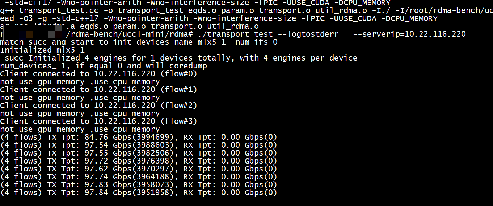
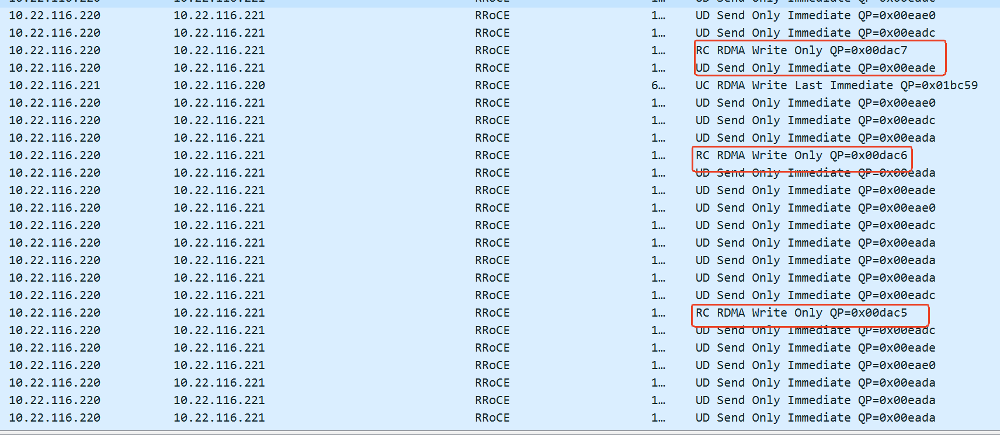
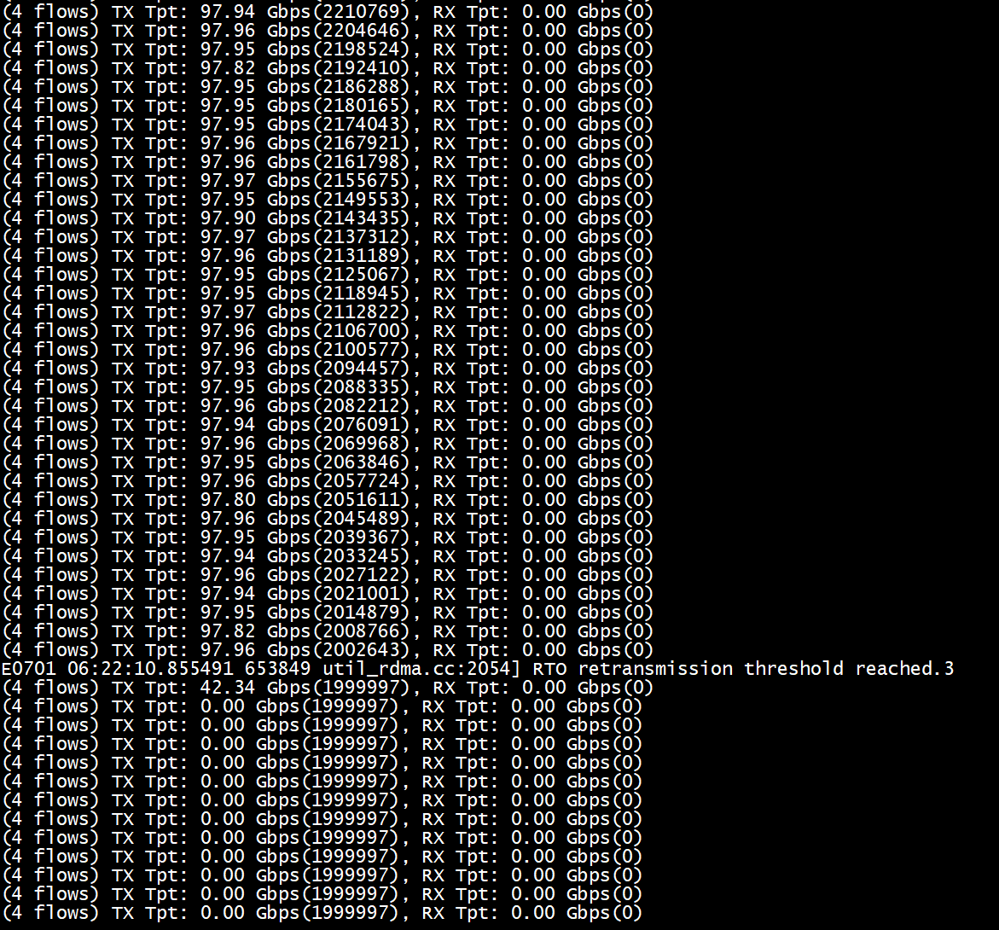
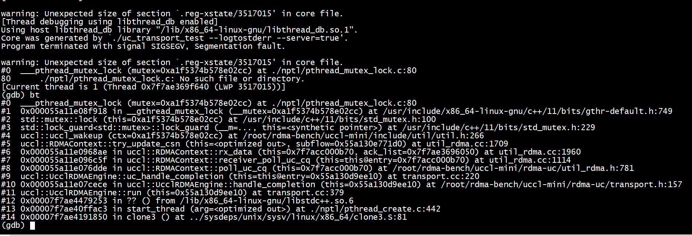

# gtest


```
export GLOG_v=4
```

```
./transport_test --logtostderr   --serverip=10.22.116.220   >> log.txt  2>&1 &
```
or   
```
log_level=4
export GLOG_logtostderr=1 GLOG_v=${log_level}
```

# make


```
apt install libgtest-dev
```

+ 使用cpu memeory    
```
-UUSE_CUDA -DCPU_MEMORY
```

+ 屏蔽rdma_test.cc编译（因为其依赖cudaMallocManaged or  cudaMalloc）      

```
rm rdma_test.cc 
```

#  export (不需要export)
```
export NCCL_IB_HCA=mlx5_1
export NCCL_SOCKET_IFNAME="enp61s0f1np1"
export NCCL_IB_GID_INDEX=3 
export NCCL_IB_PCI_RELAXED_ORDERING=1
CHUNK_SIZE_KB
```


#  config 

```
ibv_devices
    device                 node GUID
    ------              ----------------
    mlx5_0              c470bd0300aa1fc8
    mlx5_1              c470bd0300aa1fc9
```
mlx5_1处于工作状态，mlx5_0 出于down     

+ transport_config.h     
```
UCCL_PARAM(ROCE_GID_IDX, "ROCE_GID_IDX", 3);
UCCL_PARAM(RCMode, "RCMODE", true);
```

+ azure_perm_traffic/transport_config.h   

```
static constexpr bool ROCE_NET = true;
static char const* IB_DEVICE_NAME_PREFIX = "mlx5_";
static std::string SINGLE_CTRL_NIC("enp61s0f1np1");
static constexpr uint8_t DEVNAME_SUFFIX_LIST[8] = {0, 1, 0, 0, 0, 0, 0, 0};
static constexpr uint8_t NUM_DEVICES = 1;
static constexpr double LINK_BANDWIDTH = 100.0 * 1e9 / 8;  // 1m00Gbps
```
IB_DEVICE_NAME_PREFIX +  DEVNAME_SUFFIX_LIST 组成

#  test

```
ibv_devices
    device                 node GUID
    ------              ----------------
    mlx5_0              c470bd0300aa1fc8
    mlx5_1              c470bd0300aa1fc9
```
mlx5_1处于工作状态，mlx5_0 出于down   


+ server

```
./transport_test --logtostderr   --server=true
```

+ client    
```
 ./transport_test --logtostderr   --serverip=10.22.116.221
devices name mlx5_1  num_ifs 0 match succ 
Initialized mlx5_1
Initialized 4 engines for 1 devices totally, with 4 engines per device
num_devices_ 1 
Client connected to 10.22.116.221 (flow#0)
Client connected to 10.22.116.221 (flow#1)
Client connected to 10.22.116.221 (flow#2)
Client connected to 10.22.116.221 (flow#3)
E0630 06:37:52.695745 3514092 transport.cc:3360] RTO retransmission threshold reached.1
*** Aborted at 1751265473 (unix time) try "date -d @1751265473" if you are using GNU date ***
PC: @                0x0 (unknown)
*** SIGSEGV (@0x7f34df945000) received by PID 3514082 (TID 0x7f9e099f1640) from PID 18446744073165623296; stack trace: ***
    @     0x7f9e56969046 (unknown)
    @     0x7f9e563e4520 (unknown)
    @     0x55a1d8b38e29 uccl::RDMAContext::try_retransmit_chunk()
    @     0x55a1d8b42954 uccl::RDMAContext::__retransmit_for_flow()
    @     0x55a1d8b42b6e uccl::UcclRDMAEngine::handle_rto()
    @     0x55a1d8b461a6 uccl::UcclRDMAEngine::periodic_process()
    @     0x55a1d8b46498 uccl::UcclRDMAEngine::run()
    @     0x7f9e567b0253 (unknown)
    @     0x7f9e56436ac3 (unknown)
    @     0x7f9e564c8850 (unknown)
    @                0x0 (unknown)
Segmentation fault
```

将UCCL_PARAM(RCMode, "RCMODE", false);改为UCCL_PARAM(RCMode, "RCMODE", true);


    

```
./transport_test --logtostderr   --serverip=10.22.116.220
./transport_test --logtostderr   --server=true
```

# uc

[uc-proj](https://github.com/bzhng-development/uccl/tree/main/rdma)
```
DEFINE_bool(server, false, "Whether this is a server receiving traffic.");
DEFINE_string(serverip, "", "Server IP address the client tries to connect.");
DEFINE_string(perftype, "tpt", "Performance type: basic/lat/tpt/bi.");
DEFINE_bool(warmup, false, "Whether to run warmup.");
DEFINE_uint32(nflow, 4, "Number of flows.");
DEFINE_uint32(nmsg, 1, "Number of messages within one request to post.");
DEFINE_uint32(nreq, 2, "Outstanding requests to post.");
DEFINE_uint32(msize, 1000000, "Size of message.");
DEFINE_uint32(iterations, 1000000, "Number of iterations to run.");
DEFINE_bool(flush, false, "Whether to flush after receiving.");
DEFINE_bool(bi, false, "Whether to run bidirectional test.");
```

```
void dump_ibv_device_attr(struct ibv_device_attr *attr)
{
    printf("\n==== device attr ====\n");
    printf("\tfw_ver: %s\n", attr->fw_ver);
    printf("\tnode_guid: 0x%lx\n", attr->node_guid);
    printf("\tsys_image_guid: 0x%lx\n", attr->sys_image_guid);
    printf("\tmax_mr_size: 0x%lx\n", attr->max_mr_size);    /* Largest contiguous block that can be registered */
    printf("\tpage_size_cap: %lu\n", attr->page_size_cap);  /* Supported memory shift sizes */
    printf("\thw_ver:  %u\n", attr->hw_ver);
    printf("\tmax_qp:  %d\n", attr->max_qp);
    printf("\tmax_qp_wr:  %d\n", attr->max_qp_wr);
    printf("\tmax_sge:  %d\n", attr->max_sge);
    printf("\tmax_cq:  %d\n", attr->max_cq);
    printf("\tmax_cqe:  %d\n", attr->max_cqe);
    printf("\tmax_mr:  %d\n", attr->max_mr);
    printf("\tmax_pd:  %d\n", attr->max_pd);
    printf("\tmax_qp_rd_atom:  %d\n", attr->max_qp_rd_atom);    /* Maximum number of RDMA Read & Atomic operations that can be outstanding per QP */
    printf("\tmax_res_rd_atom:  %d\n", attr->max_res_rd_atom);  /* Maximum number of resources used for RDMA Read & Atomic operations by this HCA as the Target */
    printf("\tmax_qp_init_rd_atom:  %d\n", attr->max_qp_init_rd_atom);  /* Maximum depth per QP for initiation of RDMA Read & Atomic operations */
    printf("\tphys_port_cnt:  %d\n", attr->phys_port_cnt);
    printf("\t\n");
    printf("==============\n");
    //////////

}

void dump_ibv_port_attr(struct ibv_port_attr *attr)
{
    printf("\n==========  port attr ==========\n");
    printf("\tstate: %d  (%s)\n", attr->state, ibv_port_state_string(attr->state));
    printf("\tmax_mtu:  %s\n", ibv_mtu_string(attr->max_mtu));
    printf("\tactive_mtu:  %s\n", ibv_mtu_string(attr->active_mtu));
    printf("\tgid_tbl_len:  %d\n", attr->gid_tbl_len);  /* Length of source GID table */
    printf("\tport_cap_flags:  0x %x\n", attr->port_cap_flags);
    printf("\tmax_msg_sz:  %u\n", attr->max_msg_sz);
    printf("\tlid:  %d\n", attr->lid);  /* Base port LID */
    printf("\tsm_lid:  %d\n", attr->sm_lid);
    printf("\tlmc:  %d\n", attr->lmc);  /* LMC of LID */
    printf("\tmax_vl_num:  %d (%s)\n", attr->max_vl_num, ibv_vl_string(attr->max_vl_num));  /* Maximum number of VLs */
    printf("\tsm_sl:  %d\n", attr->sm_sl);  /* SM service level */
    printf("\tactive_width:  %d (%s)\n", attr->active_width, ibv_width_string(attr->active_width)); /* Currently active link width */
    printf("\tactive_speed:  %d (%s)\n", attr->active_speed, ibv_speed_string(attr->active_speed));
    printf("\tphys_state:  %d (%s)\n", attr->phys_state, ibv_port_phy_state_string(attr->phys_state));
    printf("==============\n");

}
```
  

3种qp  

+ IBV_QPT_UD
```
      util_rdma_create_qp(
          context, &ctrl_qp_, IBV_QPT_UD, use_cq_ex, true,
          (struct ibv_cq**)&ctrl_cq_ex_, false, kCQSize, pd, port, &ctrl_mr_,
          nullptr, CtrlChunkBuffPool::kChunkSize * CtrlChunkBuffPool::kNumChunk,
          kMaxCtrlWRs, kMaxCtrlWRs, 1, 1);
```
+  IBV_QPT_RC     

```
    util_rdma_create_qp(factory_dev->context, &comm_base->fifo_qp, IBV_QPT_RC,
                        false, false, &comm_base->flow_cq, false, kFifoCQSize,
                        factory_dev->pd, factory_dev->ib_port_num,
                        &comm_base->fifo_mr, nullptr, kFifoMRSize,
                        kMaxReq * kMaxRecv, kMaxReq * kMaxRecv, 1, 1);
```

+  IBV_QPT_UC     
```
 if (!ucclParamRCMode()){

    qp_init_attr.qp_type = IBV_QPT_UC;
     
  }
```

## run cause coredump
  
这是kChunkSize设置不对导致：   

+ 对于rdma-uc/transport_config.h 中kChunkSize应该设置为
static constexpr uint32_t kChunkSize = 32 << 10;    

+ 对于rdma-uc2/transport_config.h 中CHUNK_SIZE_KB应该设置为    
UCCL_PARAM(CHUNK_SIZE_KB, "CHUNK_SIZE_KB", 64);    

## run rdma-uc(有个bug)
rdma-uc2也有这个bug        
  

```
*** Aborted at 1751351451 (unix time) try "date -d @1751351451" if you are using GNU date ***
PC: @                0x0 (unknown)
*** SIGSEGV (@0x0) received by PID 3517443 (TID 0x7f00c496c640) from PID 0; stack trace: ***
    @     0x7f00f9c72046 (unknown)
    @     0x7f00f96ed520 (unknown)
    @     0x7f00f9742ef4 pthread_mutex_lock
    @     0x557ca351b4b8 uccl::RDMAContext::try_update_csn()
    @     0x557ca352ab7b uccl::RDMAContext::uc_rx_chunk()
    @     0x557ca3544dff uccl::SharedIOContext::uc_poll_recv_cq()
    @     0x557ca3517ef3 uccl::UcclRDMAEngine::uc_handle_completion()
    @     0x557ca35283ca uccl::UcclRDMAEngine::run()
    @     0x7f00f9ab9253 (unknown)
    @     0x7f00f973fac3 (unknown)
    @     0x7f00f97d1850 (unknown)
    @                0x0 (unknown)
Segmentation fault (core dumped)
```
