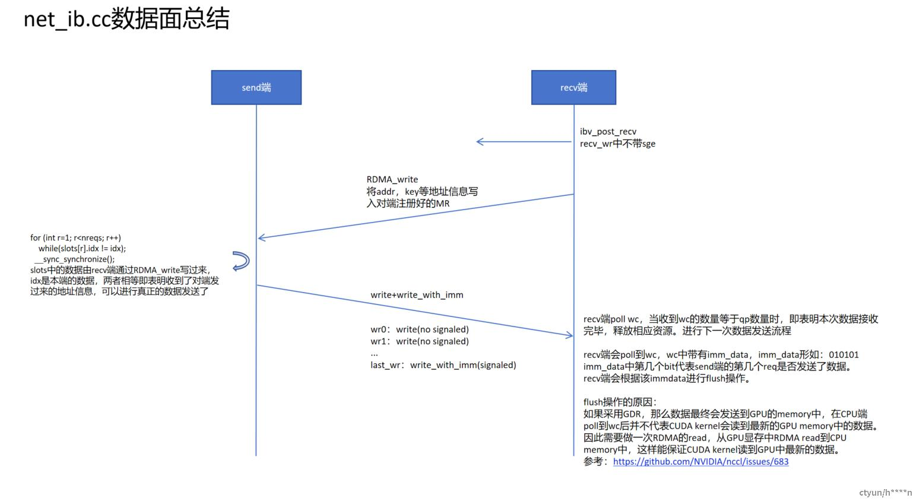
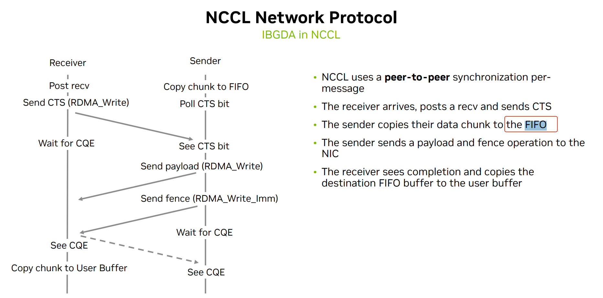

#  UCCL   


[UCCL-Tran：为GPU网络打造的可扩展软件传输层](https://zhuanlan.zhihu.com/p/1925692992087390160)  

[NCCL 源码解读(17): Primitives Simple](https://blog.hidva.com/2025/03/09/nccl-primitives-simple/)   
[阿里云 ACCL-Barex -- GDR: 再深一点](https://blog.hidva.com/2025/05/07/gdr-in-depth/)    


```
./transport_test --logtostderr   --serverip=10.22.116.221 --perftype=basic --iterations=8
./transport_test --logtostderr   --server=true  --perftype=basic --iterations=8
```


```
python3  benchmark.py --role server --local-gpu-idx 0 --num-cpus 4 --sizes 16384 --iters 1
python3  benchmark.py --role client --remote-ip 10.22.116.221  --local-gpu-idx 0 --num-cpus 4  --sizes 16384 --iters 1
```

## mytest

```
rm rdma_test.cc 
```


```
./transport_test --help
```

# gtest


```
export GLOG_v=4
```

```
./transport_test --logtostderr   --serverip=10.22.116.220   >> log.txt  2>&1 &
```
or   
```
log_level=4
export GLOG_logtostderr=1 GLOG_v=${log_level}
```

# make


```
apt install libgtest-dev
```

+ 使用cpu memeory    
```
-UUSE_CUDA -DCPU_MEMORY
```

+ 屏蔽rdma_test.cc编译（因为其依赖cudaMallocManaged or  cudaMalloc）      

```
rm rdma_test.cc 
```

#  export (不需要export)
```
export NCCL_IB_HCA=mlx5_1
export NCCL_SOCKET_IFNAME="enp61s0f1np1"
export NCCL_IB_GID_INDEX=3 
export NCCL_IB_PCI_RELAXED_ORDERING=1
CHUNK_SIZE_KB
```


#  config 

```
ibv_devices
    device                 node GUID
    ------              ----------------
    mlx5_0              c470bd0300aa1fc8
    mlx5_1              c470bd0300aa1fc9
```
mlx5_1处于工作状态，mlx5_0 出于down     

+ transport_config.h     
```
UCCL_PARAM(ROCE_GID_IDX, "ROCE_GID_IDX", 3);
UCCL_PARAM(RCMode, "RCMODE", true);
```

+ transport_config.h添加   

```
static constexpr bool ROCE_NET = true;
static char const* IB_DEVICE_NAME_PREFIX = "mlx5_";
static std::string SINGLE_CTRL_NIC("enp61s0f1np1");
static constexpr uint8_t DEVNAME_SUFFIX_LIST[8] = {0, 1, 0, 0, 0, 0, 0, 0};
static constexpr uint8_t NUM_DEVICES = 1;
static constexpr double LINK_BANDWIDTH = 100.0 * 1e9 / 8;  // 1m00Gbps
```
IB_DEVICE_NAME_PREFIX +  DEVNAME_SUFFIX_LIST 组成

#  test

```
ibv_devices
    device                 node GUID
    ------              ----------------
    mlx5_0              c470bd0300aa1fc8
    mlx5_1              c470bd0300aa1fc9
```
mlx5_1处于工作状态，mlx5_0 出于down   


+ server

```
./transport_test --logtostderr   --server=true
```

+ client    
```
 ./transport_test --logtostderr   --serverip=10.22.116.221
devices name mlx5_1  num_ifs 0 match succ 
Initialized mlx5_1
Initialized 4 engines for 1 devices totally, with 4 engines per device
num_devices_ 1 
Client connected to 10.22.116.221 (flow#0)
Client connected to 10.22.116.221 (flow#1)
Client connected to 10.22.116.221 (flow#2)
Client connected to 10.22.116.221 (flow#3)
E0630 06:37:52.695745 3514092 transport.cc:3360] RTO retransmission threshold reached.1
*** Aborted at 1751265473 (unix time) try "date -d @1751265473" if you are using GNU date ***
PC: @                0x0 (unknown)
*** SIGSEGV (@0x7f34df945000) received by PID 3514082 (TID 0x7f9e099f1640) from PID 18446744073165623296; stack trace: ***
    @     0x7f9e56969046 (unknown)
    @     0x7f9e563e4520 (unknown)
    @     0x55a1d8b38e29 uccl::RDMAContext::try_retransmit_chunk()
    @     0x55a1d8b42954 uccl::RDMAContext::__retransmit_for_flow()
    @     0x55a1d8b42b6e uccl::UcclRDMAEngine::handle_rto()
    @     0x55a1d8b461a6 uccl::UcclRDMAEngine::periodic_process()
    @     0x55a1d8b46498 uccl::UcclRDMAEngine::run()
    @     0x7f9e567b0253 (unknown)
    @     0x7f9e56436ac3 (unknown)
    @     0x7f9e564c8850 (unknown)
    @                0x0 (unknown)
Segmentation fault
```

将UCCL_PARAM(RCMode, "RCMODE", false);改为UCCL_PARAM(RCMode, "RCMODE", true);


    

```
./transport_test --logtostderr   --serverip=10.22.116.220
./transport_test --logtostderr   --server=true
```

# uc

[uc-proj](https://github.com/bzhng-development/uccl/tree/main/rdma)
```
DEFINE_bool(server, false, "Whether this is a server receiving traffic.");
DEFINE_string(serverip, "", "Server IP address the client tries to connect.");
DEFINE_string(perftype, "tpt", "Performance type: basic/lat/tpt/bi.");
DEFINE_bool(warmup, false, "Whether to run warmup.");
DEFINE_uint32(nflow, 4, "Number of flows.");
DEFINE_uint32(nmsg, 1, "Number of messages within one request to post.");
DEFINE_uint32(nreq, 2, "Outstanding requests to post.");
DEFINE_uint32(msize, 1000000, "Size of message.");
DEFINE_uint32(iterations, 1000000, "Number of iterations to run.");
DEFINE_bool(flush, false, "Whether to flush after receiving.");
DEFINE_bool(bi, false, "Whether to run bidirectional test.");
```

```
void dump_ibv_device_attr(struct ibv_device_attr *attr)
{
    printf("\n==== device attr ====\n");
    printf("\tfw_ver: %s\n", attr->fw_ver);
    printf("\tnode_guid: 0x%lx\n", attr->node_guid);
    printf("\tsys_image_guid: 0x%lx\n", attr->sys_image_guid);
    printf("\tmax_mr_size: 0x%lx\n", attr->max_mr_size);    /* Largest contiguous block that can be registered */
    printf("\tpage_size_cap: %lu\n", attr->page_size_cap);  /* Supported memory shift sizes */
    printf("\thw_ver:  %u\n", attr->hw_ver);
    printf("\tmax_qp:  %d\n", attr->max_qp);
    printf("\tmax_qp_wr:  %d\n", attr->max_qp_wr);
    printf("\tmax_sge:  %d\n", attr->max_sge);
    printf("\tmax_cq:  %d\n", attr->max_cq);
    printf("\tmax_cqe:  %d\n", attr->max_cqe);
    printf("\tmax_mr:  %d\n", attr->max_mr);
    printf("\tmax_pd:  %d\n", attr->max_pd);
    printf("\tmax_qp_rd_atom:  %d\n", attr->max_qp_rd_atom);    /* Maximum number of RDMA Read & Atomic operations that can be outstanding per QP */
    printf("\tmax_res_rd_atom:  %d\n", attr->max_res_rd_atom);  /* Maximum number of resources used for RDMA Read & Atomic operations by this HCA as the Target */
    printf("\tmax_qp_init_rd_atom:  %d\n", attr->max_qp_init_rd_atom);  /* Maximum depth per QP for initiation of RDMA Read & Atomic operations */
    printf("\tphys_port_cnt:  %d\n", attr->phys_port_cnt);
    printf("\t\n");
    printf("==============\n");
    //////////

}

void dump_ibv_port_attr(struct ibv_port_attr *attr)
{
    printf("\n==========  port attr ==========\n");
    printf("\tstate: %d  (%s)\n", attr->state, ibv_port_state_string(attr->state));
    printf("\tmax_mtu:  %s\n", ibv_mtu_string(attr->max_mtu));
    printf("\tactive_mtu:  %s\n", ibv_mtu_string(attr->active_mtu));
    printf("\tgid_tbl_len:  %d\n", attr->gid_tbl_len);  /* Length of source GID table */
    printf("\tport_cap_flags:  0x %x\n", attr->port_cap_flags);
    printf("\tmax_msg_sz:  %u\n", attr->max_msg_sz);
    printf("\tlid:  %d\n", attr->lid);  /* Base port LID */
    printf("\tsm_lid:  %d\n", attr->sm_lid);
    printf("\tlmc:  %d\n", attr->lmc);  /* LMC of LID */
    printf("\tmax_vl_num:  %d (%s)\n", attr->max_vl_num, ibv_vl_string(attr->max_vl_num));  /* Maximum number of VLs */
    printf("\tsm_sl:  %d\n", attr->sm_sl);  /* SM service level */
    printf("\tactive_width:  %d (%s)\n", attr->active_width, ibv_width_string(attr->active_width)); /* Currently active link width */
    printf("\tactive_speed:  %d (%s)\n", attr->active_speed, ibv_speed_string(attr->active_speed));
    printf("\tphys_state:  %d (%s)\n", attr->phys_state, ibv_port_phy_state_string(attr->phys_state));
    printf("==============\n");

}
```
  

3种qp  

+ IBV_QPT_UD
```
      util_rdma_create_qp(
          context, &ctrl_qp_, IBV_QPT_UD, use_cq_ex, true,
          (struct ibv_cq**)&ctrl_cq_ex_, false, kCQSize, pd, port, &ctrl_mr_,
          nullptr, CtrlChunkBuffPool::kChunkSize * CtrlChunkBuffPool::kNumChunk,
          kMaxCtrlWRs, kMaxCtrlWRs, 1, 1);
```
+  IBV_QPT_RC     

```
    util_rdma_create_qp(factory_dev->context, &comm_base->fifo_qp, IBV_QPT_RC,
                        false, false, &comm_base->flow_cq, false, kFifoCQSize,
                        factory_dev->pd, factory_dev->ib_port_num,
                        &comm_base->fifo_mr, nullptr, kFifoMRSize,
                        kMaxReq * kMaxRecv, kMaxReq * kMaxRecv, 1, 1);
```

+  IBV_QPT_UC     
```
 if (!ucclParamRCMode()){

    qp_init_attr.qp_type = IBV_QPT_UC;
     
  }
```

## run cause coredump
  
这是kChunkSize设置不对导致：   

+ 对于rdma-uc/transport_config.h 中kChunkSize应该设置为
static constexpr uint32_t kChunkSize = 32 << 10;    

+ 对于rdma-uc2/transport_config.h 中CHUNK_SIZE_KB应该设置为    
UCCL_PARAM(CHUNK_SIZE_KB, "CHUNK_SIZE_KB", 64);    

## run rdma-uc(有个bug)
rdma-uc2也有这个bug        
  

```
*** Aborted at 1751351451 (unix time) try "date -d @1751351451" if you are using GNU date ***
PC: @                0x0 (unknown)
*** SIGSEGV (@0x0) received by PID 3517443 (TID 0x7f00c496c640) from PID 0; stack trace: ***
    @     0x7f00f9c72046 (unknown)
    @     0x7f00f96ed520 (unknown)
    @     0x7f00f9742ef4 pthread_mutex_lock
    @     0x557ca351b4b8 uccl::RDMAContext::try_update_csn()
    @     0x557ca352ab7b uccl::RDMAContext::uc_rx_chunk()
    @     0x557ca3544dff uccl::SharedIOContext::uc_poll_recv_cq()
    @     0x557ca3517ef3 uccl::UcclRDMAEngine::uc_handle_completion()
    @     0x557ca35283ca uccl::UcclRDMAEngine::run()
    @     0x7f00f9ab9253 (unknown)
    @     0x7f00f973fac3 (unknown)
    @     0x7f00f97d1850 (unknown)
    @                0x0 (unknown)
Segmentation fault (core dumped)
```


# p2p


```
pip3 install  pybind11
apt-get install libelf-dev -y
```


## listen


```
(gdb) bt
#0  listen () at ../sysdeps/unix/syscall-template.S:120
#1  0x0000555555577b47 in uccl::create_listen_socket (listen_port=30000, listen_fd=0x5555555be170) at /root/rdma-bench/uccl/include/util/util.h:141
#2  operator() (__closure=0x7fffffffe280) at transport.cc:815
#3  std::__invoke_impl<void, uccl::RDMAEndpoint::initialize_engine_by_dev(int)::<lambda()> > (__f=...) at /usr/include/c++/11/bits/invoke.h:61
#4  std::__invoke<uccl::RDMAEndpoint::initialize_engine_by_dev(int)::<lambda()> > (__fn=...) at /usr/include/c++/11/bits/invoke.h:96
#5  operator() (__closure=<optimized out>) at /usr/include/c++/11/mutex:776
#6  operator() (__closure=0x0) at /usr/include/c++/11/mutex:712
#7  _FUN () at /usr/include/c++/11/mutex:712
#8  0x00007ffff7a65ee8 in __pthread_once_slow (once_control=0x55555560a210, init_routine=0x7ffff7dd8d50 <__once_proxy>) at ./nptl/pthread_once.c:116
#9  0x00005555555660a7 in __gthread_once (__func=<optimized out>, __once=0x55555560a210) at /usr/include/x86_64-linux-gnu/c++/11/bits/gthr-default.h:700
#10 std::call_once<uccl::RDMAEndpoint::initialize_engine_by_dev(int)::<lambda()> > (__f=..., __once=...) at /usr/include/c++/11/mutex:783
#11 uccl::RDMAEndpoint::initialize_engine_by_dev (this=this@entry=0x5555555a24c0 <ep>, dev=dev@entry=0) at transport.cc:775
#12 0x000055555555d826 in main (argc=<optimized out>, argv=<optimized out>) at transport_test.cc:411
(gdb) 
```

## use cpu memory test

```
int const kMaxNumGPUs = 1;
```

```
#ifndef CPU_MEMORY
  DCHECK(local_gpu_idx_ < gpu_cards.size() && gpu_cards.size() <= kMaxNumGPUs)
      << "Local GPU index out of range";
  auto ib_nics = uccl::get_rdma_nics();
  // Find the RDMA NIC that is closest to each of the GPUs.
  for (int i = 0; i < kMaxNumGPUs; i++) {
    auto gpu_device_path = gpu_cards[i];
    auto ib_nic_it = std::min_element(
        ib_nics.begin(), ib_nics.end(), [&](auto const& a, auto const& b) {
          return uccl::cal_pcie_distance(gpu_device_path, a.second) <
                 uccl::cal_pcie_distance(gpu_device_path, b.second);
        });
    gpu_to_dev[i] = ib_nic_it - ib_nics.begin();
  }
  std::cout << "Detected best GPU-NIC mapping: " << std::endl;
  for (int i = 0; i < kMaxNumGPUs; i++) {
    std::cout << "\tGPU " << i << " -> NIC " << gpu_to_dev[i] << " ("
              << ib_nics[gpu_to_dev[i]].first << ")" << std::endl;
  }
  std::cout << std::endl;
#endif
```

+ server


```
python3  benchmark.py --role server --local-gpu-idx 0 --num-cpus 4
UCCL P2P Benchmark — role: server
Message sizes: 256 B, 1.0 KB, 4.0 KB, 16.0 KB, 64.0 KB, 256.0 KB, 1.0 MB, 10.0 MB, 100.0 MB
Device: cpu | Local GPU idx: 0 | Iterations: 1000
Creating Engine with GPU index: 0, CPUs: 4
Initialized mlx5_1
Initialized 4 engines for 1 devices totally, with 4 engines per device
Creating Engine GPU num: 0
Endpoint initialized successfully
[Server] Waiting for connection …
Waiting to accept incoming connection...
[Server] Connected to 10.22.116.220 (GPU 0) conn_id=0
[Server]    256 B :   0.25 Gbps |   0.03 GB/s
[Server]   1.0 KB :   0.98 Gbps |   0.12 GB/s
[Server]   4.0 KB :   3.62 Gbps |   0.45 GB/s
[Server]  16.0 KB :  12.30 Gbps |   1.54 GB/s
[Server]  64.0 KB :  35.55 Gbps |   4.44 GB/s
[Server] 256.0 KB :  68.28 Gbps |   8.54 GB/s
[Server]   1.0 MB :  86.73 Gbps |  10.84 GB/s
[Server]  10.0 MB :  95.50 Gbps |  11.94 GB/s
[Server] 100.0 MB :  96.71 Gbps |  12.09 GB/s
[Server] Benchmark complete
Destroying Engine...
Engine destroyed
```
+ client   

```
python3  benchmark.py --role client --remote-ip 10.22.116.221  --local-gpu-idx 0 --num-cpus 4
UCCL P2P Benchmark — role: client
Message sizes: 256 B, 1.0 KB, 4.0 KB, 16.0 KB, 64.0 KB, 256.0 KB, 1.0 MB, 10.0 MB, 100.0 MB
Device: cpu | Local GPU idx: 0 | Iterations: 1000
Creating Engine with GPU index: 0, CPUs: 4
Initialized mlx5_1
Initialized 4 engines for 1 devices totally, with 4 engines per device
Creating Engine GPU num: 0
Endpoint initialized successfully
Attempting to connect to 10.22.116.221:0
[Client] Connected to 10.22.116.221 conn_id=0
[Client]    256 B :   0.25 Gbps |   0.03 GB/s
[Client]   1.0 KB :   0.98 Gbps |   0.12 GB/s
[Client]   4.0 KB :   3.62 Gbps |   0.45 GB/s
[Client]  16.0 KB :  12.30 Gbps |   1.54 GB/s
[Client]  64.0 KB :  35.55 Gbps |   4.44 GB/s
[Client] 256.0 KB :  68.28 Gbps |   8.54 GB/s
[Client]   1.0 MB :  86.73 Gbps |  10.84 GB/s
[Client]  10.0 MB :  95.50 Gbps |  11.94 GB/s
[Client] 100.0 MB :  96.71 Gbps |  12.09 GB/s
[Client] Benchmark complete
Destroying Engine...
Engine destroyed
```

# nccl
+ NCCL的传输层分析（二）    

```
// @ref ncclIbNetCommBase
struct alignas(32) NetCommBase {
  // Pointing to rdma_ctx_->fifo_mr_->addr.
  struct RemFifo* fifo;

  // CQ for Fifo QP and GPU flush QP and RC QP.
  struct ibv_cq* flow_cq;

  // Fifo QP based on Reliable Connection (RC).
  struct ibv_qp* fifo_qp;
  // Memory region for Fifo.
  struct ibv_mr* fifo_mr;

  // RC UP for small messages bypassing UcclEngine.
  struct ibv_qp* rc_qp;

  uint64_t remote_fifo_addr;
  uint32_t remote_fifo_rkey;
};

/// @ref ncclIbSendComm
struct SendComm {
  struct NetCommBase base;
  // Track outstanding FIFO requests.
  struct ucclRequest* fifo_ureqs[kMaxReq][kMaxRecv];
  uint64_t fifo_head;
};

/// @ref ncclIbRecvComm
struct RecvComm {
  struct NetCommBase base;

  // QP for GPU flush.
  struct ibv_qp* gpu_flush_qp;
  // Memory region for GPU flush.
  struct ibv_mr* gpu_flush_mr;
  struct ibv_sge gpu_flush_sge;
  // GPU flush buffer
  int gpu_flush;
};
struct ncclIbQpInfo {
  uint32_t lid;
  uint8_t ib_port;
  uint8_t link_layer;
  uint32_t qpn[NCCL_IB_MAX_QPS];

  // For RoCE
  uint64_t spn;
  uint64_t iid;
  enum ibv_mtu mtu;

  // FIFO RDMA info
  uint32_t fifoRkey;
  ui
```

## uccl 


通过分析NCCL传输层的数据数据流程可以看到，Recv会将地址信息通过RDMA＿WRITE写到发送端，发送端会根据Recv端写过来的地址信息去将自己的数据发送出去。总而言之，NCCL的数据发送的流程是由Recv驱动的，这是NCCL传输层最关键的一点。

    
ncclIbPostFifo流程分析：       
1 往comm->remFifo[MAX_REQUESTS][NCCL_NET_IB_MAX_RECVS]中的某一行填写地址信息，即ncclIbSendFifo中的addr，rkey等地址信息     

2 将某一行的地址信息作为一整块内存（内存大小为NCCL_NET_IB_MAX_RECVS*sizeof(struct ncclIbSendFifo)），并把这块内存作为WR的sge，   

sge的length就是这块内存的大小（NCCL_NET_IB_MAX_RECVS*sizeof(struct ncclIbSendFifo)），并填充好WR中其他相关的信息。   

3 将WR通过RDMA_WRITE写到对端的一块内存，对端将会根据本端发送的地址信息进行数据的发送。    
  


```
  // Prepare my fifo
  NCCLCHECK(wrap_ibv_reg_mr(&comm->fifoMr, comm->verbs.pd, comm->fifo, sizeof(struct ncclIbSendFifo)*MAX_REQUESTS*NCCL_NET_IB_MAX_RECVS, IBV_ACCESS_LOCAL_WRITE|IBV_ACCESS_REMOTE_WRITE|IBV_ACCESS_REMOTE_READ));
  qpInfo.fifoRkey = comm->fifoMr->rkey;
  qpInfo.fifoAddr = (uint64_t)comm->fifo;
```

```
/**
 * @brief A FIFO queue for flow control.
 * Receiver posts a buffer to the FIFO queue for the sender to use RDMA WRITE.
 */
struct RemFifo {
  // FIFO elements prepared for sending to remote peer.
  struct FifoItem elems[kMaxReq][kMaxRecv];
  // Tail pointer of the FIFO.
  uint64_t fifo_tail;
  // Only used for testing RC.
  uint32_t sizes[kMaxReq][kMaxRecv];
};
```
+  transport_test server     

```
(gdb) bt
#0  uccl::UcclFlow::post_fifo (this=0x5598d70905a0, engine_idx=1, data=0x7ffe07703c68, size=0x7ffe07703ce4, n=1, mhandle=0x7ffe07703ca8, wr=0x5598d7127f00, sge=0x5598d7127f80)
    at transport.cc:137
#1  0x00005598a3743f8f in uccl::RDMAEndpoint::uccl_recv_async (this=this@entry=0x5598a37644c0 <ep>, flow=0x5598d70905a0, mhandles=mhandles@entry=0x7ffe07703ca8, 
    data=data@entry=0x7ffe07703c68, size=size@entry=0x7ffe07703ce4, n=1, ureq=0x5598d7127ec0) at transport.cc:1534
#2  0x00005598a3724104 in server_tpt (datas=std::vector of length 4, capacity 4 = {...}, mhandles=std::vector of length 4, capacity 4 = {...}, 
    conn_ids=std::vector of length 4, capacity 4 = {...}) at transport_test.cc:177
#3  server_worker () at transport_test.cc:331
#4  0x00005598a371f947 in main (argc=<optimized out>, argv=<optimized out>) at transport_test.cc:438
```


+  server  ibv_post_send    
```
#0  ibv_post_send (bad_wr=0x7fffddbe9fa8, wr=0x7fffffffe1c0, qp=0x555555912878) at /usr/include/infiniband/verbs.h:3327
#1  uccl::RDMAContext::supply_rx_buff (this=0x7fffd8002ed0, ureq=0x7fffffffe180) at transport.cc:1854
#2  0x0000555555567bdc in uccl::UcclRDMAEngine::handle_rx_work (this=0x5555556003a0) at transport.cc:269
#3  0x00005555555762f5 in uccl::UcclRDMAEngine::run (this=0x5555556003a0) at transport.cc:441
```

```
#0  ibv_post_send (bad_wr=<optimized out>, wr=<optimized out>, qp=<optimized out>) at util_rdma.cc:550
#1  uccl::SharedIOContext::flush_acks (this=0x555555600540) at util_rdma.cc:553
#2  0x0000555555592c49 in uccl::SharedIOContext::uc_poll_recv_cq (this=this@entry=0x555555600540) at util_rdma.cc:691
#3  0x0000555555565f73 in uccl::UcclRDMAEngine::uc_handle_completion (this=this@entry=0x5555556003a0) at transport.cc:222
#4  0x000055555557631a in uccl::UcclRDMAEngine::handle_completion (this=0x5555556003a0) at /root/rdma-bench/uccl/rdma/transport.h:718
#5  uccl::UcclRDMAEngine::run (this=0x5555556003a0) at transport.cc:447
```


+   benchmark.py  server  

```
#0  uccl::UcclFlow::post_fifo (this=0x5602d7b5b080, engine_idx=0, data=0x7ffd79b4b988, size=0x7ffd79b4b9a4, n=1, mhandle=0x7ffd79b4b9a8, wr=0x7ffd79b4ba00, sge=0x7ffd79b4ba80)
    at transport.cc:137
#1  0x00007f32ec81899f in uccl::RDMAEndpoint::uccl_recv_async (this=0x5602d78127e0, flow=0x5602d7b5b080, mhandles=<optimized out>, data=<optimized out>, size=0x7ffd79b4b9a4, n=1, 
    ureq=0x7ffd79b4b9c0) at transport.cc:1534
```

## fifo is ready ?

```
check_fifo_ready
```

```
int RDMAEndpoint::uccl_send_async(UcclFlow* flow, struct Mhandle* mhandle,
                                  void const* data, size_t const size,
                                  struct ucclRequest* ureq) {
  ureq->type = ReqTx;
  ureq->send.data_len = size;

  int slot, nmsg;

  if (!flow->check_fifo_ready(&slot, &nmsg)) return -1;
```

##  server control

控制qp

```
      util_rdma_create_qp(
          context, &ctrl_qp_, IBV_QPT_UD, use_cq_ex, true,
          (struct ibv_cq**)&ctrl_cq_ex_, false, kCQSize, pd, port, &ctrl_mr_,
          nullptr, CtrlChunkBuffPool::kChunkSize * CtrlChunkBuffPool::kNumChunk,
          kMaxCtrlWRs, kMaxCtrlWRs, 1, 1);
```


```
    for (int i = 0; i < kMaxAckWRs; i++) {
          memset(&tx_ack_wr_[i], 0, sizeof(tx_ack_wr_[i]));
          memset(&tx_ack_sge_[i], 0, sizeof(tx_ack_sge_[i]));
          tx_ack_wr_[i].sg_list = &tx_ack_sge_[i];
          tx_ack_wr_[i].num_sge = 1;
          tx_ack_wr_[i].opcode = IBV_WR_SEND_WITH_IMM;
          tx_ack_wr_[i].send_flags = IBV_SEND_SIGNALED;
        }
```

```
3285    void RDMAContext::try_post_acks(int num_ack, uint64_t chunk_addr, bool force) {
(gdb) bt
#0  uccl::RDMAContext::try_post_acks (this=0x7fffd8002ed0, num_ack=1, chunk_addr=140736914866176, force=false) at transport.cc:3285
#1  0x0000555555569cd7 in uccl::RDMAContext::uc_post_acks (this=0x7fffd8002ed0) at transport.cc:2188
#2  0x0000555555592d28 in uccl::SharedIOContext::uc_poll_recv_cq (this=this@entry=0x555555600540) at util_rdma.cc:691
#3  0x0000555555565f73 in uccl::UcclRDMAEngine::uc_handle_completion (this=this@entry=0x5555556003a0) at transport.cc:222
#4  0x000055555557631a in uccl::UcclRDMAEngine::handle_completion (this=0x5555556003a0) at /root/rdma-bench/uccl/rdma/transport.h:718
```

## client controller plane


```
#0  ibv_start_poll (attr=0x7fffddbea02c, cq=0x5555556c5270) at /usr/include/infiniband/verbs.h:1540
#1  uccl::SharedIOContext::poll_ctrl_cq (this=this@entry=0x5555555bca60) at util_rdma.cc:425
#2  0x0000555555565f3c in uccl::UcclRDMAEngine::uc_handle_completion (this=this@entry=0x5555555bc8c0) at transport.cc:211
#3  0x000055555557631a in uccl::UcclRDMAEngine::handle_completion (this=0x5555555bc8c0) at /root/rdma-bench/uccl/rdma/transport.h:718
#4  uccl::UcclRDMAEngine::run (this=0x5555555bc8c0) at transport.cc:447
```


# 拥塞控制


```
static constexpr enum SenderCCA kSenderCCA = SENDER_CCA_TIMELY;
static constexpr enum ReceiverCCA kReceiverCCA = RECEIVER_CCA_NONE;
```

+  duplicate acks
```
// kFastRexmitDupAckThres equals to 1 means all duplicate acks are caused by
// packet loss. This is true for flow-level ECMP, which is the common case. When
// the network supports adaptive routing, duplicate acks may be caused by
// adaptive routing. In this case, kFastRexmitDupAckThres should be set to a
// value greater than 0.
static constexpr std::size_t kFastRexmitDupAckThres = ROCE_NET ? 32 : 65536;
```