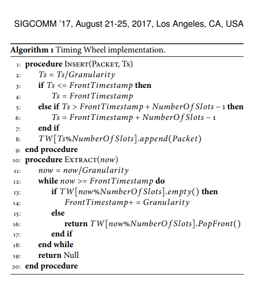

#  TIMELY Algorithm 

```
https://radhikam.web.illinois.edu/timely-code-snippet.cc
https://radhikam.web.illinois.edu/
```

```
/***********************************************************
TIMELY Algorithm to compute new rate
************************************************************/
/* 
It is assumed this function is part of a 'sender' class, which declares the required instance variables and paramaters as detailed below.
It takes as input the current rate at which data is being sent and the current rtt.
It can be invoked when an ack/completion event is received.
It returns the new rate that can be enforced by the 'sender'.
*/

/* Parameters used and their recommended values (these values may need finetuning based on experimental scenario) 
ewma_alpha: recommended value = 0.02
t_low: recommended value = 0 (if using per-packet pacing), 50us (if using per 64KB message pacing)
t_high: recommended value = 1ms
HAI_Thresh: recommended value = 5
additiveIncrement: 10Mbps for 10Gbps line rate
decreaseFactor: 0.8
maxRate = line rate
minRate = optional 
*/

/* Other instance variables used and their initialization
prevRTT_: previous RTT (initialized to 0)
negGradientCount_: negative gradient counter for HAI increase (initialized to 0)
avgRTTDiff_: moving average of the RTT difference (initialized to 0)
minRTT_ = fixed minimum network RTT value
last_update_time_: initialized to 0
*/


double getNewRate(double rtt, double rate) {

  if(prevRTT_ == 0) prevRTT_ = rtt;

  double rtt_diff = rtt - prevRTT_;

  if (rtt_diff < 0) {
    negGradientCount_++;
  } else {
    negGradientCount_ = 0;
  }


  avgRTTDiff_ = ((1 - ewma_alpha) * avgRTTDiff_) + (ewma_alpha * rtt_diff);

  double normalized_gradient = avgRTTDiff_ / minRTT_;

  double delta_factor = (curTime() - last_update_time_) / minRTT_;
  delta_factor = min(delta_factor, 1.0);

  prevRTT_ = rtt;
  last_update_time_ = curTime();
 
  double new_rate;
  if (rtt < t_low) { //additivive increase if rtt < t_low
      new_rate = rate + (additiveIncrement * delta_factor);
  } else {
    if (rtt > t_high) { //multiplicative decrease if rtt > t_high
      new_rate = rate * (1 - (delta_factor * decreaseFactor * (1 - (t_high / rtt))));
    } else {
      if (normalized_gradient <= 0) { //additive increase if avg gradient <= 0 
        int N = 1;
        if (negGradientCount_ >= HAI_thresh) N = 5;
        new_rate = rate + (N * additiveIncrement * delta_factor);
      } else { //multiplicative decrease if avg gradient > 0
        new_rate = rate * (1.0 - (decreaseFactor * normalized_gradient));
      }
   }
 }
 //derease in rate capped by 0.5 times the old rate
 new_rate = max(new_rate, rate * 0.5);
 //enabling max and min cap on the new rate
 new_rate = min(new_rate, maxRate);
 new_rate = max(new_rate, minRate);
 return new_rate;
}
```
# kernel
struct tcp_congestion_ops tcp_bbr_cong_ops   


#  Hashed and hierarchical timing wheels
[B4 Traffic Engineering Optimization 算法 (2013)](https://github.com/chanfung032/chanfung032.github.io/blob/ac3f7ba0f0a1291bd2532e366ac9e5e5fa490d82/src/b4.rst#L8)   
[微秒级 TCP 时间戳](https://zhuanlan.zhihu.com/p/535077633)   
[大历史下的 pacing：why & how](https://zhuanlan.zhihu.com/p/689176163)   
Hashed and hierarchical timing wheels （哈希分层定时轮）是一种高效的数据结构，用于管理大量定时任务，由 George Varghese 和 Tony Lauck 于1996年提出。其核心思想是通过环形数据结构（类似时钟的刻度盘）将时间分割为多个槽位，每个槽位对应特定时间间隔，任务按到期时间被分配到对应槽位。 ‌    
 

#  eRPC timely

[refer to eRPC timely](https://github.com/PickingUpPieces/eRPC/tree/5242f49dadaeb4f9943884e0452b3b33615f731b/src/cc)   

[eRPC-arm](https://github.com/Peter-JanGootzen/eRPC-arm/tree/afbacaccc6dfb8f326d6a6857bc6d9133bb38c17)

[timely and Carousel](https://zhuanlan.zhihu.com/p/693128127)        
     


```
  /**
   * @brief Perform a Timely rate update on receiving the explict CR or response
   * packet for this triggering packet number
   *
   * @param sslot The request sslot for which a packet is received
   * @param pkt_num The received packet's packet number
   * @param Time at which the explicit CR or response packet was received
   */
  inline void update_timely_rate(SSlot *sslot, size_t pkt_num, size_t rx_tsc) {
    size_t rtt_tsc =
        rx_tsc - sslot->client_info_.tx_ts_[pkt_num % kSessionCredits];
    // This might use Timely bypass
    sslot->session_->client_info_.cc_.timely_.update_rate(rx_tsc, rtt_tsc);
  }
```
## docker


```
docker  run -it  --rm  --name erpc  --net=host -u root --cap-add=SYS_PTRACE   --security-opt seccomp=unconfined -v /root/dpdk-stable-19.11.1:/root/dpdk-stable-19.11.1 -v /root/prog:/root/prog -v /mnt/huge:/mnt/huge -v /sys/bus/pci/drivers:/sys/bus/pci/drivers -v /sys/kernel/mm/hugepages:/sys/kernel/mm/hugepages -v /sys/devices/system/node:/sys/devices/system/node -v /dev:/dev --privileged  erpc:2.0 bash
```

## dpdk

```
make install T=arm64-armv8a-linuxapp-gcc  -j 64   EXTRA_CFLAGS="-pie -fPIC -g"   
```

```
[root@centos7 dpdk-stable-19.11.14]# export RTE_TARGET=arm64-armv8a-linuxapp-gcc
[root@centos7 dpdk-stable-19.11.14]# export RTE_SDK=/root/dpdk-stable-19.11.1/
[root@centos7 dpdk-stable-19.11.14]# make install T=arm64-armv8a-linuxapp-gcc  -j 64   EXTRA_CFLAGS="-pie -fPIC -g" 
[root@centos7 arm64-armv8a-linuxapp-gcc]# pwd
/root/dpdk-stable-19.11.14/arm64-armv8a-linuxapp-gcc
[root@centos7 arm64-armv8a-linuxapp-gcc]# make clean -j64
```
设置配置  CONFIG_RTE_FORCE_INTRINSICS=y
或者如下     
```
 vim config/defconfig_arm64-armv8a-linuxapp-gcc
```

```
[root@centos7 helloworld]# export RTE_SDK=/root/dpdk-stable-19.11.1/
[root@centos7 helloworld]# make
  CC main.o
  LD helloworld
  INSTALL-APP helloworld
  INSTALL-MAP helloworld.map
```

### lib dpdk

```
set(LIBRARIES ${LIBRARIES} -Wl,--whole-archive dpdk -Wl,--no-whole-archive numa dl ibverbs mlx4 mlx5)
```

改成

```
set(LIBRARIES ${LIBRARIES}   -Bsymbolic -fPIC  -no-pie  -L/root/dpdk-stable-19.11.1/arm64-armv8a-linuxapp-gcc/lib/ -Wl,--whole-archive  dpdk -Wl,--no-whole-archive numa dl ibverbs mlx4 mlx5)
```

## -march=native for arm64    

删除 -march=native   

## make


### 依赖    
```
apt-get install -y zlib1g-dev
root@centos7:~/prog/eRPC# whereis libz.so.1 
libz.so: /usr/lib/aarch64-linux-gnu/libz.so /usr/lib/aarch64-linux-gnu/libz.so.1
root@centos7:~/prog/eRPC# mkdir -p /usr/lib64/
root@centos7:~/prog/eRPC# ln -sf  /usr/lib/aarch64-linux-gnu/libz.so.1  /usr/lib64/libz.so
```

关闭test，安装gtest gflags   
```
libgflags.so.2.2: cannot open shared object file: No such file or directory
```
```
 fatal error: gflags/gflags.h: No such file or directory
```
```
apt-get install libgflags2.2
apt-get install libgtest-dev
```

+ test

关闭test，-DTESTING=off
```
 cmake . -DTRANSPORT=dpdk -DDPDK_LIB=/root/dpdk-stable-19.11.1/lib  -DDPDK_INCLUDE_DIR=/root/dpdk-stable-19.11.1/arm64-armv8a-linuxapp-gcc/include -DTESTING=off -DLOG_LEVEL=info
```


### 编译选项   

I have tried to add -Wno-address-of-packed-member to CMAKE_CXX_FLAGS by modifying file CMakeLists.txt:

```


+ Add additional compilation flags only after adding subprojects
```

```
set(CMAKE_CXX_FLAGS "${CMAKE_CXX_FLAGS} -std=c++11 -march=native -Wall -Wextra -Werror -pedantic")
set(CMAKE_CXX_FLAGS "${CMAKE_CXX_FLAGS} -Wsign-conversion -Wold-style-cast -Wno-unused-function")
set(CMAKE_CXX_FLAGS "${CMAKE_CXX_FLAGS} -Wno-nested-anon-types -Wno-keyword-macro -Wno-deprecated-declarations")
```
+ add this line

```
set(CMAKE_CXX_FLAGS "${CMAKE_CXX_FLAGS} -Wno-address-of-packed-member")
```


 
+ DRTE_FORCE_INTRINSICS
```
set(CMAKE_CXX_FLAGS "${CMAKE_CXX_FLAGS} -Wno-address-of-packed-member -Wno-sign-conversion")
#set(CMAKE_CXX_FLAGS "${CMAKE_CXX_FLAGS} -DCONFIG_RTE_FORCE_INTRINSICS")
set(CMAKE_CXX_FLAGS "${CMAKE_CXX_FLAGS} -DRTE_FORCE_INTRINSICS")
 ```


```
/usr/bin/ld: ../build/libdpdk/librte_bus_dpaa.a(process.o): relocation R_AARCH64_ADR_PREL_PG_HI21 against symbol `stderr@@GLIBC_2.17' which may bind externally can not be used when making a shared object; recompile with -fPIC
```

加上 -no-pie


### x86 and arm64 


```
#ifdef __x86_64__


#elif defined(__aarch64__)
```

### cmake编译

```
root@centos7:~/prog/eRPC# cmake --version
cmake version 3.30.0-rc4

CMake suite maintained and supported by Kitware (kitware.com/cmake).
root@centos7:~/prog/eRPC# 
```

```
 cmake . -DTRANSPORT=dpdk -DDPDK_LIB=/root/dpdk-stable-19.11.1/lib  -DDPDK_INCLUDE_DIR=/root/dpdk-stable-19.11.1/arm64-armv8a-linuxapp-gcc/include -DTESTING=off -DLOG_LEVEL=info
```

 


## run

```
 cat /proc/meminfo  | grep -i huge
AnonHugePages:         0 kB
ShmemHugePages:        0 kB
HugePages_Total:     256
HugePages_Free:      252
HugePages_Rsvd:        0
HugePages_Surp:        0
Hugepagesize:     524288 kB
```

RTE_MEMZONE_2MB改为RTE_MEMZONE_512MB   
```
  const std::string memzone_name = erpc::DpdkTransport::get_memzone_name();
  const rte_memzone *memzone = rte_memzone_reserve(
      memzone_name.c_str(), sizeof(erpc::DpdkTransport::ownership_memzone_t),
      FLAGS_numa_node, RTE_MEMZONE_512MB);
  //FLAGS_numa_node, RTE_MEMZONE_2MB);
```


```
mount -t hugetlbfs nodev /mnt/huge
```

```
 docker  run -it   --net=host --cap-add=NET_ADMIN --privileged=true  -v /root/dpdk-stable-19.11.1:/root/dpdk-stable-19.11.1 -v /root/prog:/root/prog -v /mnt/huge:/mnt/huge  e-rpc bash
```

```
export LD_LIBRARY_PATH=$LD_LIBRARY_PATH:/root/dpdk-stable-19.11.1/arm64-armv8a-linuxapp-gcc/lib/
root@centos7:~/prog/eRPC# ./build/erpc_dpdk_daemon 
81:539967 WARNG: eRPC DPDK daemon: Managing DPDK port 0 on NUMA node 0
82:581482 WARNG: eRPC DPDK daemon: Successfully initialized DPDK EAL
82:581518 WARNG: eRPC DPDK daemon: Successfully initialized shared memzone erpc_daemon_memzone
82:903531 WARNG: eRPC DPDK daemon: Successfully initialized DPDK port 0

```

## hello_world


```
 ln -sf /root/dpdk-stable-19.11.1/arm64-armv8a-linuxapp-gcc/include /usr/include/dpdk
 
 ln -sf /root/dpdk-stable-19.11.1/arm64-armv8a-linuxapp-gcc/lib/  /root/prog/eRPC/build/libdpdk
```

```
root@centos7:~/prog/eRPC/hello_world# ls
Makefile  client  client.cc  common.h  server  server.cc
root@centos7:~/prog/eRPC/hello_world# ls ../build/
erpc_dpdk_daemon  latency  libdpdk  liberpc.a
root@centos7:~/prog/eRPC/hello_world# 
```

```
ip n add 192.168.16.251   dev enahisic2i2 lladdr 44:a1:91:a4:9c:0c
iperf  -u -c 192.168.16.251 -p 31850 -i 1 -t 600 -b 10G
```

# hugepage size_t

```
#define HUGE_PAGESIZE (1 << 29)
```


```
#define HUGE_PAGESIZE (1 << 29)
void free_names(char **dir_names)
{
    int i;
    for (i = 0; dir_names[i] != NULL; ++i)
        free(dir_names[i]);
    free(dir_names);
}
void test_mbind()
{
    int shm_key, shm_id, ret;
    const unsigned long nodemask = (1ul << (unsigned long)0);
    shm_key = 99999999;
    unsigned int size = SIZE;
    //size = (size + HUGE_PAGESIZE) & ~(HUGE_PAGESIZE - 1);
    shm_id = shmget(shm_key, size, IPC_CREAT | IPC_EXCL | 0666 | SHM_HUGETLB);
    char *shm_buf = (char *)shmat(shm_id, NULL, 0);
    shmctl(shm_id, IPC_RMID, NULL);
    ret = mbind(shm_buf, size, MPOL_BIND, &nodemask, 2, 0);
    if (0 != ret )
       printf("hugeAlloc: mbind() failed. Key %d \n" ,shm_key);
}
```
发生如下错误

```
hugeAlloc: mbind() failed. Key 99999999
```
添加如下代码解决

```
size = (size + HUGE_PAGESIZE) & ~(HUGE_PAGESIZE - 1);
```

参考如下    
```
static void *huge_malloc(BLASLONG size){
  int shmid;
  void *address;

#ifndef SHM_HUGETLB
#define SHM_HUGETLB 04000
#endif

  if ((shmid =shmget(IPC_PRIVATE,
		     (size + HUGE_PAGESIZE) & ~(HUGE_PAGESIZE - 1),
		     SHM_HUGETLB | IPC_CREAT |0600)) < 0) {
    printf( "Memory allocation failed(shmget).\n");
    exit(1);
  }

  address = shmat(shmid, NULL, SHM_RND);

  if ((BLASLONG)address == -1){
    printf( "Memory allocation failed(shmat).\n");
    exit(1);
  }

  shmctl(shmid, IPC_RMID, 0);

  return address;
}
```
