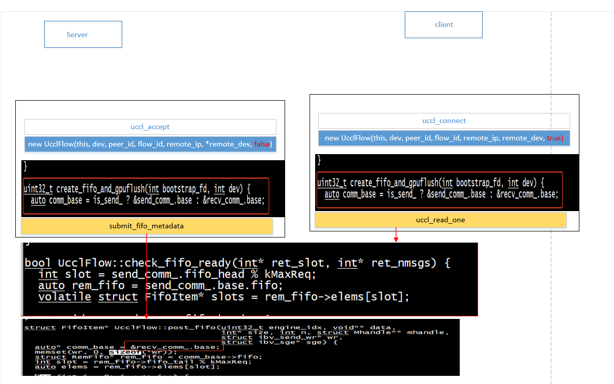
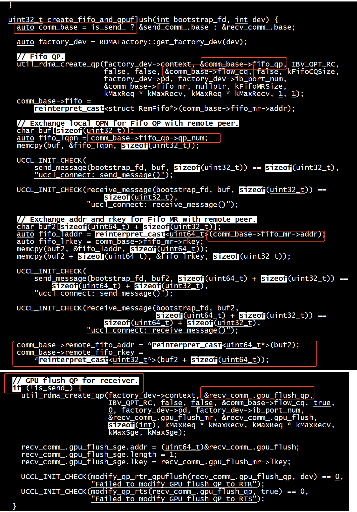

# rc mode test

[refer to steven4354/uccl ](https://github.com/steven4354/uccl/tree/main)    

+ mode   
```
UCCL_PARAM(RCMode, "RCMODE", true);
```

+  my functions


```
  int submit_fifo_metadata(UcclFlow* flow, struct Mhandle** mhandles,
                                        void const* data, size_t size, struct ucclRequest* ureq) ;

  int uccl_read_one(UcclFlow* flow, Mhandle* local_mh, void* dst, size_t size,ucclRequest* ureq);
```

+  server

```
./fifo_test --logtostderr   --server=true  --perftype=basic --iterations=8
I0805 02:32:54.883514 2926644 rdma_io.cc:39] Using OOB interface eno8303 with IP 172.22.116.221 for connection setup
I0805 02:32:54.883551 2926644 rdma_io.cc:44] UCCL_IB_HCA: 
I0805 02:32:54.883556 2926644 rdma_io.cc:47] NCCL_IB_HCA: 
I0805 02:32:54.907301 2926644 rdma_io.cc:178] Found IB device #0 :mlx5_1 with port 1 / 1
P2P listening on port 36789
Server accepted connection from 172.22.116.220 
prepare_fifo_metadata successfully 

```


+ client

```
./fifo_test --logtostderr   --serverip=10.22.116.221 --perftype=basic --iterations=8
I0805 02:34:10.891502 3709027 rdma_io.cc:39] Using OOB interface eno8303 with IP 172.22.116.220 for connection setup
I0805 02:34:10.891547 3709027 rdma_io.cc:44] UCCL_IB_HCA: 
I0805 02:34:10.891551 3709027 rdma_io.cc:47] NCCL_IB_HCA: 
I0805 02:34:10.918715 3709027 rdma_io.cc:178] Found IB device #0 :mlx5_1 with port 1 / 1
P2P listening on port 33705
Client connecting to 172.22.116.221:36789 
Client connected to 172.22.116.221:36789 
buf data : AAAAAAAAAAAAAAAAAAAAAAAAAAAAAAAAAAAAAAAAAAAAAAAAAAAAAAAAAAAAAAA 
check fifo ready for read one 
check fifo ready for read one 
fifo ready for read one 
recv data : BBBBBBBBBBBBBBBBBBBBBBBBBBBBBBBBBBBBBBBBBBBBBBBBBBBBBBBBBBBBBBB 
```

## bug


```
./fifo_test --logtostderr   --serverip=10.22.116.221 --perftype=basic --iterations=8
I0805 07:30:53.785843 3710227 rdma_io.cc:39] Using OOB interface eno8303 with IP 172.22.116.220 for connection setup
I0805 07:30:53.785882 3710227 rdma_io.cc:44] UCCL_IB_HCA: 
I0805 07:30:53.785885 3710227 rdma_io.cc:47] NCCL_IB_HCA: 
I0805 07:30:53.810542 3710227 rdma_io.cc:178] Found IB device #0 :mlx5_1 with port 1 / 1
P2P listening on port 44243
Client connecting to 172.22.116.221:41775 
Client connected to 172.22.116.221:41775 
buf data : AAAAAAAAAAAAAAAAAAAAAAAAAAAAAAAAAAAAAAAAAAAAAAAAAAAAAAAAAAAAAAA 
check fifo ready for read one 
check fifo ready for read one 
fifo ready for read one 
F0805 07:30:55.292340 3710231 rdma_io.cc:646] Check failed: false data path CQ state error: 2 from QP:16939
*** Check failure stack trace: ***
    @     0x7fd9d352eb03  google::LogMessage::Fail()
    @     0x7fd9d35369d1  google::LogMessage::SendToLog()
    @     0x7fd9d352e7c2  google::LogMessage::Flush()
    @     0x7fd9d353078f  google::LogMessageFatal::~LogMessageFatal()
    @     0x55d0b5ca6d91  uccl::SharedIOContext::_uc_poll_send_cq_ex()
    @     0x55d0b5cae69c  uccl::UcclRDMAEngine::uc_handle_completion()
    @     0x55d0b5cbf9da  uccl::UcclRDMAEngine::run()
    @     0x7fd9d3382253  (unknown)
    @     0x7fd9d3008ac3  (unknown)
    @     0x7fd9d309a850  (unknown)
    @              (nil)  (unknown)
Aborted (core dumped)
```

这是因为RCMODE不等于true     
```
UCCL_PARAM(RCMode, "RCMODE", true);
```

# send recv test


+  handle_tx_work   

1） handle_tx_work 调用jring_sc_dequeue_bulk   
2） 调用tx_message    

```
void UcclRDMAEngine::handle_tx_work(void) {
  Channel::Msg tx_work;
  int budget;
  uint32_t bytes = 0;

  budget = pending_tx_works_.size();
  while (!pending_tx_works_.empty() && budget--) {
    auto it = pending_tx_works_.front();
    pending_tx_works_.pop_front();
    auto rdma_ctx = it.first;
    auto ureq = it.second;
    if (!ureq) {
      UCCL_LOG_ERROR << "Null ureq in tx work\n";
      continue;
    }
    UCCL_LOG_ENGINE << "Process tx work.";
    if (!rdma_ctx->tx_message(ureq)) {
      pending_tx_works_.push_back(std::make_pair(rdma_ctx, ureq));
    }
  }

  budget = kMaxTxWork;
  while (budget--) {
    if (jring_sc_dequeue_bulk(channel_->tx_cmdq_, &tx_work, 1, nullptr) == 0)
      break;
    // Make data written by the app thread visible to the engine.
    std::ignore = std::atomic_load_explicit(&tx_work.poll_ctx->fence,
                                            std::memory_order_relaxed);
    std::atomic_thread_fence(std::memory_order_acquire);

    auto peer_id = tx_work.peer_id;
    auto it = rdma_ctx_map_.find(peer_id);
    DCHECK(it != rdma_ctx_map_.end());
    auto rdma_ctx = it->second;

    UCCL_LOG_ENGINE << "Process tx work.";
    if (!rdma_ctx->tx_message(tx_work.ureq)) {
      // Push the message to the pending transmit queue.
      pending_tx_works_.push_back(std::make_pair(rdma_ctx, tx_work.ureq));
    }

    bytes += tx_work.ureq->send.data_len;

    if (bytes >= kMaxTxBytesThres) break;
  }
}
```


```
  bool tx_message(struct ucclRequest* ureq) {
    if constexpr (kReceiverCCA != RECEIVER_CCA_NONE) {
      return receiverCC_tx_message(ureq);
    } else {
      if (ureq->type == ReqRead) return senderCC_tx_read(ureq);
      return senderCC_tx_message(ureq);
    }
  }
```

+ receiverCC_tx_message 从wr_ex_pool_->alloc_buff(&wr_addr)分配wr（opcode =IBV_WR_RDMA_WRITE_WITH_IMM）， 不重新设置wr->opcode      
+ senderCC_tx_read从wr_ex_pool_->alloc_buff(&wr_addr)分配wr， 设置wr->opcode = IBV_WR_RDMA_READ;       
+ senderCC_tx_message从wr_ex_pool_->alloc_buff(&wr_addr)分配wr(opcode =IBV_WR_RDMA_WRITE_WITH_IMM)， 不重新设置wr->opcode            


+ 发送端执行拥塞控制kSenderCCA = SENDER_CCA_TIMELY，采用senderCC_tx_message      
```
static constexpr enum SenderCCA kSenderCCA = SENDER_CCA_TIMELY;
static constexpr enum ReceiverCCA kReceiverCCA = RECEIVER_CCA_NONE;
```

```
(gdb) bt
#0  uccl::RDMAContext::senderCC_tx_message (this=0x7fffd8000e20, ureq=0x7fffffffe180) at transport.cc:2222
#1  0x000055555557a3a5 in uccl::RDMAContext::tx_message (ureq=0x7fffffffe180, this=0x7fffd8000e20) at /root/rdma-bench/steven_uccl/rdma/transport.h:432
#2  uccl::UcclRDMAEngine::handle_tx_work (this=0x555555606150) at transport.cc:400
#3  0x000055555557e9fd in uccl::UcclRDMAEngine::run (this=0x555555606150) at transport.cc:454
#4  0x00007ffff7dda253 in ?? () from /lib/x86_64-linux-gnu/libstdc++.so.6
#5  0x00007ffff7a60ac3 in start_thread (arg=<optimized out>) at ./nptl/pthread_create.c:442
#6  0x00007ffff7af2850 in clone3 () at ../sysdeps/unix/sysv/linux/x86_64/clone3.S:81
```

```
class WrExBuffPool : public BuffPool {
  static constexpr size_t kWrSize = sizeof(struct wr_ex);
  static constexpr uint32_t kNumWr = 4096;
  static_assert((kNumWr & (kNumWr - 1)) == 0, "kNumWr must be power of 2");

 public:
  WrExBuffPool()
      : BuffPool(kNumWr, kWrSize, nullptr, [](uint64_t buff) {
          struct wr_ex* wr_ex = reinterpret_cast<struct wr_ex*>(buff);
          auto wr = &wr_ex->wr;
          wr->sg_list = &wr_ex->sge;
          wr->num_sge = 1;
          wr->next = nullptr;
          wr->opcode = IBV_WR_RDMA_WRITE_WITH_IMM;
          wr->wr_id = 0;
        }) {}

  ~WrExBuffPool() = default;
};
```

```
std::optional<WrExBuffPool> wr_ex_pool_
```


## test


+ server    
```
./send_recv_test --logtostderr   --server=true  --perftype=basic --iterations=8
I0805 07:40:25.748010 2927796 rdma_io.cc:39] Using OOB interface eno8303 with IP 172.22.116.221 for connection setup
I0805 07:40:25.748049 2927796 rdma_io.cc:44] UCCL_IB_HCA: 
I0805 07:40:25.748054 2927796 rdma_io.cc:47] NCCL_IB_HCA: 
I0805 07:40:25.775367 2927796 rdma_io.cc:178] Found IB device #0 :mlx5_1 with port 1 / 1
P2P listening on port 37667
Server accepted connection from 172.22.116.220 
buf data : BBBBBBBBBBBBBBBBBBBBBBBBBBBBBBBBBBBBBBBBBBBBBBBBBBBBBBBBBBBBBBB 
submit_fifo_metadata successfully 
recv buf data : AAAAAAAAAAAAAAAAAAAAAAAAAAAAAAAAAAAAAAAAAAAAAAAAAAAAAAAAAAAAAAA 
```

+ client    

```
./send_recv_test --logtostderr   --serverip=10.22.116.221 --perftype=basic --iterations=8
I0805 07:40:31.346652 3710375 rdma_io.cc:39] Using OOB interface eno8303 with IP 172.22.116.220 for connection setup
I0805 07:40:31.346693 3710375 rdma_io.cc:44] UCCL_IB_HCA: 
I0805 07:40:31.346696 3710375 rdma_io.cc:47] NCCL_IB_HCA: 
I0805 07:40:31.370590 3710375 rdma_io.cc:178] Found IB device #0 :mlx5_1 with port 1 / 1
P2P listening on port 42459
Client connecting to 172.22.116.221:37667 
Client connected to 172.22.116.221:37667 
send buf data : AAAAAAAAAAAAAAAAAAAAAAAAAAAAAAAAAAAAAAAAAAAAAAAAAAAAAAAAAAAAAAA 
```


## IBV_QPT_UD  ctrl_qp_ 发送 ack    


+ server     
try_post_acks
```
(gdb) set args --logtostderr   --server=true  --perftype=basic --iterations=8
(gdb) b flush_acks
Breakpoint 1 at 0x11a20: file rdma_io.cc, line 440.
(gdb) 
```

```
(gdb) bt
#0  uccl::SharedIOContext::flush_acks (this=0x5555556052f0) at rdma_io.cc:440
#1  0x000055555558143c in uccl::RDMAContext::uc_rx_chunk (this=this@entry=0x7fffd8000e20, cq_ex=cq_ex@entry=0x5555556ca980) at transport.cc:3616
#2  0x000055555556984f in uccl::SharedIOContext::_uc_poll_recv_cq_ex (this=this@entry=0x5555556052f0) at rdma_io.cc:690
#3  0x000055555556d6cd in uccl::SharedIOContext::uc_poll_recv_cq (this=0x5555556052f0) at /root/rdma-bench/steven_uccl/rdma/rdma_io.h:822
#4  uccl::UcclRDMAEngine::uc_handle_completion (this=this@entry=0x555555605150) at transport.cc:223
#5  0x000055555557e9fa in uccl::UcclRDMAEngine::handle_completion (this=0x555555605150) at /root/rdma-bench/steven_uccl/rdma/transport.h:792
```


+  client    

```
(gdb) set args  --logtostderr   --serverip=10.22.116.221 --perftype=basic --iterations=8
(gdb) b _poll_ctrl_cq_ex
Breakpoint 1 at 0x16090: file rdma_io.cc, line 456
```
```
#0  uccl::SharedIOContext::_poll_ctrl_cq_ex (this=this@entry=0x5555556062f0) at rdma_io.cc:456
#1  0x000055555556d6a5 in uccl::SharedIOContext::poll_ctrl_cq (this=0x5555556062f0) at /root/rdma-bench/steven_uccl/rdma/rdma_io.h:816
#2  uccl::UcclRDMAEngine::uc_handle_completion (this=this@entry=0x555555606150) at transport.cc:212
#3  0x000055555557ea1a in uccl::UcclRDMAEngine::handle_completion (this=0x555555606150) at /root/rdma-bench/steven_uccl/rdma/transport.h:792
```