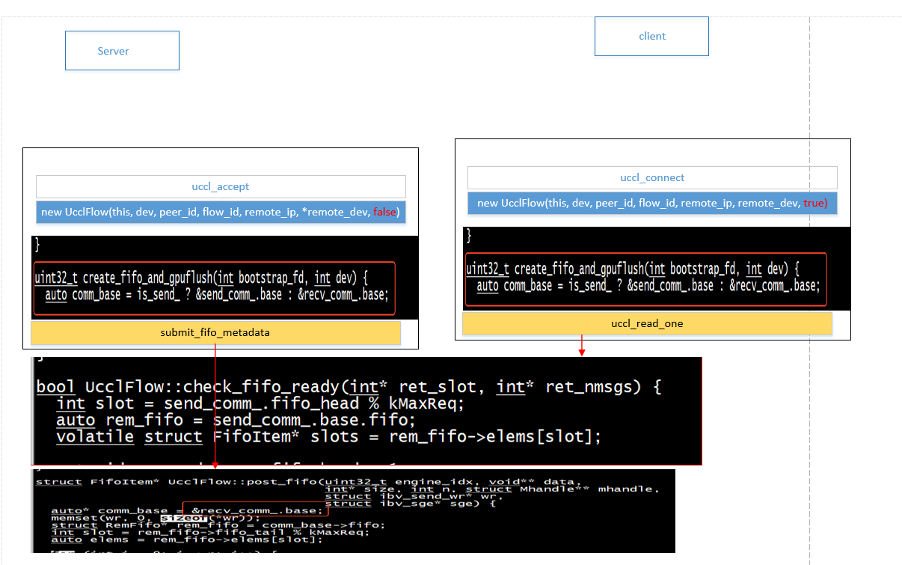
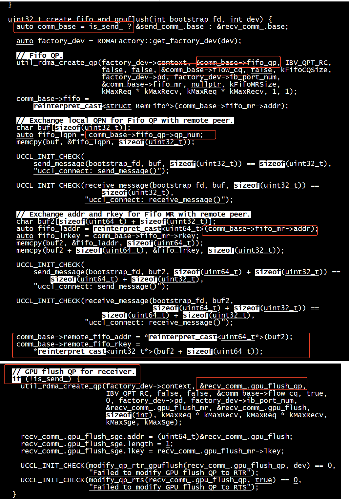

# rc mode

```
UCCL_PARAM(RCMode, "RCMODE", true);
```

+  server

```
./fifo_test --logtostderr   --server=true  --perftype=basic --iterations=8
I0805 02:32:54.883514 2926644 rdma_io.cc:39] Using OOB interface eno8303 with IP 172.22.116.221 for connection setup
I0805 02:32:54.883551 2926644 rdma_io.cc:44] UCCL_IB_HCA: 
I0805 02:32:54.883556 2926644 rdma_io.cc:47] NCCL_IB_HCA: 
I0805 02:32:54.907301 2926644 rdma_io.cc:178] Found IB device #0 :mlx5_1 with port 1 / 1
P2P listening on port 36789
Server accepted connection from 172.22.116.220 
prepare_fifo_metadata successfully 

```


+ client

```
./fifo_test --logtostderr   --serverip=10.22.116.221 --perftype=basic --iterations=8
I0805 02:34:10.891502 3709027 rdma_io.cc:39] Using OOB interface eno8303 with IP 172.22.116.220 for connection setup
I0805 02:34:10.891547 3709027 rdma_io.cc:44] UCCL_IB_HCA: 
I0805 02:34:10.891551 3709027 rdma_io.cc:47] NCCL_IB_HCA: 
I0805 02:34:10.918715 3709027 rdma_io.cc:178] Found IB device #0 :mlx5_1 with port 1 / 1
P2P listening on port 33705
Client connecting to 172.22.116.221:36789 
Client connected to 172.22.116.221:36789 
buf data : AAAAAAAAAAAAAAAAAAAAAAAAAAAAAAAAAAAAAAAAAAAAAAAAAAAAAAAAAAAAAAA 
check fifo ready for read one 
check fifo ready for read one 
fifo ready for read one 
recv data : BBBBBBBBBBBBBBBBBBBBBBBBBBBBBBBBBBBBBBBBBBBBBBBBBBBBBBBBBBBBBBB 
```