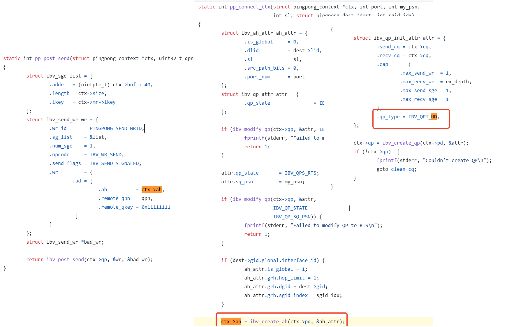
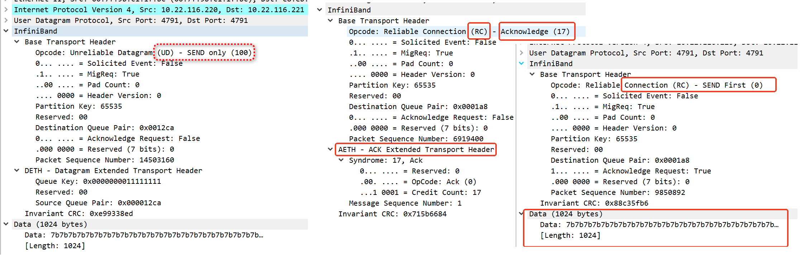

 
在数据报类型的 QP 的 Context 中，不包含对端信息，即每个 QP 不跟另一个 QP 绑定。QP 下发给硬件的每个 WQE 都可能指向不同的目的地。

+ ud  remote_qpn   
```
	struct ibv_send_wr wr = {
		.wr_id	    = PINGPONG_SEND_WRID,
		.sg_list    = &list,
		.num_sge    = 1,
		.opcode     = IBV_WR_SEND,
		.send_flags = ctx->send_flags,
		.wr         = {
			.ud = {
				 .ah          = ctx->ah,
				 .remote_qpn  = qpn,
				 .remote_qkey = 0x11111111
			 }
		}
	};
```

+   rc  dest_qp_num   

```
	struct ibv_qp_attr attr = {
		.qp_state		= IBV_QPS_RTR,
		.path_mtu		= mtu,
		.dest_qp_num		= dest->qpn,
		.rq_psn			= dest->psn,
		.max_dest_rd_atomic	= 1,
		.min_rnr_timer		= 12,
		.ah_attr		= {
			.is_global	= 0,
			.dlid		= dest->lid,
			.sl		= sl,
			.src_path_bits	= 0,
			.port_num	= port
		}
	};
```

# mtu of ud   

RDMA UD (Unreliable Datagram) mode support Send/Recv operation only, and with the limit that only one packet can be sent with a send wr, which causes that the transfered message's size should less than MTU at a time.     


```
ibv_devinfo -d mlx5_1
hca_id: mlx5_1
        transport:                      InfiniBand (0)
        fw_ver:                         22.36.1010
        node_guid:                      c470:bd03:00aa:1f09
        sys_image_guid:                 c470:bd03:00aa:1f08
        vendor_id:                      0x02c9
        vendor_part_id:                 4125
        hw_ver:                         0x0
        board_id:                       MT_0000000359
        phys_port_cnt:                  1
                port:   1
                        state:                  PORT_ACTIVE (4)
                        max_mtu:                4096 (5)
                        active_mtu:             1024 (3)
                        sm_lid:                 0
                        port_lid:               0
                        port_lmc:               0x00
                        link_layer:             Ethernet
```

```
ibv_ud_pingpong -d  mlx5_1 -g 3 -s 4096 10.22.116.221
Requested size larger than port MTU (1024)
```
网卡mtu

```
enp61s0f1np1: <BROADCAST,MULTICAST,UP,LOWER_UP> mtu 1500 qdisc mq state UP group default qlen 1000
```

## 更改网卡mtu

```
ifconfig enp61s0f1np1 mtu 4200
```

# rc mtu
ibv_rc_pingpong -s 4096 没有问题    

+ 网卡mtu  = 1500    

```
enp61s0f1np1: <BROADCAST,MULTICAST,UP,LOWER_UP> mtu 1500 qdisc mq state UP group default qlen 1000
```

```
max_mtu:                4096 (5)
                        active_mtu:             1024 (3)
```

```
ibv_rc_pingpong -d  mlx5_1 -g 3 -s 4096 10.22.116.221
  local address:  LID 0x0000, QPN 0x0001a9, PSN 0x1c998a, GID ::ffff:10.22.116.220
  remote address: LID 0x0000, QPN 0x0001a9, PSN 0x6c344d, GID ::ffff:10.22.116.221
8192000 bytes in 0.01 seconds = 9706.16 Mbit/sec
1000 iters in 0.01 seconds = 6.75 usec/iter
```