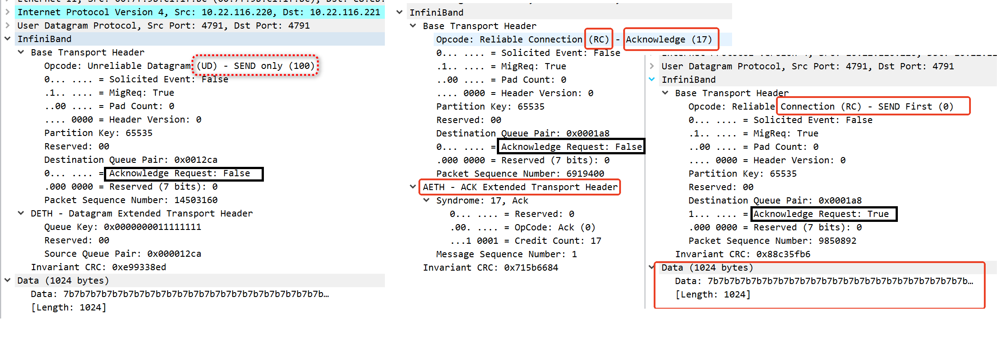

 
在数据报类型的 QP 的 Context 中，不包含对端信息，即每个 QP 不跟另一个 QP 绑定。QP 下发给硬件的每个 WQE 都可能指向不同的目的地。

+ ud  remote_qpn   
```
	struct ibv_send_wr wr = {
		.wr_id	    = PINGPONG_SEND_WRID,
		.sg_list    = &list,
		.num_sge    = 1,
		.opcode     = IBV_WR_SEND,
		.send_flags = ctx->send_flags,
		.wr         = {
			.ud = {
				 .ah          = ctx->ah,
				 .remote_qpn  = qpn,
				 .remote_qkey = 0x11111111
			 }
		}
	};
```

+   rc  dest_qp_num   

```
	struct ibv_qp_attr attr = {
		.qp_state		= IBV_QPS_RTR,
		.path_mtu		= mtu,
		.dest_qp_num		= dest->qpn,
		.rq_psn			= dest->psn,
		.max_dest_rd_atomic	= 1,
		.min_rnr_timer		= 12,
		.ah_attr		= {
			.is_global	= 0,
			.dlid		= dest->lid,
			.sl		= sl,
			.src_path_bits	= 0,
			.port_num	= port
		}
	};
```


# Choice of QP types
With no experience with DCT, we focus our discussion on choice between RC (Reliable Connection) and UD (Unreliable Datagram). Compared to RC, UD has less overhead hence has better raw performance. However, the performance improvement provided by using UD instead of RC is minimal compared to choose UDP over TCP. It is because the RDMA protocol processing is mostly in hardware, while TCP/UDP uses kernel software. The main advantage of using UD is that a single QP can used to talk to any other QPs, while using RC, one needs to create as many QPs as the number of communication peers. However, with the introduction of DCT, QP scalability problem can be well addressed.   

There are a few constrains when using UD:   

Maximum message size is limited by MTU. Modern RDMA compatible NICs supports MTU of size 2KB to 4KB, which means message of size larger than 4KB needs to be broken down into smaller pieces at the sender and re-assembled at the receiver. It simply requires more programming effort.   

Each message sent using UD has a Global Routing Header `(GRH，ibv_grh)` of 40B long. Even if your message is of size 8B, the total amount of data needs to be sent is at least 48B.    

Out-of-order message delivery. Different from RC, the message order is not guaranteed. In case where message order is important, programmers need to keep track of the message order by themselves.   

Unreliable message delivery. Although in today's datacenter environment, package drop is rare, unless applications allow message drops, tracking message delivery and re-transmission scheme all need to be implemented using software.    
 
In my opinion, unless the application allows message drops, does not care about the order of message delivery and always has message size less than the MTU, using UD requires re-implement existing hardware logic (used for RC QP) in software, which leads to more programming effort and potentially worse performance.   


```
numactl -C 24,26,27,28,30,32,34,36  ib_send_bw -d mlx5_1  -x 3 -c UD --qp=1 --report_gbits -s 6144 -m 4096     -a  -F
numactl -C 24,26,27,28,30,32,34,36  ib_send_bw -d mlx5_1  -x 3 -c UD --qp=1 --report_gbits -s 6144 -m 4096     -a  -F 10.22.116.221
```

# struct ibv_grh
[UD模式](https://www.ctyun.cn/developer/article/664125654634565)   
`ibv_create_ah`   
`struct ibv_grh`   
`ibv_query_gid` 
`IBV_QPT`  
```
static inline int get_grh_header_version(struct ibv_grh *grh)
{
	int ip6h_version = (be32toh(grh->version_tclass_flow) >> 28) & 0xf;
	struct iphdr *ip4h = (struct iphdr *)((void *)grh + 20);
	struct iphdr ip4h_checked;
}
``` 

```
show_gids
DEV     PORT    INDEX   GID                                     IPv4            VER     DEV
---     ----    -----   ---                                     ------------    ---     ---
mlx5_0  1       0       fe80:0000:0000:0000:c670:bdff:feaa:1fc8                 v1      enp61s0f0np0
mlx5_0  1       1       fe80:0000:0000:0000:c670:bdff:feaa:1fc8                 v2      enp61s0f0np0
mlx5_1  1       0       fe80:0000:0000:0000:c670:bdff:feaa:1fc9                 v1      enp61s0f1np1
mlx5_1  1       1       fe80:0000:0000:0000:c670:bdff:feaa:1fc9                 v2      enp61s0f1np1
mlx5_1  1       2       0000:0000:0000:0000:0000:ffff:0a16:74dd 10.22.116.221   v1      enp61s0f1np1
mlx5_1  1       3       0000:0000:0000:0000:0000:ffff:0a16:74dd 10.22.116.221   v2      enp61s0f1np1
mlx5_1  1       4       0000:0000:0000:0000:0000:ffff:0a16:74de 10.22.116.222   v1      enp61s0f1np1
mlx5_1  1       5       0000:0000:0000:0000:0000:ffff:0a16:74de 10.22.116.222   v2      enp61s0f1np1
mlx5_1  1       6       0000:0000:0000:0000:0000:ffff:0a16:74df 10.22.116.223   v1      enp61s0f1np1
mlx5_1  1       7       0000:0000:0000:0000:0000:ffff:0a16:74df 10.22.116.223   v2      enp61s0f1np1
n_gids_found=10
```

```
#define IB_OPCODE(transport, op) \
	IB_OPCODE_ ## transport ## _ ## op = \
		IB_OPCODE_ ## transport + IB_OPCODE_ ## op

enum {
	/* transport types -- just used to define real constants */
	IB_OPCODE_RC                                = 0x00,
	IB_OPCODE_UC                                = 0x20,
	IB_OPCODE_RD                                = 0x40,
	IB_OPCODE_UD                                = 0x60,
	/* per IBTA 1.3 vol 1 Table 38, A10.3.2 */
	IB_OPCODE_CNP                               = 0x80,
	/* Manufacturer specific */
	IB_OPCODE_MSP                               = 0xe0,

	/* operations -- just used to define real constants */
	IB_OPCODE_SEND_FIRST                        = 0x00,
	IB_OPCODE_SEND_MIDDLE                       = 0x01,
	IB_OPCODE_SEND_LAST                         = 0x02,
	IB_OPCODE_SEND_LAST_WITH_IMMEDIATE          = 0x03,
	IB_OPCODE_SEND_ONLY                         = 0x04,
	IB_OPCODE_SEND_ONLY_WITH_IMMEDIATE          = 0x05,
	IB_OPCODE_RDMA_WRITE_FIRST                  = 0x06,
	IB_OPCODE_RDMA_WRITE_MIDDLE                 = 0x07,
	IB_OPCODE_RDMA_WRITE_LAST                   = 0x08,
	IB_OPCODE_RDMA_WRITE_LAST_WITH_IMMEDIATE    = 0x09,
	IB_OPCODE_RDMA_WRITE_ONLY                   = 0x0a,
	IB_OPCODE_RDMA_WRITE_ONLY_WITH_IMMEDIATE    = 0x0b,
	IB_OPCODE_RDMA_READ_REQUEST                 = 0x0c,
	IB_OPCODE_RDMA_READ_RESPONSE_FIRST          = 0x0d,
	IB_OPCODE_RDMA_READ_RESPONSE_MIDDLE         = 0x0e,
	IB_OPCODE_RDMA_READ_RESPONSE_LAST           = 0x0f,
	IB_OPCODE_RDMA_READ_RESPONSE_ONLY           = 0x10,
	IB_OPCODE_ACKNOWLEDGE                       = 0x11,
	IB_OPCODE_ATOMIC_ACKNOWLEDGE                = 0x12,
	IB_OPCODE_COMPARE_SWAP                      = 0x13,
	IB_OPCODE_FETCH_ADD                         = 0x14,
	/* opcode 0x15 is reserved */
	IB_OPCODE_SEND_LAST_WITH_INVALIDATE         = 0x16,
	IB_OPCODE_SEND_ONLY_WITH_INVALIDATE         = 0x17,
	IB_OPCODE_FLUSH                             = 0x1C,
	IB_OPCODE_ATOMIC_WRITE                      = 0x1D,

	/* real constants follow -- see comment about above IB_OPCODE()
	   macro for more details */

	/* RC */
	IB_OPCODE(RC, SEND_FIRST),
	IB_OPCODE(RC, SEND_MIDDLE),
	IB_OPCODE(RC, SEND_LAST),
	IB_OPCODE(RC, SEND_LAST_WITH_IMMEDIATE),
	IB_OPCODE(RC, SEND_ONLY),
	IB_OPCODE(RC, SEND_ONLY_WITH_IMMEDIATE),
	IB_OPCODE(RC, RDMA_WRITE_FIRST),
	IB_OPCODE(RC, RDMA_WRITE_MIDDLE),
	IB_OPCODE(RC, RDMA_WRITE_LAST),
	IB_OPCODE(RC, RDMA_WRITE_LAST_WITH_IMMEDIATE),
	IB_OPCODE(RC, RDMA_WRITE_ONLY),
	IB_OPCODE(RC, RDMA_WRITE_ONLY_WITH_IMMEDIATE),
	IB_OPCODE(RC, RDMA_READ_REQUEST),
	IB_OPCODE(RC, RDMA_READ_RESPONSE_FIRST),
	IB_OPCODE(RC, RDMA_READ_RESPONSE_MIDDLE),
	IB_OPCODE(RC, RDMA_READ_RESPONSE_LAST),
	IB_OPCODE(RC, RDMA_READ_RESPONSE_ONLY),
	IB_OPCODE(RC, ACKNOWLEDGE),
	IB_OPCODE(RC, ATOMIC_ACKNOWLEDGE),
	IB_OPCODE(RC, COMPARE_SWAP),
	IB_OPCODE(RC, FETCH_ADD),
	IB_OPCODE(RC, SEND_LAST_WITH_INVALIDATE),
	IB_OPCODE(RC, SEND_ONLY_WITH_INVALIDATE),
	IB_OPCODE(RC, FLUSH),
	IB_OPCODE(RC, ATOMIC_WRITE),

	/* UC */
	IB_OPCODE(UC, SEND_FIRST),
	IB_OPCODE(UC, SEND_MIDDLE),
	IB_OPCODE(UC, SEND_LAST),
	IB_OPCODE(UC, SEND_LAST_WITH_IMMEDIATE),
	IB_OPCODE(UC, SEND_ONLY),
	IB_OPCODE(UC, SEND_ONLY_WITH_IMMEDIATE),
	IB_OPCODE(UC, RDMA_WRITE_FIRST),
	IB_OPCODE(UC, RDMA_WRITE_MIDDLE),
	IB_OPCODE(UC, RDMA_WRITE_LAST),
	IB_OPCODE(UC, RDMA_WRITE_LAST_WITH_IMMEDIATE),
	IB_OPCODE(UC, RDMA_WRITE_ONLY),
	IB_OPCODE(UC, RDMA_WRITE_ONLY_WITH_IMMEDIATE),

	/* RD */
	IB_OPCODE(RD, SEND_FIRST),
	IB_OPCODE(RD, SEND_MIDDLE),
	IB_OPCODE(RD, SEND_LAST),
	IB_OPCODE(RD, SEND_LAST_WITH_IMMEDIATE),
	IB_OPCODE(RD, SEND_ONLY),
	IB_OPCODE(RD, SEND_ONLY_WITH_IMMEDIATE),
	IB_OPCODE(RD, RDMA_WRITE_FIRST),
	IB_OPCODE(RD, RDMA_WRITE_MIDDLE),
	IB_OPCODE(RD, RDMA_WRITE_LAST),
	IB_OPCODE(RD, RDMA_WRITE_LAST_WITH_IMMEDIATE),
	IB_OPCODE(RD, RDMA_WRITE_ONLY),
	IB_OPCODE(RD, RDMA_WRITE_ONLY_WITH_IMMEDIATE),
	IB_OPCODE(RD, RDMA_READ_REQUEST),
	IB_OPCODE(RD, RDMA_READ_RESPONSE_FIRST),
	IB_OPCODE(RD, RDMA_READ_RESPONSE_MIDDLE),
	IB_OPCODE(RD, RDMA_READ_RESPONSE_LAST),
	IB_OPCODE(RD, RDMA_READ_RESPONSE_ONLY),
	IB_OPCODE(RD, ACKNOWLEDGE),
	IB_OPCODE(RD, ATOMIC_ACKNOWLEDGE),
	IB_OPCODE(RD, COMPARE_SWAP),
	IB_OPCODE(RD, FETCH_ADD),
	IB_OPCODE(RD, FLUSH),

	/* UD */
	IB_OPCODE(UD, SEND_ONLY),
	IB_OPCODE(UD, SEND_ONLY_WITH_IMMEDIATE)
};
```
##  UD  SEND_ONLY


# mtu of ud   

RDMA UD (Unreliable Datagram) mode support Send/Recv operation only, and with the limit that only one packet can be sent with a send wr, which causes that the transfered message's size should less than MTU at a time.     


```
ibv_devinfo -d mlx5_1
hca_id: mlx5_1
        transport:                      InfiniBand (0)
        fw_ver:                         22.36.1010
        node_guid:                      c470:bd03:00aa:1f09
        sys_image_guid:                 c470:bd03:00aa:1f08
        vendor_id:                      0x02c9
        vendor_part_id:                 4125
        hw_ver:                         0x0
        board_id:                       MT_0000000359
        phys_port_cnt:                  1
                port:   1
                        state:                  PORT_ACTIVE (4)
                        max_mtu:                4096 (5)
                        active_mtu:             1024 (3)
                        sm_lid:                 0
                        port_lid:               0
                        port_lmc:               0x00
                        link_layer:             Ethernet
```

```
ibv_ud_pingpong -d  mlx5_1 -g 3 -s 4096 10.22.116.221
Requested size larger than port MTU (1024)
```
网卡mtu

```
enp61s0f1np1: <BROADCAST,MULTICAST,UP,LOWER_UP> mtu 1500 qdisc mq state UP group default qlen 1000
```

## 更改网卡mtu

```
ifconfig enp61s0f1np1 mtu 4200
```

# rc mtu
ibv_rc_pingpong -s 4096 没有问题    

+ 网卡mtu  = 1500    

```
enp61s0f1np1: <BROADCAST,MULTICAST,UP,LOWER_UP> mtu 1500 qdisc mq state UP group default qlen 1000
```

```
max_mtu:                4096 (5)
                        active_mtu:             1024 (3)
```

```
ibv_rc_pingpong -d  mlx5_1 -g 3 -s 4096 10.22.116.221
  local address:  LID 0x0000, QPN 0x0001a9, PSN 0x1c998a, GID ::ffff:10.22.116.220
  remote address: LID 0x0000, QPN 0x0001a9, PSN 0x6c344d, GID ::ffff:10.22.116.221
8192000 bytes in 0.01 seconds = 9706.16 Mbit/sec
1000 iters in 0.01 seconds = 6.75 usec/iter
```

## ud mcast


```
./ib_send_bw -d mlx5_1  -x 3 -c UD --qp=1 --report_gbits -s 4096 -m 4096     -a  -F -p 8888
./ib_send_bw -d mlx5_1  -x 3 -c UD --qp=1 --report_gbits -s 4096 -m 4096     -a  -F 10.22.116.221  -p 8887
```