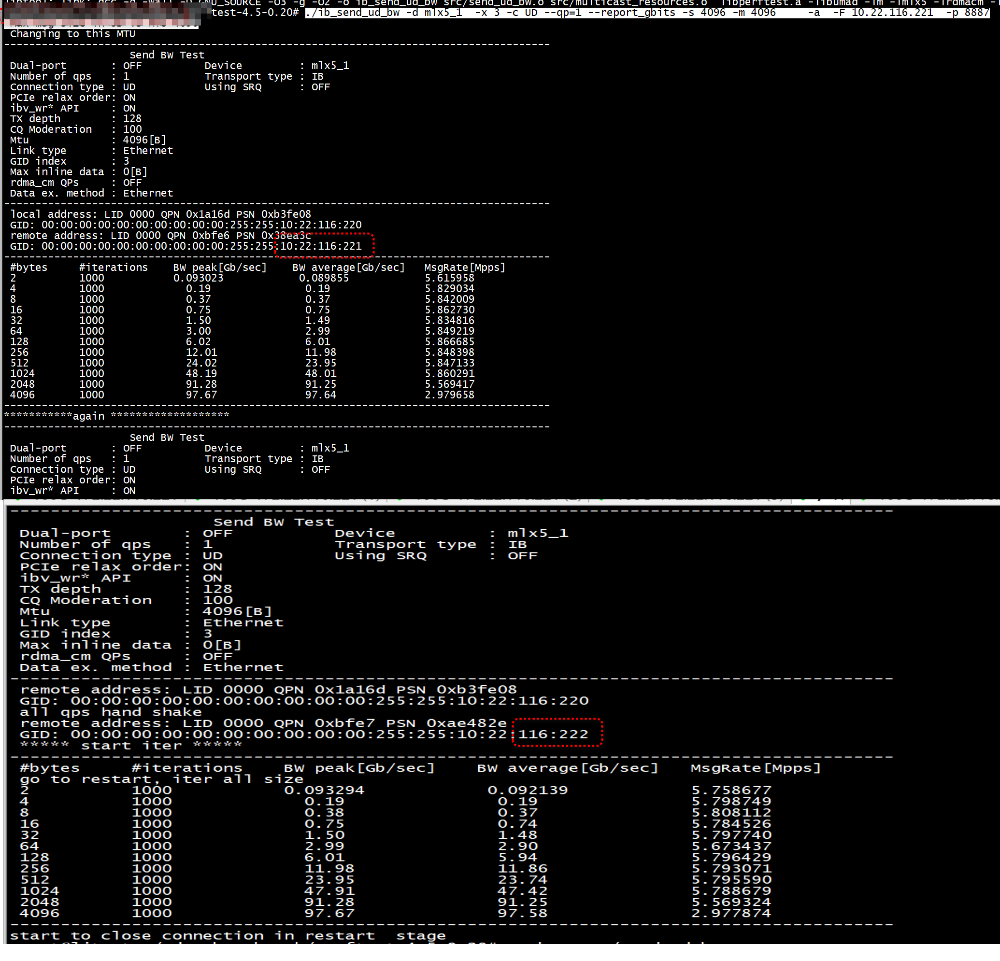

#  perftest 版本

```
 perftest-4.5-0.20# ./ib_send_bw -V
Version: 6.10
```

# ud reuse

+ server 端启动两个ib_send_bw   

```
./ib_send_bw -d mlx5_1  -x 3 -c UD --qp=1 --report_gbits -s 4096 -m 4096     -a  -F -p 8887
./ib_send_bw -d mlx5_1  -x 5  -c UD --qp=1 --report_gbits -s 4096 -m 4096     -a  -F -p 8888
```


+ client 先连接10.22.116.221，8887 后连接10.22.116.222，8888


```
./ib_send_ud_bw -d mlx5_1  -x 3 -c UD --qp=1 --report_gbits -s 4096 -m 4096     -a  -F 10.22.116.221  -p 8887

```




## client

***client 先连接10.22.116.221，8887 后连接10.22.116.222，8888***


+ 设置tcp port and ip     
```
          const char *ip_str = "10.22.116.222";
             struct in_addr ip_addr;
            uint32_t ip_int = 0;
            inet_pton(AF_INET, ip_str, &ip_addr);
            ip_int = ntohl(ip_addr.s_addr);
            again = 0;
            close(user_comm.rdma_params->sockfd);
            // tcp establish_connection
            /* Initialize the connection and print the local data. */
            user_param.port += 1;
            user_param.remote_ip = ip_int;
            user_param.server_ip = ip_int;
            user_param.machine = CLIENT;
            //user_comm.rdma_params->port +=1;
            strncpy(user_comm.rdma_params->servername,"10.22.116.222",strlen("10.22.116.222"));
            user_comm.rdma_params->port +=1;
```
+ 建立tcp连接establish_connection(&user_comm)        

+ 通过tcp socket和server交换信息,调用ctx_xchg_data_ethernet      


```
  exchange_versions(&user_comm, &user_param);
   check_sys_data
   check_mtu
```

+ 对每个qp进行ctx_hand_shake(&user_comm,&my_dest[i],&rem_dest[i])        

+ ctx_check_gid_compatibility(&my_dest[0], &rem_dest[0])    


+ ctx_hand_shake(&user_comm,&my_dest[0],&rem_dest[0])    

+ 通过ud_ctx_connect改变change dest gidx attr.ah_attr.grh.dgid      


+ 再次对每个qp进行ctx_hand_shake(&user_comm,&my_dest[i],&rem_dest[i])   