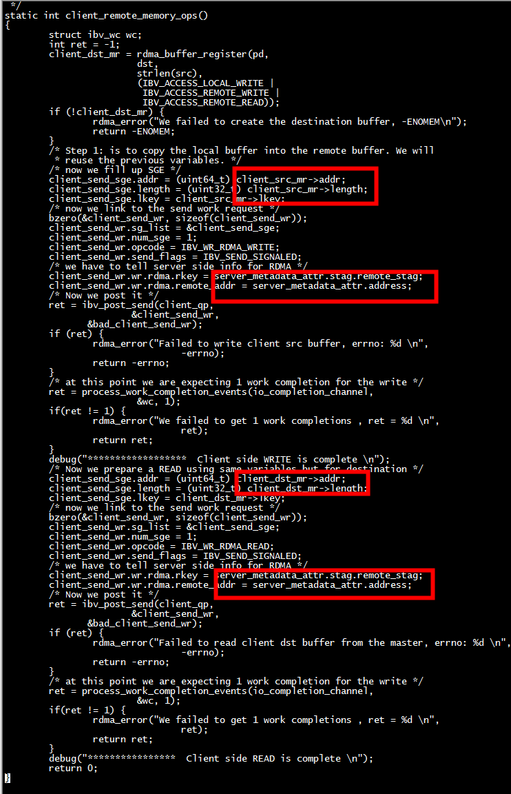

# RDMA exmaple

A simple RDMA server client example. The code contains a lot of comments. Here is the workflow that happens in the example: 

Client: 
  1. setup RDMA resources   
  2. connect to the server 
  3. receive server side buffer information via send/recv exchange 
  4. do an RDMA write to the server buffer from a (first) local buffer. The content of the buffer is the string passed with the `-s` argument. 
  5. do an RDMA read to read the content of the server buffer into a second local buffer. 
  6. compare the content of the first and second buffers, and match them. 
  7. disconnect 
  
+ a client通过ibv_post_recv（没有使用传统tcp socket）server_metadata_attr    

+ b client先执行IBV_WR_RDMA_READ，后执行IBV_WR_RDMA_READ   


Server: 
  1. setup RDMA resources 
  2. wait for a client to connect 
  3. allocate and pin a server buffer
  4. accept the incoming client connection 
  5. send information about the local server buffer to the client 
  6. wait for disconnect
  
 

###### How to run      
```text
git clone https://github.com/animeshtrivedi/rdma-example.git
cd ./rdma-example
cmake .
make
``` 
 
###### server
```text
./bin/rdma_server 
Server is listening successfully at: 0.0.0.0 , port: 20886 
A new connection is accepted from 10.11.11.82 
Client side buffer information is received...
---------------------------------------------------------
buffer attr, addr: 0x34adf360 , len: 11 , stag : 0x2ed16 
---------------------------------------------------------
The client has requested buffer length of : 11 bytes 
A disconnect event is received from the client...
Server shut-down is complete 
```
###### client
```text
./rdma_client -a 10.11.11.251  -s textstring 
Passed string is : textstring , with count 10 
Trying to connect to server at : 10.11.11.251 port: 20886 
The client is connected successfully 
---------------------------------------------------------
buffer attr, addr: 0x36310410 , len: 10 , stag : 0x11616 
---------------------------------------------------------
...
SUCCESS, source and destination buffers match 
Client resource clean up is complete 
root@ubuntu:~/the-geek-in-the-corner# ./rdma_client -a 10.11.11.251  -s hellostring 
Passed string is : hellostring , with count 11 
Trying to connect to server at : 10.11.11.251 port: 20886 
The client is connected successfully 
---------------------------------------------------------
buffer attr, addr: 0x25cb0410 , len: 11 , stag : 0x118b0 
---------------------------------------------------------
...
SUCCESS, source and destination buffers match 
Client resource clean up is complete  

```

## Does not have an RDMA device?
In case you do not have an RDMA device to test the code, you can setup SofitWARP software RDMA device on your Linux machine. Follow instructions here: [https://github.com/animeshtrivedi/blog/blob/master/post/2019-06-26-siw.md](https://github.com/animeshtrivedi/blog/blob/master/post/2019-06-26-siw.md).


# struct rdma_cm_id 和  struct sockaddr_in

```
        /* Just FYI: How to extract connection information */
        memcpy(&remote_sockaddr /* where to save */,
                        rdma_get_peer_addr(cm_client_id) /* gives you remote sockaddr */,
                        sizeof(struct sockaddr_in) /* max size */);
        printf("A new connection is accepted from %s \n",
                        inet_ntoa(remote_sockaddr.sin_addr));
```
