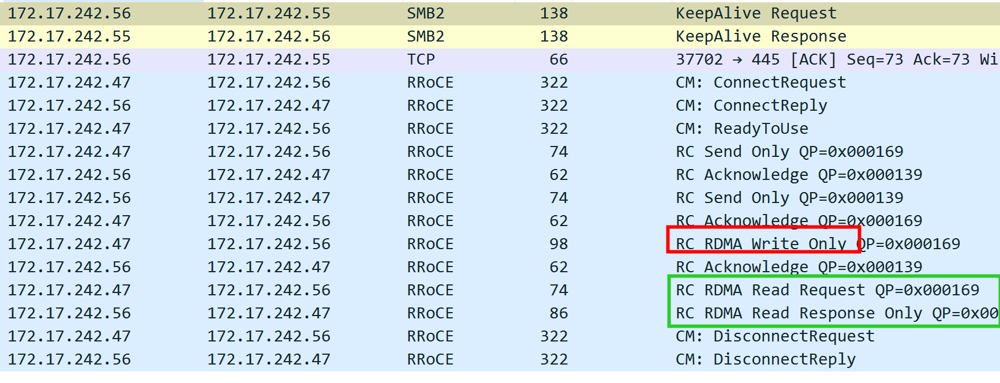
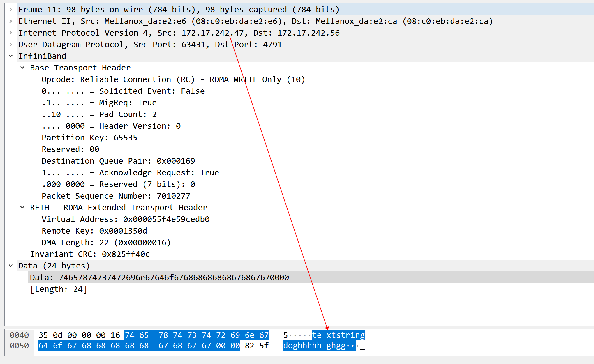
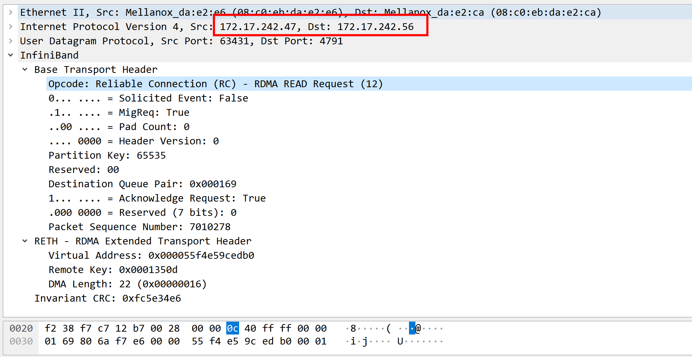
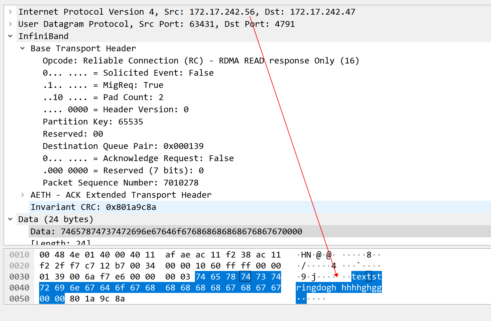

# server

```
root@centos12:/home/rdma/rdma-example# ./bin/rdma_server -a 172.17.242.56 -p 12345
Server is listening successfully at: 172.17.242.56 , port: 12345 
^C
root@centos12:/home/rdma/rdma-example# ./bin/rdma_server -a 172.17.242.56 -p 12345 
Server is listening successfully at: 172.17.242.56 , port: 12345 
A new connection is accepted from 172.17.242.47 
Client side buffer information is received...
---------------------------------------------------------
buffer attr, addr: 0x55a8bc61a360 , len: 22 , stag : 0x10e20 
---------------------------------------------------------
The client has requested buffer length of : 22 bytes 
A disconnect event is received from the client...
Server shut-down is complete 
```

# client

```
root@centos07:/home/rdma# ./rdma_client2 -a 172.17.242.56  -p 12345 -s textstringdoghhhhhghgg 
Passed string is : textstringdoghhhhhghgg , with count 22 
Trying to connect to server at : 172.17.242.56 port: 12345 
The client is connected successfully 
---------------------------------------------------------
buffer attr, addr: 0x55f4e59cedb0 , len: 22 , stag : 0x1350d 
---------------------------------------------------------
...
SUCCESS, source and destination buffers match 
Client resource clean up is complete 
root@centos07:/home/rdma# 
```


# tcpdump

+ 1  有read response , 没有 write response



+ 2 write request


+ 3 read request

没有data   
+ 4 read reponse

 