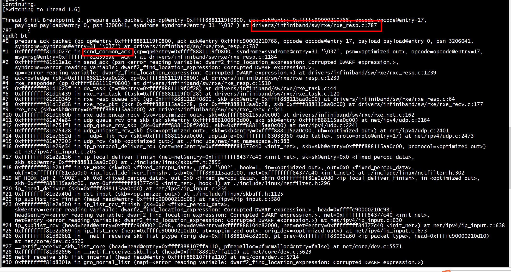

#  IB_OPCODE

```
enum {
        /* transport types -- just used to define real constants */
        IB_OPCODE_RC                                = 0x00,
        IB_OPCODE_UC                                = 0x20,
        IB_OPCODE_RD                                = 0x40,
        IB_OPCODE_UD                                = 0x60,
        /* per IBTA 1.3 vol 1 Table 38, A10.3.2 */
        IB_OPCODE_CNP                               = 0x80,
        /* Manufacturer specific */
        IB_OPCODE_MSP                               = 0xe0,

        /* operations -- just used to define real constants */
        IB_OPCODE_SEND_FIRST                        = 0x00,
        IB_OPCODE_SEND_MIDDLE                       = 0x01,
        IB_OPCODE_SEND_LAST                         = 0x02,
        IB_OPCODE_SEND_LAST_WITH_IMMEDIATE          = 0x03,
        IB_OPCODE_SEND_ONLY                         = 0x04,
        IB_OPCODE_SEND_ONLY_WITH_IMMEDIATE          = 0x05,
        IB_OPCODE_RDMA_WRITE_FIRST                  = 0x06,
        IB_OPCODE_RDMA_WRITE_MIDDLE                 = 0x07,
        IB_OPCODE_RDMA_WRITE_LAST                   = 0x08,
        IB_OPCODE_RDMA_WRITE_LAST_WITH_IMMEDIATE    = 0x09,
        IB_OPCODE_RDMA_WRITE_ONLY                   = 0x0a,
        IB_OPCODE_RDMA_WRITE_ONLY_WITH_IMMEDIATE    = 0x0b,
        IB_OPCODE_RDMA_READ_REQUEST                 = 0x0c,
        IB_OPCODE_RDMA_READ_RESPONSE_FIRST          = 0x0d,
        IB_OPCODE_RDMA_READ_RESPONSE_MIDDLE         = 0x0e,
        IB_OPCODE_RDMA_READ_RESPONSE_LAST           = 0x0f,
        IB_OPCODE_RDMA_READ_RESPONSE_ONLY           = 0x10,
        IB_OPCODE_ACKNOWLEDGE                       = 0x11,
        IB_OPCODE_ATOMIC_ACKNOWLEDGE                = 0x12,
        IB_OPCODE_COMPARE_SWAP                      = 0x13,
        IB_OPCODE_FETCH_ADD                         = 0x14,
        /* opcode 0x15 is reserved */
        IB_OPCODE_SEND_LAST_WITH_INVALIDATE         = 0x16,
        IB_OPCODE_SEND_ONLY_WITH_INVALIDATE         = 0x17,

```


# server

```
root@ubuntu:~# rping -s 192.168.11.22  -v -C 3
server ping data: rdma-ping-0: ABCDEFGHIJKLMNOPQRSTUVWXYZ[\]^_`abcdefghijklmnopqr
server ping data: rdma-ping-1: BCDEFGHIJKLMNOPQRSTUVWXYZ[\]^_`abcdefghijklmnopqrs
server ping data: rdma-ping-2: CDEFGHIJKLMNOPQRSTUVWXYZ[\]^_`abcdefghijklmnopqrst
server DISCONNECT EVENT...
wait for RDMA_READ_ADV state 10
root@ubuntu:~# 
```


opcode=opcode@entry=17,也就是IB_OPCODE_ACKNOWLEDGE    

```
static int send_ack(struct rxe_qp *qp, u8 syndrome, u32 psn)
{
        return send_common_ack(qp, syndrome, psn,
                        IB_OPCODE_RC_ACKNOWLEDGE, "ACK");
}
```
# client
```
root@ubuntux86:# rping -c -a 192.168.11.22 -v -C 3
ping data: rdma-ping-0: ABCDEFGHIJKLMNOPQRSTUVWXYZ[\]^_`abcdefghijklmnopqr
ping data: rdma-ping-1: BCDEFGHIJKLMNOPQRSTUVWXYZ[\]^_`abcdefghijklmnopqrs
ping data: rdma-ping-2: CDEFGHIJKLMNOPQRSTUVWXYZ[\]^_`abcdefghijklmnopqrst
root@ubuntux86:# 
```