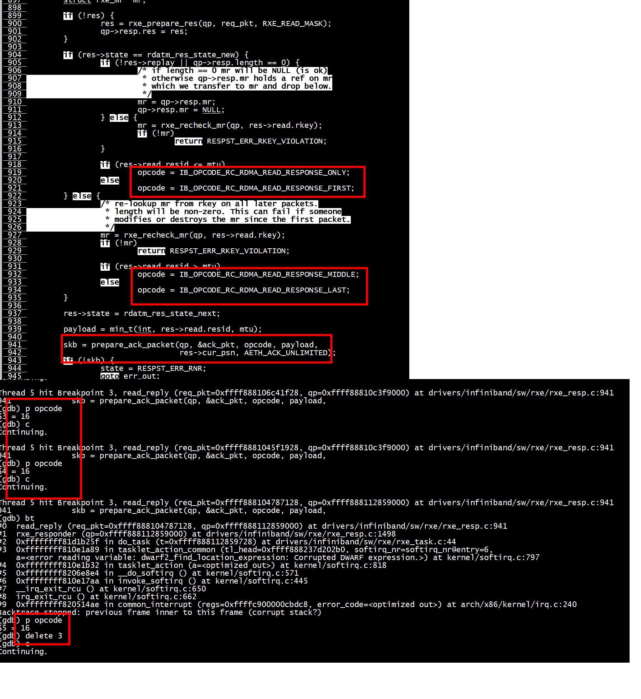

# IB_OPCODE_RDMA_READ_RESPONSE_ONLY

## server
```
root@ubuntu:~# ./rdma_server -a 192.168.11.22 -p 12345
Server is listening successfully at: 192.168.11.22 , port: 12345 
A new connection is accepted from 192.168.11.33 
Client side buffer information is received...
---------------------------------------------------------
buffer attr, addr: 0x555f517ab330 , len: 10 , stag : 0x1116 
---------------------------------------------------------
The client has requested buffer length of : 10 bytes 
A disconnect event is received from the client...
Server shut-down is complete 
root@ubuntu:~# 
```

```
(gdb) bt
#0  read_reply (req_pkt=0xffff888104787128, qp=0xffff888112859000) at drivers/infiniband/sw/rxe/rxe_resp.c:941
#1  rxe_responder (qp=0xffff888112859000) at drivers/infiniband/sw/rxe/rxe_resp.c:1498
#2  0xffffffff81d1b25f in do_task (t=0xffff888112859728) at drivers/infiniband/sw/rxe/rxe_task.c:44
#3  0xffffffff810e1a89 in tasklet_action_common (tl_head=0xffff888237d202b0, softirq_nr=softirq_nr@entry=6, 
    a=<error reading variable: dwarf2_find_location_expression: Corrupted DWARF expression.>) at kernel/softirq.c:797
#4  0xffffffff810e1b32 in tasklet_action (a=<optimized out>) at kernel/softirq.c:818
#5  0xffffffff8206e8e4 in __do_softirq () at kernel/softirq.c:571
#6  0xffffffff810e17aa in invoke_softirq () at kernel/softirq.c:445
#7  __irq_exit_rcu () at kernel/softirq.c:650
#8  irq_exit_rcu () at kernel/softirq.c:662
#9  0xffffffff820514ae in common_interrupt (regs=0xffffc900000cbdc8, error_code=<optimized out>) at arch/x86/kernel/irq.c:240
Backtrace stopped: previous frame inner to this frame (corrupt stack?)
(gdb) p opcode
$5 = 16
```

根据mtu这次是IB_OPCODE_RDMA_READ_RESPONSE_ONLY

## client
```
root@ubuntux86:# ./bin/rdma_client   -a 192.168.11.22 -p 12345  -s textstring 
Passed string is : textstring , with count 10 
Trying to connect to server at : 192.168.11.22 port: 12345 
The client is connected successfully 
---------------------------------------------------------
buffer attr, addr: 0x56165ac4a810 , len: 10 , stag : 0x122c 
---------------------------------------------------------
/work/test/rdma-write-read/src/rdma_common.c : 182 : ERROR : Work completion (WC) has error status: transport retry counter exceeded at index 0/work/test/rdma-write-read/src/rdma_client.c : 382 : ERROR : We failed to get 1 work completions , ret = -12 
/work/test/rdma-write-read/src/rdma_client.c : 539 : ERROR : Failed to finish remote memory ops, ret = -12 
root@ubuntux86:# 
```