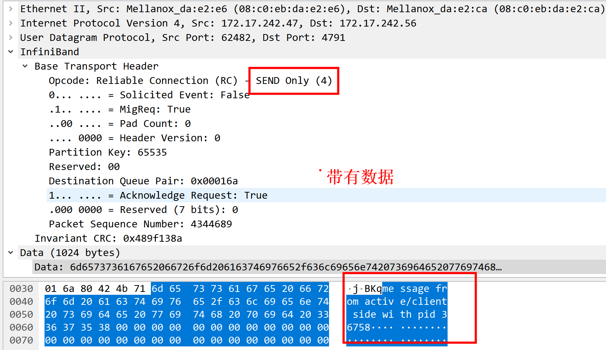

# server
```
root@centos12:/home/rdma/send_recv# ./server  172.17.242.56 12345
listening on port 12345.
received connection request.
received message: message from active/client side with pid 36758
connected. posting send...
send completed successfully.
peer disconnected.
^C
```

# client

```
root@centos07:/home/rdma# ./rdma_client3  172.17.242.56 12345
address resolved.
route resolved.
connected. posting send...
send completed successfully.
received message: message from passive/server side with pid 40292
disconnected.
root@centos07:/home/rdma# 
```
+ 1 发送   

+ 1.1  注册发送conn->send   

```
void register_memory(struct connection *conn)
{
  conn->send_region = malloc(BUFFER_SIZE);
  conn->recv_region = malloc(BUFFER_SIZE);

  TEST_Z(conn->send_mr = ibv_reg_mr(
    s_ctx->pd, 
    conn->send_region, 
    BUFFER_SIZE, 
    0));

}
```
+ 1.2 发送conn->send_mr    
```
int on_connection(void *context)
{
  struct connection *conn = (struct connection *)context;
  struct ibv_send_wr wr, *bad_wr = NULL;
  struct ibv_sge sge;

  snprintf(conn->send_region, BUFFER_SIZE, "message from active/client side with pid %d", getpid());

  printf("connected. posting send...\n");

  memset(&wr, 0, sizeof(wr));

  wr.wr_id = (uintptr_t)conn;
  wr.opcode = IBV_WR_SEND;
  wr.sg_list = &sge;
  wr.num_sge = 1;
  wr.send_flags = IBV_SEND_SIGNALED;

  sge.addr = (uintptr_t)conn->send_region;
  sge.length = BUFFER_SIZE;
  sge.lkey = conn->send_mr->lkey;

  TEST_NZ(ibv_post_send(conn->qp, &wr, &bad_wr));

  return 0;
}
```

+ 2 接收   

+ 2.1 注册接收conn->recv_mr    
```
void register_memory(struct connection *conn)
{
  conn->send_region = malloc(BUFFER_SIZE);
  conn->recv_region = malloc(BUFFER_SIZE);

  TEST_Z(conn->recv_mr = ibv_reg_mr(
    s_ctx->pd, 
    conn->recv_region, 
    BUFFER_SIZE, 
    IBV_ACCESS_LOCAL_WRITE));
}
```

+ 2.2接收   
```
void on_completion(struct ibv_wc *wc)
{
  struct connection *conn = (struct connection *)(uintptr_t)wc->wr_id;

  if (wc->opcode & IBV_WC_RECV)
    printf("received message: %s\n", conn->recv_region);

}
```

# tcpdump

