# make

## undefined reference to `spdk_thread_create'
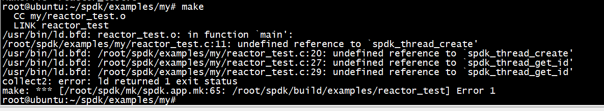

加上 SPDK_LIB_LIST

```
SPDK_LIB_LIST += event
```

# run

```
../../build/examples/reactor_test -b hello
```

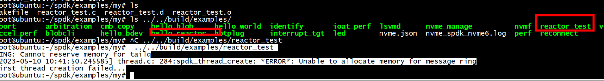

```
root@ubuntu:~/spdk/examples/my#  ../../build/examples/reactor_test 
RING: Cannot reserve memory for tailq
[2023-05-10 10:41:50.245585] thread.c: 284:spdk_thread_create: *ERROR*: Unable to allocate memory for message ring
First thread creation failed...
root@ubuntu:~/spdk/examples/my#
```

没有调用 rte_eal_init,main函数要调用spdk_app_start


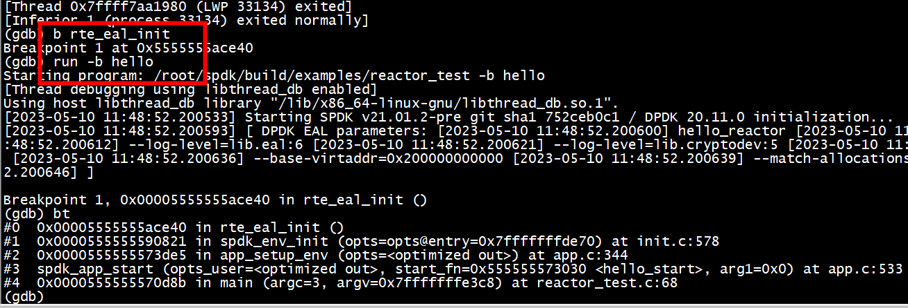

# api

## app
1) spdk_app_start   
2) spdk_app_stop
3) spdk_app_fini

spdk_app_start -> spdk_reactors_start

## spdk_app_stop


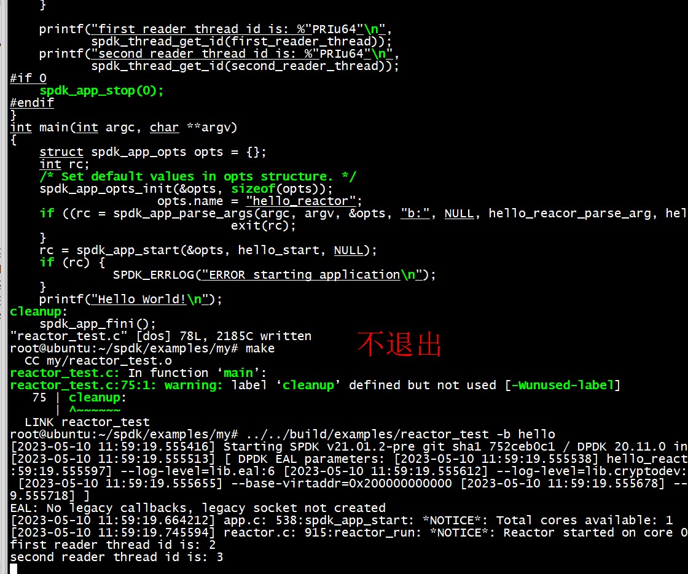

没有调用spdk_app_stop，进程处于死循环中


# env

1) spdk_env_init  
2) spdk_env_fini
3) spdk_env_thread_wait_all()   

#  ../../build/examples/reactor_test

##  init.c: 587:spdk_env_init: *ERROR*: Failed to initialize DPDK


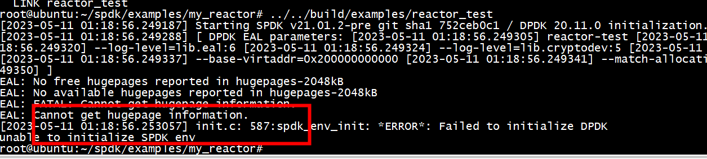
需要执行 scripts/setup.sh
```
scripts/setup.sh
ls: cannot access '/sys/kernel/iommu_groups': No such file or directory
0000:00:03.0 (1b36 0010): no driver -> uio_pci_generic
modprobe: FATAL: Module msr not found in directory /lib/modules/5.4.0-1090-kvm
```
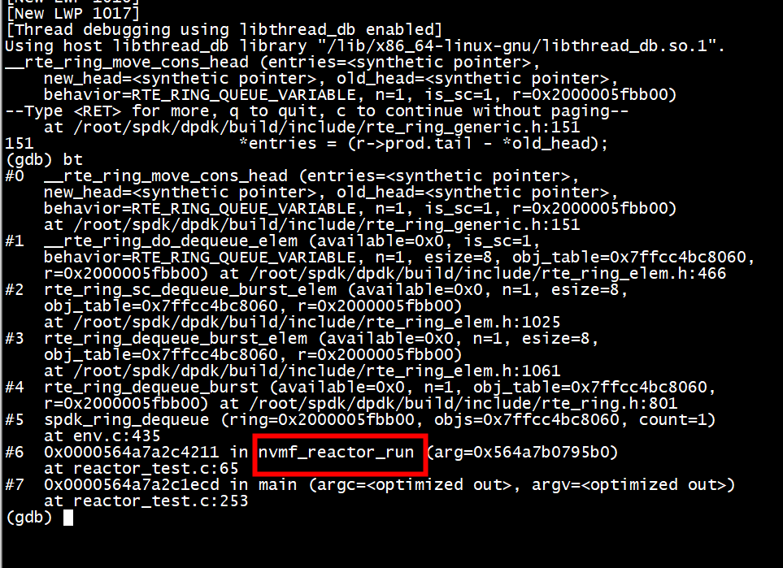

卡在__rte_ring_move_cons_head 不动了   

1) 这是因为nvmf_reactor_thread_op没有去spdk_ring_enqueue发送消息   
2) spdk_thread_create***没有调用 pthread_create***   
3) spdk_env_thread_launch_pinned调用rte_eal_remote_launch   
spdk_thread_lib_init_ext(nvmf_reactor_thread_op, nvmf_reactor_thread_op_supported,
                                 sizeof(struct nvmf_lw_thread));   
	

在nvmf_reactor_thread_op中调用nvmf_schedule_spdk_thread去 spdk_ring_enqueue发送消息   
	
```
static int
nvmf_reactor_thread_op(struct spdk_thread *thread, enum spdk_thread_op op)
{
        switch (op) {
        case SPDK_THREAD_OP_NEW:
                printf("%s new thread \n",__func__);
                return nvmf_schedule_spdk_thread(thread);
        case SPDK_THREAD_OP_RESCHED:
                printf("%s new reshedule thread \n",__func__);
                nvmf_request_spdk_thread_reschedule(thread);
                return 0;
        default:
                return -ENOTSUP;
        }
}
```

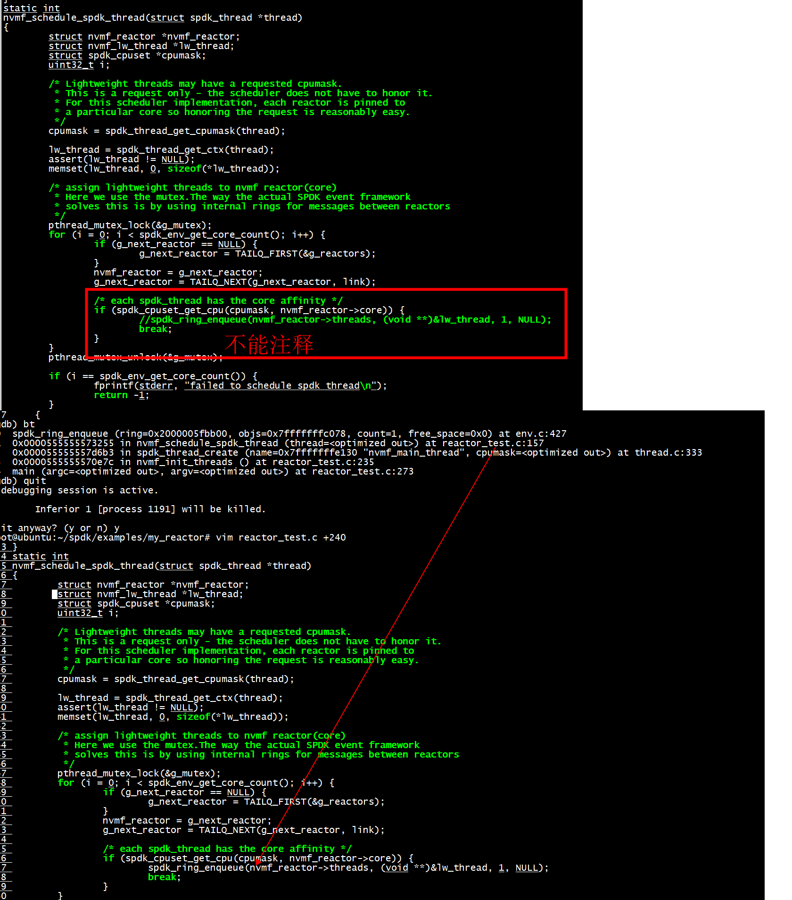


#    ../../build/examples/reactor_test 


```
static void hello_start(void *arg1)
{
    struct spdk_thread* thread = spdk_thread_create("first_reader_thread", NULL);
    struct nvmf_lw_thread *lw_thread;
    lw_thread = spdk_thread_get_ctx(thread);
    assert(lw_thread != NULL);
    memset(lw_thread, 0, sizeof(*lw_thread));
    spdk_ring_enqueue(g_main_reactor->threads, (void **)&lw_thread, 1, NULL);
    spdk_thread_send_msg(thread, hello_reader, NULL);
    printf("hello start \n");
#if 0
    // will cause coredump
    spdk_app_stop(0);
#endif
}
```

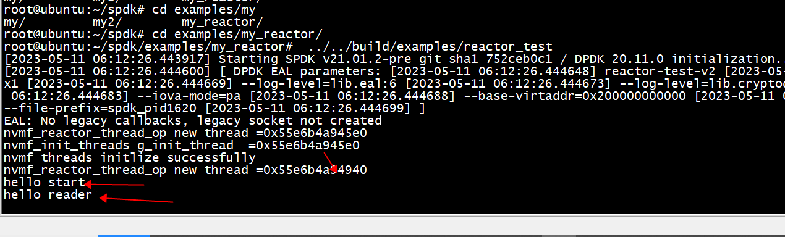

##  为什么要执行spdk_ring_enqueue

 执行spdk_ring_enqueue保证  spdk_thread_poll不断被调用
 
 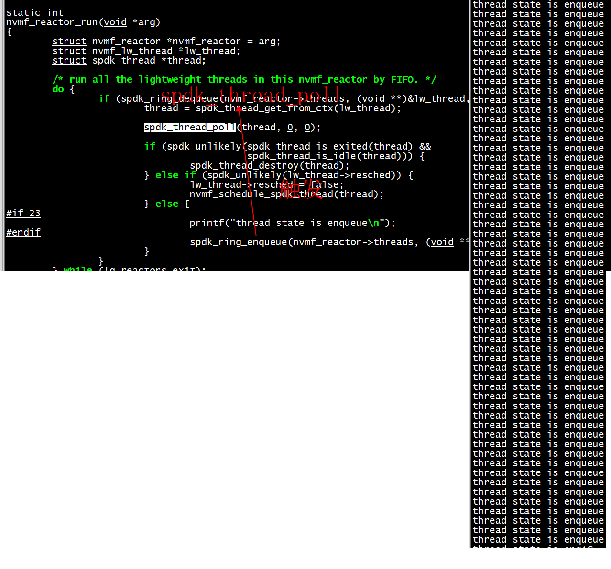

# periodic poller

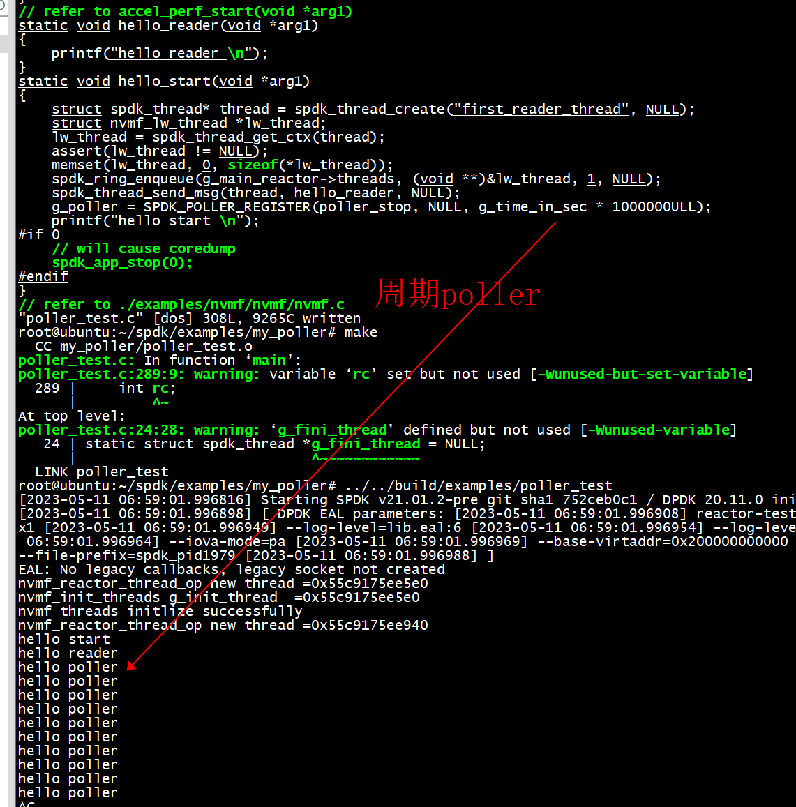

##  periodic poller cause  spdk_ring_enqueue 

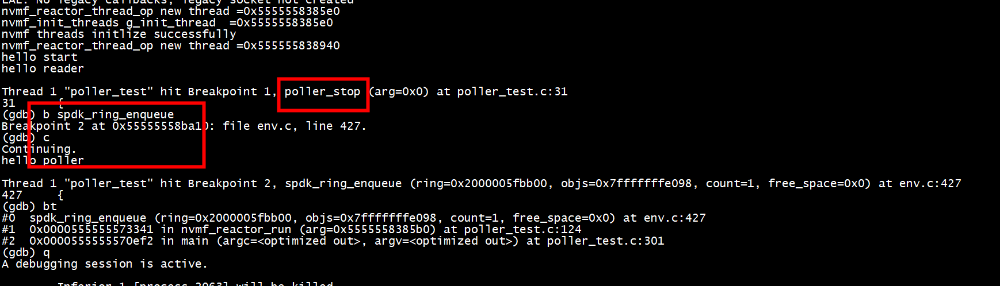

## spdk_reactors_start   spdk_reactors_stop


# log

```
~/spdk/build/examples/my_hello_nvme_bdev -c bdev.json -b Malloc0  -L all
```
