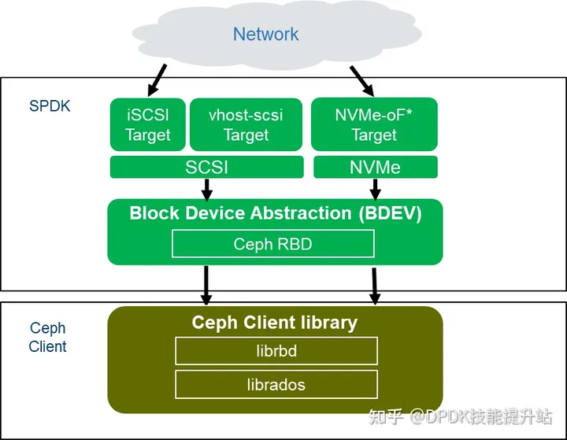
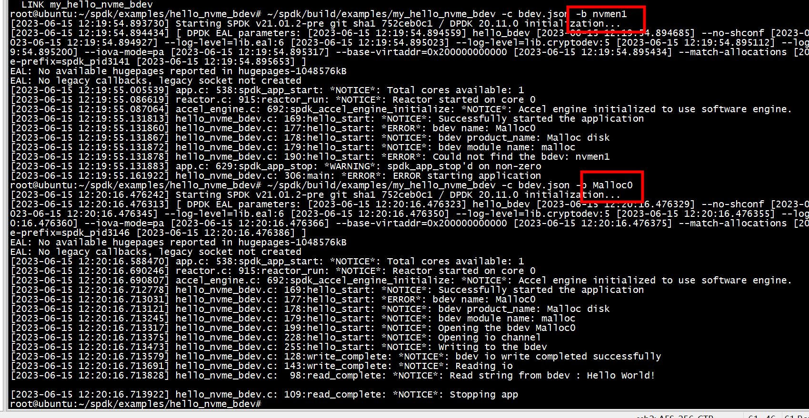
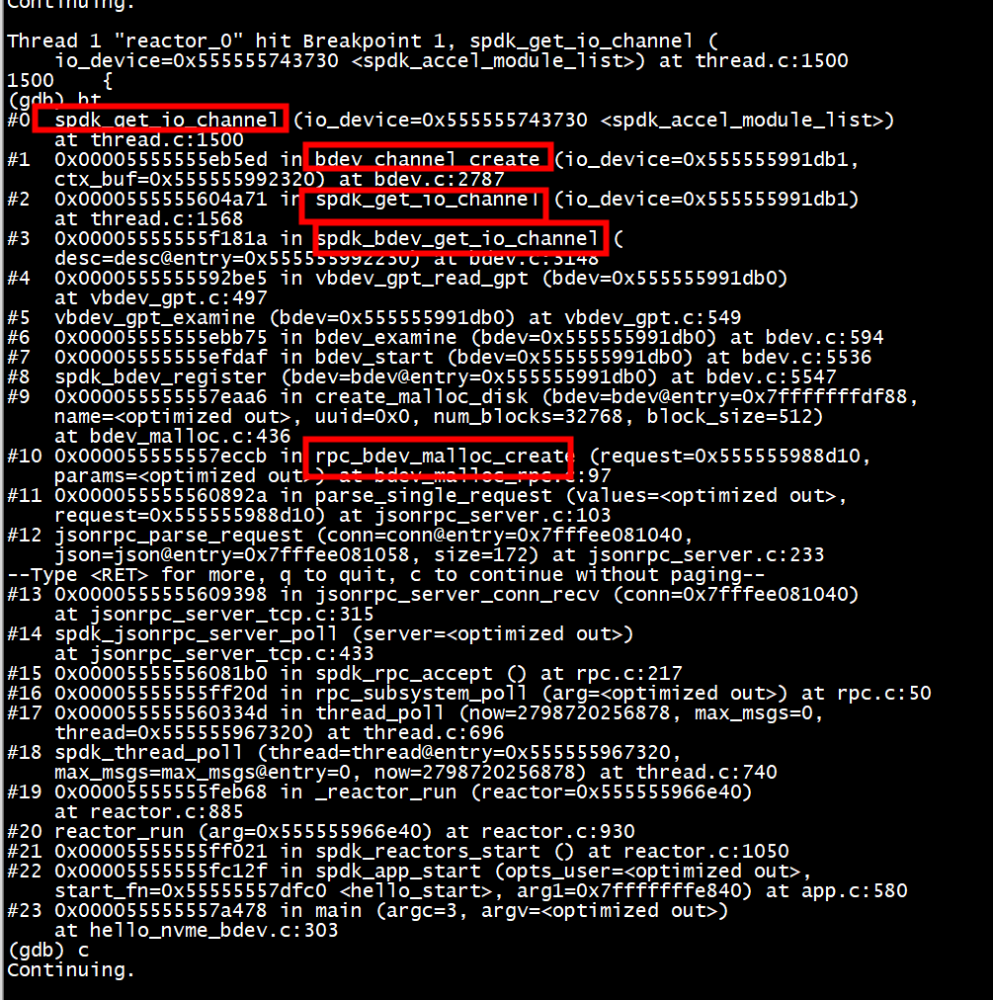
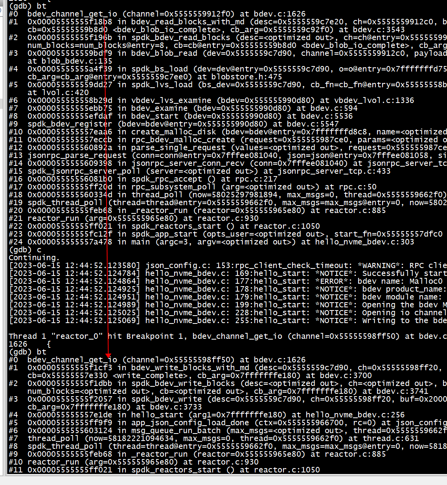
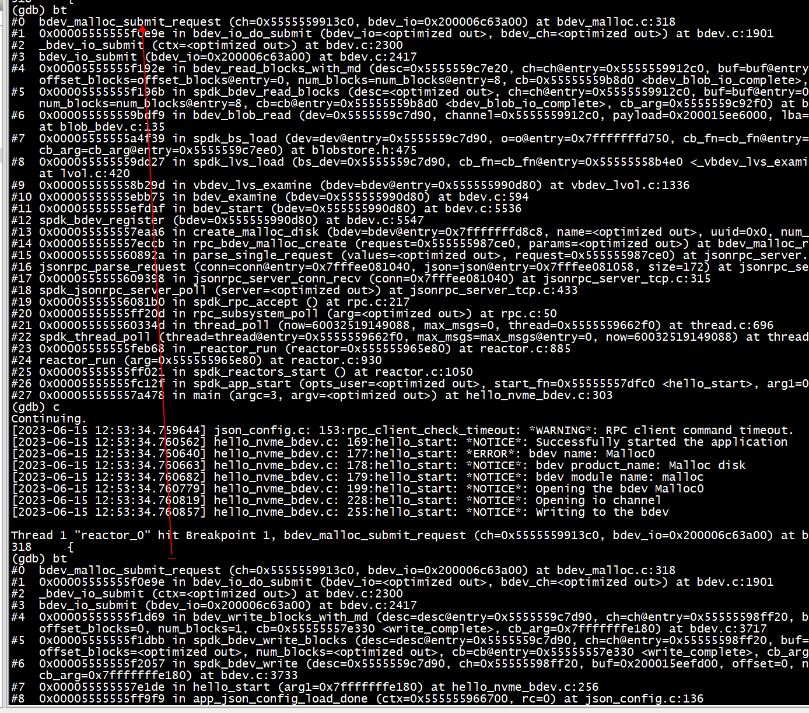

# 参考

[Block Device User Guide](https://spdk.io/doc/bdev.html)

[深信服 eds](https://www.sangfor.com.cn/video/09a754d7822049bdab5385ca2aadcc2d)

[三万英尺看分布式存储中本地存储引擎 ](https://www.modb.pro/db/25573)   
[深信服分布式存储501高性能版本发布会精彩回顾](https://www.sangfor.com.cn/event-center/eds501webinar)   

[fastblock](https://github.com/openeuler-mirror/fastblock)  

[SPDK对接Ceph性能优化](https://www.cnblogs.com/developer-tianyiyun/articles/16339003.html)


[基于SPDK NVMeOF+多路径访问远端存储设备实践](https://www.ctyun.cn/developer/article/423734886105157)  

+  命令
```
 spdk_rpc.py thread_get_pollers
```

> ## RBD bdev


SPDK项目中的RBD bdev（RBD块设备模块）。这个模块主要是利用Ceph的librados/librbd的客户端软件库，把Ceph集群的RBD pool中的image file (镜像文件)，转化为SPDK定义的块设备。最终这个块设备可以被各类SPDK的target程序使用（诸如SPDK NVMe-oF target, Vhost target, iSCSI target），充当Ceph的存储网关服务，对真正的客户端应用提供块设备服务。




#   ~/spdk/build/examples/my_hello_nvme_bdev -c bdev.json  -b Nvme0n1


# spdk_get_io_channel 



## send msg to channel thread 
**1)** spdk_get_io_channel函数会设置channel thread  
```
ch->thread = thread  
```
**2)** spdk_bdev_io_get_thread函数获取channel thread  
```
 spdk_thread_send_msg(spdk_bdev_io_get_thread(bdev_io),
                                     bdev_io_complete, bdev_io);   
```
**3)** 通过spdk_thread_send_msg向channel->thread  发送消息

##  bdev_malloc_submit_request  --> ...bdev_io_complete...  spdk_bdev_io_get_thread
```
(gdb) bt
#0  spdk_bdev_io_get_thread (bdev_io=0x200006c63a00) at bdev.c:5399
#1  0x00005555555eebdf in bdev_io_complete (ctx=0x200006c63a00) at bdev.c:5063
#2  bdev_io_complete (ctx=0x200006c63a00) at bdev.c:5043
#3  spdk_bdev_io_complete (bdev_io=0x200006c63a00, status=<optimized out>)
    at bdev.c:5227
#4  0x00005555555f7d85 in spdk_accel_task_complete (
    accel_task=accel_task@entry=0x555555992550, status=status@entry=0)
    at accel_engine.c:116
#5  0x00005555555f7ec2 in spdk_accel_submit_copy (ch=ch@entry=0x5555559923f0, 
    dst=dst@entry=0x200016200000, src=<optimized out>, nbytes=<optimized out>, 
    cb_fn=cb_fn@entry=0x55555557e5e0 <malloc_done>, 
    cb_arg=cb_arg@entry=0x200006c63d68) at accel_engine.c:203
#6  0x000055555557e884 in bdev_malloc_writev (mdisk=<optimized out>, 
    offset=<optimized out>, len=<optimized out>, iovcnt=<optimized out>, 
    iov=<optimized out>, task=0x200006c63d68, ch=0x5555559923f0)
    at bdev_malloc.c:193
#7  _bdev_malloc_submit_request (bdev_io=0x200006c63a00, ch=0x5555559923f0)
    at bdev_malloc.c:261
#8  bdev_malloc_submit_request (ch=0x5555559923f0, bdev_io=0x200006c63a00)
    at bdev_malloc.c:319
#9  0x00005555555f0e9e in bdev_io_do_submit (bdev_io=<optimized out>, 
    bdev_ch=<optimized out>) at bdev.c:1901
#11 bdev_io_submit (bdev_io=0x200006c63a00) at bdev.c:2417
#12 0x00005555555f1d69 in bdev_write_blocks_with_md (desc=0x5555559c8dc0, 
    ch=0x555555990f50, buf=0x200015eefd00, md_buf=0x0, offset_blocks=0, 
    num_blocks=1, cb=0x55555557e330 <write_complete>, cb_arg=0x7fffffffe840)
    at bdev.c:3717
#13 0x00005555555f1dbb in spdk_bdev_write_blocks (desc=<optimized out>, 
    ch=<optimized out>, buf=<optimized out>, offset_blocks=<optimized out>, 
    num_blocks=<optimized out>, cb=<optimized out>, cb_arg=0x7fffffffe840)
    at bdev.c:3741
#14 0x00005555555f2057 in spdk_bdev_write (desc=0x5555559c8dc0, 
    ch=0x555555990f50, buf=0x200015eefd00, offset=0, nbytes=512, 
    cb=0x55555557e330 <write_complete>, cb_arg=0x7fffffffe840) at bdev.c:3733
#15 0x000055555557e1de in hello_start (arg1=0x7fffffffe840)
    at hello_nvme_bdev.c:256
#16 0x00005555555ff9f9 in app_json_config_load_done (ctx=0x555555967730, rc=0)
    at json_config.c:136
#17 0x0000555555603124 in msg_queue_run_batch (max_msgs=<optimized out>, 
    thread=0x555555967320) at thread.c:553
#18 thread_poll (now=6967116559792, max_msgs=0, thread=0x555555967320)
    at thread.c:631
#19 spdk_thread_poll (thread=thread@entry=0x555555967320, 
    max_msgs=max_msgs@entry=0, now=6967116559792) at thread.c:740
#20 0x00005555555feb68 in _reactor_run (reactor=0x555555966e40)
--Type <RET> for more, q to quit, c to continue without paging--
    at reactor.c:885
#21 reactor_run (arg=0x555555966e40) at reactor.c:930
#22 0x00005555555ff021 in spdk_reactors_start () at reactor.c:1050
#23 0x00005555555fc12f in spdk_app_start (opts_user=<optimized out>, 
    start_fn=0x55555557dfc0 <hello_start>, arg1=0x7fffffffe840) at app.c:580
#24 0x000055555557a478 in main (argc=3, argv=<optimized out>)
    at hello_nvme_bdev.c:303
```

##  struct spdk_bdev_channel




# bdev_malloc_submit_request 


