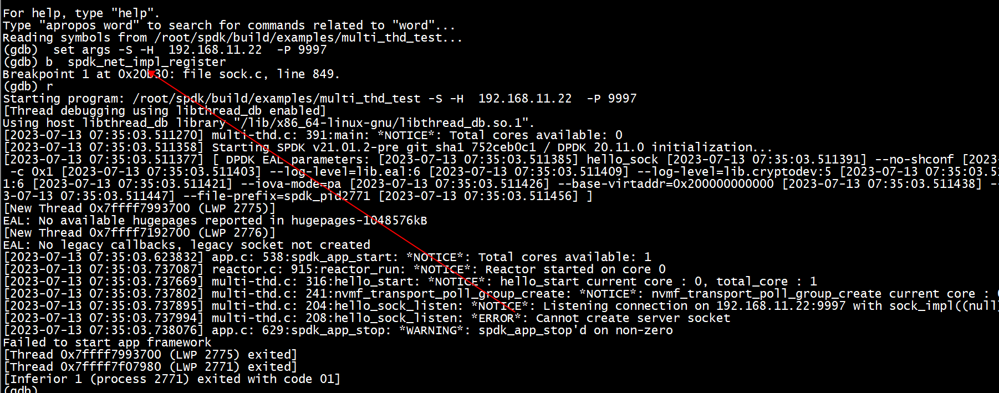

# *NOTICE*: Listening connection on 192.168.11.22:9997 with sock_impl((null))
```
./hello_sock -S -H  192.168.11.22  -P 9999
```

spdk_net_impl_register没有加载   
Makefile 加上SPDK_LIB_LIST  +=  $(SOCK_MODULES_LIST)


# server

```
./hello_sock -S -H  192.168.11.22  -P 9999
```

##   listen : spdk_sock_listen_ext

```Shell
(gdb) bt
#0  listen () at ../sysdeps/unix/syscall-template.S:78
#1  0x000055555557636a in posix_sock_create (ip=0x7fffffffe6a9 "192.168.11.22", port=9999, type=SPDK_SOCK_CREATE_LISTEN, opts=0x7fffffffd820) at posix.c:524
#2  0x0000555555583747 in spdk_sock_listen_ext (ip=ip@entry=0x7fffffffe6a9 "192.168.11.22", port=port@entry=9999, _impl_name=_impl_name@entry=0x0, 
    opts=opts@entry=0x7fffffffd870) at sock.c:311
#3  0x000055555558380c in spdk_sock_listen (ip=0x7fffffffe6a9 "192.168.11.22", port=9999, impl_name=0x0) at sock.c:282
#4  0x00005555555745ec in hello_sock_listen (ctx=0x7fffffffe140) at hello_sock.c:394
#5  hello_start (arg1=0x7fffffffe140) at hello_sock.c:394
#6  0x000055555557b723 in spdk_subsystem_init (cb_fn=<optimized out>, cb_arg=<optimized out>) at subsystem.c:212
#7  0x000055555557f074 in msg_queue_run_batch (max_msgs=<optimized out>, thread=0x55555585d960) at thread.c:553
#8  thread_poll (now=835600865166, max_msgs=0, thread=0x55555585d960) at thread.c:631
#9  spdk_thread_poll (thread=thread@entry=0x55555585d960, max_msgs=max_msgs@entry=0, now=835600865166) at thread.c:740
#10 0x000055555557aab8 in _reactor_run (reactor=0x55555585d540) at reactor.c:885
#11 reactor_run (arg=0x55555585d540) at reactor.c:930
#12 0x000055555557af71 in spdk_reactors_start () at reactor.c:1050
#13 0x000055555557807f in spdk_app_start (opts_user=<optimized out>, start_fn=0x555555574590 <hello_start>, arg1=0x7fffffffe140) at app.c:580
#14 0x0000555555571f5f in main (argc=6, argv=0x7fffffffe388) at hello_sock.c:427
```

##   accept :  hello_sock_accept_poll

```
(gdb) bt
#0  __libc_accept (fd=69, addr=addr@entry=..., len=len@entry=0x7fffffffd83c) at ../sysdeps/unix/sysv/linux/accept.c:24
#1  0x0000555555575660 in posix_sock_accept (_sock=0x55555585e0d0) at posix.c:600
#2  0x000055555558382e in spdk_sock_accept (sock=0x55555585e0d0) at sock.c:330
#3  0x0000555555574ace in hello_sock_accept_poll (arg=<optimized out>) at hello_sock.c:300
#4  hello_sock_accept_poll (arg=0x7fffffffe140) at hello_sock.c:285
#5  0x000055555557f29d in thread_poll (now=1104872569854, max_msgs=0, thread=0x55555585d960) at thread.c:696
#6  spdk_thread_poll (thread=thread@entry=0x55555585d960, max_msgs=max_msgs@entry=0, now=1104872569854) at thread.c:740
#7  0x000055555557aab8 in _reactor_run (reactor=0x55555585d540) at reactor.c:885
#8  reactor_run (arg=0x55555585d540) at reactor.c:930
#9  0x000055555557af71 in spdk_reactors_start () at reactor.c:1050
#10 0x000055555557807f in spdk_app_start (opts_user=<optimized out>, start_fn=0x555555574590 <hello_start>, arg1=0x7fffffffe140) at app.c:580
#11 0x0000555555571f5f in main (argc=6, argv=0x7fffffffe388) at hello_sock.c:427
```

## posix_sock_group_impl_poll epoll_wait

```
(gdb) bt
#0  epoll_wait (epfd=70, events=events@entry=0x7fffffffd650, maxevents=maxevents@entry=32, timeout=timeout@entry=0)
    at ../sysdeps/unix/sysv/linux/epoll_wait.c:28
#1  0x0000555555576aac in posix_sock_group_impl_poll (_group=0x55555585e220, max_events=32, socks=0x7fffffffd860) at posix.c:1218
#2  0x0000555555583f99 in sock_group_impl_poll_count (max_events=32, group=0x5555557f0570, group_impl=0x55555585e220) at sock.c:646
#3  spdk_sock_group_poll_count (group=0x5555557f0570, max_events=32) at sock.c:691
#4  0x00005555555748d1 in hello_sock_group_poll (arg=0x7fffffffe140) at hello_sock.c:339
#5  0x000055555557f105 in thread_poll (now=3169656484248, max_msgs=0, thread=0x55555585d960) at thread.c:652
#6  spdk_thread_poll (thread=thread@entry=0x55555585d960, max_msgs=max_msgs@entry=0, now=3169656484248) at thread.c:740
#7  0x000055555557aab8 in _reactor_run (reactor=0x55555585d540) at reactor.c:885
#8  reactor_run (arg=0x55555585d540) at reactor.c:930
#9  0x000055555557af71 in spdk_reactors_start () at reactor.c:1050
#10 0x000055555557807f in spdk_app_start (opts_user=<optimized out>, start_fn=0x555555574590 <hello_start>, arg1=0x7fffffffe140) at app.c:580
#11 0x0000555555571f5f in main (argc=6, argv=0x7fffffffe388) at hello_sock.c:427
```

##  epoll EPOLL_CTL_ADD

客户端发起telnet  192.168.11.22 9999 连接触发EPOLL_CTL_ADD  
```
(gdb) bt
#0  epoll_ctl () at ../sysdeps/unix/syscall-template.S:78
#1  0x00005555555755a7 in posix_sock_group_impl_add_sock (_group=0x55555585e220, _sock=0x55555585e630) at posix.c:1133
#2  0x0000555555583cce in spdk_sock_group_add_sock (group=0x5555557f0570, sock=0x55555585e630, cb_fn=0x5555555743c0 <hello_sock_cb>, cb_arg=0x7fffffffe140)
    at sock.c:576
#3  0x0000555555574aba in hello_sock_accept_poll (arg=<optimized out>) at hello_sock.c:312
#4  hello_sock_accept_poll (arg=0x7fffffffe140) at hello_sock.c:285
#5  0x000055555557f29d in thread_poll (now=2195090340274, max_msgs=0, thread=0x55555585d960) at thread.c:696
#6  spdk_thread_poll (thread=thread@entry=0x55555585d960, max_msgs=max_msgs@entry=0, now=2195090340274) at thread.c:740
#7  0x000055555557aab8 in _reactor_run (reactor=0x55555585d540) at reactor.c:885
#8  reactor_run (arg=0x55555585d540) at reactor.c:930
#9  0x000055555557af71 in spdk_reactors_start () at reactor.c:1050
#10 0x000055555557807f in spdk_app_start (opts_user=<optimized out>, start_fn=0x555555574590 <hello_start>, arg1=0x7fffffffe140) at app.c:580
#11 0x0000555555571f5f in main (argc=6, argv=0x7fffffffe388) at hello_sock.c:427
```

# read/write 回调

1)  spdk_sock_recv   
2)  spdk_sock_writev  

```
spdk_sock_group_add_sock
spdk_sock_group_add_sock(ctx->group, sock,hello_sock_cb, ctx);
```

```
(gdb) bt
#0  hello_sock_cb (arg=0x7fffffffe140, group=0x5555557f0570, sock=0x55555585e630) at hello_sock.c:249
#1  0x000055555558403e in sock_group_impl_poll_count (max_events=32, group=0x5555557f0570, group_impl=0x55555585e220) at sock.c:664
#2  spdk_sock_group_poll_count (group=0x5555557f0570, max_events=32) at sock.c:691
#3  0x00005555555748d1 in hello_sock_group_poll (arg=0x7fffffffe140) at hello_sock.c:339
#4  0x000055555557f105 in thread_poll (now=4476088097030, max_msgs=0, thread=0x55555585d960) at thread.c:652
#5  spdk_thread_poll (thread=thread@entry=0x55555585d960, max_msgs=max_msgs@entry=0, now=4476088097030) at thread.c:740
#6  0x000055555557aab8 in _reactor_run (reactor=0x55555585d540) at reactor.c:885
#7  reactor_run (arg=0x55555585d540) at reactor.c:930
#8  0x000055555557af71 in spdk_reactors_start () at reactor.c:1050
#9  0x000055555557807f in spdk_app_start (opts_user=<optimized out>, start_fn=0x555555574590 <hello_start>, arg1=0x7fffffffe140) at app.c:580
#10 0x0000555555571f5f in main (argc=6, argv=0x7fffffffe388) at hello_sock.c:427
```


# client

```
telnet  192.168.11.22 9999
```

#  group_impl_poll 

```C
.group_impl_poll        = uring_sock_group_impl_poll
.group_impl_poll        = posix_sock_group_impl_poll
```


```
(gdb) bt
#0  posix_sock_group_impl_poll (_group=0x555555843ae0, max_events=32, 
    socks=0x7fffffffdf60) at posix.c:1195
#1  0x0000555555583f99 in sock_group_impl_poll_count (max_events=32, 
    group=0x5555557ed250, group_impl=0x555555843ae0) at sock.c:646
#2  spdk_sock_group_poll_count (group=0x5555557ed250, max_events=32)
    at sock.c:691
#3  0x00005555555748d1 in hello_sock_group_poll (arg=0x7fffffffe840)
    at hello_sock.c:339
#4  0x000055555557f105 in thread_poll (now=2773230275020, max_msgs=0, 
    thread=0x555555843220) at thread.c:652
#5  spdk_thread_poll (thread=thread@entry=0x555555843220, 
    max_msgs=max_msgs@entry=0, now=2773230275020) at thread.c:740
#6  0x000055555557aab8 in _reactor_run (reactor=0x555555842d80)
    at reactor.c:885
#7  reactor_run (arg=0x555555842d80) at reactor.c:930
#8  0x000055555557af71 in spdk_reactors_start () at reactor.c:1050
#9  0x000055555557807f in spdk_app_start (opts_user=<optimized out>, 
    start_fn=0x555555574590 <hello_start>, arg1=0x7fffffffe840) at app.c:580
#10 0x0000555555571f5f in main (argc=6, argv=0x7fffffffea88)
    at hello_sock.c:427
(gdb) 
```

#  spdk_net_impl_register


```C
SPDK_NET_IMPL_REGISTER(posix, &g_posix_net_impl, DEFAULT_SOCK_PRIORITY + 1);
```


```C
void spdk_net_impl_register(struct spdk_net_impl *impl, int priority);

#define SPDK_NET_IMPL_REGISTER(name, impl, priority) \
static void __attribute__((constructor)) net_impl_register_##name(void) \
{ \
        spdk_net_impl_register(impl, priority); \
}  
```

## __attribute__ ((constructor))
```
[root@centos7 test]# cat construct.c 
#include <stdio.h>
#include <stdlib.h>

static void __attribute__ ((constructor)) __reg_module(void)
{
    printf("__reg_module called.\n");
}

static void __attribute__ ((destructor)) __unreg_module(void)
{
    printf("__unreg_module called.\n");
}

int main(int argc, const char *argv[])
{
    printf("main called.\n");
    
    return 0;
}[root@centos7 test]# 
```

```
[root@centos7 test]# gcc construct.c  -o construct
[root@centos7 test]# ./construct 
__reg_module called.
main called.
__unreg_module called.
[root@centos7 test]# 
```

# 单线程

```
root@ubuntu:~/spdk/module# ps -T -p  1103
    PID    SPID TTY          TIME CMD
   1103    1103 pts/0    00:01:03 reactor_0
   1103    1104 pts/0    00:00:00 eal-intr-thread
   1103    1105 pts/0    00:00:00 hello_sock
root@ubuntu:~/spdk/module# 
```

#  uring_sock_group_impl_poll