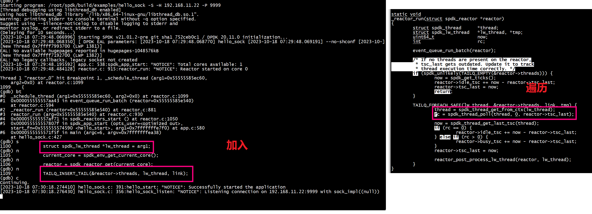

# run

```
build/examples/poller_test 
hello reader 
hello poller
hello poller
hello poller
hello poller
hello poller
hello poller
hello poller
hello poller
hello poller
hello poller
hello poller
hello poller
hello poller
hello poller
hello poller
hello poller
hello poller
hello poller
hello poller
hello poller
hello poller
hello poller
hello poller
hello poller
```

```
root@ubuntu:~# ps -T -p 1225
    PID    SPID TTY          TIME CMD
   1225    1225 ttyS0    00:00:24 poller_test
   1225    1226 ttyS0    00:00:00 eal-intr-thread
   1225    1227 ttyS0    00:00:00 poller_test
root@ubuntu:~# 

```

# 结构

+  spdk_thread_lib_init_ext 设置g_thread_op_fn和 g_thread_op_supported_fn，mempool  
   spdk_thread_lib_init功能比spdk_thread_lib_init_ext功能简单些   
+  main core 调用spdk_thread_create调用g_thread_op_fn 或g_new_thread_fn   
   spdk_thread_create创建的线程，需要调用spdk_thread_send_msg发送消息   
   spdk_thread_create回调g_thread_op_fn(thread, SPDK_THREAD_OP_NEW)，g_thread_op_fn调用spdk_thread_send_msg发送消息   
+  slave core 调用spdk_env_thread_launch_pinned-->rte_eal_remote_launch    
+  SPDK_POLLER_REGISTER 注册poller(per linux thread),spdk_thread_poll调用poller的callback
+  main线程调用nvmf_reactor_run   
+  slave线程调用nvmf_reactor_run   
+  poller有分为定时和非定时，通过spdk_poller_register注册poller给指定线程。其中Reactor有个轮训函数，就是一个while(1) {}，先处理msg，在轮询处理非定时poller，最后轮询处理定时poller     

## 5个问题
+ 问题1 什么情况下触发创建struct nvmf_reactor *nvmf_reactor ？reactor要执行spdk_ring_dequeue --> spdk_thread_poll   
     Reactor有个轮训函数，就是一个while(1) {}，先处理msg，在轮询处理非定时poller，最后轮询处理定时poller       
+ 问题2 什么情况下触发spdk_thread_create ？新的spdk_thread根据cpu_set通过spdk_ring_enqueue给哪些reactor发送消息   

+ 问题3 spdk_thread_send_msg和spdk_ring_enqueue(g_main_reactor->threads）的消息怎么执行   
     + ***a***  thread_poll--> msg_queue_run_batch --> msg->fn(msg->arg) 处理thread->messages,spdk_thread_send_msg执行enqueue thread->messages   
	  spdk_thread_send_msg(thread, hello_reader, NULL);    
	  
	 + ***b***  spdk_ring_enqueue(g_main_reactor->threads）,Reactor实现， 
	     
		 
+ 问题4 spdk_thread func 怎么被reactor调用   
+ a 创建线程   
```
    struct nvmf_lw_thread *lw_thread;  
    lw_thread = spdk_thread_get_ctx(thread);
    assert(lw_thread != NULL);
    memset(lw_thread, 0, sizeof(*lw_thread));
    spdk_ring_enqueue(g_main_reactor->threads, (void **)&lw_thread, 1, NULL);
    spdk_thread_send_msg(thread, hello_reader, NULL);	
```
+ b 执行线程回调   
```
	if (spdk_ring_dequeue(nvmf_reactor->threads, (void **)&lw_thread, 1)) {
			thread = spdk_thread_get_from_ctx(lw_thread);
```
reactor的thread管理
 

+ 问题5 spdk thread调度到哪个一个reactor    
    直接绑定到spdk_ring_enqueue(g_main_reactor->threads, (void **)&lw_thread, 1, NULL);
## spdk thread调度到哪个一个reactor
```

        spdk_thread_lib_init_ext(reactor_thread_op, reactor_thread_op_supported,
                                 sizeof(struct spdk_lw_thread));
```
reactor_thread_op执行：
+ 1 根据 cpumask选择core
+ 2 准备spdk_event_allocate(core, _schedule_thread, lw_thread, NULL)消息
+ 3 spdk_event_call(evt)根据core选择 reactor = spdk_reactor_get(event->lcore)， 给core发送schedule_thread消息
```

struct spdk_event *
spdk_event_allocate(uint32_t lcore, spdk_event_fn fn, void *arg1, void *arg2)
{
        struct spdk_event *event = NULL;
        struct spdk_reactor *reactor = spdk_reactor_get(lcore);

        if (!reactor) {
                assert(false);
                return NULL;
        }

        event = spdk_mempool_get(g_spdk_event_mempool);
        if (event == NULL) {
                assert(false);
                return NULL;
        }

        event->lcore = lcore;
        event->fn = fn;
        event->arg1 = arg1;
        event->arg2 = arg2;

        return event;
}
```
### cpumask设置

```
static void
nvmf_tgt_create_poll_groups(void)
{
      uint32_t  current_core;
      struct spdk_cpuset tmp_cpumask = {};
      uint32_t i;
      char thread_name[32];
      struct spdk_thread *thread;
      current_core = spdk_env_get_current_core();
      SPDK_ENV_FOREACH_CORE(i) {
          if (i != current_core) {
#if 1
	               spdk_cpuset_zero(&tmp_cpumask);
			       spdk_cpuset_set_cpu(&tmp_cpumask, i, true);
			       snprintf(thread_name, sizeof(thread_name), "nvmf_tgt_poll_group_%u", i);
			       thread = spdk_thread_create(thread_name, &tmp_cpumask);
			       assert(thread != NULL);
			       spdk_thread_send_msg(thread, nvmf_tgt_create_poll_group, g_group_ctx + i);
#endif
	 }
      }
}
```

# spdk_env_thread_launch_pinned

```
spdk_env_thread_launch_pinned(uint32_t core, thread_start_fn fn, void *arg)
{
        int rc;

        rc = rte_eal_remote_launch(fn, arg, core);

        return rc;
}
```


#  spdk_thread_create 使用

```
static void hello_start(void *arg1)
{
    struct spdk_thread* thread = spdk_thread_create("first_reader_thread", NULL);
    struct nvmf_lw_thread *lw_thread;
    lw_thread = spdk_thread_get_ctx(thread);
    assert(lw_thread != NULL);
    memset(lw_thread, 0, sizeof(*lw_thread));
    spdk_ring_enqueue(g_main_reactor->threads, (void **)&lw_thread, 1, NULL);
    spdk_thread_send_msg(thread, hello_reader, NULL);
    g_poller = SPDK_POLLER_REGISTER(poller_stop, NULL, g_time_in_sec * 1000000ULL);
    printf("hello start \n");
#if 0
    // will cause coredump
    spdk_app_stop(0);
#endif
}
```

#  poller callback(周期性地)
nvmf_reactor_run -->  spdk_thread_poll -->  poller callback   


```
(gdb) bt
#0  poller_stop (arg=0x0) at poller_test.c:31
#1  0x000055555557b65d in thread_poll (now=1515459461490, 
    max_msgs=<optimized out>, thread=0x555555853d20) at thread.c:696
#2  spdk_thread_poll (thread=0x555555853d20, max_msgs=<optimized out>, 
    now=1515459461490) at thread.c:740
#3  0x0000555555573317 in nvmf_reactor_run (arg=0x5555557ec430)
    at poller_test.c:115
#4  0x0000555555570ef2 in main (argc=<optimized out>, argv=<optimized out>)
    at poller_test.c:301
(gdb) 
```


#  nvmf_schedule_spdk_thread


# cpu set mask
