# run
参考spdk/rdma-example   
```
./build/bin/nvmf_tgt -m 0xf
```
# i 两类poller
+  1 周期性nvmf_tgt_accept poller   

+  2 nvmf_tgt_create_poll_group注册poller,执行ibv_poll_cq   
```
group->poller = SPDK_POLLER_REGISTER(nvmf_poll_group_poll, group, 0)
```

# i spdk_nvmf_tgt_create
 gdb ./build/bin/nvmf_tgt执行润命令就会执行到断点spdk_nvmf_tgt_create，不需要外界触发    
1) 注册nvmf_tgt_accept poller（周期性）

```
        tgt->accept_poller = SPDK_POLLER_REGISTER(nvmf_tgt_accept, tgt, acceptor_poll_rate);
        if (!tgt->accept_poller) {
                pthread_mutex_destroy(&tgt->mutex);
                free(tgt->subsystems);
                free(tgt);
                return NULL;
        }

        spdk_io_device_register(tgt,
                                nvmf_tgt_create_poll_group,
                                nvmf_tgt_destroy_poll_group,
                                sizeof(struct spdk_nvmf_poll_group),
                                tgt->name);
```
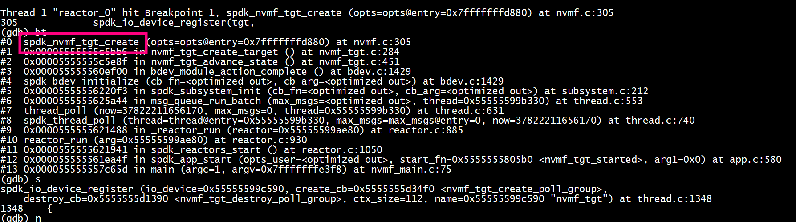

## ii spdk_get_io_channel
    spdk_get_io_channel -->  dev->create_cb也就是nvmf_tgt_create_poll_group   

## ii 发送nvmf_tgt_create_poll_group(启动时触发，不需要外界触发)

```
static void
nvmf_tgt_create_poll_groups(void)
{
        struct spdk_cpuset tmp_cpumask = {};
        uint32_t i;
        char thread_name[32];
        struct spdk_thread *thread;

        g_tgt_init_thread = spdk_get_thread();
        assert(g_tgt_init_thread != NULL);

        SPDK_ENV_FOREACH_CORE(i) {
                spdk_cpuset_zero(&tmp_cpumask);
                spdk_cpuset_set_cpu(&tmp_cpumask, i, true);
                snprintf(thread_name, sizeof(thread_name), "nvmf_tgt_poll_group_%u", i);

                thread = spdk_thread_create(thread_name, &tmp_cpumask);
                assert(thread != NULL);

                spdk_thread_send_msg(thread, nvmf_tgt_create_poll_group, NULL);
        }
}

```

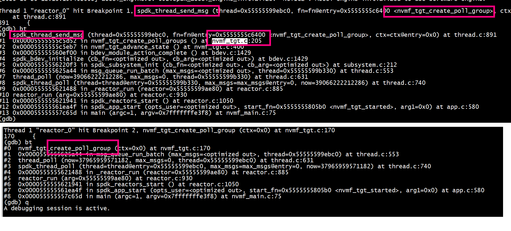

###  ii     rdma_create_event_channel
执行 spdk/scripts/rpc.py nvmf_create_transport -t RDMA -u 16384 -m 8 -c 8192   

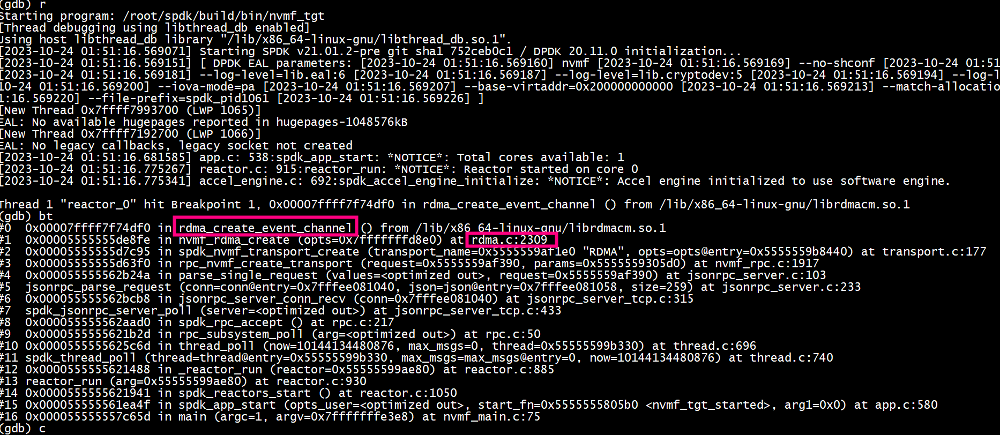


### ii rdma_create_qp(要等到host connect)

```
  qp_init_attr.recv_cq = cq; /* Where should I notify for receive completion operations */
  qp_init_attr.send_cq = cq; /* Where should I notify for send completion operations */
  ret = rdma_create_qp(cm_client_id /* which connection id */,
		       pd /* which protection domain*/,
		       &qp_init_attr /* Initial attributes */)
```
+ rdma_create_qp(cm_client_id需要client id、需要pd、 需要qp_init_attr.send_cq、 qp_init_attr.recv_cq 
+ ibv_alloc_pd 和ibv_create_cq 不需要cm_client_id

执行完 spdk/scripts/rpc.py nvmf_subsystem_add_listener nqn.2016-06.io.spdk:cnode1 -t RDMA -a 192.168.11.22 -s 4420
没有执行rdma_create_qp   
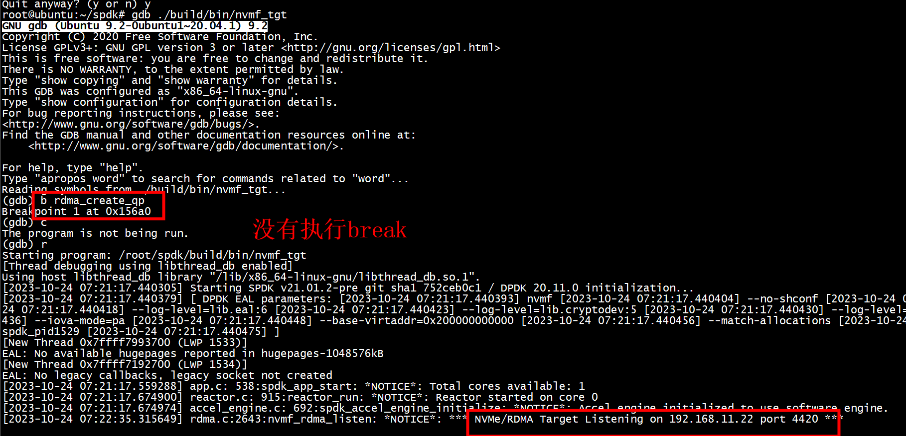

host执行nvme discover -t rdma -a 192.168.11.22 -s 4420 触发rdma_create_qp


### ii  ibv_alloc_pd  ibv_create_cq (target端)
执行 spdk/scripts/rpc.py nvmf_create_transport -t RDMA -u 16384 -m 8 -c 8192 
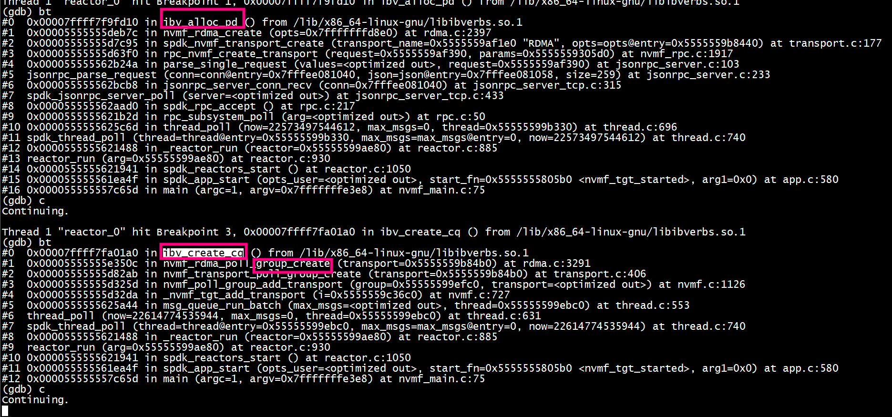

+ lib/nvmf/rdma.c   
```
2397                         device->pd = ibv_alloc_pd(device->context);
```

+ lib/nvmf/rdma.c   
```
3291                 poller->cq = ibv_create_cq(device->context, num_cqe, poller, NULL, 0);
```

#  i rdma_create_id  rdma_bind_addr rdma_listen
spdk/scripts/rpc.py nvmf_subsystem_add_listener nqn.2016-06.io.spdk:cnode1 -t RDMA -a 192.168.11.22 -s 4420   
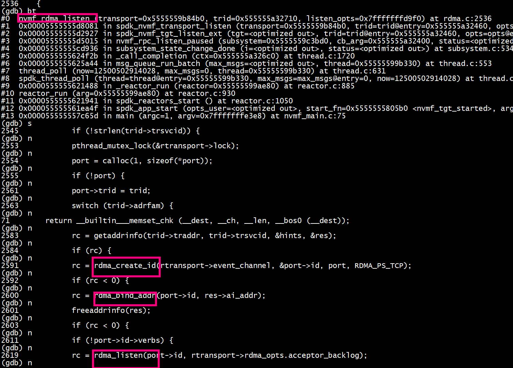


# i ibv_poll_cq
nvmf_tgt_create_poll_group注册poller:   
```
group->poller = SPDK_POLLER_REGISTER(nvmf_poll_group_poll, group, 0)
```
最终调用ibv_poll_cq
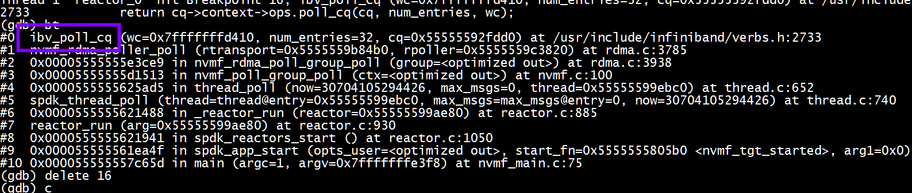
## ii ibv_poll_cq 处理 RDMA_WR_TYPE_SEND、RDMA_WR_TYPE_RECV


## 怎么处理 RDMA_WR_TYPE_SEND、RDMA_WR_TYPE_RECV completion_events
process_work_completion_events(io_completion_channel, &wc, 1) --> ibv_poll_cq
rdma也采用ibv_poll_cq   


# i accept （周期性nvmf_tgt_accept poller）
rdma_get_cm_event处理RDMA_CM_EVENT_CONNECT_REQUEST   
+ 1  调用linux poll(rtransport->poll_fds, rtransport->npoll_fds, 0)    
+ 2  nvmf_process_cm_event -->  rdma_get_cm_event处理RDMA_CM_EVENT_CONNECT_REQUEST   
+ 3  nvmf_process_cm_event -->nvmf_rdma_connect -->  spdk_nvmf_tgt_new_qpair -->    
     + a) spdk_nvmf_get_optimal_poll_group(选举)    
     + b) spdk_thread_send_msg(group->thread, _nvmf_poll_group_add, ctx)(发送消息)    
+ 4  nvmf_poll_group_add -->…… ***rdma_create_qp/rdma_accept***     

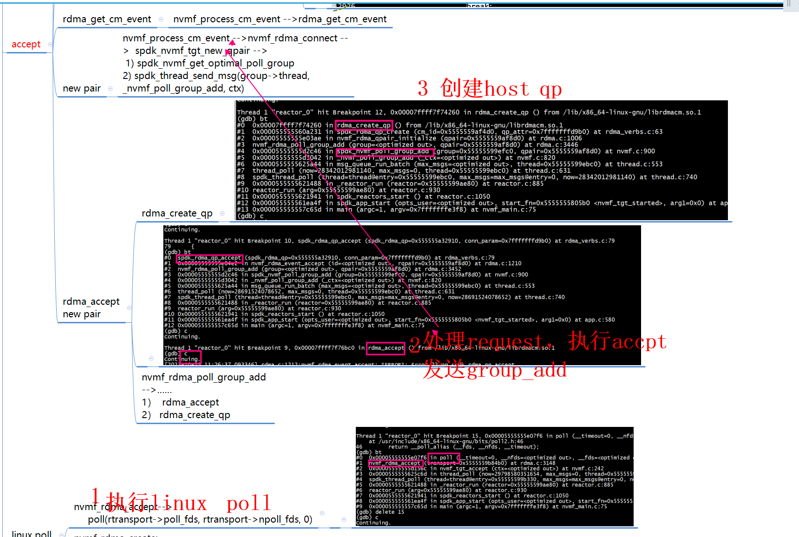

## ii 怎么标识client
```
nvmf_rdma_connect
   rqpair->listen_id = event->listen_id;
   rqpair->cm_id = event->id;
```
### iii example

cm_event->id标识client  
  
```Text
start_rdma_server
   process_rdma_cm_event(cm_event_channel, 
			RDMA_CM_EVENT_CONNECT_REQUEST,
			&cm_event);
   cm_client_id = cm_event->id;
   rdma_ack_cm_event(cm_event);
   rdma_accept(cm_client_id, &conn_param);
setup_client_resources
   ibv_alloc_pd
   ibv_create_cq
accept_client_connection
   process_rdma_cm_event(cm_event_channel, 
		       RDMA_CM_EVENT_ESTABLISHED,
		       &cm_event);
   rdma_get_cm_event(echannel, cm_event)
   rdma_ack_cm_event(cm_event)
```
## ii RDMA_CM_EVENT_ESTABLISHED
target不需要处理 RDMA_CM_EVENT_ESTABLISHED    
rdma_connect后执行nvme_rdma_process_event(rqpair, rctrlr->cm_channel, RDMA_CM_EVENT_ESTABLISHED)  
```
ret = rdma_connect(rqpair->cm_id, &param);
ret = nvme_rdma_process_event(rqpair, rctrlr->cm_channel, RDMA_CM_EVENT_ESTABLISHED);
```

# i mem reg

```
device->pd = ibv_alloc_pd(device->context);
device->map = spdk_rdma_create_mem_map(device->pd, &g_nvmf_hooks);
```
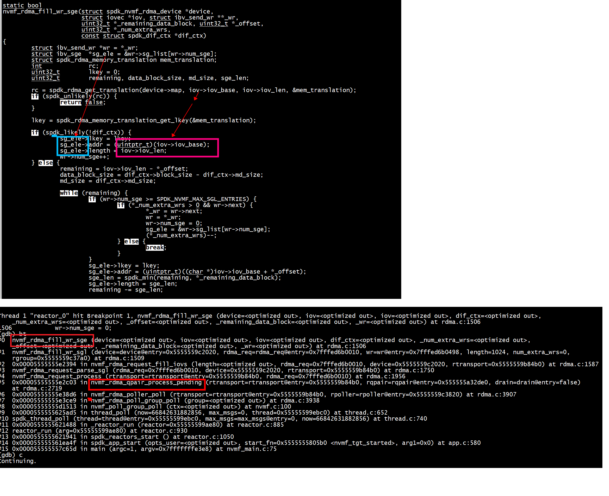

# i host 端

rdma write/read只能由target发起

## ii rdma_create_qp host端
host执行 nvme discover -t rdma -a 192.168.11.22 -s 4420   
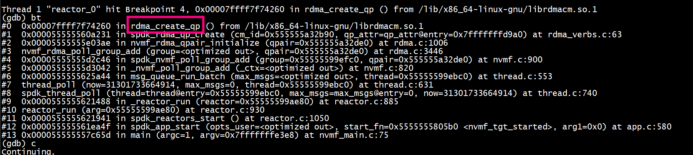

host执行
 nvme connect -t rdma -n "nqn.2016-06.io.spdk:cnode1" -a 192.168.11.22 -s 4420
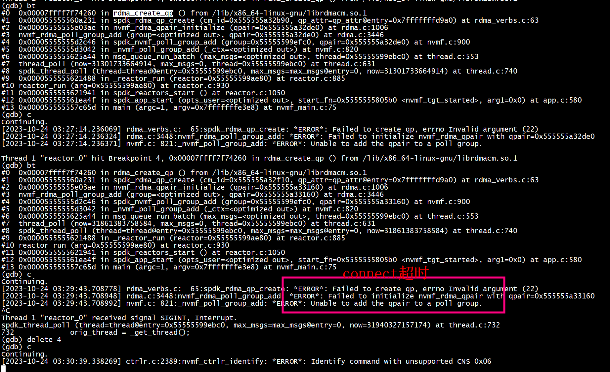

## ii qp_init_attr

spdk_rdma_qp_create --> rdma_create_qp   
```

static int
nvmf_rdma_qpair_initialize(struct spdk_nvmf_qpair *qpair)
{
        qp_init_attr.qp_context = rqpair;
        qp_init_attr.pd         = device->pd;
        qp_init_attr.send_cq    = rqpair->poller->cq;
        qp_init_attr.recv_cq    = rqpair->poller->cq;
		rqpair->rdma_qp = spdk_rdma_qp_create(rqpair->cm_id, &qp_init_attr);
}
```