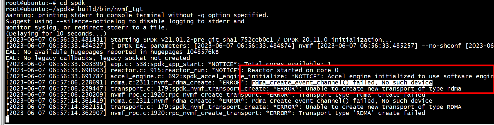
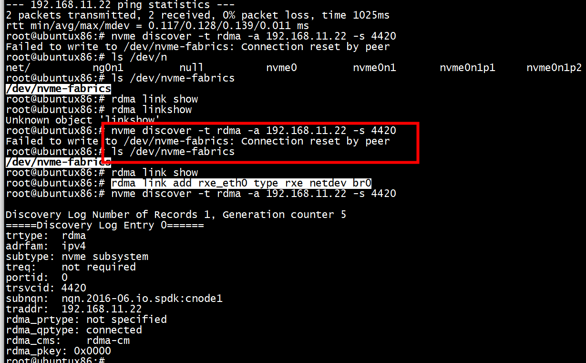

# build

rdma支持
```Shell
# apt-get install libibverbs-dev librdmacm-dev （或者yum install libibverbs-devel librdmacm-devel）
```

```Shell
git clone https://github.com/spdk/spdk

cd spdk

git submodule update --init

scripts/pkgdep.sh

./configure --with-rdma

make
```
# target 

## 代码

./app/nvmf_tgt/nvmf_main.c

## rdma.c:2311:nvmf_rdma_create: *ERROR*: rdma_create_event_channel() failed, No such device




需要通过rdma link add添加rdma 设备

```Shell
root@ubuntu:~# rdma link
root@ubuntu:~# rdma link add rxe_eth0 type rxe netdev ens4
root@ubuntu:~# rdma link show 
link rxe_eth0/1 state ACTIVE physical_state LINK_UP netdev ens4 
root@ubuntu:~# spdk/scripts/rpc.py nvmf_create_transport -t RDMA -u 16384 -m 8 -c 8192
root@ubuntu:~# 
```

## 总结

1） iptables -F  
2） rdma link add rxe_eth0 type rxe netdev ens4  
3）modprobe nvme_rdma （spdk不需要）    
4）scripts/setup.sh   
5)  启动target  
spdk/build/bin/nvmf_tgt     
spdk/scripts/rpc.py nvmf_create_transport -t RDMA -u 16384 -m 8 -c 8192   
spdk/scripts/rpc.py bdev_nvme_attach_controller -b NVMe1 -t PCIe -a 0000:00:03.0   
spdk/scripts/rpc.py nvmf_create_subsystem nqn.2016-06.io.spdk:cnode1 -a -s SPDK00000000000001 -d SPDK_Controller1  
spdk/scripts/rpc.py nvmf_subsystem_add_ns nqn.2016-06.io.spdk:cnode1 NVMe1n1  
spdk/scripts/rpc.py nvmf_subsystem_add_listener nqn.2016-06.io.spdk:cnode1 -t RDMA -a 192.168.11.22 -s 4420 

nvmf_subsystem_add_listener不是创建tcp server   
```
root@ubuntu:~# spdk/scripts/rpc.py nvmf_subsystem_add_listener nqn.2016-06.io.spdk:cnode1 -t RDMA -a 192.168.11.22 -s 4420
root@ubuntu:~# netstat -pan | grep 4420
root@ubuntu:~# 
```

# 查询接口

```
root@ubuntu:~# spdk/scripts/rpc.py -h | grep nvmf
    nvmf_set_max_subsystems (set_nvmf_target_max_subsystems)
    nvmf_set_config (set_nvmf_target_config)
    nvmf_create_transport
    nvmf_get_transports (get_nvmf_transports)
                        Display nvmf transports
    nvmf_get_subsystems (get_nvmf_subsystems)
                        Display nvmf subsystems
    nvmf_create_subsystem (nvmf_subsystem_create)
    nvmf_delete_subsystem (delete_nvmf_subsystem)
                        Delete a nvmf subsystem
    nvmf_subsystem_add_listener
    nvmf_subsystem_remove_listener
    nvmf_subsystem_listener_set_ana_state
    nvmf_subsystem_add_ns
    nvmf_subsystem_remove_ns
    nvmf_subsystem_add_host
    nvmf_subsystem_remove_host
    nvmf_subsystem_allow_any_host
    nvmf_subsystem_get_controllers
    nvmf_subsystem_get_qpairs
    nvmf_subsystem_get_listeners
    nvmf_get_stats     
```

```
root@ubuntu:~# spdk/scripts/rpc.py get_nvmf_subsystems
[
  {
    "nqn": "nqn.2014-08.org.nvmexpress.discovery",
    "subtype": "Discovery",
    "listen_addresses": [],
    "allow_any_host": true,
    "hosts": []
  },
  {
    "nqn": "nqn.2016-06.io.spdk:cnode1",
    "subtype": "NVMe",
    "listen_addresses": [],
    "allow_any_host": true,
    "hosts": [],
    "serial_number": "SPDK00000000000001",
    "model_number": "SPDK_Controller1",
    "max_namespaces": 32,
    "namespaces": [
      {
        "nsid": 1,
        "bdev_name": "NVMe1n1",
        "name": "NVMe1n1",
        "uuid": "2a90e548-e212-433f-96e3-092a7f69a18b"
      }
    ]
  }
]
get_nvmf_subsystems is deprecated, use nvmf_get_subsystems instead.
root@ubuntu:~#
```

```
root@ubuntu:~# spdk/scripts/rpc.py bdev_nvme_get_controllers
[
  {
    "name": "NVMe1",
    "trid": {
      "trtype": "PCIe",
      "traddr": "0000:00:03.0"
    }
  }
]
```

```
root@ubuntu:~#  spdk/scripts/rpc.py nvmf_subsystem_get_listeners   nqn.2014-08.org.nvmexpress.discovery
[]
```

```
root@ubuntu:~# spdk/scripts/rpc.py nvmf_get_transports
[
  {
    "trtype": "RDMA",
    "max_queue_depth": 128,
    "max_io_qpairs_per_ctrlr": 8,
    "in_capsule_data_size": 8192,
    "max_io_size": 131072,
    "io_unit_size": 16384,
    "max_aq_depth": 128,
    "num_shared_buffers": 4095,
    "buf_cache_size": 32,
    "dif_insert_or_strip": false,
    "max_srq_depth": 4096,
    "no_srq": false,
    "acceptor_backlog": 100,
    "no_wr_batching": false,
    "abort_timeout_sec": 1
  }
]
```


#  删除  target
spdk/scripts/rpc.py  nvmf_subsystem_remove_listener  nqn.2016-06.io.spdk:cnode1 -t RDMA -a 192.168.11.22 -s 4420  
spdk/scripts/rpc.py nvmf_subsystem_remove_ns nqn.2016-06.io.spdk:cnode1   1    
spdk/scripts/rpc.py delete_nvmf_subsystem nqn.2016-06.io.spdk:cnode1   
spdk/scripts/rpc.py bdev_nvme_detach_controller  NVMe1   

 
##  nvmf_subsystem_remove_ns
```
root@ubuntu:~# spdk/scripts/rpc.py nvmf_subsystem_remove_ns nqn nqn.2016-06.io.spdk:cnode1  nsid 1
usage: rpc.py [options] nvmf_subsystem_remove_ns [-h] [-t TGT_NAME] nqn nsid
rpc.py [options] nvmf_subsystem_remove_ns: error: argument nsid: invalid int value: 'nqn.2016-06.io.spdk:cnode1'
root@ubuntu:~# spdk/scripts/rpc.py nvmf_subsystem_remove_ns nqn.2016-06.io.spdk:cnode1   1
```


# host
1) modprobe nvme-rdma  
2) modprobe rdma_rxe 
3) iptables -F  
4) rdma link add rxe_eth0 type rxe netdev br0  
5) nvme discover -t rdma -a 192.168.11.22 -s 4420  
6) nvme connect -t rdma -n "nqn.2016-06.io.spdk:cnode1" -a 192.168.11.22 -s 4420  
7） nvme disconnect -n "nqn.2016-06.io.spdk:cnode1"  

```
root@ubuntux86:# modprobe nvme-rdma
root@ubuntux86:# lsmod | grep rxe
root@ubuntux86:# modprobe rdma_rxe
root@ubuntux86:# lsmod | grep rxe
rdma_rxe              122880  0
ib_uverbs             159744  1 rdma_rxe
ip6_udp_tunnel         16384  1 rdma_rxe
udp_tunnel             20480  1 rdma_rxe
ib_core               360448  6 rdma_cm,rdma_rxe,nvme_rdma,iw_cm,ib_uverbs,ib_cm
root@ubuntux86:#
```

```
root@ubuntux86:# rdma link add rxe_eth0 type rxe netdev br0
root@ubuntux86:# nvme discover -t rdma -a 192.168.11.22 -s 4420

Discovery Log Number of Records 1, Generation counter 5
=====Discovery Log Entry 0======
trtype:  rdma
adrfam:  ipv4
subtype: nvme subsystem
treq:    not required
portid:  0
trsvcid: 4420
subnqn:  nqn.2016-06.io.spdk:cnode1
traddr:  192.168.11.22
rdma_prtype: not specified
rdma_qptype: connected
rdma_cms:    rdma-cm
rdma_pkey: 0x0000
root@ubuntux86:#  nvme connect -t rdma -n "nqn.2016-06.io.spdk:cnode1" -a 192.168.11.22 -s 4420
```
##  Failed to write to /dev/nvme-fabrics: Connection reset by peer


需要添加rdma设备，rdma link add rxe_eth0 type rxe netdev br0

# process

```
root@ubuntu:~# ps -elf | grep nvme
1 I root         218       2  0  60 -20 -     0 rescue 06:54 ?        00:00:00 [nvme-wq]
1 I root         219       2  0  60 -20 -     0 rescue 06:54 ?        00:00:00 [nvme-reset-wq]
1 I root         220       2  0  60 -20 -     0 rescue 06:54 ?        00:00:00 [nvme-delete-wq]
1 I root         221       2  0  60 -20 -     0 rescue 06:54 ?        00:00:00 [nvme-auth-wq]
0 S root        1273     993  0  80   0 -  2042 pipe_r 08:07 pts/0    00:00:00 grep --color=auto nvme
root@ubuntu:~# ps -elf | grep nvmf_tgt
4 R root        1074     888 99  80   0 - 16839730 -   06:56 ttyS0    01:12:13 build/bin/nvmf_tgt
0 S root        1275     993  0  80   0 -  2042 pipe_r 08:08 pts/0    00:00:00 grep --color=auto nvmf_tgt
root@ubuntu:~#
```

# nvmf_rdma_poll_group_create

1) 调用spdk/scripts/rpc.py nvmf_create_transport -t RDMA -u 16384 -m 8 -c 8192 触发poll_group_create

```
(gdb) bt
#0  nvmf_rdma_poll_group_create (transport=0x5555559b84b0) at rdma.c:3212
#1  0x00005555555d82ab in nvmf_transport_poll_group_create (transport=0x5555559b84b0) at transport.c:406
#2  0x00005555555d325d in nvmf_poll_group_add_transport (group=0x55555599efc0, transport=<optimized out>) at nvmf.c:1126
#3  0x00005555555d32da in _nvmf_tgt_add_transport (i=0x5555559c36c0) at nvmf.c:727
#4  0x0000555555625a44 in msg_queue_run_batch (max_msgs=<optimized out>, thread=0x55555599ebc0) at thread.c:553
#5  thread_poll (now=36496463166128, max_msgs=0, thread=0x55555599ebc0) at thread.c:631
#6  spdk_thread_poll (thread=thread@entry=0x55555599ebc0, max_msgs=max_msgs@entry=0, now=36496463166128) at thread.c:740
#7  0x0000555555621488 in _reactor_run (reactor=0x55555599ae80) at reactor.c:885
#8  reactor_run (arg=0x55555599ae80) at reactor.c:930
#9  0x0000555555621941 in spdk_reactors_start () at reactor.c:1050
#10 0x000055555561ea4f in spdk_app_start (opts_user=<optimized out>, start_fn=0x5555555805b0 <nvmf_tgt_started>, arg1=0x0) at app.c:580
#11 0x000055555557c65d in main (argc=1, argv=0x7fffffffe3c8) at nvmf_main.c:75
(gdb) c
Continuing.
```


  