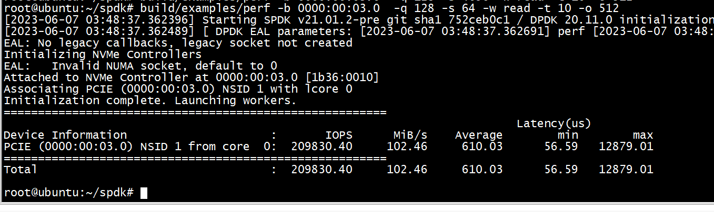
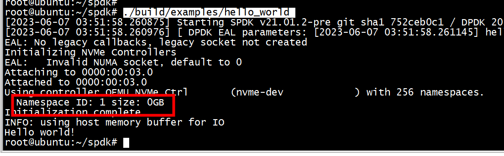

# perf

```Shell
 build/examples/perf -b 0000:00:03.0  -q 128 -s 64 -w read -t 10 -o 512
```



#   identify 

```
root@ubuntu:~/spdk# ./build/examples/identify 
```


# hello_world 

```
root@ubuntu:~/spdk/examples/nvme/hello_world# ls
Makefile  hello_world.c
root@ubuntu:~/spdk/examples/nvme/hello_world# make
  CC hello_world/hello_world.o
  LINK hello_world
```

```
./build/examples/hello_world 
```




# spdk_mmio_write_4

```
(gdb) bt
#0  spdk_mmio_write_4 (val=4604000, addr=0x201000800014) at /root/spdk/include/spdk/mmio.h:94
#1  nvme_pcie_ctrlr_set_reg_4 (ctrlr=0x2000003e6200, offset=<optimized out>, value=4604000) at nvme_pcie.c:195
#2  0x000055555557d77b in nvme_ctrlr_set_cc (cc=0x7fffffffdf30, ctrlr=0x2000003e6200) at nvme_ctrlr.c:3056
#3  nvme_ctrlr_process_init (ctrlr=ctrlr@entry=0x2000003e6200) at nvme_ctrlr.c:3056
#4  0x000055555558dd9b in nvme_ctrlr_poll_internal (probe_ctx=0x555555887730, ctrlr=0x2000003e6200) at nvme.c:1518
#5  spdk_nvme_probe_poll_async (probe_ctx=probe_ctx@entry=0x555555887730) at nvme.c:1518
#6  0x000055555558df58 in nvme_init_controllers (probe_ctx=<optimized out>) at nvme.c:755
#7  spdk_nvme_probe (trid=<optimized out>, cb_ctx=0x0, probe_cb=0x5555555752d0 <probe_cb>, attach_cb=<optimized out>, remove_cb=<optimized out>) at nvme.c:903
#8  0x00005555555731c6 in main (argc=<optimized out>, argv=0x7fffffffe3d8) at hello_world.c:460
(gdb) c
Continuing.

Thread 1 "hello_world" hit Breakpoint 3, spdk_mmio_write_4 (val=2031647, addr=0x201000800024) at /root/spdk/include/spdk/mmio.h:94
94              *addr = val;
(gdb) bt
#0  spdk_mmio_write_4 (val=2031647, addr=0x201000800024) at /root/spdk/include/spdk/mmio.h:94
#1  nvme_pcie_ctrlr_set_reg_4 (value=2031647, offset=36, ctrlr=0x2000003e6200) at nvme_pcie.c:195
#2  nvme_pcie_ctrlr_set_aqa (aqa=<synthetic pointer>, pctrlr=0x2000003e6200) at nvme_pcie.c:263
#3  nvme_pcie_ctrlr_enable (ctrlr=0x2000003e6200) at nvme_pcie.c:722
#4  0x000055555557d5af in nvme_ctrlr_enable (ctrlr=0x2000003e6200) at nvme_ctrlr.c:3111
#5  nvme_ctrlr_process_init (ctrlr=ctrlr@entry=0x2000003e6200) at nvme_ctrlr.c:3111
#6  0x000055555558dd9b in nvme_ctrlr_poll_internal (probe_ctx=0x555555887730, ctrlr=0x2000003e6200) at nvme.c:1518
#7  spdk_nvme_probe_poll_async (probe_ctx=probe_ctx@entry=0x555555887730) at nvme.c:1518
#8  0x000055555558df58 in nvme_init_controllers (probe_ctx=<optimized out>) at nvme.c:755
#9  spdk_nvme_probe (trid=<optimized out>, cb_ctx=0x0, probe_cb=0x5555555752d0 <probe_cb>, attach_cb=<optimized out>, remove_cb=<optimized out>) at nvme.c:903
#10 0x00005555555731c6 in main (argc=<optimized out>, argv=0x7fffffffe3d8) at hello_world.c:460
(gdb) c
```

##  sq_doorbell

```
(gdb) bt
#0  spdk_mmio_write_4 (val=1, addr=0x201000801000) at /root/spdk/include/spdk/mmio.h:94
#1  nvme_pcie_qpair_ring_sq_doorbell (qpair=0x2000003e6058) at nvme_pcie_internal.h:264
#2  nvme_pcie_qpair_submit_tracker (qpair=0x2000003e6058, tr=<optimized out>) at nvme_pcie_common.c:598
#3  0x00005555555882d3 in nvme_pcie_qpair_submit_request (qpair=0x2000003e6058, req=<optimized out>) at nvme_pcie.c:1281
#4  0x000055555558a7fd in _nvme_qpair_submit_request (qpair=0x2000003e6058, req=0x2000003e5e40) at nvme_qpair.c:926
#5  0x000055555558afb2 in nvme_qpair_submit_request (qpair=0x2000003e6058, req=0x2000003e5e40) at nvme_qpair.c:976
#6  0x000055555557bdf0 in nvme_ctrlr_submit_admin_request (ctrlr=ctrlr@entry=0x2000003e6200, req=<optimized out>) at nvme_ctrlr.c:3426
#7  0x0000555555578625 in nvme_ctrlr_cmd_identify (ctrlr=ctrlr@entry=0x2000003e6200, cns=cns@entry=1 '\001', cntid=cntid@entry=0, nsid=nsid@entry=0, 
    csi=csi@entry=0 '\000', payload=payload@entry=0x2000003e67f0, payload_size=4096, cb_fn=0x55555557a810 <nvme_ctrlr_identify_done>, cb_arg=0x2000003e6200)
    at nvme_ctrlr_cmd.c:158
#8  0x000055555557d525 in nvme_ctrlr_identify (ctrlr=0x2000003e6200) at nvme_ctrlr.c:1598
#9  nvme_ctrlr_process_init (ctrlr=ctrlr@entry=0x2000003e6200) at nvme_ctrlr.c:3135
#10 0x000055555558dd9b in nvme_ctrlr_poll_internal (probe_ctx=0x555555887730, ctrlr=0x2000003e6200) at nvme.c:1518
#11 spdk_nvme_probe_poll_async (probe_ctx=probe_ctx@entry=0x555555887730) at nvme.c:1518
#12 0x000055555558df58 in nvme_init_controllers (probe_ctx=<optimized out>) at nvme.c:755
#13 spdk_nvme_probe (trid=<optimized out>, cb_ctx=0x0, probe_cb=0x5555555752d0 <probe_cb>, attach_cb=<optimized out>, remove_cb=<optimized out>) at nvme.c:903
#14 0x00005555555731c6 in main (argc=<optimized out>, argv=0x7fffffffe3d8) at hello_world.c:460
```

##  cq_doorbell

**调用nvme_pcie_qpair_process_completions触发**

```
(gdb) bt
#0  spdk_mmio_write_4 (val=1, addr=0x201000801004) at /root/spdk/include/spdk/mmio.h:94
#1  nvme_pcie_qpair_ring_cq_doorbell (qpair=0x2000003e6058) at nvme_pcie_internal.h:285
#2  nvme_pcie_qpair_process_completions (qpair=0x2000003e6058, max_completions=<optimized out>) at nvme_pcie_common.c:841
#3  0x000055555558b145 in spdk_nvme_qpair_process_completions (qpair=0x2000003e6058, max_completions=max_completions@entry=0) at nvme_qpair.c:715
#4  0x000055555557d4b6 in nvme_ctrlr_process_init (ctrlr=ctrlr@entry=0x2000003e6200) at nvme_ctrlr.c:3221
#5  0x000055555558dd9b in nvme_ctrlr_poll_internal (probe_ctx=0x555555887730, ctrlr=0x2000003e6200) at nvme.c:1518
#6  spdk_nvme_probe_poll_async (probe_ctx=probe_ctx@entry=0x555555887730) at nvme.c:1518
#7  0x000055555558df58 in nvme_init_controllers (probe_ctx=<optimized out>) at nvme.c:755
#8  spdk_nvme_probe (trid=<optimized out>, cb_ctx=0x0, probe_cb=0x5555555752d0 <probe_cb>, attach_cb=<optimized out>, remove_cb=<optimized out>) at nvme.c:903
#9  0x00005555555731c6 in main (argc=<optimized out>, argv=0x7fffffffe3d8) at hello_world.c:460
```

spdk_nvme_ctrlr_connect_io_qpair触发  
```
(gdb) bt
#0  nvme_pcie_qpair_ring_cq_doorbell (qpair=0x2000003e6058) at nvme_pcie_internal.h:273
#1  nvme_pcie_qpair_process_completions (qpair=0x2000003e6058, max_completions=<optimized out>) at nvme_pcie_common.c:841
#2  0x000055555558b145 in spdk_nvme_qpair_process_completions (qpair=qpair@entry=0x2000003e6058, max_completions=max_completions@entry=0) at nvme_qpair.c:715
#3  0x000055555558bd32 in nvme_wait_for_completion_robust_lock_timeout (qpair=0x2000003e6058, status=0x555555887ad0, robust_mutex=0x0, timeout_in_usecs=<optimized out>)
    at nvme.c:301
#4  0x0000555555586aab in _nvme_pcie_ctrlr_create_io_qpair (qid=<optimized out>, qpair=0x2000004ffe58, ctrlr=0x2000003e6200) at nvme_pcie_common.c:453
#5  nvme_pcie_ctrlr_connect_qpair (ctrlr=0x2000003e6200, qpair=0x2000004ffe58) at nvme_pcie_common.c:522
#6  0x000055555558ebdb in nvme_transport_ctrlr_connect_qpair (ctrlr=ctrlr@entry=0x2000003e6200, qpair=qpair@entry=0x2000004ffe58) at nvme_transport.c:309
#7  0x000055555557b21b in spdk_nvme_ctrlr_connect_io_qpair (ctrlr=ctrlr@entry=0x2000003e6200, qpair=qpair@entry=0x2000004ffe58) at nvme_ctrlr.c:354
#8  0x000055555557f379 in spdk_nvme_ctrlr_alloc_io_qpair (ctrlr=0x2000003e6200, user_opts=<optimized out>, opts_size=<optimized out>) at nvme_ctrlr.c:418
#9  0x0000555555573214 in hello_world () at hello_world.c:216
#10 main (argc=<optimized out>, argv=<optimized out>) at hello_world.c:474
```
spdk_nvme_qpair_process_completions触发  
```
#0  nvme_pcie_qpair_ring_cq_doorbell (qpair=0x2000004ffe58) at nvme_pcie_internal.h:273
#1  nvme_pcie_qpair_process_completions (qpair=0x2000004ffe58, max_completions=<optimized out>) at nvme_pcie_common.c:841
#2  0x000055555558b145 in spdk_nvme_qpair_process_completions (qpair=0x2000004ffe58, max_completions=0) at nvme_qpair.c:715
#3  0x0000555555573313 in hello_world () at hello_world.c:298
#4  main (argc=<optimized out>, argv=<optimized out>) at hello_world.c:474
```
spdk_nvme_ctrlr_free_io_qpair 触发  
```
(gdb) bt
#0  nvme_pcie_qpair_ring_cq_doorbell (qpair=0x2000003e6058) at nvme_pcie_internal.h:273
#1  nvme_pcie_qpair_process_completions (qpair=0x2000003e6058, max_completions=<optimized out>) at nvme_pcie_common.c:841
#2  0x000055555558b145 in spdk_nvme_qpair_process_completions (qpair=qpair@entry=0x2000003e6058, max_completions=max_completions@entry=0) at nvme_qpair.c:715
#3  0x000055555558bd32 in nvme_wait_for_completion_robust_lock_timeout (qpair=0x2000003e6058, status=0x555555887f30, robust_mutex=0x0, timeout_in_usecs=<optimized out>)
    at nvme.c:301
#4  0x000055555558783c in nvme_pcie_ctrlr_delete_io_qpair (ctrlr=0x2000003e6200, qpair=0x2000004ffe58) at nvme_pcie_common.c:961
#5  0x000055555557f5e4 in spdk_nvme_ctrlr_free_io_qpair (qpair=0x2000004ffe58) at nvme_ctrlr.c:554
#6  0x0000555555573324 in hello_world () at hello_world.c:307
#7  main (argc=<optimized out>, argv=<optimized out>) at hello_world.c:474
```

# qpair_submit_request

```
<A> nvme_pcie_qpair_submit_request
<B> nvme_rdma_qpair_submit_request
<C> nvme_tcp_qpair_submit_request
```

bdev框架对NVME盘的具体实现  
```
bdev_io_do_submit
  spdk_bdev->fn_table->submit_request
  bdev_nvme_submit_request
    bdev_nvme_readv
      spdk_nvme_ns_cmd_read_with_md
        nvme_qpair_submit_request
           nvme_transport_qpair_submit_request
              spdk_nvme_transport->ops.qpair_submit_request
              <A> nvme_pcie_qpair_submit_request
              <B> nvme_rdma_qpair_submit_request
              <C> nvme_tcp_qpair_submit_request
```

```
      bdev_nvme_readv_done
        bdev_nvme_io_complete_nvme_status
          spdk_bdev_io_complete_nvme_status    
            spdk_bdev_io_complete
              bdev_io_complete
                spdk_bdev_io->internal.cb
                // spdk_bdev_io_completion_cb
```
## 读写请求-PCIe接口
```
nvme_transport_qpair_submit_request
   spdk_nvme_transport->ops.qpair_submit_request
   nvme_pcie_qpair_submit_request
       nvme_pcie_qpair_build_metadata
       nvme_pcie_qpair_submit_tracker
           // Copy the command from the submit-tracker to submission-queue
           nvme_pcie_copy_command
           nvme_pcie_qpair_ring_sq_doorbell
```
## nvme_pcie_qpair_submit_request

```
(gdb) bt
#0  nvme_pcie_qpair_submit_request (qpair=0x20001b8ffdd8, req=0x20001b8fd800) at nvme_pcie.c:1223
#1  0x00005555555f6a3d in _nvme_qpair_submit_request (qpair=0x20001b8ffdd8, req=0x20001b8fd800) at nvme_qpair.c:926
#2  0x00005555555f71f2 in nvme_qpair_submit_request (qpair=qpair@entry=0x20001b8ffdd8, req=0x20001b8fd800) at nvme_qpair.c:976
#3  0x00005555555ef2d3 in spdk_nvme_ns_cmd_read_with_md (ns=0x2000166c17c0, qpair=0x20001b8ffdd8, buffer=<optimized out>, metadata=<optimized out>, 
    lba=lba@entry=16968, lba_count=lba_count@entry=8, cb_fn=<optimized out>, cb_arg=<optimized out>, io_flags=<optimized out>, apptag_mask=<optimized out>, 
    apptag=<optimized out>) at nvme_ns_cmd.c:641
#4  0x0000555555583945 in bdev_nvme_readv (ns=<optimized out>, qpair=<optimized out>, bio=bio@entry=0x200006d2a468, iov=iov@entry=0x7fffed6b25f8, 
    iovcnt=<optimized out>, md=<optimized out>, lba_count=8, lba=16968, flags=0) at bdev_nvme.c:2531
#5  0x0000555555584abf in _bdev_nvme_submit_request (bdev_io=0x200006d2a100, ch=0x5555559c58e0) at bdev_nvme.c:680
#6  bdev_nvme_submit_request (ch=0x5555559c58e0, bdev_io=0x200006d2a100) at bdev_nvme.c:787
#7  0x00005555556137be in bdev_io_do_submit (bdev_io=<optimized out>, bdev_ch=<optimized out>) at bdev.c:1901
#8  _bdev_io_submit (ctx=<optimized out>) at bdev.c:2300
#9  bdev_io_submit (bdev_io=0x200006d2a100) at bdev.c:2417
#10 0x0000555555613c4c in bdev_readv_blocks_with_md (desc=desc@entry=0x555555a316a0, ch=ch@entry=0x5555559c57e0, iov=iov@entry=0x7fffed6b25f8, iovcnt=1, 
    md_buf=md_buf@entry=0x0, offset_blocks=16968, num_blocks=8, cb=0x5555555cbc30 <nvmf_bdev_ctrlr_complete_cmd>, cb_arg=0x7fffed6b24d0) at bdev.c:3652
#11 0x0000555555613c8d in spdk_bdev_readv_blocks (desc=desc@entry=0x555555a316a0, ch=ch@entry=0x5555559c57e0, iov=iov@entry=0x7fffed6b25f8, 
    iovcnt=<optimized out>, offset_blocks=<optimized out>, num_blocks=<optimized out>, cb=0x5555555cbc30 <nvmf_bdev_ctrlr_complete_cmd>, cb_arg=0x7fffed6b24d0)
    at bdev.c:3661
#12 0x00005555555cc32e in nvmf_bdev_ctrlr_read_cmd (bdev=0x555555a30f20, desc=0x555555a316a0, ch=0x5555559c57e0, req=req@entry=0x7fffed6b24d0)
    at ctrlr_bdev.c:289
#13 0x00005555555ca80f in nvmf_ctrlr_process_io_cmd (req=req@entry=0x7fffed6b24d0) at ctrlr.c:3410
#14 0x00005555555cb3b1 in spdk_nvmf_request_exec (req=0x7fffed6b24d0) at ctrlr.c:3659
#15 0x00005555555e198e in nvmf_rdma_request_process (rtransport=rtransport@entry=0x5555559b84b0, rdma_req=0x7fffed6b24d0) at rdma.c:2041
#16 0x00005555555e2c03 in nvmf_rdma_qpair_process_pending (rtransport=rtransport@entry=0x5555559b84b0, rqpair=rqpair@entry=0x555555a33080, 
    drain=drain@entry=false) at rdma.c:2719
#17 0x00005555555e38d6 in nvmf_rdma_poller_poll (rtransport=rtransport@entry=0x5555559b84b0, rpoller=rpoller@entry=0x5555559c3820) at rdma.c:3907
#18 0x00005555555e3ce9 in nvmf_rdma_poll_group_poll (group=<optimized out>) at rdma.c:3938
#19 0x00005555555d1513 in nvmf_poll_group_poll (ctx=<optimized out>) at nvmf.c:100
#20 0x0000555555625ad5 in thread_poll (now=20030980520588, max_msgs=0, thread=0x55555599ebc0) at thread.c:652
#21 spdk_thread_poll (thread=thread@entry=0x55555599ebc0, max_msgs=max_msgs@entry=0, now=20030980520588) at thread.c:740
#22 0x0000555555621488 in _reactor_run (reactor=0x55555599ae80) at reactor.c:885
#23 reactor_run (arg=0x55555599ae80) at reactor.c:930
#24 0x0000555555621941 in spdk_reactors_start () at reactor.c:1050
#25 0x000055555561ea4f in spdk_app_start (opts_user=<optimized out>, start_fn=0x5555555805b0 <nvmf_tgt_started>, arg1=0x0) at app.c:580
#26 0x000055555557c65d in main (argc=1, argv=0x7fffffffe3e8) at nvmf_main.c:75
(gdb) c
Continuing.

```


## 读写请求-RDMA接口
```
nvme_transport_qpair_submit_request
   spdk_nvme_transport->ops.qpair_submit_request
   nvme_rdma_qpair_submit_request
       nvme_rdma_req_init
           nvme_rdma_build_sgl_request
       nvme_rdma_qpair_queue_send_wr
           spdk_rdma_qp_queue_send_wrs
               ibv_wr_send
               ibv_wr_send_inv
               ibv_wr_rdma_read
               ibv_wr_rdma_write
               ibv_wr_set_sge_list
           nvme_rdma_qpair_submit_sends
               spdk_rdma_qp_flush_send_wrs
                   ibv_wr_complete
```

# create qpair
*1)* nvme_pcie_qpair_construct创建qpair  
*2)* nvme_pcie_ctrlr_construct_admin_qpair

```
        pqpair->sq_tdbl = pctrlr->doorbell_base + (2 * qpair->id + 0) * pctrlr->doorbell_stride_u32;
        pqpair->cq_hdbl = pctrlr->doorbell_base + (2 * qpair->id + 1) * pctrlr->doorbell_stride_u32;
```


##  sq_tdbl
nvme_pcie_qpair_ring_sq_doorbell 写  sq_tdbl
```
spdk_mmio_write_4(pqpair->sq_tdbl, pqpair->sq_tail)
```

##  cq_hdbl

```
spdk_mmio_write_4(pqpair->cq_hdbl, pqpair->cq_head);
```

# SPDK_NVME_OPC_CREATE_IO_CQ  and   SPDK_NVME_OPC_CREATE_IO_SQ
*1)* nvme_pcie_ctrlr_cmd_create_io_cq 调用 SPDK_NVME_OPC_CREATE_IO_CQ命令
*2)*  nvme_pcie_ctrlr_cmd_create_io_sq  调用 SPDK_NVME_OPC_CREATE_IO_SQ命令


```
static int
_nvme_pcie_ctrlr_create_io_qpair(struct spdk_nvme_ctrlr *ctrlr, struct spdk_nvme_qpair *qpair,
                                 uint16_t qid)
{
        struct nvme_pcie_ctrlr  *pctrlr = nvme_pcie_ctrlr(ctrlr);
        struct nvme_pcie_qpair  *pqpair = nvme_pcie_qpair(qpair);
        struct nvme_completion_poll_status      *status;
        int                                     rc;

        status = calloc(1, sizeof(*status));
        if (!status) {
                SPDK_ERRLOG("Failed to allocate status tracker\n");
                return -ENOMEM;
        }

        rc = nvme_pcie_ctrlr_cmd_create_io_cq(ctrlr, qpair, nvme_completion_poll_cb, status);
        if (rc != 0) {
                free(status);
                return rc;
        }

        if (nvme_wait_for_completion(ctrlr->adminq, status)) {
                SPDK_ERRLOG("nvme_create_io_cq failed!\n");
                if (!status->timed_out) {
                        free(status);
                }
                return -1;
        }

        memset(status, 0, sizeof(*status));
        rc = nvme_pcie_ctrlr_cmd_create_io_sq(qpair->ctrlr, qpair, nvme_completion_poll_cb, status);
		        if (nvme_wait_for_completion(ctrlr->adminq, status)) {
                SPDK_ERRLOG("nvme_create_io_sq failed!\n");
                if (status->timed_out) {
                        /* Request is still queued, the memory will be freed in a completion callback.
                           allocate a new request */
                        status = calloc(1, sizeof(*status));
                        if (!status) {
                                SPDK_ERRLOG("Failed to allocate status tracker\n");
                                return -ENOMEM;
                        }
                }

                memset(status, 0, sizeof(*status));
                /* Attempt to delete the completion queue */
                rc = nvme_pcie_ctrlr_cmd_delete_io_cq(qpair->ctrlr, qpair, nvme_completion_poll_cb, status);
                if (rc != 0) {
                        /* The originall or newly allocated status structure can be freed since
                         * the corresponding request has been completed of failed to submit */
                        free(status);
                        return -1;
                }
                nvme_wait_for_completion(ctrlr->adminq, status);
                if (!status->timed_out) {
                        /* status can be freed regardless of nvme_wait_for_completion return value */
                        free(status);
                }
                return -1;
        }
```