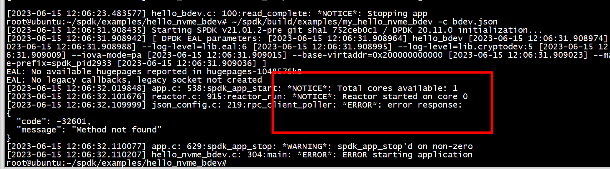
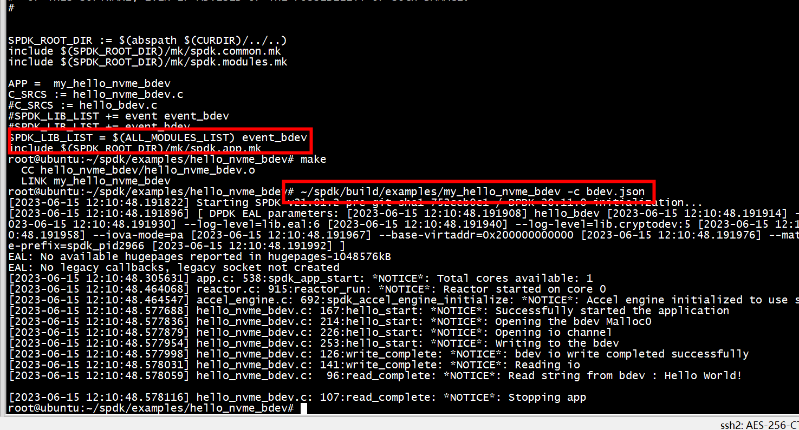
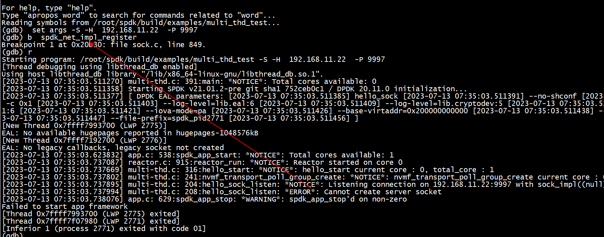

# rpc_client_poller: *ERROR*: error response




原来是有些module没有编译   
```
SPDK_ROOT_DIR := $(abspath $(CURDIR)/../..)
include $(SPDK_ROOT_DIR)/mk/spdk.common.mk
include $(SPDK_ROOT_DIR)/mk/spdk.modules.mk

APP =  my_hello_nvme_bdev
C_SRCS := hello_nvme_bdev.c
#C_SRCS := hello_bdev.c
SPDK_LIB_LIST += event event_bdev
#SPDK_LIB_LIST += event_bdev
#SPDK_LIB_LIST = $(ALL_MODULES_LIST) event_bdev
include $(SPDK_ROOT_DIR)/mk/spdk.app.mk
```
添加SPDK_LIB_LIST = $(ALL_MODULES_LIST)编译选项   
```
SPDK_LIB_LIST = $(ALL_MODULES_LIST) event_bdev
```



# *NOTICE*: Listening connection on 192.168.11.22:9997 with sock_impl((null))
```
./hello_sock -S -H  192.168.11.22  -P 9999
```

spdk_net_impl_register没有加载   
Makefile 加上SPDK_LIB_LIST  += $(SOCK_MODULES_LIST)