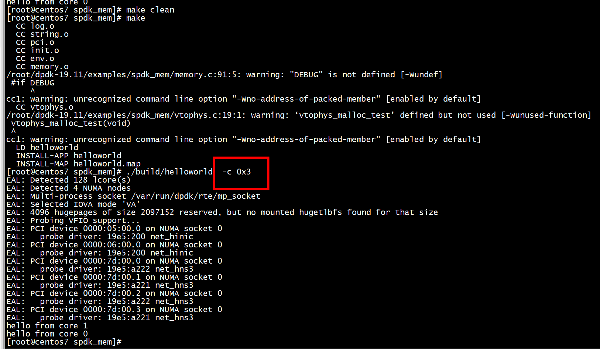

# 大页内存

```
 ./usertools/dpdk-setup.sh
```

# 添加include目录 和忽略警告

```
CFLAGS += -O3 -DDEBUG=1
CFLAGS += -I$(SRCDIR)/inc
CFLAGS += $(WERROR_FLAGS) -Wno-error=deprecated-declarations -Wno-deprecated-declarations -Wno-pointer-arith -Wno-unused-parameter -Wno-missing-prototypes\
-Wno-cast-qual -Wno-missing-declarations -Wno-nested-externs -Wno-missing-field-initializers
```

#   RTE_SDK

```
export RTE_SDK=~/dpdk-19.11
```

# run


```
./build/helloworld  -c 0x3
```




## env 初始化

```
int
spdk_env_dpdk_post_init(bool legacy_mem)
{
        int rc;

        pci_env_init();

        rc = mem_map_init(legacy_mem);
        if (rc < 0) {
                SPDK_ERRLOG("Failed to allocate mem_map\n");
                return rc;
        }

        rc = vtophys_init();
        if (rc < 0) {
                SPDK_ERRLOG("Failed to initialize vtophys\n");
                return rc;
        }

        return 0;
}

void
spdk_env_dpdk_post_fini(void)
{
        vtophys_fini();

        pci_env_fini();

        free_args(g_eal_cmdline, g_eal_cmdline_argcount);
        g_eal_cmdline = NULL;
        g_eal_cmdline_argcount = 0;
}
```

# spdk_mem_register

```
(gdb) bt
#0  spdk_mem_register (vaddr=0x120000000, len=536870912) at /root/dpdk-19.11/examples/spdk_mem/memory.c:385
#1  0x000000000055a1f0 in rte_memseg_contig_walk ()
#2  0x000000000048bf5c in mem_map_init (legacy_mem=legacy_mem@entry=false) at /root/dpdk-19.11/examples/spdk_mem/memory.c:763
#3  0x0000000000486f90 in spdk_env_dpdk_post_init (legacy_mem=legacy_mem@entry=false) at /root/dpdk-19.11/examples/spdk_mem/init.c:496
#4  0x000000000047b4ec in main (argc=<optimized out>, argv=<optimized out>) at /root/dpdk-19.11/examples/spdk_mem/vtophys.c:298
(gdb) 
```