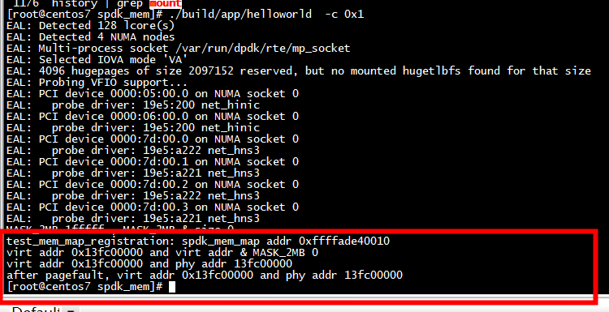
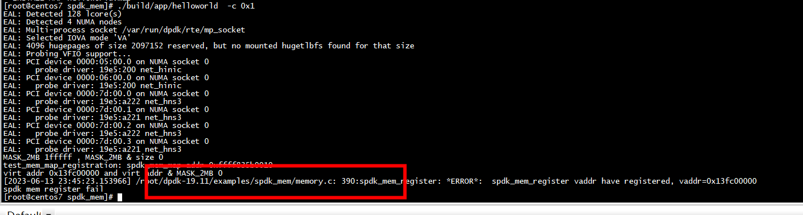

# hugetlbfs

```
 mount -t hugetlbfs nodev /mnt/huge
```

# 地址对齐

spdk_mem_register：

```
int
spdk_mem_register(void *vaddr, size_t len)
{
        struct spdk_mem_map *map;
        int rc;
        void *seg_vaddr;
        size_t seg_len;
        uint64_t reg;

        if ((uintptr_t)vaddr & ~MASK_256TB) {
                DEBUG_PRINT("invalid usermode virtual address %p\n", vaddr);
                return -EINVAL;
        }

        if (((uintptr_t)vaddr & MASK_2MB) || (len & MASK_2MB)) {
                DEBUG_PRINT("invalid %s parameters, vaddr=%p len=%ju\n",
                            __func__, vaddr, len);
                return -EINVAL;
        }
```

# test1

不调用spdk_mem_register(ptr,  size)



```
static int
test_mem_map_registration(void)
{
        struct spdk_mem_map *map;
        int rc = 0;
        char* ptr;
        uint64_t default_translation = 0xDEADBEEF0BADF00D;
        uint64_t size =0x200000;
        uint64_t paddr;
        map = spdk_mem_map_alloc(SPDK_VTOPHYS_ERROR, &test_mem_map_ops, NULL);
        //map = spdk_mem_map_alloc(default_translation, &test_mem_map_ops, NULL);
        //  MASK_2MB=1fffff
        printf("MASK_2MB %llx , MASK_2MB & size %llx \n", MASK_2MB, MASK_2MB & size);
        printf("%s: spdk_mem_map addr %p \n", __func__,map);
        SPDK_CU_ASSERT_FATAL(map != NULL);
        //ptr = (char *)malloc(size);
        ptr = (char *)rte_malloc("test",0x200000,0x200000);
        printf("virt addr %p and virt addr & MASK_2MB %llx \n", ptr, MASK_2MB&(uint64_t)ptr);
        paddr = spdk_vtophys(ptr, &size);
        printf("virt addr %p and phy addr %lx \n", ptr, paddr);
        *ptr= 'A';
        paddr = spdk_vtophys(ptr, &size);
        printf("after pagefault, virt addr %p and phy addr %lx \n", ptr, paddr);
        spdk_mem_map_free(&map);
        CU_ASSERT(map == NULL);
        rte_free(ptr);
        return rc;
}
```
# test2

调用spdk_mem_register(ptr,  size)




```
static int
test_mem_map_registration(void)
{
        struct spdk_mem_map *map;
        int rc = 0;
        char* ptr;
        uint64_t default_translation = 0xDEADBEEF0BADF00D;
        uint64_t size =0x200000;
        uint64_t paddr;
        map = spdk_mem_map_alloc(SPDK_VTOPHYS_ERROR, &test_mem_map_ops, NULL);
        //map = spdk_mem_map_alloc(default_translation, &test_mem_map_ops, NULL);
        //  MASK_2MB=1fffff
        printf("MASK_2MB %llx , MASK_2MB & size %llx \n", MASK_2MB, MASK_2MB & size);
        printf("%s: spdk_mem_map addr %p \n", __func__,map);
        SPDK_CU_ASSERT_FATAL(map != NULL);
        //ptr = (char *)malloc(size);
        ptr = (char *)rte_malloc("test",0x200000,0x200000);
        printf("virt addr %p and virt addr & MASK_2MB %llx \n", ptr, MASK_2MB&(uint64_t)ptr);
        rc = spdk_mem_register(ptr,  size);
        if (rc) {
             printf("spdk mem register fail \n");
             return 0;
        }
        paddr = spdk_vtophys(ptr, &size);
        printf("virt addr %p and phy addr %lx \n", ptr, paddr);
        *ptr= 'A';
        paddr = spdk_vtophys(ptr, &size);
        printf("after pagefault, virt addr %p and phy addr %lx \n", ptr, paddr);
        spdk_mem_map_free(&map);
        CU_ASSERT(map == NULL);
        rte_free(ptr);
        return rc;
}
```
## spdk_mem_register vaddr have registered

原因是rte_memseg_contig_walk调用了spdk_mem_register
# spdk_mem_register

```
(gdb) bt
#0  spdk_mem_register (vaddr=0x120000000, len=536870912) at /root/dpdk-19.11/examples/spdk_mem/memory.c:385
#1  0x000000000055a1f0 in rte_memseg_contig_walk ()
#2  0x000000000048bf5c in mem_map_init (legacy_mem=legacy_mem@entry=false) at /root/dpdk-19.11/examples/spdk_mem/memory.c:763
#3  0x0000000000486f90 in spdk_env_dpdk_post_init (legacy_mem=legacy_mem@entry=false) at /root/dpdk-19.11/examples/spdk_mem/init.c:496
#4  0x000000000047b4ec in main (argc=<optimized out>, argv=<optimized out>) at /root/dpdk-19.11/examples/spdk_mem/vtophys.c:298
(gdb) 
```