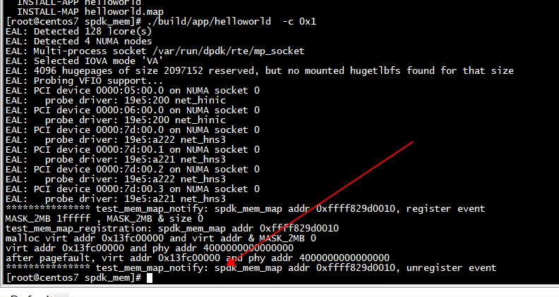
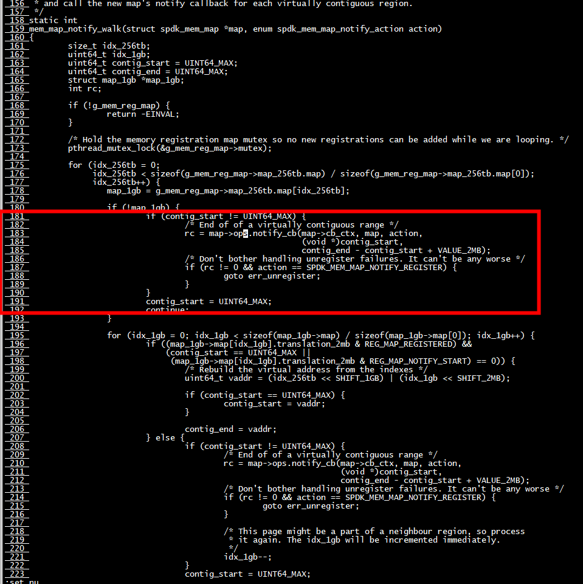
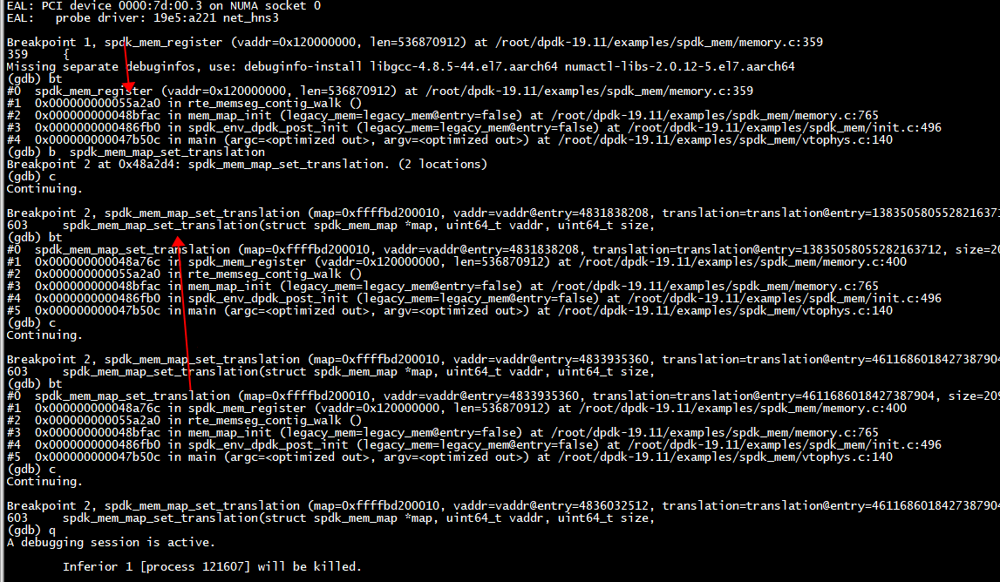
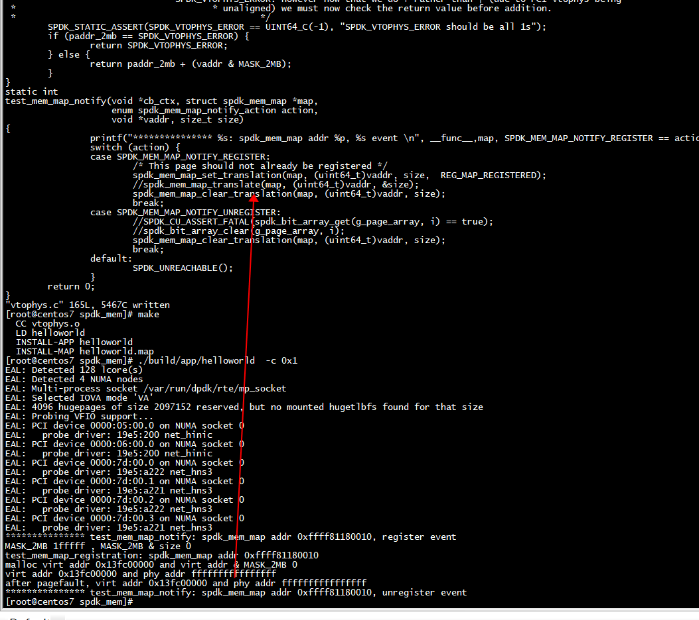

#   查找页表 spdk_mem_map_translate

 spdk_mem_map_translate： 查找页表，进行地址转换  
 
 ```C
 test_spdk_vtophys(struct spdk_mem_map *vtophys_map, const void *buf, uint64_t *size)
{
        uint64_t vaddr, paddr_2mb;

        vaddr = (uint64_t)buf;
        paddr_2mb = spdk_mem_map_translate(vtophys_map, vaddr, size);

        /*
 *          * SPDK_VTOPHYS_ERROR has all bits set, so if the lookup returned SPDK_VTOPHYS_ERROR,
 *                   * we will still bitwise-or it with the buf offset below, but the result will still be
 *                            * SPDK_VTOPHYS_ERROR. However now that we do + rather than | (due to PCI vtophys being
 *                                     * unaligned) we must now check the return value before addition.
 *                                              */
        SPDK_STATIC_ASSERT(SPDK_VTOPHYS_ERROR == UINT64_C(-1), "SPDK_VTOPHYS_ERROR should be all 1s");
        if (paddr_2mb == SPDK_VTOPHYS_ERROR) {
                return SPDK_VTOPHYS_ERROR;
        } else {
                return paddr_2mb + (vaddr & MASK_2MB);
        }
}
 ```
 
# 建立页表 spdk_mem_map_set_translation 

spdk_mem_map_set_translation(map, (uint64_t)vaddr, size,  REG_MAP_REGISTERED)： 建立页表  


# run

```C
static int
test_mem_map_registration(void)
{
        struct spdk_mem_map *map;
        int rc = 0;
        char* ptr;
        //uint64_t default_translation = 0xDEADBEEF0BADF00D;
        uint64_t size =0x200000;
        uint64_t paddr;
        map = spdk_mem_map_alloc(SPDK_VTOPHYS_ERROR, &test_mem_map_ops, NULL);
        //  MASK_2MB=1fffff
        printf("MASK_2MB %llx , MASK_2MB & size %llx \n", MASK_2MB, MASK_2MB & size);
        printf("%s: spdk_mem_map addr %p \n", __func__,map);
        SPDK_CU_ASSERT_FATAL(map != NULL);
        //ptr = (char *)malloc(size);
        ptr = (char *)rte_malloc("test",0x200000,0x200000);
        printf("malloc virt addr %p and virt addr & MASK_2MB %llx \n", ptr, MASK_2MB&(uint64_t)ptr);
#if 0
        rc = spdk_mem_register(ptr,  size);
        if (rc) {
             printf("spdk mem register fail \n");
             return 0;
        }
#endif
        paddr = test_spdk_vtophys(map,ptr, &size);
        printf("virt addr %p and phy addr %lx \n", ptr, paddr);
        //*ptr= 'A';
        paddr = test_spdk_vtophys(map,ptr, &size);
        printf("after pagefault, virt addr %p and phy addr %lx \n", ptr, paddr);
        spdk_mem_map_free(&map);
        CU_ASSERT(map == NULL);
        //free(ptr);
        rte_free(ptr);
        return rc;
}
```




# test_mem_map_notify


```

Breakpoint 1, test_mem_map_notify (cb_ctx=0x0, map=0xffffbcbd0010, action=SPDK_MEM_MAP_NOTIFY_REGISTER, vaddr=0x120000000, size=536870912) at /root/dpdk-19.11/examples/spdk_mem/vtophys.c:63
63      {
Missing separate debuginfos, use: debuginfo-install libgcc-4.8.5-44.el7.aarch64 numactl-libs-2.0.12-5.el7.aarch64
(gdb) bt
#0  test_mem_map_notify (cb_ctx=0x0, map=0xffffbcbd0010, action=SPDK_MEM_MAP_NOTIFY_REGISTER, vaddr=0x120000000, size=536870912) at /root/dpdk-19.11/examples/spdk_mem/vtophys.c:63
#1  0x0000000000489d80 in mem_map_notify_walk (map=map@entry=0xffffbcbd0010, action=action@entry=SPDK_MEM_MAP_NOTIFY_REGISTER) at /root/dpdk-19.11/examples/spdk_mem/memory.c:183
#2  0x000000000048a538 in spdk_mem_map_alloc (default_translation=default_translation@entry=18446744073709551615, ops=ops@entry=0x9472e8 <test_mem_map_ops>, cb_ctx=cb_ctx@entry=0x0) at /root/dpdk-19.11/examples/spdk_mem/memory.c:309
#3  0x000000000048c66c in test_mem_map_registration () at /root/dpdk-19.11/examples/spdk_mem/vtophys.c:99
#4  0x000000000047b560 in lcore_hello (arg=0x0) at /root/dpdk-19.11/examples/spdk_mem/vtophys.c:128
#5  main (argc=<optimized out>, argv=<optimized out>) at /root/dpdk-19.11/examples/spdk_mem/vtophys.c:160
(gdb) 
```



***根据g_mem_reg_map 建立***  


## g_mem_reg_map中页表的建立

spdk_mem_register调用spdk_mem_map_set_translation建立页表  



#  删除页表 spdk_mem_map_clear_translation 

调用spdk_mem_map_clear_translation(map, (uint64_t)vaddr, size)会删除页表  



```Shell
virt addr 0x13fc00000 and phy addr ffffffffffffffff 
after pagefault, virt addr 0x13fc00000 and phy addr ffffffffffffffff 
```
删除页表后，phy addr ffffffffffffffff   

```C
static int
test_mem_map_notify(void *cb_ctx, struct spdk_mem_map *map,
                    enum spdk_mem_map_notify_action action,
                    void *vaddr, size_t size)
{
                printf("*************** %s: spdk_mem_map addr %p, %s event \n", __func__,map, SPDK_MEM_MAP_NOTIFY_REGISTER == action ? "register": "unregister");
                switch (action) {
                case SPDK_MEM_MAP_NOTIFY_REGISTER:
                        /* This page should not already be registered */
                        spdk_mem_map_set_translation(map, (uint64_t)vaddr, size,  REG_MAP_REGISTERED);
                        //spdk_mem_map_translate(map, (uint64_t)vaddr, &size);
                        spdk_mem_map_clear_translation(map, (uint64_t)vaddr, size);
                        break;
            
}
```
 
