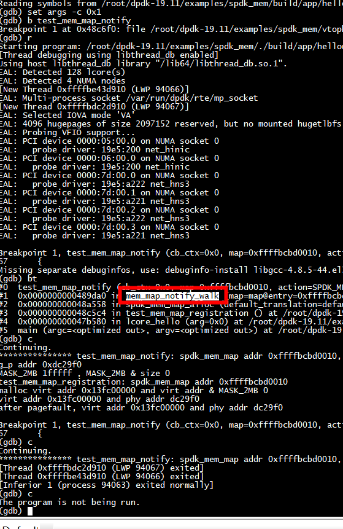
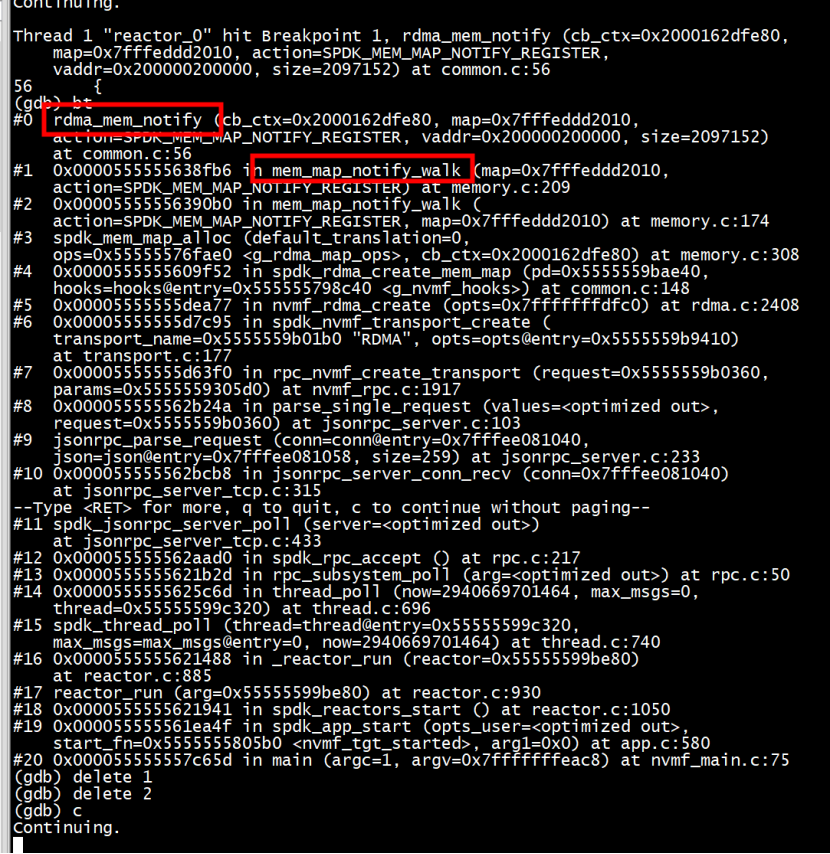
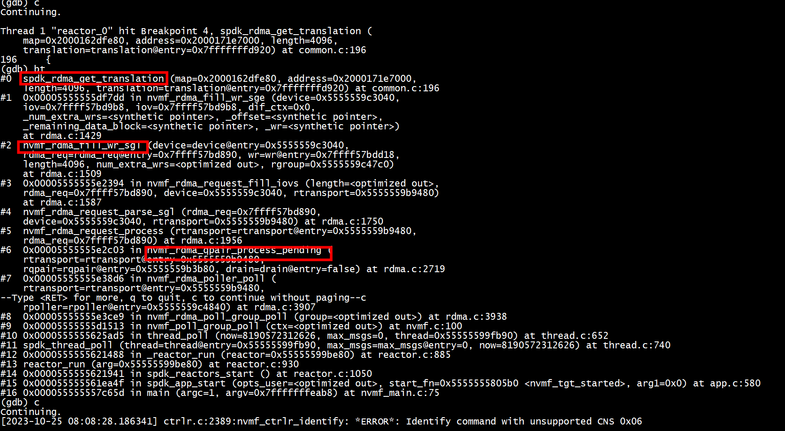
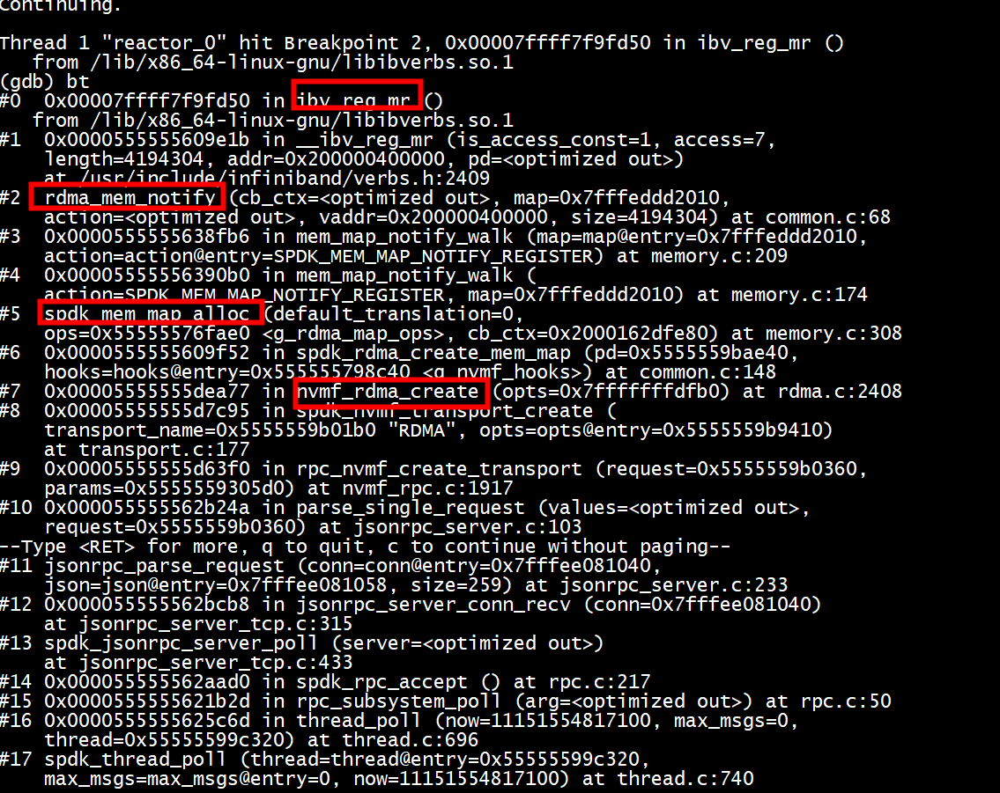
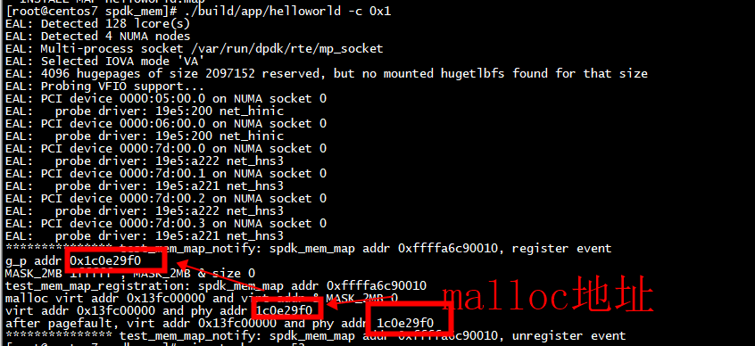
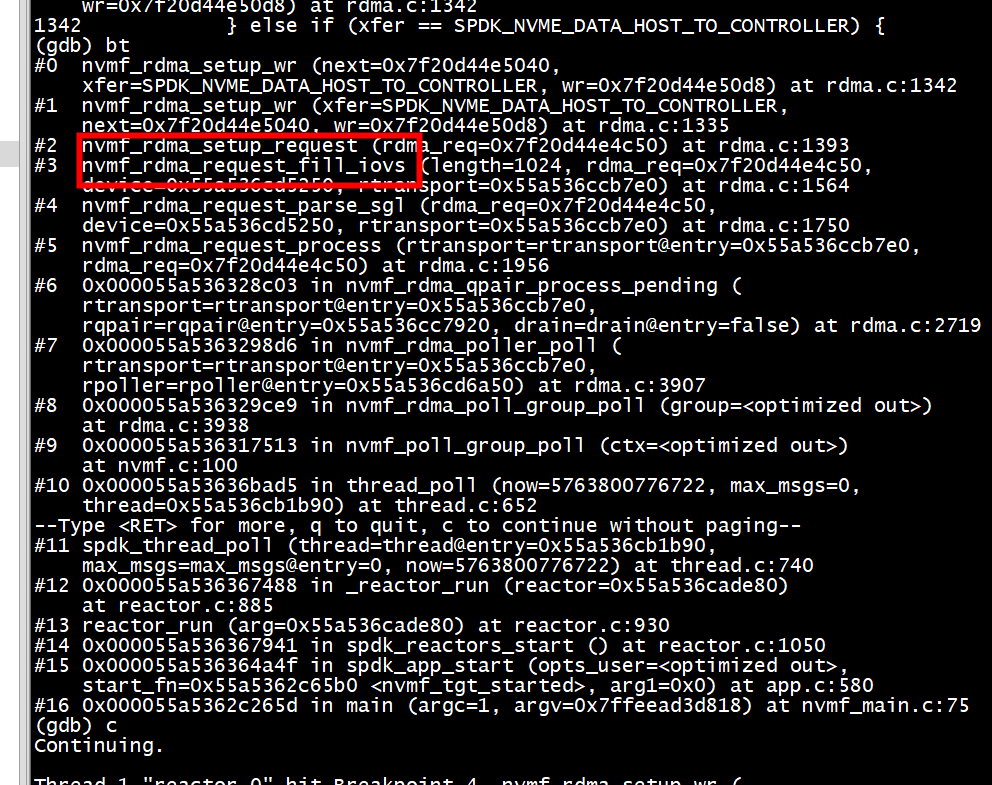

spdk 建立了一套用户态的 3级页表，来方便在用户态进行虚拟地址到物理地址的转化。3级页表是：256TiB-> 1GiB -> 2MiB:   
+ 第三级页表：[30..47]   
+ 第二级页表：[21..29]   
+ 最小的页是2M，偏移范围是[0..20]   
二级页表容纳 1GB 的地址空间，那么需要占用 1G/2M = 2^9, 也就是 9 bits 的地址位。也就是 [21..29]。   
三级页表容纳 256TB 的地址空间，那么需要占用 256 T/1G = 2^18, 也就是 16 bits 的地址位。也就是[30..47]。   

# hugesize

```
root@ubuntu:~# cat /proc/meminfo | grep -i huge
AnonHugePages:         0 kB
ShmemHugePages:        0 kB
FileHugePages:         0 kB
HugePages_Total:    1024
HugePages_Free:      849
HugePages_Rsvd:        0
HugePages_Surp:        0
Hugepagesize:       2048 kB
Hugetlb:         2097152 kB
```

#  mem_map_notify_walk



# spdk_mem_map_set_translation
```
                        mr = ibv_reg_mr(pd, vaddr, size, access_flags);
                        if (mr == NULL) {
                                SPDK_ERRLOG("ibv_reg_mr() failed\n");
                                return -1;
                        } else {
                                rc = spdk_mem_map_set_translation(map, (uint64_t)vaddr, size, (uint64_t)mr);
                        }
```
spdk_mem_map_set_translation的第四个参数是个地址，不是REG_MAP_REGISTERED   
spdk_mem_map_set_translation(map, (uint64_t)vaddr, size,  REG_MAP_REGISTERED);   
***spdk_rdma_create_mem_map会被调用一次，但是rdma_mem_notify被多次调用***   




# spdk_mem_map_translate


## spdk_rdma_get_translation
host执行读写：   
echo "hllo" >>   /work/data_mnt/hello.txt    



```
int
spdk_rdma_get_translation(struct spdk_rdma_mem_map *map, void *address,
                          size_t length, struct spdk_rdma_memory_translation *translation)
{
        uint64_t real_length = length;

        assert(map);
        assert(address);
        assert(translation);

        if (map->hooks && map->hooks->get_rkey) {
                translation->translation_type = SPDK_RDMA_TRANSLATION_KEY;
                translation->mr_or_key.key = spdk_mem_map_translate(map->map, (uint64_t)address, &real_length);
        } else {
                translation->translation_type = SPDK_RDMA_TRANSLATION_MR;
                translation->mr_or_key.mr = (struct ibv_mr *)spdk_mem_map_translate(map->map, (uint64_t)address,
                                            &real_length);
                if (spdk_unlikely(!translation->mr_or_key.mr)) {
                        SPDK_ERRLOG("No translation for ptr %p, size %zu\n", address, length);
                        return -EINVAL;
                }
        }

        assert(real_length >= length);

        return 0;
}
```

##  rdma_mem_notify --> ibv_reg_mr 


# 测试

1） spdk_mem_map_set_translation   

spdk_mem_map_set_translation的时候传递一个malloc返回的地址   

```
 g_p = (char*)malloc(1);
 printf("g_p addr %p \n", g_p);
 spdk_mem_map_set_translation(map, (uint64_t)vaddr, size,  (uint64_t)g_p);
```


2） spdk_mem_map_translate 返回malloc的地址   


```
test_spdk_vtophys(struct spdk_mem_map *vtophys_map, const void *buf, uint64_t *size)
{
        uint64_t vaddr, paddr_2mb;

        vaddr = (uint64_t)buf;
        paddr_2mb = spdk_mem_map_translate(vtophys_map, vaddr, size);

        /*
 *          * SPDK_VTOPHYS_ERROR has all bits set, so if the lookup returned SPDK_VTOPHYS_ERROR,
 *                   * we will still bitwise-or it with the buf offset below, but the result will still be
 *                            * SPDK_VTOPHYS_ERROR. However now that we do + rather than | (due to PCI vtophys being
 *                                     * unaligned) we must now check the return value before addition.
 *                                              */
#if 0
        SPDK_STATIC_ASSERT(SPDK_VTOPHYS_ERROR == UINT64_C(-1), "SPDK_VTOPHYS_ERROR should be all 1s");
        if (paddr_2mb == SPDK_VTOPHYS_ERROR) {
                return SPDK_VTOPHYS_ERROR;
        } else {
                return paddr_2mb + (vaddr & MASK_2MB);
        }
#endif
       return paddr_2mb;
}
```

3) 测试结果
 ./build/app/helloworld  -c 0x1   



# IBV_WR_XX
client 发起如下操作
```
nvme connect -t rdma -n "nqn.2016-06.io.spdk:cnode1" -a 192.168.11.22 -s 4420
```

```
nvmf_rdma_qpair_process_pending  --> nvmf_rdma_request_process -->  nvmf_rdma_request_parse_sgl   -->nvmf_rdma_request_fill_iovs    |-->    nvmf_rdma_setup_request -->  nvmf_rdma_setup_wr 
                                  |-->    nvmf_rdma_fill_wr_sgl  --> nvmf_rdma_fill_wr_sge
```



