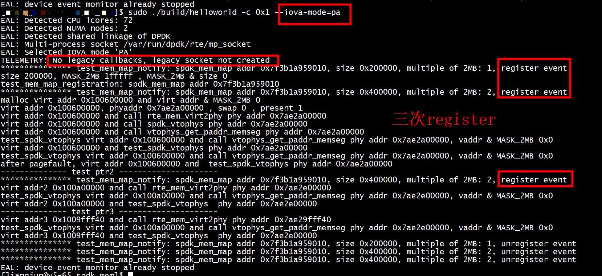

# pci.c
没有使用pci.c   
```
SRCS-y := log.c string.c  init.c env.c memory.c vtophys.c
#SRCS-y := log.c string.c pci.c init.c env.c memory.c vtophys.c
PKGCONF ?= pkg-config
```
CFLAGS += -DALLOW_EXPERIMENTAL_API -DNO_PCI_DEV   
通过-DNO_PCI_DEV 把pci相关的代码注释

# 大页大小

```
cat /proc/meminfo | grep -i huge
HugePages_Total:    4096
HugePages_Free:     4094
HugePages_Rsvd:        0
HugePages_Surp:        0
Hugepagesize:       2048 kB
```
# lscpu
```
lscpu
Architecture:          x86_64
CPU op-mode(s):        32-bit, 64-bit
Byte Order:            Little Endian
CPU(s):                72
On-line CPU(s) list:   0-71
Thread(s) per core:    2
Core(s) per socket:    18
Socket(s):             2
NUMA node(s):          2
Vendor ID:             GenuineIntel
CPU family:            6
Model:                 85
Model name:            Intel(R) Xeon(R) Gold 6154 CPU @ 3.00GHz
```

# run
 ./build/helloworld -c 0x1 --iova-mode=pa   
