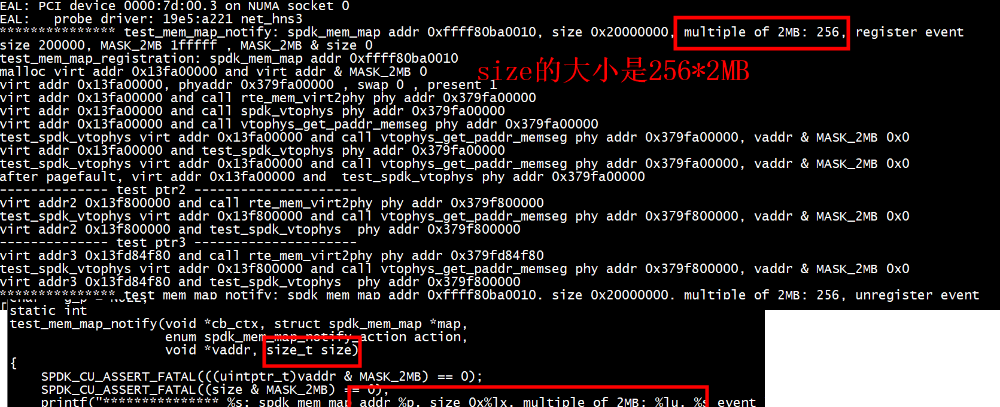
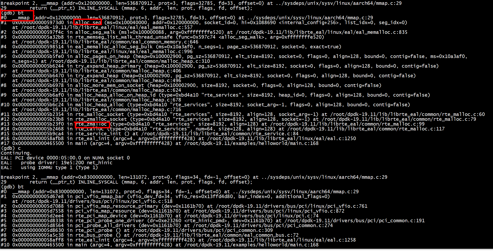

# I run
```
./build/app/helloworld -c 0x1 --iova-mode=pa
```


+ 1  test_mem_map_notify 按照VALUE_2MB大小分块，对于每个块调用spdk_mem_map_set_translation  
+ 2  只调用了一次register event   

# II 大页大小

```
cat /proc/meminfo | grep -i huge
AnonHugePages:         0 kB
ShmemHugePages:        0 kB
HugePages_Total:     256
HugePages_Free:      255
HugePages_Rsvd:        0
HugePages_Surp:        0
Hugepagesize:     524288 kB
```


#  vtophys_init 
./build/bin/nvmf_tgt   


# spdk_mem_register

+ spdk_env_dpdk_post_init会调用 spdk_mem_register
```
(gdb) bt
#0  spdk_mem_register (vaddr=0x120000000, len=536870912) at /root/dpdk-19.11/examples/spdk_mem/memory.c:385
#1  0x000000000055a1f0 in rte_memseg_contig_walk ()
#2  0x000000000048bf5c in mem_map_init (legacy_mem=legacy_mem@entry=false) at /root/dpdk-19.11/examples/spdk_mem/memory.c:763
#3  0x0000000000486f90 in spdk_env_dpdk_post_init (legacy_mem=legacy_mem@entry=false) at /root/dpdk-19.11/examples/spdk_mem/init.c:496
#4  0x000000000047b4ec in main (argc=<optimized out>, argv=<optimized out>) at /root/dpdk-19.11/examples/spdk_mem/vtophys.c:298
(gdb) 
```
+ spdk_mem_register的地址要求 MASK_2MB对齐，大小也是2MB（参考mytest/spdk-mem2）    
+ spdk_mem_register调用***spdk_mem_map_set_translation***建立页表（参考mytest/spdk-mem3） 

```
/**
 * Register an address translation for a range of virtual memory.
 *
 * \param map Memory map.
 * \param vaddr Virtual address of the region to register - must be 2 MB aligned.
 * \param size Size of the region in bytes - must be multiple of 2 MB in the
 *  current implementation.
 * \param translation Translation to store in the map for this address range.
 *
 * \sa spdk_mem_map_clear_translation().
 *
 * \return 0 on success, negative errno on failure.
 */
int spdk_mem_map_set_translation(struct spdk_mem_map *map, uint64_t vaddr, uint64_t size,
                                 uint64_t translation);
```

# VALUE_2MB对齐
+ 分配size2= 8, VALUE_2MB 对齐    
```
        printf("-------------- test ptr2 --------------------- \n");
        ptr2 = (char *)rte_malloc("test2",size2,VALUE_2MB);
        printf("virt addr2 %p and call rte_mem_virt2phy phy addr 0x%lx \n", ptr2,  rte_mem_virt2phy(ptr2));
        paddr = test_spdk_vtophys(map,ptr2, &size2);
        printf("virt addr2 %p and test_spdk_vtophys  phy addr 0x%lx \n", ptr2, paddr);
```

```
-------------- test ptr2 --------------------- 
virt addr2 0x13f800000 and call rte_mem_virt2phy phy addr 0x379f800000 
test_spdk_vtophys virt addr 0x13f800000 and call vtophys_get_paddr_memseg phy addr 0x379f800000, vaddr & MASK_2MB 0x0 
virt addr2 0x13f800000 and test_spdk_vtophys  phy addr 0x379f800000 
```
test_spdk_vtophys  phy addr 0x379f800000  和 rte_mem_virt2phy phy addr 0x379f800000***地址一样***    


+  分配size2= 8, 8对齐  
```
        printf("-------------- test ptr3 --------------------- \n");
        ptr3 = (char *)rte_malloc("test3",size2,size2);
        printf("virt addr3 %p and call rte_mem_virt2phy phy addr 0x%lx \n", ptr3,  rte_mem_virt2phy(ptr3));
        paddr = test_spdk_vtophys(map,ptr2, &size2);
        printf("virt addr3 %p and test_spdk_vtophys  phy addr 0x%lx \n", ptr3, paddr);
```
 
```
-------------- test ptr3 --------------------- 
virt addr3 0x13fd84f80 and call rte_mem_virt2phy phy addr 0x379fd84f80 
test_spdk_vtophys virt addr 0x13f800000 and call vtophys_get_paddr_memseg phy addr 0x379f800000, vaddr & MASK_2MB 0x0 
virt addr3 0x13fd84f80 and test_spdk_vtophys  phy addr 0x379f800000 
*************** test_mem_map_notify: spdk_mem_map addr 0xffff7ef60010, size 0x20000000, multiple of 2MB: 256, unregister event
```
test_spdk_vtophys  phy addr 0x379fd84f80  和 rte_mem_virt2phy phy addr 0x379f800000***地址不一样***   

# 地址是否连续

```
static int
test_check_regions_contiguous(uint64_t paddr1, uint64_t paddr2)
{
    return (paddr2 - paddr1 == VALUE_2MB);
}
```

# I test_mem_map_notify被调用
spdk_mem_map_alloc 和 spdk_mem_map_free会触发test_mem_map_notify   


## II test_mem_map_notify 内存长度

```
test_mem_map_notify: spdk_mem_map addr 0xffff8d230010, size 0x20000000, multiple of 2MB: 256, register event
```
连续内存长度：256*2MB      



参考test/env/memory/memory_ut.c   
```
static int
test_mem_map_notify(void *cb_ctx, struct spdk_mem_map *map,
                    enum spdk_mem_map_notify_action action,
                    void *vaddr, size_t len)
{
        uint32_t i, end;

        SPDK_CU_ASSERT_FATAL(((uintptr_t)vaddr & MASK_2MB) == 0);
        SPDK_CU_ASSERT_FATAL((len & MASK_2MB) == 0);

        /*
         * This is a test requirement - the bit array we use to verify
         * pages are valid is only so large.
         */
        SPDK_CU_ASSERT_FATAL((uintptr_t)vaddr < (VALUE_2MB * PAGE_ARRAY_SIZE));

        i = (uintptr_t)vaddr >> SHIFT_2MB;
        end = i + (len >> SHIFT_2MB);
        for (; i < end; i++) {
                switch (action) {
                case SPDK_MEM_MAP_NOTIFY_REGISTER:
                        /* This page should not already be registered */
                        SPDK_CU_ASSERT_FATAL(spdk_bit_array_get(g_page_array, i) == false);
                        SPDK_CU_ASSERT_FATAL(spdk_bit_array_set(g_page_array, i) == 0);
                        break;
                case SPDK_MEM_MAP_NOTIFY_UNREGISTER:
                        SPDK_CU_ASSERT_FATAL(spdk_bit_array_get(g_page_array, i) == true);
                        spdk_bit_array_clear(g_page_array, i);
                        break;
                default:
                        SPDK_UNREACHABLE();
                }
        }

        return 0;
}
```

+ 对size按照VALUE_2MB分块
+ 对每个分块进行spdk_mem_map_set_translation
```
start = (uint64_t)vaddr + index*VALUE_2MB;
++index;
spdk_mem_map_set_translation(map, start , VALUE_2MB,  vtophys_get_paddr_memseg((uint64_t)start));
```

# 比较rte_mem_virt2phy获得的物理地址

spdk_vtophys --> spdk_mem_map_translate(g_vtophys_map, vaddr, size) 采用g_vtophys_map

# vtophys_get_paddr_memseg


```
static uint64_t
vtophys_get_paddr_memseg(uint64_t vaddr)
{
        uintptr_t paddr;
        struct rte_memseg *seg;

        seg = rte_mem_virt2memseg((void *)(uintptr_t)vaddr, NULL);
        if (seg != NULL) {
                paddr = seg->iova;
                if (paddr == RTE_BAD_IOVA) {
                        return SPDK_VTOPHYS_ERROR;
                }
                paddr += (vaddr - (uintptr_t)seg->addr);
                return paddr;
        }

        return SPDK_VTOPHYS_ERROR;
}
```

#  iova-mode
```
./app --iova-mode=pa  # use IOVA as PA mode
./app --iova-mode=va  # use IOVA as VA mode
./build/app/helloworld -c 0x1 --iova-mode=pa
```

##  va mode
./build/app/helloworld -c 0x1 --iova-mode=va   


# I legacy-mem
dpdk legacy memory 实现下内存的分配却受限于大页的物理内存连续性，常常需要在系统启动更前的地方预留更多的大页内存，也限制了 dpdk 的应用场景.
```
./build/app/helloworld -c 0x1 --iova-mode=pa --legacy-mem
```

 multiple of 2MB: 16384，使用的page比非legacy-mem 增多了   
 
## II DPDK的内存模式
DPDK存在两种内存模式:   
+ 1, legacy mode : 这一种为静态内存模式，即在初始化过程就根据配置分配所有的内存，并且这些内存页在application结束之前
不会归还给OS；而且也不会再向OS申请更多的内存。并且application使用DPDK的rte_malloc库申请内存时，若剩余可用的内存不足，则
直接返回错误。这种模式的优点是若一段内存空间的虚拟内存地址是连续的，那么其物理内存地址也是连续的。  
+ 2, dynamic mode：这一种为动态内存模式，在初始化过程根据配置分配所需要的内存，并且这些内存页在application结束之前不会
归还给OS。若application使用DPDK的rte_malloc库申请内存时，若剩余可用的内存不足，则会先向操作系统申请内存，再将这些内存分配给application。由于会动态地向OS申请内存，所以虚拟内存连续并不意味着物理内存连续。  
(对于向操作系统动态申请的内存，在application释放这些内存时，DPDK系统会将其归还给OS，不必等到application结束)

## II  eal_legacy_hugepage_init 重映射
dpdk-19.11/examples/helloworld   
set args -c 0x1 --iova-mode=pa --legacy-mem   
在legacy mode下，会调用eal_legacy_hugepage_init（）函数，相反则调用eal_hugepage_init()。前者根据配置internal_config->hugepage_info来将相关SOCKET_ID，PageSZ对rte_memseg_list中的rte_memseg进行映射并排序。然后通过巨页内存文件的***重映射***来保证虚拟和物理地址二者同时的连续性。保存相关信息及描述符到巨页数据文件。并采用read-ahead做为技术保证。这样就可以保障相关数据操作的效率。 采用了read-ahead目的是为了保证虚拟内存连续的mem segments在物理内存上也是连续的， 同时也能够提前载入物理页，提高系统的性能。 而对于nohugepage的情况，将其视为legacy, single-file mode，采用的页的大小为4K。    


+ --legacy-mem，malloc_heap_alloc_on_heap_id执行heap_alloc分配成功  

### III MAP_FIXED
```
void * mmap(void *addr, size_t len, int prot, int flags, int fd, off_t offset);
```
 系统使用 addr 参数来确定映射的起始地址，其解释取决于 MAP_FIXED 标志的设置。 
 + a 如果在 flags 中指定了 MAP_FIXED，系统将尝试将映射放置在指定地址，可能会删除该位置已存在的映射。
 + b 如果未指定 MAP_FIXED，则系统将尝试使用从 addr 开始的地址范围，前提是它们不与任何现有映射重叠，包括由 malloc(3) 和其他此类分配器分配的内存。
  + b1 否则，系统将为映射（使用与实现相关的算法）选择不与任何现有映射重叠的备用地址。换句话说，如果没有指定 MAP_FIXED，如果指定的地址范围已经被其他对象映射，系统将尝试在地址空间中找到一个空位置(***不会删除以前的映射***)。
 + c 如果 addr 为零且未指定 MAP_FIXED，则系统将选择一个地址，以免与地址空间中的任何现有映射重叠。
 在所有情况下，都会返回该区域的实际起始地址。如果指定了 MAP_FIXED，则成功的 mmap ***会删除分配的地址范围内的任何先前映射。如果未指定 MAP_FIXED，则永远不会删除以前的映射***。
 

## II  eal_hugepage_init  

set args -c 0x1 --iova-mode=pa 
根据socket_mem的需求，计算hugepage在不同socket的分布。然后使用了eal_memalloc_alloc_seg_bluk进行分配， 由于这个方法是一个一个mem segment进行分配，所以不能保证分配完成后，虚拟空间上连续的mem segments在物理上也是连续的. 采用了pre-allocate（mmap_flags = MAP_SHARED | MAP_POPULATE | MAP_FIXED），能够提高系统的性能。    


+ 没有进入eal_memalloc_alloc_seg_bulk，但是 rte_zmalloc --> eal_memalloc_alloc_seg_bulk
+ #define MAX_HUGEPAGE_SIZES 4

### III   rte_zmalloc --> eal_memalloc_alloc_seg_bulk


 eal_memalloc_alloc_seg_bulk 底层调用mmap   


## II --legacy-mem  和非--legacy-mem  malloc_heap_alloc_on_heap_id动作区别

+ --legacy-mem，malloc_heap_alloc_on_heap_id执行heap_alloc分配成功  
```
malloc_heap_alloc_on_heap_id
 647         /* for legacy mode, try once and with all flags */
 648         if (internal_config.legacy_mem) {
 649                 ret = heap_alloc(heap, type, size, flags, align, bound, contig);
 650                 goto alloc_unlock;
 651         }
```

+ 非--legacy-mem，malloc_heap_alloc_on_heap_id执行heap_alloc分配失败，要继续执行alloc_more_mem_on_socket  
```
malloc_heap_alloc_on_heap_id
         alloc_more_mem_on_socket
```