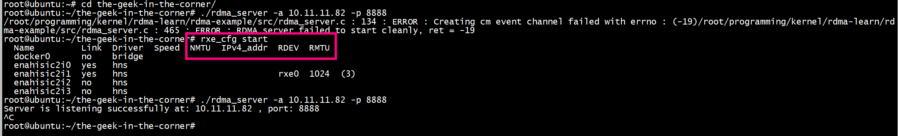

# RDMA exmaple

A simple RDMA server client example. The code contains a lot of comments. Here is the workflow that happens in the example: 

Client: 
  1. setup RDMA resources   
  2. connect to the server 
  3. receive server side buffer information via send/recv exchange 
  4. do an RDMA write to the server buffer from a (first) local buffer. The content of the buffer is the string passed with the `-s` argument. 
  5. do an RDMA read to read the content of the server buffer into a second local buffer. 
  6. compare the content of the first and second buffers, and match them. 
  7. disconnect 

Server: 
  1. setup RDMA resources 
  2. wait for a client to connect 
  3. allocate and pin a server buffer
  4. accept the incoming client connection 
  5. send information about the local server buffer to the client 
  6. wait for disconnect

没有调用ibv_poll_cq

## ii  rdma_create_qp
```
  qp_init_attr.recv_cq = cq; /* Where should I notify for receive completion operations */
  qp_init_attr.send_cq = cq; /* Where should I notify for send completion operations */
  ret = rdma_create_qp(cm_client_id /* which connection id */,
		       pd /* which protection domain*/,
		       &qp_init_attr /* Initial attributes */)
```
+ rdma_create_qp(cm_client_id需要client id、需要pd、 需要qp_init_attr.send_cq、 qp_init_attr.recv_cq 
+ ibv_alloc_pd 和ibv_create_cq 不需要cm_client_id

## ii 怎么标识client
cm_event->id标识client    
```Text
start_rdma_server
   process_rdma_cm_event(cm_event_channel, 
			RDMA_CM_EVENT_CONNECT_REQUEST,
			&cm_event);
   cm_client_id = cm_event->id;
   rdma_ack_cm_event(cm_event);
   rdma_accept(cm_client_id, &conn_param);
setup_client_resources
   ibv_alloc_pd
   ibv_create_cq
accept_client_connection
   process_rdma_cm_event(cm_event_channel, 
		       RDMA_CM_EVENT_ESTABLISHED,
		       &cm_event);
   rdma_get_cm_event(echannel, cm_event)
   rdma_ack_cm_event(cm_event)
```

###### How to run      
```text
git clone https://github.com/animeshtrivedi/rdma-example.git
cd ./rdma-example
cmake .
make
``` 
 
###### server


```
[root@centos7 bin]# ./rdma_server 
/root/rdma-example/src/rdma_server.c : 134 : ERROR : Creating cm event channel failed with errno : (-19)/root/prdma-example/src/rdma_server.c : 465 : ERROR : RDMA server failed to start cleanly, ret = -19 
[root@centos7 bin]# 
```
执行rxe_cfg start

```text
 ./bin/rdma_server -a 10.11.11.251 -p 8888
Server is listening successfully at: 10.11.11.251 , port: 8888 
A new connection is accepted from 10.11.11.82 
Client side buffer information is received...
---------------------------------------------------------
buffer attr, addr: 0x2833360 , len: 15 , stag : 0x322 
---------------------------------------------------------
The client has requested buffer length of : 15 bytes 
A disconnect event is received from the client...
Server shut-down is complete 
```
###### client


```text
./rdma_client -a 10.11.11.251 -p 8888 -s "hello world 789"
Passed string is : hello world 789 , with count 15 
Trying to connect to server at : 10.11.11.251 port: 8888 
The client is connected successfully 
---------------------------------------------------------
buffer attr, addr: 0x1f6b4ff0 , len: 15 , stag : 0x516 
---------------------------------------------------------
...
SUCCESS, source and destination buffers match 
Client resource clean up is complete 
```


## Does not have an RDMA device?
In case you do not have an RDMA device to test the code, you can setup SofitWARP software RDMA device on your Linux machine. Follow instructions here: [https://github.com/animeshtrivedi/blog/blob/master/post/2019-06-26-siw.md](https://github.com/animeshtrivedi/blog/blob/master/post/2019-06-26-siw.md).
