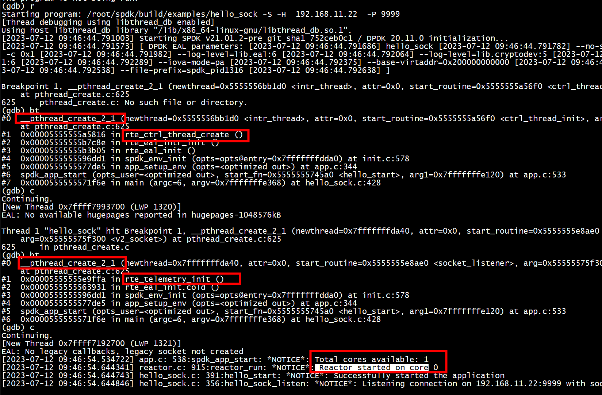
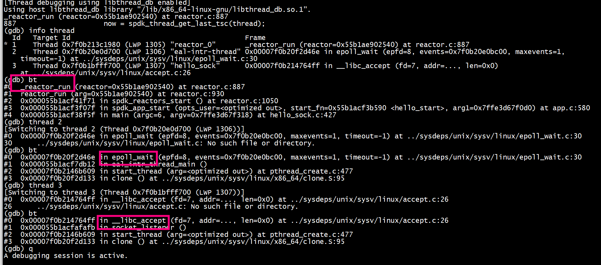
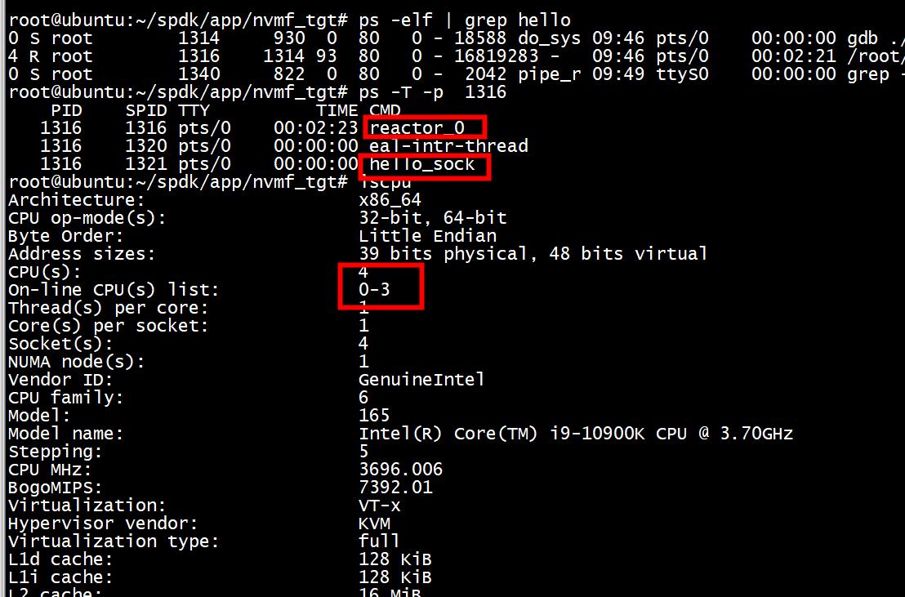
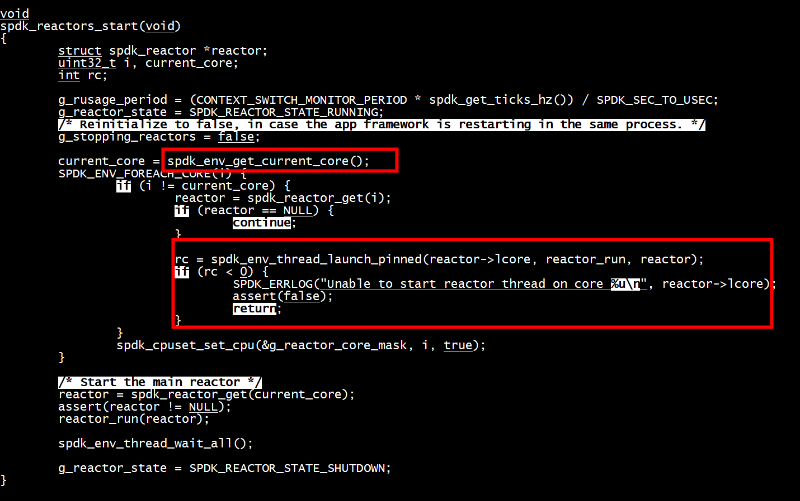
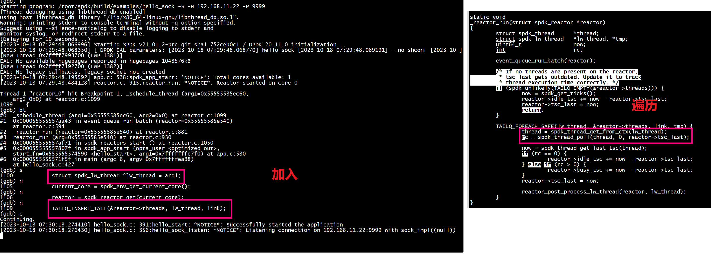

An example program developed under the SPDK framework to demonstrate the use of SPDK threads on NVME devices.

```Shell
 ./build/examples/hello_sock  -S -H 192.168.11.22 -P 9999
```



+ 1)    rte_telemetry_init 创建了一个线程      
+ 2)    rte_ctrl_thread_create创建了一个线程    
   

# spdk_reactors_start 每个核启动一个reactor
```Shell
 ./build/examples/hello_sock  -S -H 192.168.11.22 -P 9999
```


+ spdk_thread func 怎么被reactor调用?

  + a  _schedule_thread把新的spdk_thread加入reactor->threads， TAILQ_INSERT_TAIL(&reactor->threads, lw_thread, link）
      _reactor_run --> event_queue_run_batch
  + b  _reactor_run调用spdk_thread_poll
 

# spdk thread调度到哪个一个reactor
```

        spdk_thread_lib_init_ext(reactor_thread_op, reactor_thread_op_supported,
                                 sizeof(struct spdk_lw_thread));
```
***reactor_thread_op***执行：
+ 1 根据 cpumask选择core
```
	               spdk_cpuset_zero(&tmp_cpumask);
			       spdk_cpuset_set_cpu(&tmp_cpumask, i, true);
			       snprintf(thread_name, sizeof(thread_name), "nvmf_tgt_poll_group_%u", i);
			       thread = spdk_thread_create(thread_name, &tmp_cpumask)
```
+ 2 准备spdk_event_allocate(core, _schedule_thread, lw_thread, NULL)消息
+ 3 spdk_event_call(evt)根据core选择 reactor = spdk_reactor_get(event->lcore)， 给core发送schedule_thread消息,schedule_thread将spdk thread insert 到reactor->threads（TAILQ_INSERT_TAIL(&reactor->threads, lw_thread, link)）

```

struct spdk_event *
spdk_event_allocate(uint32_t lcore, spdk_event_fn fn, void *arg1, void *arg2)
{
        struct spdk_event *event = NULL;
        struct spdk_reactor *reactor = spdk_reactor_get(lcore);

        if (!reactor) {
                assert(false);
                return NULL;
        }

        event = spdk_mempool_get(g_spdk_event_mempool);
        if (event == NULL) {
                assert(false);
                return NULL;
        }

        event->lcore = lcore;
        event->fn = fn;
        event->arg1 = arg1;
        event->arg2 = arg2;

        return event;
}
```
## cpumask设置

```
static void
nvmf_tgt_create_poll_groups(void)
{
      uint32_t  current_core;
      struct spdk_cpuset tmp_cpumask = {};
      uint32_t i;
      char thread_name[32];
      struct spdk_thread *thread;
      current_core = spdk_env_get_current_core();
      SPDK_ENV_FOREACH_CORE(i) {
          if (i != current_core) {
#if 1
	                       spdk_cpuset_zero(&tmp_cpumask);
			       spdk_cpuset_set_cpu(&tmp_cpumask, i, true);
			       snprintf(thread_name, sizeof(thread_name), "nvmf_tgt_poll_group_%u", i);
			       thread = spdk_thread_create(thread_name, &tmp_cpumask);
			       assert(thread != NULL);
			       spdk_thread_send_msg(thread, nvmf_tgt_create_poll_group, g_group_ctx + i);
#endif
	 }
      }
}
```

## spdk_env_thread_launch_pinned 

```
int
spdk_env_thread_launch_pinned(uint32_t core, thread_start_fn fn, void *arg)
{
        int rc;

        rc = rte_eal_remote_launch(fn, arg, core);

        return rc;
}

void
spdk_env_thread_wait_all(void)
{
        rte_eal_mp_wait_lcore();
}
```

# multiple threads

```
 app_opts.reactor_mask = "0xF";
```


# references

 [Nvmf target crashed with core mask 0xFFFFFFFF](https://github.com/spdk/spdk/issues/282)
