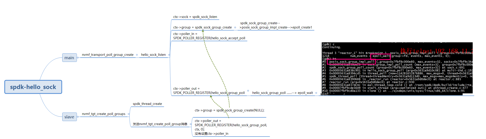
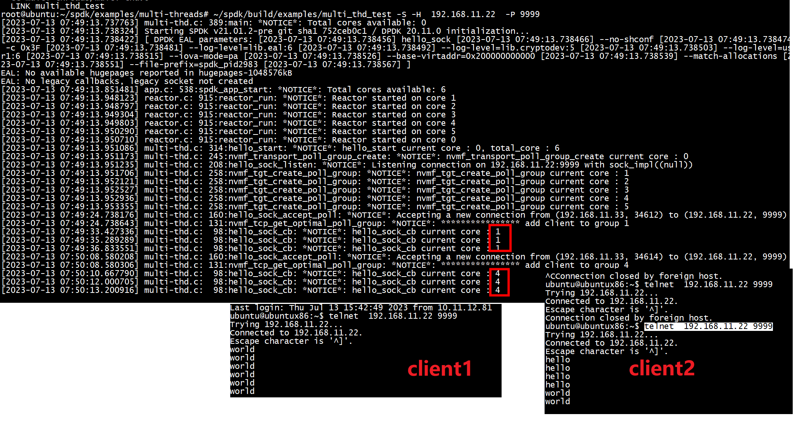
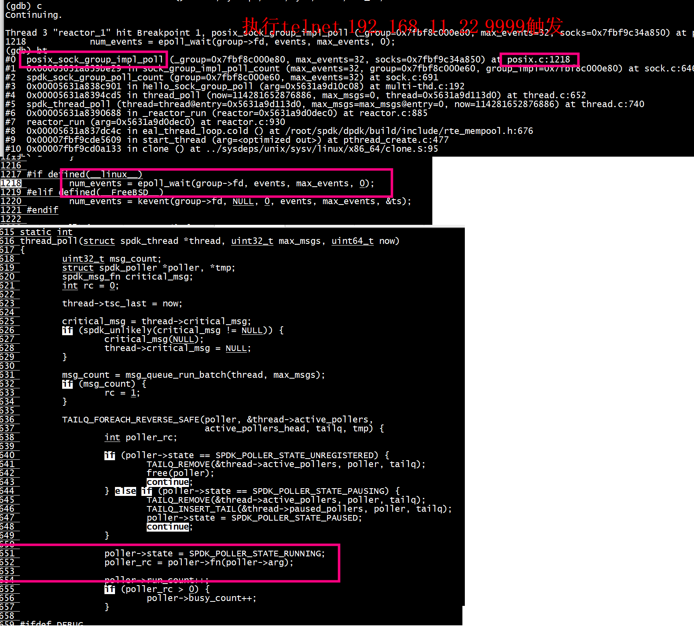
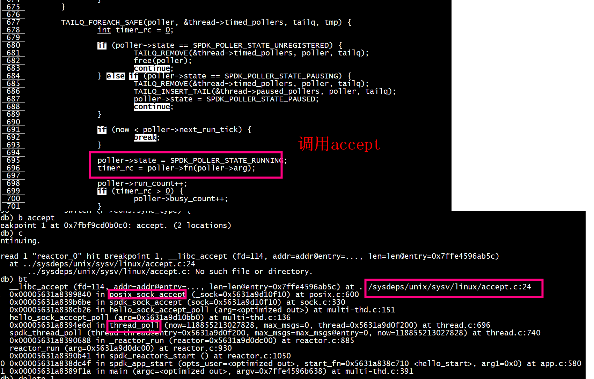

 

hello_sock_group_poll -> spdk_sock_group_poll  -> epoll_wait


###  spdk thread调度到哪个一个reactor
thread = spdk_thread_create(thread_name, &tmp_cpumask)底层会调用reactor_thread_op    
```

        spdk_thread_lib_init_ext(reactor_thread_op, reactor_thread_op_supported,
                                 sizeof(struct spdk_lw_thread));
```
***reactor_thread_op***执行：
+ 1 根据 cpumask选择core
```
	               spdk_cpuset_zero(&tmp_cpumask);
			       spdk_cpuset_set_cpu(&tmp_cpumask, i, true);
			       snprintf(thread_name, sizeof(thread_name), "nvmf_tgt_poll_group_%u", i);
			       thread = spdk_thread_create(thread_name, &tmp_cpumask)
```
+ 2 准备spdk_event_allocate(core, _schedule_thread, lw_thread, NULL)消息
+ 3 spdk_event_call(evt)根据core选择 reactor = spdk_reactor_get(event->lcore)， 给core发送schedule_thread消息,schedule_thread将spdk thread insert 到reactor->threads（TAILQ_INSERT_TAIL(&reactor->threads, lw_thread, link)）

 
**spdk_sock_group_add_sock**   
# test


+ 1) listen thread 和 非listen thread都要执行如下操作，以实现epoll_wait     
  ctx->group = spdk_sock_group_create(NULL);   
  ctx->poller_out = SPDK_POLLER_REGISTER(hello_sock_group_poll, ctx, 0);  
  hello_sock_group_poll -> spdk_sock_group_poll  -> epoll_wait   
  ***epoll_wait***
+ 2) listen thread    
   + a 调用nvmf_transport_poll_group_create执行listen
   + b **accept**,
    hello_sock_accept_poll函数accept一个socket,则会调用spdk_sock_group_add_sock通过nvmf_tcp_get_optimal_poll_group选择spdk_sock_group    
	+ c  nvmf_tgt_create_poll_groups创建spdk_thread（slave thread）执行nvmf_tgt_create_poll_group
	
##  epoll_wait


## accept(周期性poller)

## ctx和poll_group

 + ctx 有什么用？
     + a ctx保存socket信息、
	 

```
static int
hello_sock_listen(struct hello_context_t *ctx)
{
	ctx->host = g_host;
	ctx->sock_impl_name = g_sock_impl_name;
	ctx->port = g_port;

	ctx->sock = spdk_sock_listen(ctx->host, ctx->port, ctx->sock_impl_name);
	ctx->poller_in = SPDK_POLLER_REGISTER(hello_sock_accept_poll, ctx,
					      ACCEPT_TIMEOUT_US);
	ctx->poller_out = SPDK_POLLER_REGISTER(hello_sock_group_poll, ctx, 0);

	return 0;
}
```

# 共享数据池

共享数据池(Data buffer Pool): NVMe/TCP transport的读/写命令，都需要分配相应的buffer，然后进行后续的读写。当每个NVMe读/写命令(包含在NVMe/TCP transport的Command Capsule PDU中)被正确解析后，我们就会在共享数据池中分配所需要的data buffer。使用共享数据缓冲池的目的是为了控制内存使用的footprint。如果所需要的内存根据每个qpair的深度（Queue depth），那么所需要的内存大小将随着qpair的增加而线性增加， 这样对于支持大量TCP 连接而言是巨大的内存消耗。在SPDK的设计中，数据缓冲池由每一个CPU core上的TCP polling group共享，那么这些polling group之间必然会存在对这个共享池的数据竞争。为了很好的缓解这个数据竞争的问题，我们采用以下策略，即每个polling group在这个共享池中预先保留了一些data buffer，这些data buffer组成了一个buffer cache。那么这将保证每个TCP polling group 都有内存可以分配，杜绝了starvation(饥饿)的产生。因为在buffer cache中分配的数据buffer在使用完毕以后，依然会被回收到相应的polling group对应的buffer cache中。
 