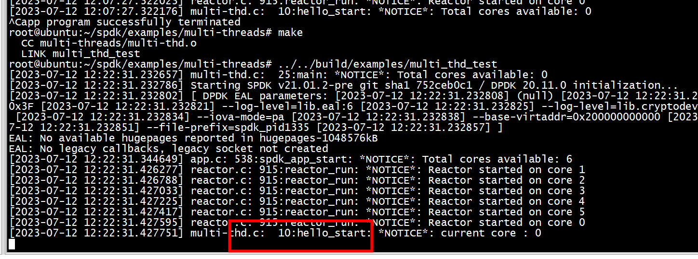

# cpu 总数

```
root@ubuntu:~# lscpu
Architecture:                    x86_64
CPU op-mode(s):                  32-bit, 64-bit
Byte Order:                      Little Endian
Address sizes:                   39 bits physical, 48 bits virtual
CPU(s):                          6
On-line CPU(s) list:             0-5
```

# 查看线程

```
root@ubuntu:~# ps -elf | grep multi_thd_test
4 R root        1243    1040 99  80   0 - 16927823 -   12:02 pts/1    00:14:15 ../../build/examples/multi_thd_test
0 S root        1255     827  0  80   0 -  2043 pipe_r 12:05 ttyS0    00:00:00 grep --color=auto multi_thd_test
root@ubuntu:~# ps -T -p 1243
    PID    SPID TTY          TIME CMD
   1243    1243 pts/1    00:02:32 reactor_0
   1243    1244 pts/1    00:00:00 eal-intr-thread
   1243    1245 pts/1    00:02:32 reactor_1
   1243    1246 pts/1    00:02:32 reactor_2
   1243    1247 pts/1    00:02:32 reactor_3
   1243    1248 pts/1    00:02:32 reactor_4
   1243    1249 pts/1    00:02:32 reactor_5
   1243    1250 pts/1    00:00:00 multi_thd_test
root@ubuntu:~# 
```


#
运行hello_start的只有core : 0   


# launch  reactor_run

spdk_env_thread_launch_pinned(reactor->lcore, reactor_run, reactor);   

```
int
spdk_env_thread_launch_pinned(uint32_t core, thread_start_fn fn, void *arg)
{
        int rc;

        rc = rte_eal_remote_launch(fn, arg, core);

        return rc;
}
```

# 线程间的高效通信 spdk_event_call 及 spdk_thread_send_msg
```text
SPDK放弃了传统加锁式的通信方式，改用了EVENT机制，SPDK线程间通信分为两种场景。其一：reactor之间的event通信，其二是spdk_thread间的通信；其消息分发接口分别为：spdk_event_call 及    spdk_thread_send_msg。具体的消息中能够携带具体任务的入口地址，这样就能够把任务发送到其他指定的线程执行。当然event   消息的处理也是在reactor thread中执行。   
 这两种通信模式的内部实现机制主要包含两大块：其一：DPDK的无锁队列 rte_ring 构建消息队列，其二：    基于非阻塞模式的events_fd的消息通知机制；前者本身就是无锁且支持多生产者多消费者模式，后者是一种高效的事件通知机制。毫无疑问通过这两种技术的加持，SPDK的reactor thread 能够及时高效的处理相关交换任务。   
```
 1）events   
 reactor->events = spdk_ring_create(SPDK_RING_TYPE_MP_SC, 65536, SPDK_ENV_SOCKET_ID_ANY); 

# struct spdk_lw_thread  pk  struct spdk_thread

```
struct spdk_thread *
spdk_thread_create(const char *name, struct spdk_cpuset *cpumask)
{
        struct spdk_thread *thread;
        struct spdk_msg *msgs[SPDK_MSG_MEMPOOL_CACHE_SIZE];
        int rc = 0, i;

        thread = calloc(1, sizeof(*thread) + g_ctx_sz);
		TAILQ_INIT(&thread->io_channels);
}
```
1) spdk_thread_create 分配 sizeof(*thread) +  sizeof(struct nvmf_lw_thread）  
2） 
```
    struct spdk_thread* thread = spdk_thread_create("first_reader_thread", NULL);
    struct nvmf_lw_thread *lw_thread;
    lw_thread = spdk_thread_get_ctx(thread);
```

# test

```
root@ubuntu:~/spdk/examples/multi-threads# ~/spdk/build/examples/multi_thd_test 
[2023-07-13 01:40:09.347845] multi-thd.c:  53:main: *NOTICE*: Total cores available: 0
[2023-07-13 01:40:09.348233] Starting SPDK v21.01.2-pre git sha1 752ceb0c1 / DPDK 20.11.0 initialization...
[2023-07-13 01:40:09.348303] [ DPDK EAL parameters: [2023-07-13 01:40:09.348324] (null) [2023-07-13 01:40:09.348339] --no-shconf [2023-07-13 01:40:09.348355] -c 0x3F [2023-07-13 01:40:09.348369] --log-level=lib.eal:6 [2023-07-13 01:40:09.348395] --log-level=lib.cryptodev:5 [2023-07-13 01:40:09.348419] --log-level=user1:6 [2023-07-13 01:40:09.348434] --iova-mode=pa [2023-07-13 01:40:09.348451] --base-virtaddr=0x200000000000 [2023-07-13 01:40:09.348466] --match-allocations [2023-07-13 01:40:09.348480] --file-prefix=spdk_pid1265 [2023-07-13 01:40:09.348494] ]
EAL: No available hugepages reported in hugepages-1048576kB
EAL: No legacy callbacks, legacy socket not created
[2023-07-13 01:40:09.462810] app.c: 538:spdk_app_start: *NOTICE*: Total cores available: 6
[2023-07-13 01:40:09.544348] reactor.c: 915:reactor_run: *NOTICE*: Reactor started on core 1
[2023-07-13 01:40:09.544649] reactor.c: 915:reactor_run: *NOTICE*: Reactor started on core 2
[2023-07-13 01:40:09.544863] reactor.c: 915:reactor_run: *NOTICE*: Reactor started on core 3
[2023-07-13 01:40:09.545094] reactor.c: 915:reactor_run: *NOTICE*: Reactor started on core 4
[2023-07-13 01:40:09.545298] reactor.c: 915:reactor_run: *NOTICE*: Reactor started on core 5
[2023-07-13 01:40:09.545494] reactor.c: 915:reactor_run: *NOTICE*: Reactor started on core 0
[2023-07-13 01:40:09.545671] multi-thd.c:  23:hello_start: *NOTICE*: current core : 0
[2023-07-13 01:40:09.545688] multi-thd.c:  12:msg_func: *NOTICE*: msg_func current core : 2
[2023-07-13 01:40:09.545688] multi-thd.c:  12:msg_func: *NOTICE*: msg_func current core : 3
[2023-07-13 01:40:09.545688] multi-thd.c:  12:msg_func: *NOTICE*: msg_func current core : 4
[2023-07-13 01:40:09.545689] multi-thd.c:  12:msg_func: *NOTICE*: msg_func current core : 1
[2023-07-13 01:40:09.545938] multi-thd.c:  12:msg_func: *NOTICE*: msg_func current core : 5
```
# test simple


```
          if (i != current_core) {
                 reactor = spdk_reactor_get(i);
                 if (reactor == NULL) {
                             continue;
                  }
                  TAILQ_FOREACH(lw_thread, &reactor->threads, link) {

                          thread = spdk_thread_get_from_ctx(lw_thread);
                          SPDK_NOTICELOG("current core : %u, traverse core : %u , spdk thread %p\n", current_core, i, thread);
                          spdk_thread_send_msg(thread, msg_func, NULL) ;
                   }
          }
```

# I/O channel 和多线程

```
spdk_get_io_channel(void *io_device)
{
     

        thread = _get_thread();
		ch->thread = thread;
}
```

```
struct spdk_thread *
spdk_io_channel_get_thread(struct spdk_io_channel *ch)
{
        return ch->thread;
}
```

## bdev

```
struct spdk_thread *
spdk_bdev_io_get_thread(struct spdk_bdev_io *bdev_io)
{
        return spdk_io_channel_get_thread(bdev_io->internal.ch->channel);
}

struct spdk_io_channel *
spdk_bdev_io_get_io_channel(struct spdk_bdev_io *bdev_io)
{
        return bdev_io->internal.ch->channel;
}
void
spdk_put_io_channel(struct spdk_io_channel *ch)
{
        struct spdk_thread *thread;
        int rc __attribute__((unused));

        thread = spdk_get_thread();
        if (!thread) {
                SPDK_ERRLOG("called from non-SPDK thread\n");
                assert(false);
                return;
        }

        if (ch->thread != thread) {
                SPDK_ERRLOG("different from the thread that called get_io_channel()\n");
                assert(false);
                return;
        }

        SPDK_DEBUGLOG(thread,
                      "Putting io_channel %p for io_device %s (%p) on thread %s refcnt %u\n",
                      ch, ch->dev->name, ch->dev->io_device, thread->name, ch->ref);

        ch->ref--;

        if (ch->ref == 0) {
                ch->destroy_ref++;
                rc = spdk_thread_send_msg(thread, put_io_channel, ch);
                assert(rc == 0);
        }
}
```

###  spdk_bdev_io_complete 和 channel thread
```
spdk_bdev_io_complete(void *ctx)
{
	struct spdk_bdev_io *bdev_io = ctx;
	if (spdk_unlikely(bdev_io->internal.in_submit_request || bdev_io->internal.io_submit_ch)) {
		/*
		 * Send the completion to the thread that originally submitted the I/O,
		 * which may not be the current thread in the case of QoS.
		 */
		if (bdev_io->internal.io_submit_ch) {
			bdev_io->internal.ch = bdev_io->internal.io_submit_ch;
			bdev_io->internal.io_submit_ch = NULL;
		}
		/*
		 * Defer completion to avoid potential infinite recursion if the
		 * user's completion callback issues a new I/O.
		 */
		spdk_thread_send_msg(spdk_io_channel_get_thread(bdev_io->internal.ch->channel),
				     _spdk_bdev_io_complete, bdev_io);
		return;
	}
```

###  rdma  spdk_thread_send_msg

spdk_thread_send_msg(qpair_ctx->thread, qpair_ctx->cb_fn, qpair_ctx->ctx)   
qpair_ctx->thread = qpair->group->thread   

1)  spdk/scripts/rpc.py bdev_nvme_attach_controller -b NVMe1 -t PCIe -a 0000:00:03.0 触发  bdev_io_submit --> spdk_bdev_io_get_thread


2) host 执行 mount /dev/nvme1n1  /work/data/


#### group->thread

```
nvmf_tgt_create_poll_group(void *io_device, void *ctx_buf)
{
        struct spdk_nvmf_tgt *tgt = io_device;
        struct spdk_nvmf_poll_group *group = ctx_buf;
        struct spdk_nvmf_transport *transport;

        group->poller = SPDK_POLLER_REGISTER(nvmf_poll_group_poll, group, 0);
        group->thread = spdk_get_thread();

        return 0;
}
```

```
(gdb) bt
#0  spdk_get_thread () at thread.c:824
#1  0x00005555555cab9a in spdk_nvmf_request_complete (req=req@entry=0x7ffff57bc010) at ctrlr.c:3539
#2  0x00005555555cadb8 in _nvmf_ctrlr_add_io_qpair (ctx=0x7ffff57bc010) at ctrlr.c:600
#3  0x0000555555625a44 in msg_queue_run_batch (max_msgs=<optimized out>, thread=0x55555599b330) at thread.c:553
#4  thread_poll (now=14021284658738, max_msgs=0, thread=0x55555599b330) at thread.c:631
#5  spdk_thread_poll (thread=thread@entry=0x55555599b330, max_msgs=max_msgs@entry=0, now=14021284658738) at thread.c:740
#6  0x0000555555621488 in _reactor_run (reactor=0x55555599ae80) at reactor.c:885
#7  reactor_run (arg=0x55555599ae80) at reactor.c:930
#8  0x0000555555621941 in spdk_reactors_start () at reactor.c:1050
#9  0x000055555561ea4f in spdk_app_start (opts_user=<optimized out>, start_fn=0x5555555805b0 <nvmf_tgt_started>, arg1=0x0) at app.c:580
#10 0x000055555557c65d in main (argc=1, argv=0x7fffffffe3d8) at nvmf_main.c:75
```

# nvmf_tgt poll group
nvmf_tgt状态到了NVMF_TGT_INIT_CREATE_POLL_GROUPS，创建spdk_thread_create一个struct spdk_thread，这个状态下会为每一个线程都创建相应的poll group   
```
static void
nvmf_tgt_create_poll_groups(void)
{
        struct spdk_cpuset tmp_cpumask = {};
        uint32_t i;
        char thread_name[32];
        struct spdk_thread *thread;

        g_tgt_init_thread = spdk_get_thread();
        assert(g_tgt_init_thread != NULL);

        SPDK_ENV_FOREACH_CORE(i) {
                spdk_cpuset_zero(&tmp_cpumask);
                spdk_cpuset_set_cpu(&tmp_cpumask, i, true);
                snprintf(thread_name, sizeof(thread_name), "nvmf_tgt_poll_group_%u", i);

                thread = spdk_thread_create(thread_name, &tmp_cpumask);
                assert(thread != NULL);

                spdk_thread_send_msg(thread, nvmf_tgt_create_poll_group, NULL);
        }
}
```

nvmf_tgt_create_poll_group ->spdk_nvmf_poll_group_create    


```

struct spdk_nvmf_poll_group *
spdk_nvmf_poll_group_create(struct spdk_nvmf_tgt *tgt)
{
        struct spdk_io_channel *ch;

        ch = spdk_get_io_channel(tgt);
        if (!ch) {
                SPDK_ERRLOG("Unable to get I/O channel for target\n");
                return NULL;
        }

        return spdk_io_channel_get_ctx(ch);
}
```

```
static int spdk_nvmf_tgt_create_poll_group(void *io_device, void *ctx_buf)

{

….. // 初始化transport 、nvmf subsystem等

// 注册一个poller

group->poller = spdk_poller_register(spdk_nvmf_poll_group_poll, group, 0);

group->thread = spdk_get_thread();

return 0;

}

```
在spdk_nvmf_poll_group_poll中，因为spdk_nvmf_poll_group对象中有transport的poll group，所以它会调用对应的transport的poll_group_poll方法，比如rdma的poll_group_poll就会轮询rdma注册的poller处理每个在相应的qpair来的请求，进入rdma的状态机将请求处理好。


