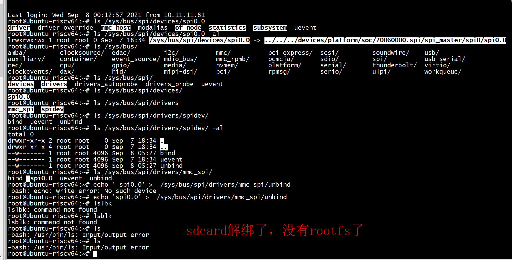

# echo 'spi0.0' >  /sys/bus/spi/drivers/mmc_spi/unbind 

```
root@Ubuntu-riscv64:~# ls /sys/bus/spi/
devices  drivers  drivers_autoprobe  drivers_probe  uevent
root@Ubuntu-riscv64:~# ls /sys/bus/spi/devices/
spi0.0
```



系统报错

```

[ 2985.047048][ T1066] systemd-journald[1066]: Failed to write entry (21 items, 720 bytes), ignoring: Read-only file system
[ 2985.070439][ T1066] systemd-journald[1066]: Failed to write entry (21 items, 731 bytes), ignoring: Read-only file system
[ 2985.093737][ T1066] systemd-journald[1066]: Failed to write entry (21 items, 720 bytes), ignoring: Read-only file system
[ 2985.117063][ T1066] systemd-journald[1066]: Failed to write entry (21 items, 731 bytes), ignoring: Read-only file system
[ 2985.140376][ T1066] systemd-journald[1066]: Failed to write entry (21 items, 720 bytes), ignoring: Read-only file system
[ 2988.687776][ T2473] EXT4-fs error (device mmcblk0p4): __ext4_find_entry:1613: inode #261121: comm gmain: reading directory lblock 0
[ 2988.712638][ T2473] EXT4-fs error (device mmcblk0p4): __ext4_find_entry:1613: inode #803185: comm gmain: reading directory lblock 0
[ 2988.737496][ T2473] EXT4-fs error (device mmcblk0p4): __ext4_find_entry:1613: inode #803185: comm gmain: reading directory lblock 0
[ 2988.762338][ T2473] EXT4-fs error (device mmcblk0p4): __ext4_find_entry:1613: inode #803185: comm gmain: reading directory lblock 0
```

# spi_transfer_one_message
mmc_spi_command_send -->  spi_sync_locked
```
[    3.109587] sit: IPv6, IPv4 and MPLS over IPv4 tunneling driver
[    3.110309] ------------[ cut here ]------------
[    3.110316] WARNING: CPU: 1 PID: 109 at drivers/spi/spi-sifive.c:250 sifive_spi_transfer_one+0x20a/0x268
[    3.110364] Modules linked in:
[    3.110377] CPU: 1 PID: 109 Comm: kworker/1:2 Not tainted 5.15.24-rt31 #3
[    3.110387] Hardware name: SiFive HiFive Unmatched A00 (DT)
[    3.110393] Workqueue: events_freezable mmc_rescan
[    3.110413] epc : sifive_spi_transfer_one+0x20a/0x268
[    3.110428]  ra : sifive_spi_transfer_one+0x1ca/0x268
[    3.110442] epc : ffffffff8084121c ra : ffffffff808411dc sp : ffffffd114bbb700
[    3.110456]  gp : ffffffff81a27358 tp : ffffffe081d01580 t0 : ffffffe081ca0200
[    3.110470]  t1 : ffffffe3fed2a2c0 t2 : 000000000000007a s0 : ffffffd114bbb760
[    3.110483]  s1 : 0000000000000000 a0 : 0000000000000001 a1 : ffffffd114bbb6a8
[    3.110496]  a2 : 00000000037e5a3b a3 : 00000000000000f4 a4 : ffffffe0847ee9d1
[    3.110509]  a5 : ffffffff80000001 a6 : 0000000000000001 a7 : 00000000000003e0
[    3.110523]  s2 : ffffffe084881550 s3 : ffffffe0847ee9d1 s4 : ffffffe0847ee9d1
[    3.110537]  s5 : ffffffff81a621b8 s6 : ffffffff80e754b8 s7 : 0000000000000001
[    3.110550]  s8 : 0000000000000001 s9 : 0000000000000000 s10: ffffffe081d0b570
[    3.110563]  s11: ffffffe084881000 t3 : 0000000000000228 t4 : 0000000000000001
[    3.110576]  t5 : 0000000000000400 t6 : ffffffe08480586d
[    3.110586] status: 0000000200000120 badaddr: ffffffd00404d04c cause: 0000000000000003
[    3.110604] [<ffffffff8083ddaa>] spi_transfer_one_message+0x2aa/0x4c0
[    3.110616] [<ffffffff8083e324>] __spi_pump_messages+0x364/0x654
[    3.110627] [<ffffffff8083e7cc>] __spi_sync+0x18a/0x1fe
[    3.110636] [<ffffffff8083ea78>] spi_sync_locked+0x20/0x28
[    3.110646] [<ffffffff80925afc>] mmc_spi_command_send+0x16e/0x544
[    3.110657] [<ffffffff80925f52>] mmc_spi_request+0x80/0xa2a
[    3.110665] [<ffffffff80911ec2>] __mmc_start_request+0x6a/0x186
[    3.110675] [<ffffffff8091206c>] mmc_start_request+0x8e/0xa8
[    3.110684] [<ffffffff80912188>] mmc_wait_for_req+0x6e/0xdc
[    3.110693] [<ffffffff8091225e>] mmc_wait_for_cmd+0x68/0x7c
[    3.110703] [<ffffffff8091bc44>] mmc_app_cmd+0x78/0xae
[    3.110714] [<ffffffff8091bd62>] mmc_wait_for_app_cmd+0x46/0xc2
[    3.110722] [<ffffffff8091bf02>] mmc_send_app_op_cond+0xa8/0x124
[    3.110731] [<ffffffff8091bac6>] mmc_attach_sd+0x36/0x13c
[    3.110739] [<ffffffff8091382a>] mmc_rescan+0x26a/0x28c
[    3.110748] [<ffffffff80028ae4>] process_one_work+0x19a/0x3b0
[    3.110771] [<ffffffff80028d5a>] worker_thread+0x60/0x364
[    3.110782] [<ffffffff8002f8ba>] kthread+0x156/0x18e
[    3.110799] [<ffffffff8000386c>] ret_from_exception+0x0/0xc
```