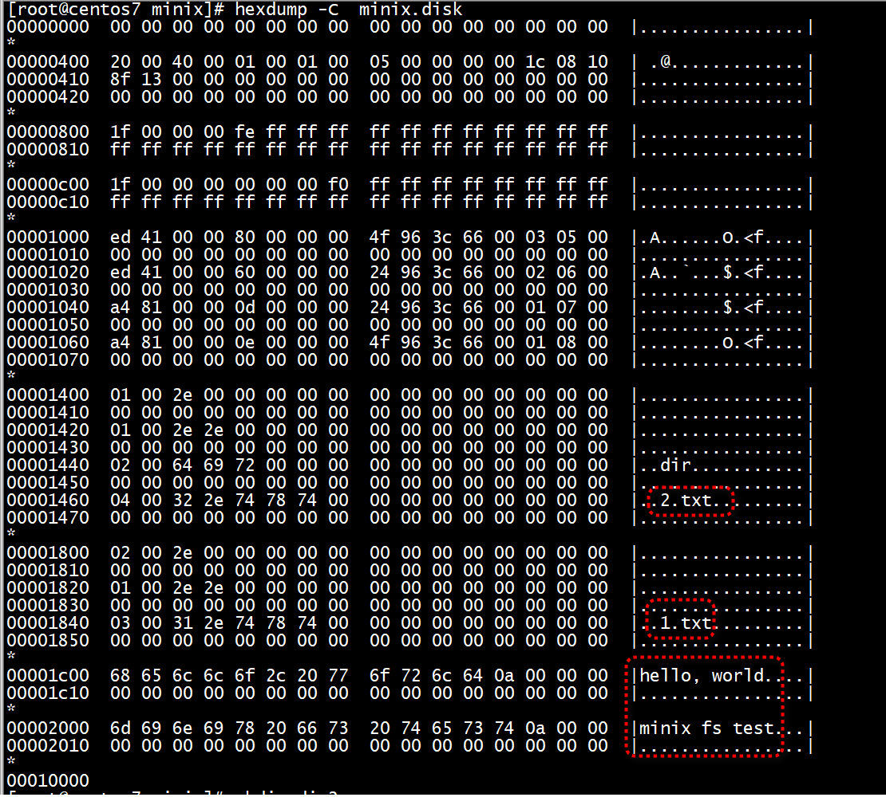
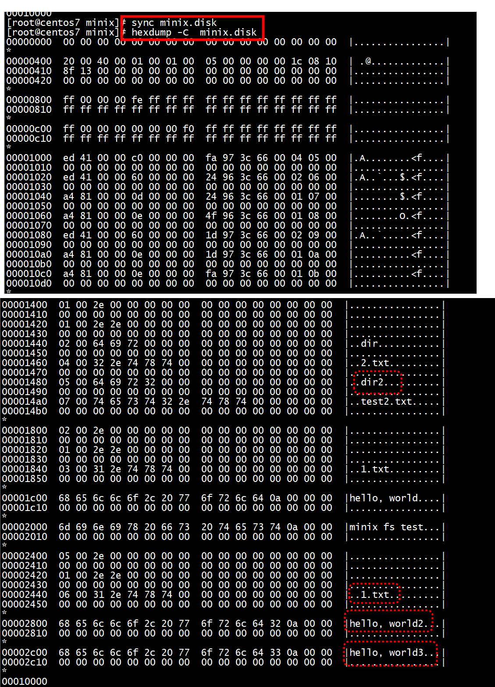

# 参考

[一个简单的文件系统(MinixFS)实现解析](https://blog.csdn.net/hbuxiaofei/article/details/132701943)   

+ inmod minix.ko
```
root@centos7 minix]# insmod  minix.ko 
[root@centos7 minix]# 
```

```
[root@centos7 kernel]# mkdir minix
[root@centos7 kernel]# cd minix/
[root@centos7 minix]# dd if=/dev/zero of=minix.disk bs=1k count=64 oflag=direct
64+0 records in
64+0 records out
65536 bytes (66 kB) copied, 0.00253823 s, 25.8 MB/s
```

格式化过程就是按照具体文件系统指定的结构来编排数据，比如格式化为MINIX文件系统，就需要写入超级块、inode位图、逻辑数据块位图、inode表等数据结构


```
[root@centos7 minix]# mkfs.minix -1 minix.disk
32 inodes
64 blocks
Firstdatazone=5 (5)
Zonesize=1024
Maxsize=268966912

[root@centos7 minix]# file minix.disk 
minix.disk: Minix filesystem, V1, 30 char names, 16384 zones
[root@centos7 minix]#      
[root@centos7 minix]# mount minix.disk /mnt/myfs/
```


```
[root@centos7 minix]# mount minix.disk /mnt/myfs/
[root@centos7 minix]# df -i minix.disk 
Filesystem        Inodes   IUsed     IFree IUse% Mounted on
/dev/sda3      234031616 4284897 229746719    2% /
[root@centos7 minix]# cd /mnt/myfs/
[root@centos7 myfs]# ls
[root@centos7 myfs]# mkdir dir
[root@centos7 myfs]#  echo "hello, world" > dir/1.txt
[root@centos7 myfs]# cat  dir/1.txt
hello, world
[root@centos7 myfs]# ls -i   dir/1.txt
3 dir/1.txt
[root@centos7 myfs]# ls -i   dir
3 1.txt
```

dir/1.txt 和 dir的inode相同   

```
[root@centos7 myfs]# echo "minix fs test" > 2.txt
[root@centos7 myfs]# ls -i   2.txt 
4 2.txt
[root@centos7 myfs]# 
```



再执行   
```
[root@centos7 minix]# mkdir /mnt/myfs/dir2
[root@centos7 minix]#  echo "hello, world2" > /mnt/myfs/dir2/1.txt
echo "hello, world3" > /mnt/myfs/test2.txt
```

执行sync minix.disk（否则采用了page cache-minix_readpage/minix_writepage,hexdump看不到更新）     


 

> ## dd

```
[root@centos7 minix]# dd if=/dev/zero of=minix.disk bs=1k count=64 oflag=direct
64+0 records in
64+0 records out
65536 bytes (66 kB) copied, 0.00242124 s, 27.1 MB/s
[root@centos7 minix]# file minix.disk 
minix.disk: data
[root@centos7 minix]# ls -i minix.disk 
83568241 minix.disk
[root@centos7 minix]# df -i minix.disk 
Filesystem        Inodes   IUsed     IFree IUse% Mounted on
/dev/sda3      234031616 4284921 229746695    2% /
[root@centos7 minix]# 
```

+ 2 执行mkfs.minix 和mount
```
[root@centos7 minix]# mkfs.minix -1 minix.disk
32 inodes
64 blocks
Firstdatazone=5 (5)
Zonesize=1024
Maxsize=268966912

[root@centos7 minix]# mount minix.disk /mnt/myfs/
[root@centos7 minix]# file minix.disk 
minix.disk: Minix filesystem, V1, 30 char names, 16384 zones
[root@centos7 minix]# 
[root@centos7 minix]#  df -i minix.disk 
Filesystem        Inodes   IUsed     IFree IUse% Mounted on
/dev/sda3      234031616 4284921 229746695    2% /
```
file minix.disk  有变化    
df -i minix.disk  没有变化    

+ 3 执行 echo "hello, world2" > /mnt/myfs/test1.txt
```
[root@centos7 minix]#  df -i minix.disk 
Filesystem        Inodes   IUsed     IFree IUse% Mounted on
/dev/sda3      234031616 4284921 229746695    2% /
[root@centos7 minix]#  echo "hello, world2" > /mnt/myfs/test1.txt
[root@centos7 minix]#  df -i minix.disk 
Filesystem        Inodes   IUsed     IFree IUse% Mounted on
/dev/sda3      234031616 4284921 229746695    2% /
[root@centos7 minix]# 
```
df -i minix.disk  没有变化    

> ## inode可用数目

```
[root@centos7 ~]# df -i
Filesystem        Inodes   IUsed     IFree IUse% Mounted on
devtmpfs         4182785     395   4182390    1% /dev
tmpfs            4182932       1   4182931    1% /dev/shm
tmpfs            4182932    1120   4181812    1% /run
tmpfs            4182932      16   4182916    1% /sys/fs/cgroup
/dev/sda3      234031616 4284859 229746757    2% /
/dev/sda2         262144      29    262115    1% /boot
/dev/sda1              0       0         0     - /boot/efi
tmpfs            4182932       1   4182931    1% /run/user/0
```

```
[root@centos7 minix]# df -i minix.disk 
Filesystem        Inodes   IUsed     IFree IUse% Mounted on
/dev/sda3      234031616 4284861 229746755    2% /
[root@centos7 minix]# df -i /dev/sda3 
Filesystem        Inodes   IUsed     IFree IUse% Mounted on
/dev/sda3      234031616 4284861 229746755    2% /
[root@centos7 minix]# ls -i minix.disk 
83568241 minix.disk
[root@centos7 minix]# 
```

# hexdump 

```
root@ubuntux86:# dd if=/dev/zero of=test.img bs=1M count=1
1+0 records in
1+0 records out
1048576 bytes (1.0 MB, 1.0 MiB) copied, 0.000602298 s, 1.7 GB/s
root@ubuntux86:# hexdump -C  test.img 
00000000  00 00 00 00 00 00 00 00  00 00 00 00 00 00 00 00  |................|
*
00100000
```
mkfs.minix之后    
```
root@ubuntux86:# mkfs.minix -1 test.img 
352 inodes
1024 blocks
Firstdatazone=15 (15)
Zonesize=1024
Maxsize=268966912

root@ubuntux86:# hexdump -C  test.img 
00000000  00 00 00 00 00 00 00 00  00 00 00 00 00 00 00 00  |................|
*
00000400  60 01 00 04 01 00 01 00  0f 00 00 00 00 1c 08 10  |`...............|
00000410  8f 13 01 00 00 00 00 00  00 00 00 00 00 00 00 00  |................|
00000420  00 00 00 00 00 00 00 00  00 00 00 00 00 00 00 00  |................|
*
00000800  03 00 00 00 00 00 00 00  00 00 00 00 00 00 00 00  |................|
00000810  00 00 00 00 00 00 00 00  00 00 00 00 00 00 00 00  |................|
00000820  00 00 00 00 00 00 00 00  00 00 00 00 fe ff ff ff  |................|
00000830  ff ff ff ff ff ff ff ff  ff ff ff ff ff ff ff ff  |................|
*
00000c00  03 00 00 00 00 00 00 00  00 00 00 00 00 00 00 00  |................|
00000c10  00 00 00 00 00 00 00 00  00 00 00 00 00 00 00 00  |................|
*
00000c70  00 00 00 00 00 00 00 00  00 00 00 00 00 00 fc ff  |................|
00000c80  ff ff ff ff ff ff ff ff  ff ff ff ff ff ff ff ff  |................|
*
00001000  ed 41 00 00 40 00 00 00  ae 8d 3c 66 00 02 0f 00  |.A..@.....<f....|
00001010  00 00 00 00 00 00 00 00  00 00 00 00 00 00 00 00  |................|
*
00003c00  01 00 2e 00 00 00 00 00  00 00 00 00 00 00 00 00  |................|
00003c10  00 00 00 00 00 00 00 00  00 00 00 00 00 00 00 00  |................|
00003c20  01 00 2e 2e 00 00 00 00  00 00 00 00 00 00 00 00  |................|
00003c30  00 00 00 00 00 00 00 00  00 00 00 00 00 00 00 00  |................|
*
00100000
root@ubuntux86:# 
```

# minix  block_write_begin


代码参考：
```
.write_begin -> minix_write_begin -> block_write_begin -> __ block_write_begin -> __ block_write_begin_int -> ll_rw_block -> submit_bh (minix文件系统举例)
```
    有时bio layer的下一层是最终的磁盘驱动程序，例如 drbd（分布式复制块设备）或 brd（基于 RAM 的块设备）。有时下一层是中间层，例如由 md 和 dm 提供的虚拟设备。 


    有些人可能会听说过buffer_head机制，它是历史的产物，还有一些早期的文件系统使用buffer_head机制，并且buffer_head的bio一般只有一个bio_vec，且bio_vec一般以block_size为单位。而iomap比buffer_head更加灵活，并且iomap兼容了buffer_head机制，如果使用iomap时标记为IOMAP_F_BUFFER_HEAD，那么iomap就会走buffer_head的回调函数。当前xfs也已经全面接入了iomap。    