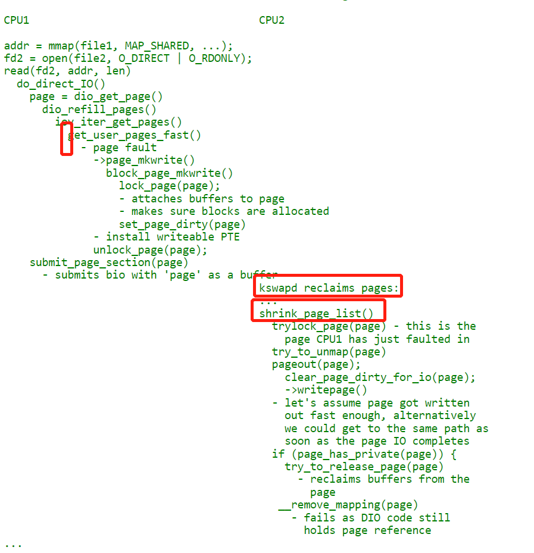

# 块大小  

文件件系统和底层块设备都有自己的块大小设置，而且，这两者可以不相同。块设备的默认块大小为512字节，有兴趣的可以自己查看下hd_init()这个函数。文件系统，如ext3，默认块大小是1024字节（可以自己挂载文件系统的时候设置，但最小1024字节，最大为PAGE_SIZE），有兴趣的同学可以自己查看下ext3_fill_super()这个函数。因此一般说来，文件系统块大小是块设备默认大小的整数倍。    

 
# Direct IO实现
 direct_io既有优点也有缺点，看具体场景。对于大文件的顺序i/o，direct_io可以有效减少大量的内存拷贝。但是对于小文件的随机访问，不采用direct_io而保留kernel的page cache，在cache命令率较高的情况下可以有效的减少i/o的路径       
```
[76358.790433] [<ffff00000821c468>] do_writepages+0x30/0x98
[76358.795721] [<ffff00000820c818>] __filemap_fdatawrite_range+0xe0/0x144
[76358.802217] [<ffff00000820ca00>] filemap_write_and_wait_range+0x48/0xac
[76358.808801] [<ffff0000009d0090>] test_generic_file_fsync+0x70/0xd8 [myfs]
[76358.815558] [<ffff0000082eddcc>] vfs_fsync_range+0xc8/0xf8
[76358.821020] [<ffff00000825a7dc>] SyS_msync+0x170/0x1d8
```

```
[root@centos7 myfs2]# insmod myfs.ko 
[root@centos7 myfs2]#  mount -t myfs none /mnt/myfs
[root@centos7 myfs2]# touch /mnt/myfs/myfile
[root@centos7 myfs2]# ./mmap_test 
/mnt/myfs/myfile size 196608 
Zero page frame number
virt addr: 0xffffa8d70000, phyaddr: 0x0 

Write/Read test ...
0x66616365
0x66616365
0x66616365
[root@centos7 myfs2]# 
```

## IOCB_DIRECT   
```
ext4_file_read_iter(kio, iter)
    \--generic_file_read_iter(iocb, to)
        \--if (iocb->ki_flags & IOCB_DIRECT) 
               ext4_dio_read_iter(iocb, to);
            else
                generic_file_buffered_read(iocb, iter, retval)
 
```

```
static ssize_t
ext2_direct_IO(struct kiocb *iocb, struct iov_iter *iter)
{


        ret = blockdev_direct_IO(iocb, inode, iter, ext2_get_block);
}
```
__blockdev_direct_IO() 会调用 do_blockdev_direct_IO()，在这里面我们要准备一个 struct dio 结构和 struct dio_submit 结构，用来描述将要发生的写入请求    


 do_blockdev_direct_IO  -->     do_direct_IO   
 
 do_direct_IO 函数在dio_get_page过程中通过get_user_pages_fast来获取用户态传递进来的地址对应的page。      
 dio_get_page -->  dio_refill_pages  -->    iov_iter_get_pages   -->    get_user_pages_fast    
 
 
 __blockdev_direct_IO --> do_direct_IO --> dio_get_page --> get_user_pages_fast，direct IO针对的是用户空间        
 
    
 
> ## get_user_pages_fast pin user addr       


```

ssize_t iov_iter_get_pages(struct iov_iter *i,
                   struct page **pages, size_t maxsize, unsigned maxpages,
                   size_t *start)
{
        if (maxsize > i->count)
                maxsize = i->count;

        if (unlikely(i->type & ITER_PIPE))
                return pipe_get_pages(i, pages, maxsize, maxpages, start);
        iterate_all_kinds(i, maxsize, v, ({
                unsigned long addr = (unsigned long)v.iov_base;
                size_t len = v.iov_len + (*start = addr & (PAGE_SIZE - 1));
                int n;
                int res;

                if (len > maxpages * PAGE_SIZE)
                        len = maxpages * PAGE_SIZE;
                addr &= ~(PAGE_SIZE - 1);
                n = DIV_ROUND_UP(len, PAGE_SIZE);
                res = get_user_pages_fast(addr, n, (i->type & WRITE) != WRITE, pages);
                if (unlikely(res < 0))
                        return res;
                return (res == n ? len : res * PAGE_SIZE) - *start;
        0;}),({
                /* can't be more than PAGE_SIZE */
                *start = v.bv_offset;
                get_page(*pages = v.bv_page);
                return v.bv_len;
        }),({
                return -EFAULT;
        })
        )
        return 0;
}
EXPORT_SYMBOL(iov_iter_get_pages);
```
 
 
## pagecache写入磁盘要实现 writepage    
```
int generic_writepages(struct address_space *mapping,
                       struct writeback_control *wbc)
{
        struct blk_plug plug;
        int ret;

        /* deal with chardevs and other special file */
        if (!mapping->a_ops->writepage)
                return 0;

        blk_start_plug(&plug);
        ret = write_cache_pages(mapping, wbc, __writepage, mapping);
        blk_finish_plug(&plug);
        return ret;
}
static int __writepage(struct page *page, struct writeback_control *wbc,
                       void *data)
{
        struct address_space *mapping = data;
        int ret = mapping->a_ops->writepage(page, wbc);
        mapping_set_error(mapping, ret);
        return ret;

```

## generic_file_direct_write
```
ssize_t
generic_file_direct_write(struct kiocb *iocb, const struct iovec *iov,
		unsigned long *nr_segs, loff_t pos, loff_t *ppos,
		size_t count, size_t ocount)
{
	...

	if (count != ocount)
		*nr_segs = iov_shorten((struct iovec *)iov, *nr_segs, count);

	write_len = iov_length(iov, *nr_segs);
	end = (pos + write_len - 1) >> PAGE_CACHE_SHIFT;

	written = filemap_write_and_wait_range(mapping, pos, pos + write_len - 1);
	if (written)
		goto out;

	if (mapping->nrpages) {
		written = invalidate_inode_pages2_range(mapping,
					pos >> PAGE_CACHE_SHIFT, end);
		if (written) {
			if (written == -EBUSY)
				return 0;
			goto out;
		}
	}

	written = mapping->a_ops->direct_IO(WRITE, iocb, iov, pos, *nr_segs);

	if (mapping->nrpages) {
		invalidate_inode_pages2_range(mapping,
					      pos >> PAGE_CACHE_SHIFT, end);
	}

	if (written > 0) {
		pos += written;
		if (pos > i_size_read(inode) && !S_ISBLK(inode->i_mode)) {
			i_size_write(inode, pos);
			mark_inode_dirty(inode);
		}
		*ppos = pos;
	}
out:
	return written;
}
```

由于是Direct IO，在写入之前需要调用filemap_write_and_wait_range()将page cache里的对应脏数据刷盘，以保障正确的写入顺序。filemap_write_and_wait_range()函数最终通过调用do_writepages()函数将脏页刷盘（参见后面）。   
然后调用invalidate_inode_pages2_range()函数将要写入的区域在page cache里失效，以保证读操作必须经过磁盘读到最新写入的数据。在本次写操作完成后再次调用invalidate_inode_pages2_range()函数将page cache失效，避免写入磁盘的过程中有新的读取操作将过期数据读到了cache里。   
最终通过调用a_ops->dierct_IO()将数据Direct IO方式写入磁盘。a_ops即struct address_operations，由底层文件系统实现。   

## filemap_write_and_wait_range
```
filemap_write_and_wait_range(mapping, start, end)
	do_writepages(mapping, &wbc)
		mapping->a_ops->writepages(mapping, wbc)
			generic_writepages(mapping, wbc)
				write_cache_pages(mapping, wbc, __writepage, mapping
```

```
int __generic_file_fsync(struct file *file, loff_t start, loff_t end,
                                 int datasync)
{
        struct inode *inode = file->f_mapping->host;
        int err;
        int ret;

        err = file_write_and_wait_range(file, start, end);
        if (err)
                return err;

        inode_lock(inode);
        ret = sync_mapping_buffers(inode->i_mapping);
        if (!(inode->i_state & I_DIRTY_ALL))
                goto out;
        if (datasync && !(inode->i_state & I_DIRTY_DATASYNC))
                goto out;

        err = sync_inode_metadata(inode, 1);
        if (ret == 0)
                ret = err;

out:
        inode_unlock(inode);
        /* check and advance again to catch errors after syncing out buffers */
        err = file_check_and_advance_wb_err(file);
        if (ret == 0)
                ret = err;
        return ret;
}
EXPORT_SYMBOL(__generic_file_fsync);
```


