#  虚拟化 和segmentation-offload

Offload软分片技术也应用在虚拟化技术中。虚拟技术中更多的是使用虚拟网桥设备来联系host主机和guest主机。网桥设备默认是开启UFO/TSO的。虚拟设备中不会依赖真实设备的offload特性，自己也是可以提供offload功能的，效果类似于网卡的分片。而真实网卡是不支持UFO的，这时就会用软分片技术对报文进行分片。

对于TCP协议而言，Offload分片在使用虚拟设备传输数据时的处理流程如图。分片的时机见图中的Soft Segment。

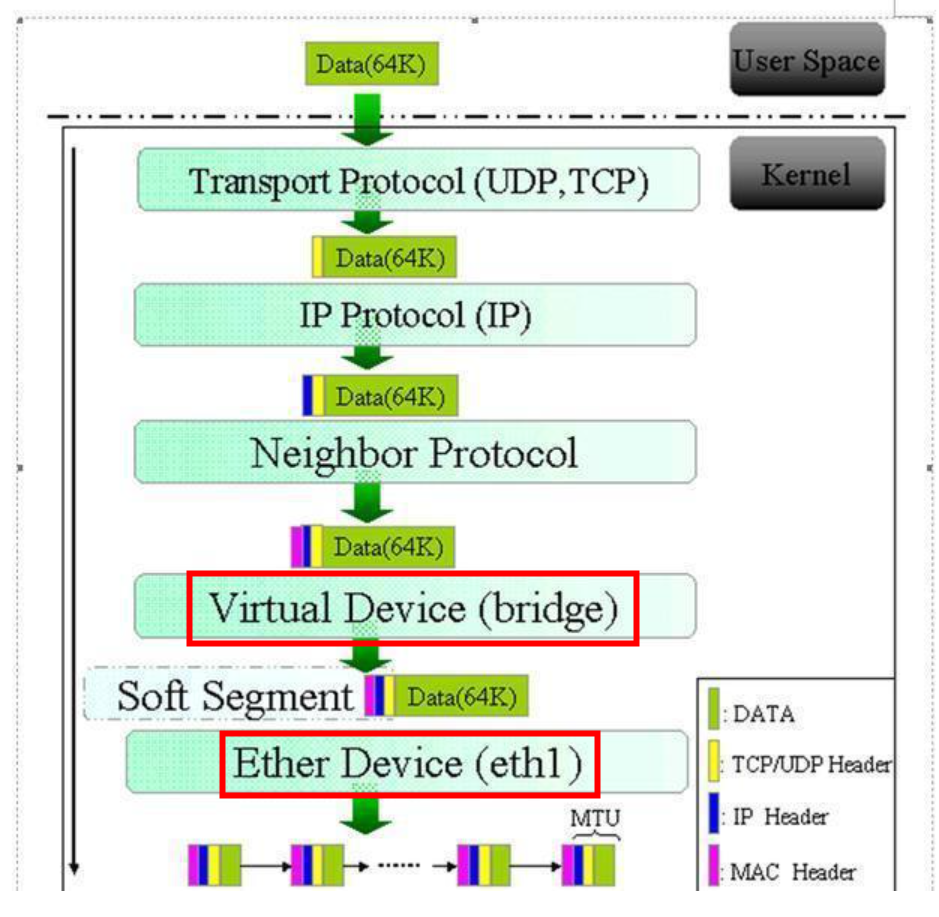
图中，用户层发送的数据大小是64K。虚拟设备桥设备中，启用了TSO功能。而最底层的网卡设备eth1没有启用TSO。则在发送到网卡驱动程序之前，会对大包进行分片，即图中的[Soft Segment]。如果最底层的网卡设备eth1启用TSO，则不需要[Soft Segment]这个操作，而是由网卡本身对数据包进行分片。对于UFO而言，与TSO处理相同，由于现在没有网卡支持UFO，所以肯定是要执行软分片的。

+ 目前貌似没找到有支持UFO机制的网卡，主要是应用在虚拟化设备上。   

# Print absolute TCP sequence number
```
 tcpdump -i enp125s0f0  tcp and dst port  7002 -env -S
```

# Generic Segmentation Offload
Generic segmentation offload is ***a pure software offload*** that is meant to deal with cases where device drivers cannot perform the offloads described above. What occurs in GSO is that a given skbuff will have its data broken out over multiple skbuffs that have been resized to match the MSS provided via skb_shinfo()->gso_size.

Before enabling any hardware segmentation offload a corresponding software offload is required in GSO. Otherwise it becomes possible for a frame to be re-routed between devices and end up being unable to be transmitted.  
# segmentation-offload
```
ethtool -k ens6 | grep segmentation-offload
tcp-segmentation-offload: on
generic-segmentation-offload: on 
```

 

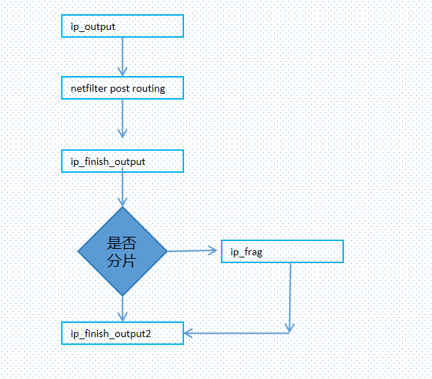

#  tcp
发送22048字节    
> + tso off，gso off  
 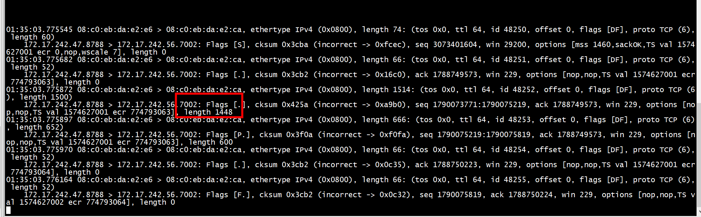
 tcpdump抓到1448 bit和600 bit的两个packet 
> + tso off，gso on  
 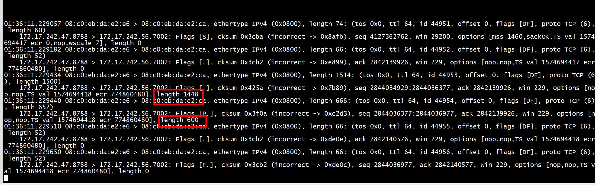
 tcpdump抓到1448 bit和600 bit的两个packet 
> + tso on，gso off   

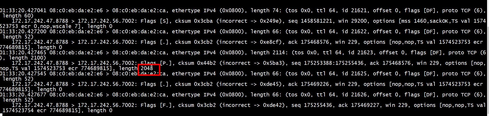
tcpdump抓到2048 bit的packet    
> ##  tso on，gso on   
>> + 发送端  
 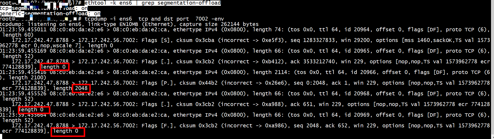
tcpdump抓到2048 bit的packet    
>> + 接收端 gro on  
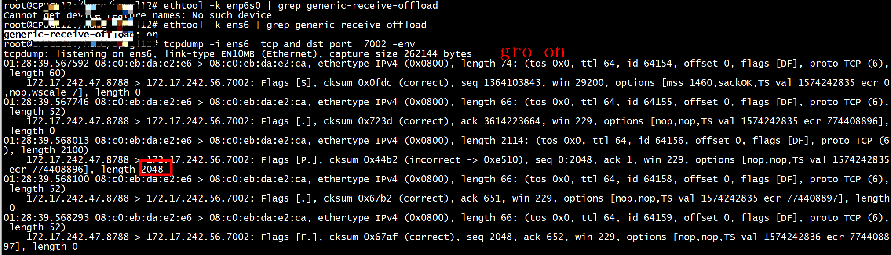
tcpdump抓到2048 bit的packet   
>> + 接收端 gro off  
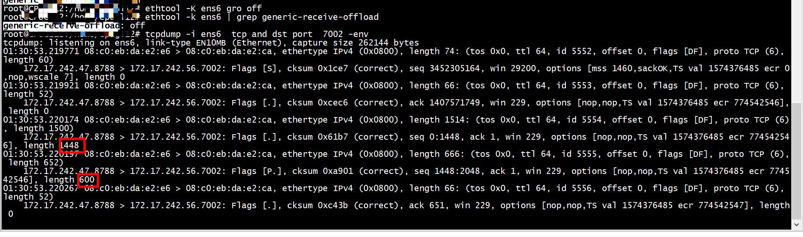
tcpdump抓到1448 bit和600 bit的两个packet   

# udp
+ Linux 4.18.0及以上的内核才支持GSO，SRS会自动检测内核版本   
[Support gso sendmmsg for UDP](https://github.com/ossrs/state-threads/issues/12)    

+   tx-udp-segmentation on     
GSO除了可以一次写入较大buffer，在支持的GSO offload的网卡还有相应的硬件加速，可以通过
ethtool -K enp193s0 tx-udp-segmentation  on来开启    
+   GSO可以通过两种方式去使用，一种是设置socket option开启，一种是通过oob去对msg级别设置。 一般通过oob的方式去进行设置，因为这样比较灵活一些，缺点的话就是会多copy一点内存。    
```
        ret = setsockopt(sock, SOL_UDP, UDP_SEGMENT, &gso_size, sizeof(gso_size));
        if(ret< 0)
        {
            perror("set udp gso size");
            goto error;
        }
```
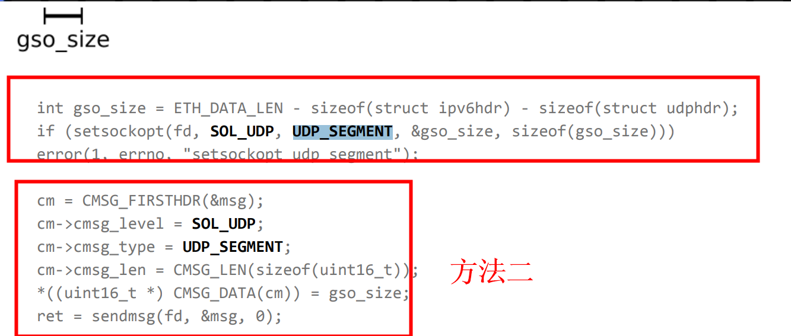
+ gso size 和  USHRT_MAX     
```
	case UDP_SEGMENT:
		if (val < 0 || val > USHRT_MAX)
			return -EINVAL;
		up->gso_size = val;
		break;

	case UDP_GRO:
		lock_sock(sk);
		if (valbool)
			udp_tunnel_encap_enable(sk->sk_socket);
		up->gro_enabled = valbool;
		release_sock(sk);
		break;
```

+ 低版本内核     

```
root@ubuntu:/home/rdma/socket# uname -a
Linux CPUGL07 4.15.0-55-generic #60-Ubuntu SMP Tue Jul 2 18:22:20 UTC 2019 x86_64 x86_64 x86_64 GNU/Linux
root@ubuntu:/home/rdma/socket# ./udp_cli 
set udp gso size: Protocol not available
root@ubuntu:/home/rdma/socket# 
```

+ 高版本内核

```
uname -a
Linux cpu7 5.4.0-125-generic #141-Ubuntu SMP Wed Aug 10 13:42:03 UTC 2022 x86_64 x86_64 x86_64 GNU/Linux
```


> ## udp-fragmentation-offload

+ 高版本mlx5_core   


> +  网卡 tx-udp-segmentation
```
root@ubuntu:/home/nvme-rdma/socket# ethtool -k enp193s0  | grep udp
tx-udp_tnl-segmentation: on
tx-udp_tnl-csum-segmentation: off [fixed]
tx-udp-segmentation: on
rx-udp_tunnel-port-offload: on
root@ubuntu:/home/nvme-rdma/socket# ethtool -i enp193s0
driver: mlx5_core
version: 5.4-3.0.3
firmware-version: 16.31.2006 (MT_0000000011)
expansion-rom-version: 
bus-info: 0000:c1:00.0
supports-statistics: yes
supports-test: yes
supports-eeprom-access: no
supports-register-dump: no
supports-priv-flags: yes
```

> +  generic-segmentation-offload

```

root@ubuntu:/home/nvme-rdma/socket# ethtool -k enp193s0 | grep offload
tcp-segmentation-offload: on
generic-segmentation-offload: on
generic-receive-offload: on
large-receive-offload: off
rx-vlan-offload: on
tx-vlan-offload: on
l2-fwd-offload: off [fixed]
hw-tc-offload: off
esp-hw-offload: off [fixed]
esp-tx-csum-hw-offload: off [fixed]
rx-udp_tunnel-port-offload: on
tls-hw-tx-offload: off [fixed]
tls-hw-rx-offload: off [fixed]
```

+ 低版本mlx5_core   
```
ethtool -k ens6 | grep udp
udp-fragmentation-offload: off
tx-udp_tnl-segmentation: on
tx-udp_tnl-csum-segmentation: on
rx-udp_tunnel-port-offload: on
```
> +  generic-segmentation-offload
```
ethtool -k ens6 | grep offload
tcp-segmentation-offload: on
udp-fragmentation-offload: off
generic-segmentation-offload: on
generic-receive-offload: on
large-receive-offload: off
rx-vlan-offload: on
tx-vlan-offload: on
l2-fwd-offload: off [fixed]
hw-tc-offload: off
esp-hw-offload: off [fixed]
esp-tx-csum-hw-offload: off [fixed]
rx-udp_tunnel-port-offload: on
```
> +  udp-fragmentation-offload
```
ethtool -K ens6 ufo on
Cannot change udp-fragmentation-offload
Could not change any device features
```

```
ethtool -i ens6
driver: mlx5_core
version: 4.9-5.1.0
firmware-version: 16.27.1016 (MT_0000000011)
expansion-rom-version: 
bus-info: 0000:4b:00.0
supports-statistics: yes
supports-test: yes
supports-eeprom-access: no
supports-register-dump: no
supports-priv-flags: yes
```

> ## MSG_ZEROCOPY

```
// MSG_ZEROCOPY for UDP was added in commit b5947e5d1e71 ("udp: msg_zerocopy") in Linux 5.0.
// @see https://lore.kernel.org/netdev/CA+FuTSfBFqRViKfG5crEv8xLMgAkp3cZ+yeuELK5TVv61xT=Yw@mail.gmail.com/
#if LINUX_VERSION_CODE < KERNEL_VERSION(5,0,0)
        if (r0 == -1) {
            printf("MSG_ZEROCOPY should be kernel 5.0+, kernel %#x, errno=%d\n", LINUX_VERSION_CODE, 524);
            exit(-1);
        }
#endif
```

> ##  UDP_SEGMENT  UDP_GRO
```
/* socket options */
int socket_set_options(int fd) {
#ifndef _WIN32
  // Set non-blocking flag
  int flags = fcntl(fd, F_GETFL, NULL);
  if (flags < 0) {
    perror("fcntl");
    return -1;
  }

  if (fcntl(fd, F_SETFL, flags | O_NONBLOCK) < 0) {
    perror("fcntl");
    return -1;
  }
#else
  // Set non-blocking flag
  int result = ioctlsocket(fd, FIONBIO, &(int){1});
  if (result != NO_ERROR) {
    perror("ioctlsocket");
    return -1;
  }
#endif

  // don't hang onto address after listener has closed
  if (setsockopt(fd, SOL_SOCKET, SO_REUSEPORT, &(int){1}, sizeof(int)) < 0) {
    perror("setsockopt");
    return -1;
  }

#ifdef WITH_GSO
  int gso_size = ETH_DATA_LEN - sizeof(struct ipv6hdr) - sizeof(struct udphdr);
  if (setsockopt(fd, SOL_UDP, UDP_SEGMENT, &gso_size, sizeof(gso_size)) < 0) {
    perror("setsockopt");
    return -1;
  }
#endif /* WITH_GSO */

#ifdef WITH_GRO
  if (setsockopt(fd, IPPROTO_UDP, UDP_GRO, &(int){1}, sizeof(int)) < 0) {
    perror("setsockopt");
    return -1;
  }
#endif /* WITH_GRO */

#ifdef WITH_ZEROCOPY
  if (setsockopt(fd, SOL_SOCKET, SO_ZEROCOPY, &(int){1}, sizeof(int))) {
    perror("setsockopt");
    return -1;
  }
#endif /* WITH_ZEROCOPY */

  if (setsockopt(fd, SOL_SOCKET, SO_RCVBUF, &(int){BATCH_SOCKET_BUFFER},
                 sizeof(int)) < 0) {
    perror("setsockopt");
    return -1;
  }
  if (setsockopt(fd, SOL_SOCKET, SO_SNDBUF, &(int){BATCH_SOCKET_BUFFER},
                 sizeof(int)) < 0) {
    perror("setsockopt");
    return -1;
  }
  return 0;
}
```
>  ## test
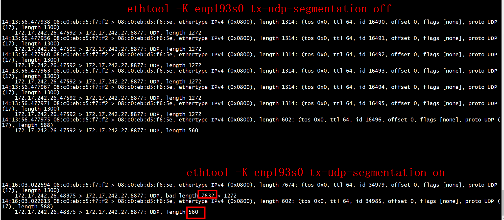


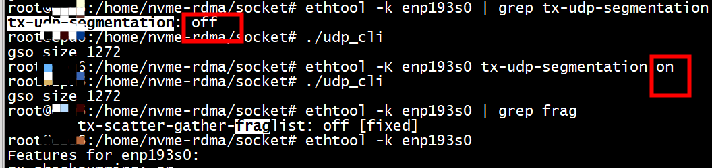

```
tcpdump -i enp193s0  ip and not icmp and  dst host 172.17.242.27 and ether src 08:c0:eb:d5:f7:f2 -env 
```
+ 1 发送TCP_SEND_LEN (2048*4)，gso size 1272 

+ 2 tx-udp-segmentation off，tcpdump抓到的报文有6个UDP, length 1272，1个UDP, length 560  

+ 3  tx-udp-segmentation on，tcpdump抓到的报文有1个 UDP, bad length 7632，一个 UDP, length 560   


+ 3   接收端开启generic-receive-offload,但是没有setsockopt(sock, IPPROTO_UDP, UDP_GRO, &val, sizeof(val))   


>  ## GRO
UDP GRO, 最开始我一直没有搞懂 UDP GRO, 单纯地从字面上看 GRO 是说内核会尽量在协议的最底层将收到的多个数据包拼接在一起之后向上传递, 也即上层看到的只是一个数据包. 对于 TCP 中的 GRO, 这里内核在拼接数据包时会遵循 TCP 的语义, 比如内核在收到了三个 TCP 数据包, TCP 序号分别为 33, 34, 35, 那么此时内核会将三个 TCP 数据包拼接成一个之后向上层协议传递, 这时还是可以理解的. 但是对于 UDP 而言, 大部分使用 UDP 作为传输协议的应用都依赖着 udp packet 边界的性质, 比如 QUIC short packet 中, packet header 中并没有长度字段, 完全是使用了 udp header 中的长度字段来隐式地指定了 short packet 的大小. 那这时 GRO 将多个 UDP 数据包拼接成一个之后, 上层应用还咋用这个边界信息来区分?   

这个真的是 google 上找了半天, 现实中问了一圈大佬都没搞清楚, 知道最后快要弃疗的时候看到了内核关于 GRO/GSO 的单测 case 才大概了解了 UDP GRO 是如何拼接成, 很简单就是仅当 udp 数据包具有相同大小时, 才会被拼接成一个大的 udp 数据包, 同时内核还会告诉上层应用原始 udp 数据包的长度信息. 这样上层应用在需要的时候也可以根据这个信息来确定 udp packet 边界. 如 ***udpgso_bench_rx.c*** 所示, 当使用了 UDP GRO 之后, 应用程序的收包 如:   

```
static int recv_msg(int fd, char *buf, int len, int *gso_size)
{
	char control[CMSG_SPACE(sizeof(uint16_t))] = {0};
	struct msghdr msg = {0};
	struct iovec iov = {0};
	struct cmsghdr *cmsg;
	uint16_t *gsosizeptr;
	int ret;

	iov.iov_base = buf;
	iov.iov_len = len;

	msg.msg_iov = &iov;
	msg.msg_iovlen = 1;

	msg.msg_control = control;
	msg.msg_controllen = sizeof(control);

	*gso_size = -1;
	ret = recvmsg(fd, &msg, MSG_TRUNC | MSG_DONTWAIT);
	if (ret != -1) {
		for (cmsg = CMSG_FIRSTHDR(&msg); cmsg != NULL;
		     cmsg = CMSG_NXTHDR(&msg, cmsg)) {
			if (cmsg->cmsg_level == SOL_UDP
			    && cmsg->cmsg_type == UDP_GRO) {
				gsosizeptr = (uint16_t *) CMSG_DATA(cmsg);
				*gso_size = *gsosizeptr;
				break;
			}
		}
	}
	return ret;
}
```
当 recv_msg() 返回后, [buf, len) 中存放的可能是多个 UDP 数据包拼接之后的内容, 此时 *gso_size 存放着原始 UDP 数据包的大小. 所以对于应用来说, 他可以以 *gso_size 来切分 buf 然后处理每一个数据包, 即中间位置的数据对应的原始 UDP 数据包大小总是为 *gso_size, 最后剩下的数据对应 UDP 数据包大小可能会小于 gsosize. 所以 QUIC 的实现 facebook/mvfst 处理  

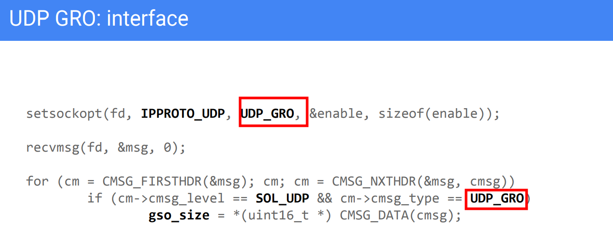

>  ### GRO test

+ 1 #define BUFFER_LEN 4096，setsockopt(sock, IPPROTO_UDP, UDP_GRO, &val, sizeof(val))   
```
./udp_srv2    
recv number of a:  4096 
```
+ 2 #define BUFFER_LEN (4096*4)， setsockopt(sock, IPPROTO_UDP, UDP_GRO, &val, sizeof(val)
```
./udp_srv2    
recv number of a:  8192 
```

+  ETH_MAX_MTU=65535, rbuf[ETH_MAX_MTU],setsockopt(sock, IPPROTO_UDP, UDP_GRO, &val, sizeof(val)   
```
./udp_srv3  
recv number of a:  8192 ,gso size 1272, len 65535, recved bytes 8192 
```

>  ### GRO 关闭

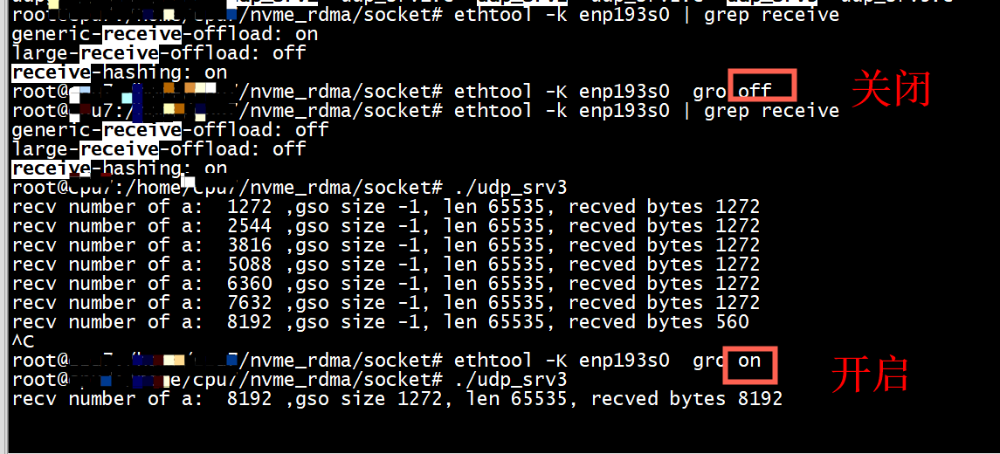

+ ethtool -K enp193s0  gro off， 收到7个报文    
+ ethtool -K enp193s0  gro on， 收到1个报文     

#  udpgso_bench_tx

+ make    

```
make -C tools/testing/selftests/net/ 
```

+ port    

```
 ./udpgso_bench_tx  -l 1 -4 -p 8888 -D  172.17.242.27  -S 0 
 
```
不能写成,这样写的话port失效   
```
 ./udpgso_bench_tx  -l 1 -4 -D  172.17.242.27  -S 0 -p 8888
```


```
The first test is to get the performance of userspace payload splitting.
bash# udpgso_bench_tx -l 4 -4 -D "$DST"

The second test is to get the performance of IP fragmentation.
bash# udpgso_bench_tx -l 4 -4 -D "$DST" -f

The third test is to get the performance of UDP GSO.
bash# udpgso_bench_tx -l 4 -4 -D "$DST" -S 0
```